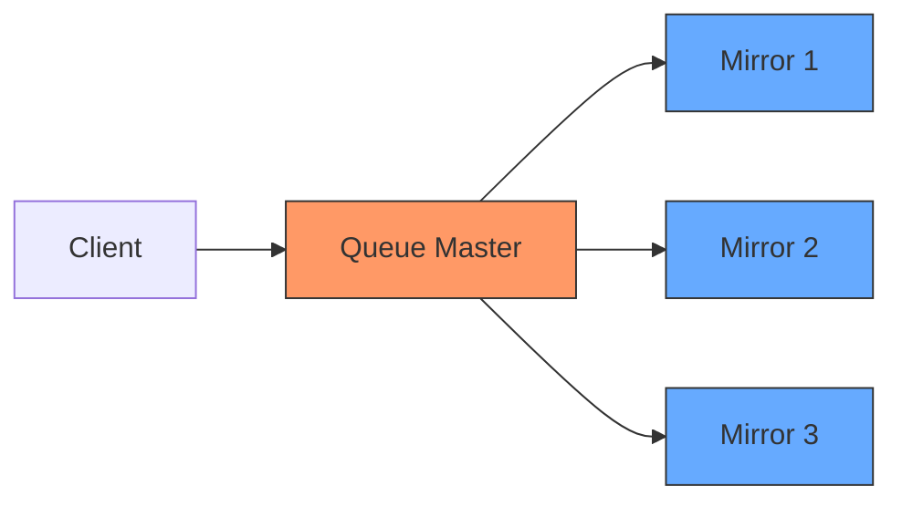
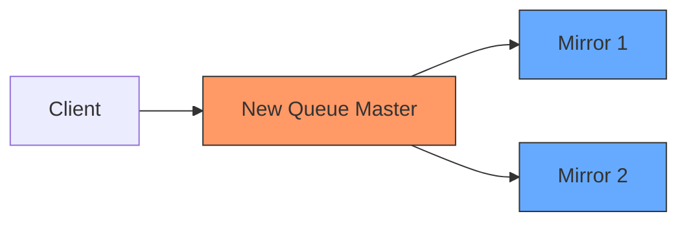
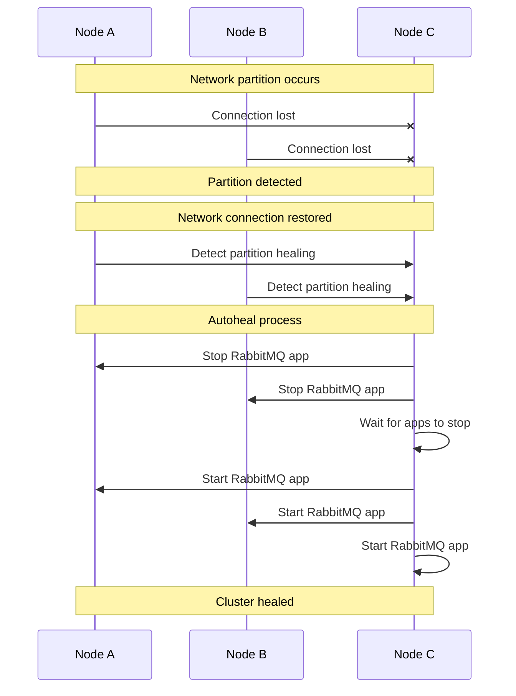

# RabbitMQ Recovery Procedures

## Introduction

When working with message brokers like RabbitMQ, ensuring system resilience is critical. Even the most robust systems can experience failures, and knowing how to recover from these situations is an essential skill for any developer or system administrator. This guide will walk you through the various recovery procedures available in RabbitMQ, from basic manual interventions to sophisticated automated recovery mechanisms.

RabbitMQ provides several built-in features to handle system failures and ensure message persistence and delivery. Understanding these recovery procedures will help you maintain a reliable messaging infrastructure and minimize downtime in your applications.

## Understanding RabbitMQ Failure Scenarios

Before diving into recovery procedures, let's first understand the types of failures that might occur in a RabbitMQ environment:

1. **Node failures**: When a RabbitMQ node crashes or becomes unavailable
2. **Network partitions**: When network issues cause nodes to lose connectivity with each other
3. **Disk failures**: When storage issues affect message persistence
4. **Queue corruption**: When message queues become corrupted
5. **Connection failures**: When clients lose connection to RabbitMQ

Each type of failure requires different recovery approaches, which we'll explore throughout this guide.

## Basic Recovery Concepts

### Message Acknowledgments

One of the fundamental concepts in RabbitMQ recovery is message acknowledgment. When a consumer processes a message, it sends an acknowledgment back to RabbitMQ, indicating that the message has been successfully processed.

```javascript
// Example of message acknowledgment in Node.js with amqplib
channel.consume(queue, function(msg) {
  // Process the message
  console.log(" [x] Received %s", msg.content.toString());
  
  // Acknowledge the message
  channel.ack(msg);
}, {
  noAck: false // Enable manual acknowledgments
});
```

If a consumer fails to acknowledge a message (due to crash or disconnection), RabbitMQ will requeue the message for delivery to another consumer. This ensures that messages are not lost even if a consumer fails.

### Durable Queues and Persistent Messages

To survive broker restarts, RabbitMQ offers durable queues and persistent messages:

```javascript
// Creating a durable queue
channel.assertQueue('durable_queue', {
  durable: true
});

// Publishing a persistent message
channel.sendToQueue('durable_queue', Buffer.from('Persistent message'), {
  persistent: true
});
```

When you mark a queue as durable and messages as persistent, RabbitMQ writes them to disk. If the broker restarts, it can recover the queue and its messages from disk.

## Manual Recovery Procedures

### Restarting a RabbitMQ Node

Sometimes, you may need to manually restart a RabbitMQ node to recover from a failure:

```bash
# On Linux/macOS
sudo service rabbitmq-server restart

# Or using the rabbitmqctl command
sudo rabbitmqctl stop
sudo rabbitmq-server -detached
```

### Checking Node Status

After restarting a node, verify its status:

```bash
sudo rabbitmqctl status
```

The output will show information about the node, including its status, memory usage, and connections.

### Recovering Individual Queues

If a specific queue is having issues, you can delete and recreate it:

```bash
# Delete the problematic queue
sudo rabbitmqctl delete_queue queue_name

# The queue will be recreated when a publisher or consumer declares it
```

Note that this approach will lose all messages in the queue unless they're part of a shovel or federation.

## Automated Recovery Mechanisms

### Client Connection Recovery

Most RabbitMQ client libraries provide automatic connection recovery. Here's an example using the Node.js amqplib:

```javascript
const amqp = require('amqplib');

async function connectWithRetry() {
  try {
    const connection = await amqp.connect('amqp://localhost');
    
    // Handle connection close event
    connection.on('error', function(err) {
      console.error('Connection error:', err);
      setTimeout(connectWithRetry, 5000); // Retry after 5 seconds
    });
    
    connection.on('close', function() {
      console.log('Connection closed');
      setTimeout(connectWithRetry, 5000); // Retry after 5 seconds
    });
    
    return connection;
  } catch (err) {
    console.error('Initial connection error:', err);
    setTimeout(connectWithRetry, 5000); // Retry after 5 seconds
  }
}

// Usage
connectWithRetry().then(async (connection) => {
  const channel = await connection.createChannel();
  // Further setup...
});
```

This example implements a retry mechanism that attempts to reconnect if the connection is lost.

### Cluster Node Recovery

In a RabbitMQ cluster, when a node goes down and comes back up, it will automatically rejoin the cluster. However, you may need to manually synchronize queue contents:

```bash
# Synchronize all queues on the node
sudo rabbitmqctl sync_queue queue_name
```

For mirrored queues, synchronization happens automatically, but you can control this behavior through policies.

## High Availability Configuration for Automatic Recovery

### Mirrored Queues

Mirrored queues replicate messages across multiple nodes, providing redundancy:

```bash
# Set up a policy for mirrored queues
sudo rabbitmqctl set_policy ha-all "^" '{"ha-mode":"all"}'
```

This command creates a policy that mirrors all queues across all nodes in the cluster.

Let's visualize how mirrored queues work:



When the master node fails, one of the mirrors is promoted to become the new master:



### Quorum Queues

For newer versions of RabbitMQ (3.8+), quorum queues provide a more robust alternative to mirrored queues:

```javascript
// Creating a quorum queue
channel.assertQueue('critical_queue', {
  arguments: {
    'x-queue-type': 'quorum'
  }
});
```

Quorum queues use the Raft consensus algorithm to ensure consistency across replicas, making them more resilient to network partitions.

## Recovering from Network Partitions

Network partitions (or "split-brain" scenarios) occur when nodes in a cluster can't communicate with each other. RabbitMQ provides different partition handling strategies:

```bash
# Configure the partition handling strategy
rabbitmq-server -rabbitmq_cluster_partition_handling=autoheal
```

Available strategies include:

- `ignore`: Continue operating during a partition (risk of data inconsistency)
- `pause_minority`: Pause nodes in the minority partition
- `autoheal`: Automatically heal partitions when communication is restored

Here's how the `autoheal` strategy works:



## Message Store Recovery

### Recovering from Disk Failures

If a RabbitMQ node experiences disk failures, you may need to recover its message store:

1. Stop the RabbitMQ server:
   ```bash
   sudo rabbitmqctl stop
   ```

2. Replace or repair the faulty disk

3. If using RAID or other redundant storage, restore from that

4. For non-recoverable data loss, you may need to reset the node:
   ```bash
   sudo rabbitmqctl force_reset
   ```

5. Rejoin the node to the cluster (if applicable):
   ```bash
   sudo rabbitmqctl join_cluster rabbit@primary-node-name
   ```

6. Start the server:
   ```bash
   sudo rabbitmq-server -detached
   ```

### Backing Up and Restoring Definitions

Regularly backing up RabbitMQ definitions (queues, exchanges, bindings, etc.) is a good practice:

```bash
# Export definitions to a JSON file
sudo rabbitmqctl export_definitions /path/to/definitions.json

# Import definitions from a JSON file
sudo rabbitmqctl import_definitions /path/to/definitions.json
```

You can also use the Management UI to export and import definitions.

## Practical Recovery Examples

### Example 1: Recovering from a Node Failure

Scenario: A node in your RabbitMQ cluster has crashed unexpectedly.

1. Check the node status from another node in the cluster:
   ```bash
   sudo rabbitmqctl cluster_status
   ```

2. Attempt to restart the failed node:
   ```bash
   # On the failed node
   sudo service rabbitmq-server restart
   ```

3. If the node doesn't rejoin the cluster automatically:
   ```bash
   # On the failed node
   sudo rabbitmqctl join_cluster rabbit@working-node-name
   sudo rabbitmqctl start_app
   ```

4. Verify the node has rejoined:
   ```bash
   sudo rabbitmqctl cluster_status
   ```

### Example 2: Implementing Client-Side Recovery

Here's a complete example of a producer with recovery capabilities in Python:

```python
import pika
import time
import logging

logging.basicConfig(level=logging.INFO)
logger = logging.getLogger(__name__)

class ResilientProducer:
    def __init__(self, host='localhost', queue='durable_queue'):
        self.host = host
        self.queue = queue
        self.connection = None
        self.channel = None
        self.connect()
    
    def connect(self):
        while True:
            try:
                logger.info("Attempting to connect to RabbitMQ...")
                self.connection = pika.BlockingConnection(
                    pika.ConnectionParameters(host=self.host)
                )
                self.channel = self.connection.channel()
                
                # Declare a durable queue
                self.channel.queue_declare(queue=self.queue, durable=True)
                logger.info("Connected to RabbitMQ")
                return
            except pika.exceptions.AMQPConnectionError:
                logger.error("Connection failed. Retrying in 5 seconds...")
                time.sleep(5)
    
    def publish(self, message):
        try:
            self.channel.basic_publish(
                exchange='',
                routing_key=self.queue,
                body=message,
                properties=pika.BasicProperties(
                    delivery_mode=2,  # Make message persistent
                )
            )
            logger.info(f"Sent message: {message}")
        except (pika.exceptions.AMQPConnectionError, pika.exceptions.ChannelClosedByBroker):
            logger.error("Connection lost. Reconnecting...")
            self.connect()
            # Retry sending the message
            self.publish(message)
    
    def close(self):
        if self.connection and self.connection.is_open:
            self.connection.close()
            logger.info("Connection closed")

# Usage example
if __name__ == "__main__":
    producer = ResilientProducer()
    
    for i in range(10):
        producer.publish(f"Message {i}")
        time.sleep(1)
    
    producer.close()
```

And a corresponding consumer:

```python
import pika
import time
import logging

logging.basicConfig(level=logging.INFO)
logger = logging.getLogger(__name__)

class ResilientConsumer:
    def __init__(self, host='localhost', queue='durable_queue'):
        self.host = host
        self.queue = queue
        self.connection = None
        self.channel = None
        self.connect()
    
    def connect(self):
        while True:
            try:
                logger.info("Attempting to connect to RabbitMQ...")
                self.connection = pika.BlockingConnection(
                    pika.ConnectionParameters(host=self.host)
                )
                self.channel = self.connection.channel()
                
                # Declare a durable queue
                self.channel.queue_declare(queue=self.queue, durable=True)
                
                # Fair dispatch
                self.channel.basic_qos(prefetch_count=1)
                logger.info("Connected to RabbitMQ")
                return
            except pika.exceptions.AMQPConnectionError:
                logger.error("Connection failed. Retrying in 5 seconds...")
                time.sleep(5)
    
    def callback(self, ch, method, properties, body):
        logger.info(f"Received message: {body.decode()}")
        # Simulate processing time
        time.sleep(1)
        # Acknowledge the message
        ch.basic_ack(delivery_tag=method.delivery_tag)
    
    def start_consuming(self):
        try:
            self.channel.basic_consume(
                queue=self.queue,
                on_message_callback=self.callback
            )
            logger.info("Started consuming messages...")
            self.channel.start_consuming()
        except (pika.exceptions.AMQPConnectionError, pika.exceptions.ChannelClosedByBroker):
            logger.error("Connection lost. Reconnecting...")
            self.connect()
            self.start_consuming()
    
    def close(self):
        if self.connection and self.connection.is_open:
            self.channel.stop_consuming()
            self.connection.close()
            logger.info("Connection closed")

# Usage example
if __name__ == "__main__":
    consumer = ResilientConsumer()
    
    try:
        consumer.start_consuming()
    except KeyboardInterrupt:
        consumer.close()
```

## Monitoring for Recovery Needs

To effectively recover from failures, you need to know when they occur. Setting up monitoring is essential:

### Command Line Monitoring

```bash
# Check the status of all queues
sudo rabbitmqctl list_queues name messages_ready messages_unacknowledged

# Check memory usage
sudo rabbitmqctl status | grep memory

# Check cluster status
sudo rabbitmqctl cluster_status
```

### Setting Up Alarms

RabbitMQ has built-in alarms for resource usage:

```bash
# Configure memory threshold alarm
sudo rabbitmqctl set_vm_memory_high_watermark 0.6
```

This sets an alarm when memory usage reaches 60% of available RAM.

## Best Practices for Recovery Readiness

1. **Use durable queues and persistent messages** for critical data
2. **Implement proper acknowledgments** in consumers
3. **Set up clusters** with at least three nodes
4. **Use quorum queues** for critical workloads (RabbitMQ 3.8+)
5. **Regularly back up definitions**
6. **Implement client-side retry logic**
7. **Set up comprehensive monitoring**
8. **Document recovery procedures** for your specific setup
9. **Test recovery scenarios** regularly
10. **Keep RabbitMQ updated** to benefit from the latest improvements

## Summary

RabbitMQ recovery procedures are essential for maintaining a reliable messaging system. By understanding the various recovery mechanisms and implementing them appropriately, you can minimize downtime and ensure message delivery even in the face of failures.

Remember these key points:
- Use durable queues and persistent messages for important data
- Implement proper client-side recovery mechanisms
- Configure high availability through clustering and mirrored/quorum queues
- Monitor your system to detect failures early
- Have documented recovery procedures ready
- Test recovery scenarios regularly

## Additional Resources

- [RabbitMQ Reliability Guide](https://www.rabbitmq.com/reliability.html)
- [RabbitMQ Clustering Guide](https://www.rabbitmq.com/clustering.html)
- [RabbitMQ Quorum Queues](https://www.rabbitmq.com/quorum-queues.html)
- [RabbitMQ Management HTTP API](https://www.rabbitmq.com/management.html)

## Exercises

1. Set up a three-node RabbitMQ cluster and simulate a node failure. Practice recovering the failed node.
2. Implement a Python script with connection recovery that publishes messages to a durable queue.
3. Create a monitoring script that alerts you when queue lengths exceed a threshold.
4. Test different partition handling strategies and document the results.
5. Implement a backup and restore procedure for your RabbitMQ definitions.