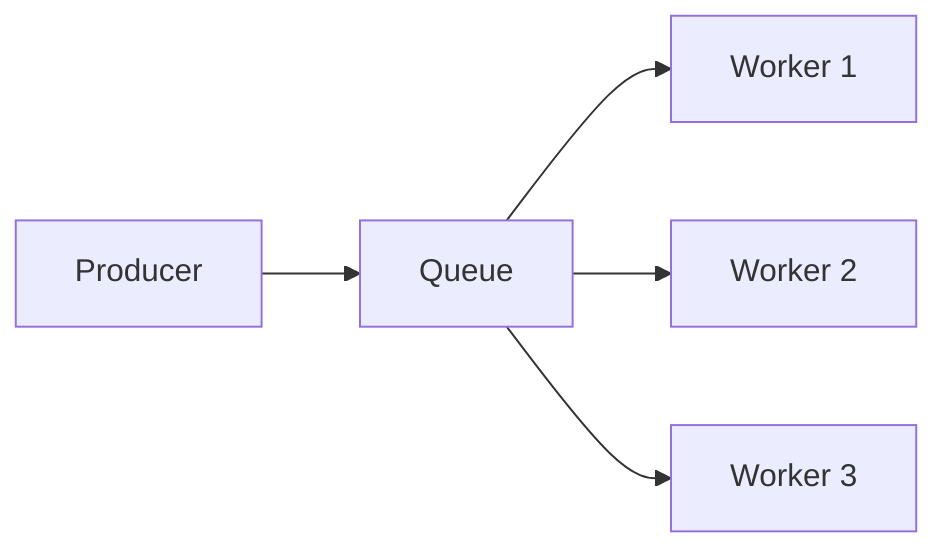
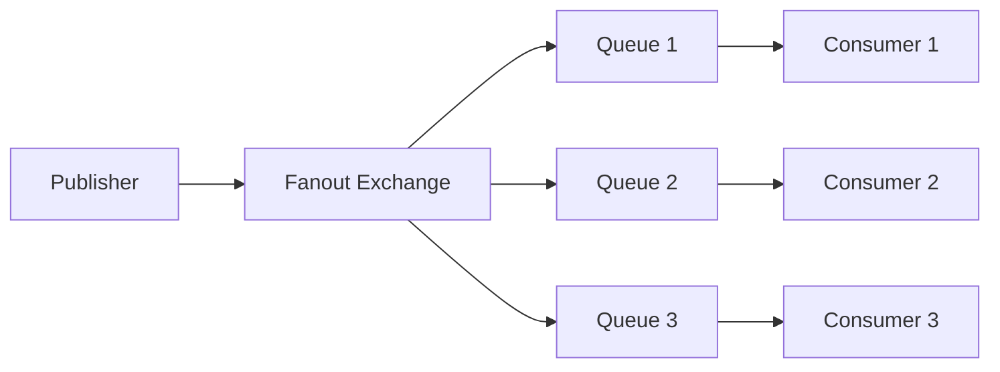
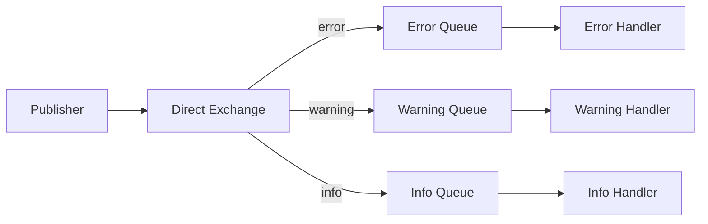
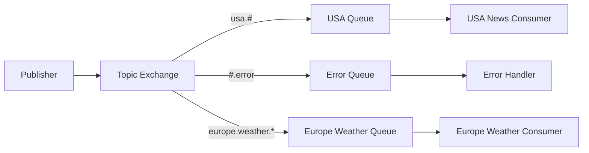
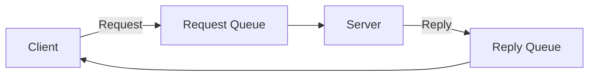
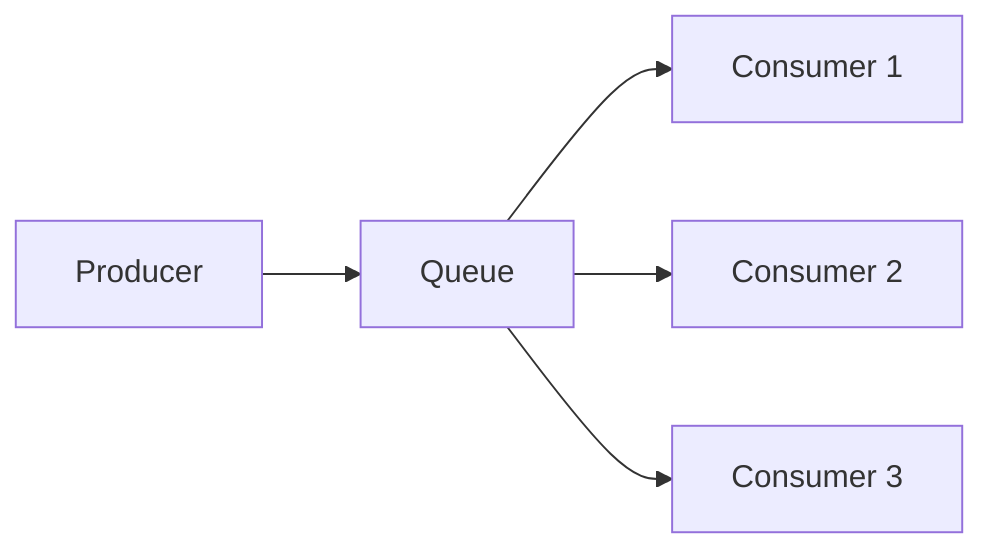
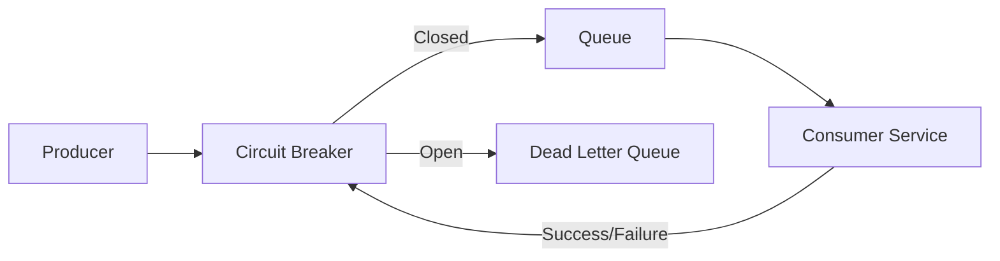

# RabbitMQ Design Patterns

## Introduction

RabbitMQ is a powerful message broker that enables applications to communicate asynchronously by sending and receiving messages. However, to use RabbitMQ effectively in real-world scenarios, it's important to understand common design patterns that solve specific messaging challenges.

In this guide, we'll explore several RabbitMQ design patterns that can help you build robust, scalable, and maintainable messaging systems. Whether you're building a simple application or a complex distributed system, these patterns will provide you with battle-tested approaches to common messaging problems.

## Basic Messaging Concepts

Before diving into specific patterns, let's quickly review the fundamental RabbitMQ concepts:

- **Producer**: Application that sends messages
- **Consumer**: Application that receives messages
- **Queue**: Buffer that stores messages
- **Exchange**: Routing mechanism that receives messages from producers and pushes them to queues
- **Binding**: Rule that tells an exchange which queue to route messages to

Now, let's explore some common design patterns!

## Pattern 1: Work Queue (Task Distribution)

### Problem

You have time-consuming tasks that you don't want to execute immediately or sequentially.

### Solution

The Work Queue pattern (also known as the Task Queue pattern) distributes tasks among multiple workers to process them in parallel.



### Implementation

**Producer Code (Python)**

```python
import pika
import json

connection = pika.BlockingConnection(pika.ConnectionParameters('localhost'))
channel = connection.channel()

# Declare a queue
channel.queue_declare(queue='task_queue', durable=True)

# Create a task
task = {
    'id': '123',
    'type': 'image_processing',
    'data': 'path/to/image.jpg'
}

# Send the task to the queue
channel.basic_publish(
    exchange='',
    routing_key='task_queue',
    body=json.dumps(task),
    properties=pika.BasicProperties(
        delivery_mode=2,  # Make message persistent
    ))

print(f"Sent task: {task}")
connection.close()
```

**Consumer/Worker Code (Python)**

```python
import pika
import time
import json

connection = pika.BlockingConnection(pika.ConnectionParameters('localhost'))
channel = connection.channel()

# Declare the same queue
channel.queue_declare(queue='task_queue', durable=True)

# Process a task
def process_task(ch, method, properties, body):
    task = json.loads(body)
    print(f"Processing task: {task}")
    
    # Simulate work
    time.sleep(3)
    
    print(f"Task completed: {task}")
    ch.basic_ack(delivery_tag=method.delivery_tag)

# Fair dispatch - don't give more than one message to a worker at a time
channel.basic_qos(prefetch_count=1)

# Set up the consumer
channel.basic_consume(queue='task_queue', on_message_callback=process_task)

print("Worker waiting for tasks. To exit press CTRL+C")
channel.start_consuming()
```

### Key Features

1. **Durability**: Messages persist even if RabbitMQ restarts
2. **Fair Dispatch**: Workers only receive one task at a time
3. **Acknowledgments**: Workers confirm task completion
4. **Parallelism**: Multiple workers process tasks simultaneously

### Real-world Applications

- Processing uploaded files (resizing images, transcoding videos)
- Generating reports
- Sending batch emails
- Long-running calculations

## Pattern 2: Publish/Subscribe (Fanout)

### Problem

You need to broadcast messages to multiple consumers.

### Solution

The Publish/Subscribe pattern broadcasts messages to all connected consumers using a fanout exchange.



### Implementation

**Publisher Code (Node.js)**

```javascript
const amqp = require('amqplib');

async function publishMessage() {
  const connection = await amqp.connect('amqp://localhost');
  const channel = await connection.createChannel();
  
  // Declare an exchange
  const exchange = 'logs';
  await channel.assertExchange(exchange, 'fanout', { durable: false });
  
  // Create a message
  const message = {
    timestamp: new Date().toISOString(),
    level: 'info',
    message: 'User logged in',
    userId: 'user123'
  };
  
  // Publish to the exchange
  channel.publish(exchange, '', Buffer.from(JSON.stringify(message)));
  console.log(`Sent: ${JSON.stringify(message)}`);
  
  setTimeout(() => {
    connection.close();
  }, 500);
}

publishMessage();
```

**Subscriber Code (Node.js)**

```javascript
const amqp = require('amqplib');

async function subscribeToLogs() {
  const connection = await amqp.connect('amqp://localhost');
  const channel = await connection.createChannel();
  
  // Declare the same exchange
  const exchange = 'logs';
  await channel.assertExchange(exchange, 'fanout', { durable: false });
  
  // Create a queue with a random name
  const { queue } = await channel.assertQueue('', { exclusive: true });
  
  // Bind the queue to the exchange
  await channel.bindQueue(queue, exchange, '');
  
  console.log(`Waiting for logs. To exit press CTRL+C`);
  
  // Consume messages
  channel.consume(queue, (message) => {
    if (message) {
      const logEntry = JSON.parse(message.content.toString());
      console.log(`Received log: ${JSON.stringify(logEntry)}`);
    }
  }, { noAck: true });
}

subscribeToLogs();
```

### Key Features

1. **Broadcasting**: All consumers receive all messages
2. **Dynamic Subscribers**: Consumers can join or leave without affecting others
3. **Temporary Queues**: Each consumer gets its own queue
4. **No Message Persistence**: Messages are typically not persisted

### Real-world Applications

- Logging systems
- Real-time dashboards
- Chat applications
- Live notifications
- System monitoring

## Pattern 3: Routing (Direct Exchange)

### Problem

You want to selectively receive messages based on specific criteria.

### Solution

The Routing pattern uses a direct exchange to route messages to specific queues based on a routing key.



### Implementation

**Publisher Code (Java)**

```java
import com.rabbitmq.client.Channel;
import com.rabbitmq.client.Connection;
import com.rabbitmq.client.ConnectionFactory;

public class LogPublisher {
    private static final String EXCHANGE_NAME = "direct_logs";

    public static void main(String[] args) throws Exception {
        ConnectionFactory factory = new ConnectionFactory();
        factory.setHost("localhost");
        
        try (Connection connection = factory.newConnection();
             Channel channel = connection.createChannel()) {
            
            channel.exchangeDeclare(EXCHANGE_NAME, "direct");
            
            String severity = "error";  // Could be "info", "warning", or "error"
            String message = "System failed to start properly";
            
            channel.basicPublish(EXCHANGE_NAME, severity, null, message.getBytes("UTF-8"));
            System.out.println(" [x] Sent '" + severity + "':'" + message + "'");
        }
    }
}
```

**Subscriber Code (Java)**

```java
import com.rabbitmq.client.*;

public class LogSubscriber {
    private static final String EXCHANGE_NAME = "direct_logs";

    public static void main(String[] args) throws Exception {
        ConnectionFactory factory = new ConnectionFactory();
        factory.setHost("localhost");
        Connection connection = factory.newConnection();
        Channel channel = connection.createChannel();

        channel.exchangeDeclare(EXCHANGE_NAME, "direct");
        String queueName = channel.queueDeclare().getQueue();

        // Subscribe only to error messages
        String severity = "error";
        channel.queueBind(queueName, EXCHANGE_NAME, severity);
        
        System.out.println(" [*] Waiting for " + severity + " logs. To exit press CTRL+C");

        DeliverCallback deliverCallback = (consumerTag, delivery) -> {
            String message = new String(delivery.getBody(), "UTF-8");
            System.out.println(" [x] Received '" + delivery.getEnvelope().getRoutingKey() + "':'" + message + "'");
        };
        
        channel.basicConsume(queueName, true, deliverCallback, consumerTag -> { });
    }
}
```

### Key Features

1. **Selective Receiving**: Consumers receive only specific types of messages
2. **Multiple Bindings**: A queue can be bound with multiple routing keys
3. **Explicit Routing**: Messages are routed based on exact routing key matches

### Real-world Applications

- Log processing by severity
- Route messages to different services
- Handling different event types differently
- Processing specific categories of data

## Pattern 4: Topics (Flexible Routing)

### Problem

You need more flexible routing based on patterns rather than exact matches.

### Solution

The Topic pattern uses the topic exchange type to route messages based on wildcarded pattern matching.



### Implementation

**Publisher Code (C#)**

```csharp
using RabbitMQ.Client;
using System;
using System.Text;

class TopicPublisher
{
    static void Main()
    {
        var factory = new ConnectionFactory() { HostName = "localhost" };
        using (var connection = factory.CreateConnection())
        using (var channel = connection.CreateModel())
        {
            channel.ExchangeDeclare(exchange: "topic_logs", type: "topic");

            var routingKey = "usa.weather.severe";
            var message = "Tornado warning in Kansas";
            
            var body = Encoding.UTF8.GetBytes(message);
            channel.BasicPublish(exchange: "topic_logs",
                                routingKey: routingKey,
                                basicProperties: null,
                                body: body);
            
            Console.WriteLine($" [x] Sent '{routingKey}':'{message}'");
        }
    }
}
```

**Subscriber Code (C#)**

```csharp
using RabbitMQ.Client;
using RabbitMQ.Client.Events;
using System;
using System.Text;

class TopicSubscriber
{
    static void Main()
    {
        var factory = new ConnectionFactory() { HostName = "localhost" };
        using (var connection = factory.CreateConnection())
        using (var channel = connection.CreateModel())
        {
            channel.ExchangeDeclare(exchange: "topic_logs", type: "topic");
            
            var queueName = channel.QueueDeclare().QueueName;
            
            // Subscribe to all USA weather events
            channel.QueueBind(queue: queueName,
                            exchange: "topic_logs",
                            routingKey: "usa.weather.*");
            
            Console.WriteLine(" [*] Waiting for weather messages");
            
            var consumer = new EventingBasicConsumer(channel);
            consumer.Received += (model, ea) =>
            {
                var body = ea.Body.ToArray();
                var message = Encoding.UTF8.GetString(body);
                var routingKey = ea.RoutingKey;
                Console.WriteLine($" [x] Received '{routingKey}':'{message}'");
            };
            
            channel.BasicConsume(queue: queueName,
                                autoAck: true,
                                consumer: consumer);
            
            Console.WriteLine(" Press [enter] to exit.");
            Console.ReadLine();
        }
    }
}
```

### Topic Pattern Rules

1. `*` (star) matches exactly one word
2. `#` (hash) matches zero or more words

Examples:
- `usa.weather.*` would match `usa.weather.sunny` and `usa.weather.cloudy` but not `usa.weather.severe.thunderstorm`
- `usa.#` would match any message with a routing key starting with `usa.`
- `#.error` would match any message with a routing key ending in `.error`

### Real-world Applications

- Geographic-based message routing
- Multi-dimensional categorization
- Hierarchical data processing
- User preference-based notifications
- Multi-tenant systems

## Pattern 5: Request-Reply

### Problem

You need to implement synchronous communication over an asynchronous messaging system.

### Solution

The Request-Reply pattern implements a request and response cycle using two queues and correlation IDs.



### Implementation

**Client Code (Ruby)**

```ruby
require 'bunny'
require 'securerandom'

# Setup connection
conn = Bunny.new
conn.start
channel = conn.create_channel

# Setup request queue
request_queue = channel.queue('rpc_queue')

# Setup reply queue
reply_queue = channel.queue('', exclusive: true)

# Generate correlation ID
correlation_id = SecureRandom.uuid

# Define callback for processing the response
consumer = Bunny::Consumer.new(channel, reply_queue, channel.generate_consumer_tag, false)
response = nil

consumer.on_delivery do |delivery_info, properties, payload|
  if properties[:correlation_id] == correlation_id
    response = payload
    delivery_info.consumer.cancel
  end
end

reply_queue.subscribe_with(consumer)

# Create request
request = { number: 30 }
request_json = request.to_json

# Send request
channel.default_exchange.publish(
  request_json,
  routing_key: 'rpc_queue',
  correlation_id: correlation_id,
  reply_to: reply_queue.name
)

puts " [x] Requesting fibonacci(#{request[:number]})"

# Wait for response
loop do
  break if response
  sleep 0.1
end

puts " [.] Got '#{response}'"

# Clean up
conn.close
```

**Server Code (Ruby)**

```ruby
require 'bunny'
require 'json'

# Fibonacci function
def fib(n)
  return n if n < 2
  fib(n - 1) + fib(n - 2)
end

# Setup connection
conn = Bunny.new
conn.start
channel = conn.create_channel

# Setup request queue
queue = channel.queue('rpc_queue')

puts " [*] Waiting for RPC requests. To exit press CTRL+C"

# Process incoming requests
queue.subscribe(block: true) do |delivery_info, properties, payload|
  request = JSON.parse(payload)
  n = request['number']

  puts " [.] fib(#{n})"
  response = fib(n).to_s

  # Send response back
  channel.default_exchange.publish(
    response,
    routing_key: properties.reply_to,
    correlation_id: properties.correlation_id
  )
end
```

### Key Features

1. **Correlation IDs**: Match responses to requests
2. **Reply Queues**: Dedicated queues for responses
3. **Synchronous Over Asynchronous**: Provides request-response pattern over async messaging

### Real-world Applications

- Service API calls
- Distributed calculations
- Data validation services
- Authentication services
- Resource allocation

## Pattern 6: Competing Consumers

### Problem

You need to scale message processing horizontally.

### Solution

The Competing Consumers pattern uses multiple consumers reading from the same queue to process messages in parallel.



### Implementation

The implementation is similar to the Work Queue pattern, but with a focus on scaling and load balancing.

**Key Code for Consumers (Python)**

```python
import pika
import time
import os
import threading

def process_message(ch, method, properties, body):
    # Get the consumer ID (for demonstration)
    consumer_id = threading.current_thread().name
    
    print(f"Consumer {consumer_id} processing message: {body}")
    
    # Simulate processing work
    processing_time = len(body) % 5 + 1
    time.sleep(processing_time)
    
    print(f"Consumer {consumer_id} completed processing: {body}")
    
    # Acknowledge the message
    ch.basic_ack(delivery_tag=method.delivery_tag)

def start_consumer(consumer_id):
    # Create a connection to RabbitMQ
    connection = pika.BlockingConnection(pika.ConnectionParameters('localhost'))
    channel = connection.channel()
    
    # Declare the queue
    channel.queue_declare(queue='task_queue', durable=True)
    
    # Fair dispatch
    channel.basic_qos(prefetch_count=1)
    
    # Set up the consumer
    channel.basic_consume(queue='task_queue', on_message_callback=process_message)
    
    print(f"Consumer {consumer_id} waiting for messages. To exit press CTRL+C")
    
    # Start consuming
    channel.start_consuming()

# Start multiple consumers
for i in range(3):
    consumer_thread = threading.Thread(target=start_consumer, args=(i,))
    consumer_thread.daemon = True
    consumer_thread.start()

# Keep the main thread running
try:
    input("Press Enter to exit...
")
except KeyboardInterrupt:
    print("Exiting...")
```

### Key Features

1. **Horizontal Scaling**: Add more consumers to increase throughput
2. **Load Balancing**: RabbitMQ distributes messages among consumers
3. **Fault Tolerance**: If one consumer fails, others continue processing
4. **Message Acknowledgment**: Ensures no messages are lost if a consumer crashes

### Real-world Applications

- High-volume transaction processing
- Web service request handling
- Log processing at scale
- Data ingestion pipelines
- Batch processing jobs

## Pattern 7: Priority Queue

### Problem

Some messages need to be processed before others.

### Solution

The Priority Queue pattern allows messages to be processed based on their priority level.

### Implementation

**Setting Up a Priority Queue**

```javascript
// JavaScript implementation
const amqp = require('amqplib');

async function setupPriorityQueue() {
  const connection = await amqp.connect('amqp://localhost');
  const channel = await connection.createChannel();
  
  // Declare a priority queue with maximum priority 10
  await channel.assertQueue('priority_queue', {
    durable: true,
    arguments: {
      'x-max-priority': 10
    }
  });
  
  console.log('Priority queue set up successfully');
  await connection.close();
}

setupPriorityQueue();
```

**Publishing Messages with Priority**

```javascript
const amqp = require('amqplib');

async function publishWithPriority(message, priority) {
  const connection = await amqp.connect('amqp://localhost');
  const channel = await connection.createChannel();
  
  // Make sure the queue exists
  await channel.assertQueue('priority_queue', {
    durable: true,
    arguments: {
      'x-max-priority': 10
    }
  });
  
  // Publish message with priority
  await channel.sendToQueue('priority_queue', Buffer.from(message), {
    persistent: true,
    priority: priority
  });
  
  console.log(`Sent message: ${message} with priority: ${priority}`);
  
  await connection.close();
}

// Send messages with different priorities
async function sendTestMessages() {
  await publishWithPriority('Low priority task', 1);
  await publishWithPriority('Medium priority task', 5);
  await publishWithPriority('HIGH PRIORITY TASK', 10);
}

sendTestMessages();
```

**Consuming from a Priority Queue**

```javascript
const amqp = require('amqplib');

async function consumePriorityQueue() {
  const connection = await amqp.connect('amqp://localhost');
  const channel = await connection.createChannel();
  
  // Make sure the queue exists
  await channel.assertQueue('priority_queue', {
    durable: true,
    arguments: {
      'x-max-priority': 10
    }
  });
  
  // Fair dispatch
  channel.prefetch(1);
  
  console.log('Waiting for priority messages. To exit press CTRL+C');
  
  // Consume messages
  channel.consume('priority_queue', (msg) => {
    const content = msg.content.toString();
    const priority = msg.properties.priority || 0;
    
    console.log(`Received message: ${content} (Priority: ${priority})`);
    
    // Simulate processing
    setTimeout(() => {
      channel.ack(msg);
      console.log(`Finished processing: ${content}`);
    }, 1000);
  });
}

consumePriorityQueue();
```

### Key Features

1. **Message Prioritization**: Higher priority messages are delivered first
2. **Queue Arguments**: Uses RabbitMQ's `x-max-priority` queue argument
3. **Backward Compatibility**: Works with standard consumers

### Real-world Applications

- Critical alerts processing
- VIP customer requests
- Emergency notifications
- System administration tasks
- Tiered service levels

## Pattern 8: Dead Letter Exchange

### Problem

You need to handle messages that can't be processed successfully.

### Solution

The Dead Letter Exchange pattern routes failed messages to a special exchange for handling, logging, or retry.


### Implementation

**Setting Up a Queue with Dead Letter Exchange**

```python
import pika

connection = pika.BlockingConnection(pika.ConnectionParameters('localhost'))
channel = connection.channel()

# Declare the dead letter exchange
channel.exchange_declare(
    exchange='dead_letter_exchange',
    exchange_type='direct'
)

# Declare the dead letter queue
channel.queue_declare(queue='dead_letter_queue', durable=True)
channel.queue_bind(
    exchange='dead_letter_exchange',
    queue='dead_letter_queue',
    routing_key='dead_letter_key'
)

# Declare the main queue with dead letter configuration
channel.queue_declare(
    queue='main_queue',
    durable=True,
    arguments={
        'x-dead-letter-exchange': 'dead_letter_exchange',
        'x-dead-letter-routing-key': 'dead_letter_key',
        # Optional: message TTL in milliseconds (messages expire after 30 seconds)
        'x-message-ttl': 30000
    }
)

connection.close()
```

**Consumer that Rejects Messages**

```python
import pika
import json

connection = pika.BlockingConnection(pika.ConnectionParameters('localhost'))
channel = connection.channel()

def process_message(ch, method, properties, body):
    try:
        # Parse the message
        message = json.loads(body)
        print(f"Processing: {message}")
        
        # Simulate a validation error for certain messages
        if 'error' in message:
            print(f"Invalid message detected: {message}")
            # Reject the message and don't requeue it (it will go to the DLQ)
            ch.basic_reject(delivery_tag=method.delivery_tag, requeue=False)
        else:
            # Process the valid message
            print(f"Successfully processed: {message}")
            # Acknowledge the message
            ch.basic_ack(delivery_tag=method.delivery_tag)
            
    except Exception as e:
        print(f"Error processing message: {e}")
        # Reject the message on error
        ch.basic_reject(delivery_tag=method.delivery_tag, requeue=False)

# Set up the consumer
channel.basic_qos(prefetch_count=1)
channel.basic_consume(queue='main_queue', on_message_callback=process_message)

print("Waiting for messages. To exit press CTRL+C")
channel.start_consuming()
```

**Dead Letter Queue Consumer (Monitoring)**

```python
import pika
import json
import datetime

connection = pika.BlockingConnection(pika.ConnectionParameters('localhost'))
channel = connection.channel()

def process_dead_letter(ch, method, properties, body):
    try:
        # Parse the message
        message = json.loads(body)
        
        # Get information about why it was dead-lettered
        reason = "Unknown"
        if properties.headers and 'x-death' in properties.headers:
            reason = properties.headers['x-death'][0]['reason']
        
        # Log the dead-lettered message
        timestamp = datetime.datetime.now().isoformat()
        print(f"[{timestamp}] Dead letter received: {message}")
        print(f"Reason: {reason}")
        print(f"Original exchange: {properties.headers['x-death'][0]['exchange']}")
        print(f"Original routing key: {properties.headers['x-death'][0]['routing-keys'][0]}")
        
        # Acknowledge the message
        ch.basic_ack(delivery_tag=method.delivery_tag)
        
    except Exception as e:
        print(f"Error processing dead letter: {e}")
        # In a real system, you might want to requeue or handle this differently
        ch.basic_ack(delivery_tag=method.delivery_tag)

# Set up the consumer
channel.basic_consume(queue='dead_letter_queue', on_message_callback=process_dead_letter)

print("Monitoring dead letter queue. To exit press CTRL+C")
channel.start_consuming()
```

### Key Features

1. **Failure Handling**: Captures messages that couldn't be processed
2. **Message Expiration**: Can capture messages that exceed their TTL
3. **Diagnostics**: Headers indicate why a message was dead-lettered
4. **Error Tracking**: Allows monitoring of system failures

### Real-world Applications

- Error monitoring and alerting
- Message retry mechanisms
- Audit logging of failed messages
- System diagnostics
- Error rate monitoring

## Pattern 9: Message TTL and Expiration

### Problem

Messages should not live forever if they're not processed within a certain timeframe.

### Solution

The Message TTL pattern sets expiration times for messages to ensure they don't persist indefinitely.

### Implementation

**Setting Message TTL at Queue Level**

```java
import com.rabbitmq.client.Channel;
import com.rabbitmq.client.Connection;
import com.rabbitmq.client.ConnectionFactory;

import java.util.HashMap;
import java.util.Map;

public class TTLQueueSetup {
    public static void main(String[] args) throws Exception {
        ConnectionFactory factory = new ConnectionFactory();
        factory.setHost("localhost");
        
        try (Connection connection = factory.newConnection();
             Channel channel = connection.createChannel()) {
            
            // Set TTL for all messages in the queue to 60 seconds
            Map<String, Object> args = new HashMap<>();
            args.put("x-message-ttl", 60000); // TTL in milliseconds
            
            // Declare queue with TTL
            channel.queueDeclare(
                "ttl_queue", 
                true,      // durable
                false,     // exclusive
                false,     // autoDelete
                args       // arguments including TTL
            );
            
            System.out.println("Queue with TTL created successfully");
        }
    }
}
```

**Setting Message TTL per Message**

```java
import com.rabbitmq.client.AMQP;
import com.rabbitmq.client.Channel;
import com.rabbitmq.client.Connection;
import com.rabbitmq.client.ConnectionFactory;

public class TTLMessagePublisher {
    public static void main(String[] args) throws Exception {
        ConnectionFactory factory = new ConnectionFactory();
        factory.setHost("localhost");
        
        try (Connection connection = factory.newConnection();
             Channel channel = connection.createChannel()) {
            
            // Ensure the queue exists
            channel.queueDeclare(
                "ttl_queue", 
                true,      // durable
                false,     // exclusive
                false,     // autoDelete
                null       // no arguments needed here
            );
            
            // Set message properties with TTL
            AMQP.BasicProperties properties = new AMQP.BasicProperties.Builder()
                .expiration("30000")  // TTL in milliseconds (30 seconds)
                .build();
            
            // Publish message with TTL
            String message = "This message will expire in 30 seconds";
            channel.basicPublish(
                "",         // default exchange
                "ttl_queue", // routing key (queue name)
                properties,  // properties including TTL
                message.getBytes()
            );
            
            System.out.println("Published message with TTL: " + message);
        }
    }
}
```

### Key Features

1. **Message Expiration**: Messages are automatically removed after their TTL
2. **Queue-Level TTL**: Apply TTL to all messages in a queue
3. **Message-Level TTL**: Set different TTLs for different messages
4. **Dead-Letter Integration**: Expired messages can be sent to a dead-letter exchange

### Real-world Applications

- Time-sensitive information (weather alerts, stock prices)
- Cache invalidation messages
- Temporary offers or promotions
- Session management
- Temporary resource allocation

## Pattern 10: Circuit Breaker

### Problem

You need to prevent cascading failures when a downstream service is unavailable.

### Solution

The Circuit Breaker pattern monitors for failures and prevents sending messages to a service that's likely to fail.



### Implementation

This pattern is typically implemented at the application level, but here's how you might implement it with RabbitMQ:

**Circuit Breaker Implementation (Python)**

```python
import pika
import json
import time
from enum import Enum

class CircuitState(Enum):
    CLOSED = 1  # Normal operation - requests go through
    OPEN = 2    # Service is down - requests are redirected
    HALF_OPEN = 3  # Testing if service is back

class CircuitBreaker:
    def __init__(self, failure_threshold=3, recovery_timeout=30):
        self.failure_threshold = failure_threshold
        self.recovery_timeout = recovery_timeout
        self.failure_count = 0
        self.state = CircuitState.CLOSED
        self.last_failure_