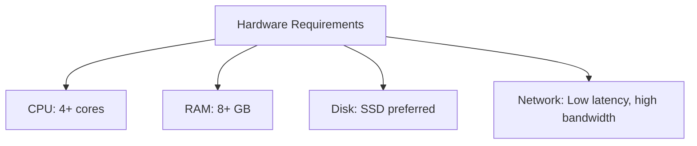
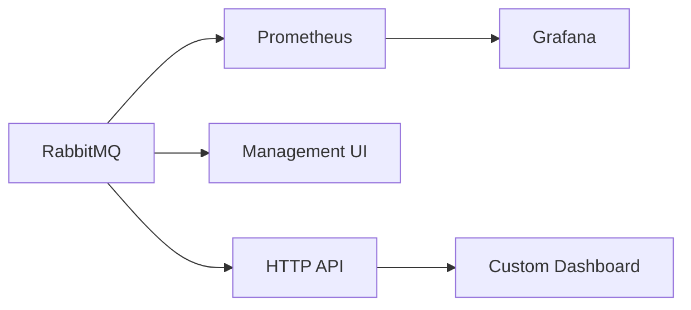

# RabbitMQ Production Checklist

## Introduction

When moving a RabbitMQ deployment from development to production, there are numerous considerations that can make the difference between a stable, performant system and one that causes headaches for your team and users. This checklist covers essential aspects you should address before and during your RabbitMQ production deployment.

RabbitMQ is a powerful message broker that implements the Advanced Message Queuing Protocol (AMQP). While it's relatively easy to set up for development, a production environment requires careful planning around high availability, monitoring, resource allocation, and security. This guide will walk you through the key considerations to ensure your RabbitMQ deployment is production-ready.

## Deployment Planning

### Hardware Requirements

Before deploying RabbitMQ to production, ensure your hardware meets the following minimum requirements:



- **CPU**: RabbitMQ benefits from multiple cores. For production, allocate at least 4 cores.
- **Memory**: Allocate at least 8GB of RAM for moderate workloads, more for high-volume systems.
- **Disk**: Use SSDs for optimal performance, especially for the message store.
- **Network**: Ensure low-latency, high-bandwidth connections between nodes.

### Cluster Architecture

```javascript
// Example cluster config in rabbitmq.conf
cluster_formation.peer_discovery_backend = rabbit_peer_discovery_classic_config
cluster_formation.classic_config.nodes.1 = rabbit@node1.example.com
cluster_formation.classic_config.nodes.2 = rabbit@node2.example.com
cluster_formation.classic_config.nodes.3 = rabbit@node3.example.com
```

For production, consider:

- **Minimum of three nodes** for proper quorum in a clustered setup
- **Network partitioning** strategies (choose between pause_minority, autoheal, or ignore)
- **Distribution across availability zones** for cloud deployments
- **Load balancer** configuration for client connections

## Configuration Optimization

### Resource Limits

```javascript
// Example resource limits in rabbitmq.conf
vm_memory_high_watermark.relative = 0.7
vm_memory_high_watermark_paging_ratio = 0.8
disk_free_limit.absolute = 2GB
```

- Set appropriate **memory high watermark** (typically 0.4-0.7 of system RAM)
- Configure **disk free space limits** to prevent the node from running out of disk space
- Adjust **file descriptor limits** based on expected connection count

### Queue Settings

```javascript
// Declaring a queue with production settings
channel.queueDeclare(
    "critical_orders", // queue name
    true,              // durable
    false,             // not exclusive
    false,             // not auto-delete
    Map.of(
        "x-max-length", 100000,
        "x-overflow", "reject-publish",
        "x-queue-type", "quorum"
    )   // arguments
);
```

- Use **durable queues** for important messages (survives broker restart)
- Set appropriate **queue limits** to prevent unbounded growth
- Consider **quorum queues** for critical data that needs replication
- Use **lazy queues** for very large queues with infrequent access

### Exchange and Binding Configuration

```javascript
// Setting up exchanges with production settings
channel.exchangeDeclare("orders", "topic", true, false, null);

// Creating bindings
channel.queueBind("critical_orders", "orders", "order.critical.*");
channel.queueBind("regular_orders", "orders", "order.regular.*");
```

- Use appropriate **exchange types** for your messaging patterns (direct, topic, fanout, headers)
- Set up **specific binding patterns** to route messages efficiently
- Consider **alternate exchanges** for handling unroutable messages

## Security Hardening

### Authentication and Authorization

```javascript
// rabbitmqctl commands for setting up users and permissions
// rabbitmqctl add_user prod_app strong_password
// rabbitmqctl set_permissions -p / prod_app "^prod_app-.*" "^prod_app-.*" "^(prod_app-.*|amq\.default)"
```

- Create **dedicated service accounts** with limited permissions
- Remove the **default guest user** or restrict it to localhost only
- Set up **vhosts** to isolate different applications or environments
- Enable **TLS for client connections** and management interface

### Network Security

- Use **firewall rules** to restrict access to RabbitMQ ports
- Set up **VLAN or subnet isolation** for cluster communication
- Consider **VPN connections** for clients in different networks
- Implement **connection rate limiting** to prevent DoS attacks

## Monitoring and Alerting

### Key Metrics to Monitor

```javascript
// Sample Prometheus configuration for RabbitMQ monitoring
scrape_configs:
  - job_name: rabbitmq
    static_configs:
      - targets: ['rabbitmq:15692']
```

RabbitMQ exposes many metrics, but focus on these critical ones:

- **Queue length** - Alert on abnormal growth patterns
- **Consumer utilization** - Below 80% may indicate processing issues
- **Memory usage** - Watch for approaching watermark
- **Disk space** - Alert well before hitting disk limits
- **Message rates** - Monitor for unusual spikes or drops
- **Connection count** - Unexpected changes may indicate issues

### Tools and Integration



- Set up the **Prometheus plugin** for metrics collection
- Create **Grafana dashboards** with relevant visualizations
- Configure **alerts for critical thresholds**
- Set up **log aggregation** with ELK Stack or similar tools

## High Availability Setup

### Clustering

```bash
# On the second node, join the first node
rabbitmqctl stop_app
rabbitmqctl reset
rabbitmqctl join_cluster rabbit@first-node
rabbitmqctl start_app

# Verify cluster status
rabbitmqctl cluster_status
```

- Deploy a **minimum of three nodes** for proper quorum
- Use **durable queues** and **persistent messages** for critical data
- Configure proper **network partition handling**
- Implement **quorum queues** for replicated message storage

### Load Balancing

```conf
# HAProxy example configuration for RabbitMQ
frontend rabbitmq_front
    bind *:5672
    mode tcp
    default_backend rabbitmq_back

backend rabbitmq_back
    mode tcp
    balance roundrobin
    server rabbit1 rabbit1.example.com:5672 check
    server rabbit2 rabbit2.example.com:5672 check
    server rabbit3 rabbit3.example.com:5672 check
```

- Set up **HAProxy** or similar load balancer for client connections
- Configure **health checks** to detect and route around failed nodes
- Consider **sticky sessions** for certain connection types

## Backup and Disaster Recovery

- Implement **regular backup procedures** for definitions (exchanges, queues, bindings)
- Set up **automated snapshots** for the Mnesia database
- Create a **disaster recovery plan** with defined RPO/RTO
- Regularly **test the disaster recovery process**

```bash
# Example backup command for definitions
rabbitmqctl export_definitions /path/to/backup/definitions.json

# Example command to restore definitions
rabbitmqctl import_definitions /path/to/backup/definitions.json
```

## Performance Tuning

### Publisher Optimizations

```javascript
// Example of batching publishes with confirms
channel.confirmSelect();

for (int i = 0; i < 1000; i++) {
    channel.basicPublish("orders", "order.regular.1", null, messageBody);
}

channel.waitForConfirmsOrDie(5000);
```

- Use **publisher confirms** for guaranteed delivery
- Implement **batching for high-throughput scenarios**
- Consider **asynchronous publishing** patterns for better performance
- Set appropriate **message persistence** levels for your use case

### Consumer Optimizations

```javascript
// Example of setting prefetch count for fair dispatch
channel.basicQos(100, true);

// Setting up a consumer
channel.basicConsume("orders", false, (consumerTag, delivery) -> {
    try {
        // Process message
        processOrder(delivery.getBody());
        
        // Acknowledge successful processing
        channel.basicAck(delivery.getEnvelope().getDeliveryTag(), false);
    } catch (Exception e) {
        // Reject and requeue on error
        channel.basicNack(delivery.getEnvelope().getDeliveryTag(), false, true);
    }
}, consumerTag -> { });
```

- Set appropriate **prefetch counts** based on consumer processing speed
- Implement proper **message acknowledgment** patterns
- Use **multiple consumers** for parallel processing
- Consider **consumer-side batching** for efficiency

### Connection Management

```javascript
// Connection factory configuration
ConnectionFactory factory = new ConnectionFactory();
factory.setHost("rabbitmq.example.com");
factory.setVirtualHost("/");
factory.setUsername("prod_app");
factory.setPassword("strong_password");
factory.setAutomaticRecoveryEnabled(true);
factory.setNetworkRecoveryInterval(10000);

// Connection sharing
Connection connection = factory.newConnection();
Channel channel1 = connection.createChannel();
Channel channel2 = connection.createChannel();
```

- **Share connections** across threads, but use separate channels
- Implement **automatic connection recovery**
- Set appropriate **heartbeat intervals** (typically 30-60 seconds)
- Implement **proper connection closure** on application shutdown

## Production Deployment Checklist

Use this final checklist before launching your production RabbitMQ deployment:

✅ **Cluster Configuration**
- [ ] At least 3 nodes for HA setup
- [ ] Network partition handling strategy defined
- [ ] Node resource limits configured

✅ **Security**
- [ ] Default guest user removed or restricted
- [ ] TLS enabled for connections
- [ ] Proper user permissions and vhosts configured
- [ ] Firewall rules in place

✅ **Monitoring**
- [ ] Prometheus/Grafana dashboards set up
- [ ] Alerts configured for critical metrics
- [ ] Log aggregation in place
- [ ] Regular health checks implemented

✅ **Data Safety**
- [ ] Persistent messages for critical data
- [ ] Regular definition backups scheduled
- [ ] Disaster recovery plan documented and tested

✅ **Client Configuration**
- [ ] Connection recovery implemented in clients
- [ ] Publisher confirms for important messages
- [ ] Proper consumer acknowledgment patterns
- [ ] Error handling and dead letter exchanges configured

## Troubleshooting Common Issues

### High CPU Usage

- Check for **long queue backlogs** causing high message processing load
- Look for **poorly optimized queue bindings** with complex routing
- Monitor for **high connection churn** (frequent connect/disconnect)

### Memory Issues

```bash
# Show memory breakdown by category
rabbitmqctl status | grep memory

# List queues sorted by memory usage
rabbitmqctl list_queues name memory
```

- Adjust **vm_memory_high_watermark** if messages are being blocked too early
- Check for **large queues** consuming excessive memory
- Monitor **connection and channel count** for unexpected growth

### Unexpected Node Failures

- Check system logs for **resource exhaustion** (disk, file descriptors)
- Verify **network stability** between nodes
- Review **cluster partition** events and configured handling strategy

## Summary

Preparing RabbitMQ for production involves careful planning across multiple dimensions: hardware resources, cluster architecture, security, monitoring, high availability, and performance tuning. By following this checklist, you can avoid common pitfalls and deploy a robust messaging system that meets your application's needs.

Remember that a production-ready RabbitMQ deployment is not a "set it and forget it" affair. Regular monitoring, maintenance, and periodic review of your configuration against changing workloads are essential to maintain optimal performance and reliability.

## Additional Resources

- [RabbitMQ Official Documentation](https://www.rabbitmq.com/documentation.html)
- [RabbitMQ Production Checklist (Official)](https://www.rabbitmq.com/production-checklist.html)
- [RabbitMQ Monitoring](https://www.rabbitmq.com/monitoring.html)
- [Clustering Guide](https://www.rabbitmq.com/clustering.html)

## Practice Exercises

1. Set up a three-node RabbitMQ cluster on your development environment and test failover scenarios.
2. Configure Prometheus and Grafana for monitoring key RabbitMQ metrics.
3. Implement a publisher-consumer application with proper production patterns (confirms, acknowledgments, connection recovery).
4. Create a disaster recovery plan for your RabbitMQ deployment and test the recovery process.
5. Perform a load test on your RabbitMQ deployment and tune the configuration based on the results.