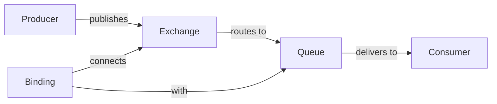

# RabbitMQ Documentation

## Introduction

RabbitMQ is an open-source message broker that implements the Advanced Message Queuing Protocol (AMQP). As a message broker, RabbitMQ acts as an intermediary for messaging, accepting and forwarding messages between applications. This decoupling of services through message queuing is a fundamental pattern in distributed systems architecture.

In this guide, we'll explore RabbitMQ concepts, installation, configuration, basic operations, and best practices to help you get started with implementing robust messaging solutions in your applications.

## Key Concepts

Before diving into RabbitMQ, let's understand some key concepts:

### What is a Message Broker?

A message broker is a software that enables applications, systems, and services to communicate with each other and exchange information. The message broker accepts and translates messages from a sender (producer) and routes them to the appropriate receiver (consumer).

### RabbitMQ Core Components



- **Producer**: Application that sends messages
- **Exchange**: Receives messages from producers and routes them to queues
- **Queue**: Buffer that stores messages
- **Consumer**: Application that receives and processes messages
- **Binding**: Link between an exchange and a queue
- **Connection**: TCP connection between your application and RabbitMQ
- **Channel**: Virtual connection inside a connection

## Installing RabbitMQ

### Prerequisites

- Erlang/OTP 23.2 or newer
- 512MB RAM minimum (1GB recommended)
- 40MB disk space for the base install

### Installation on Different Platforms

#### Ubuntu/Debian

```bash
# Add RabbitMQ repository
curl -s https://packagecloud.io/install/repositories/rabbitmq/rabbitmq-server/script.deb.sh | sudo bash

# Install RabbitMQ server
sudo apt-get install rabbitmq-server

# Start the server
sudo systemctl start rabbitmq-server

# Enable the server to start on boot
sudo systemctl enable rabbitmq-server
```

#### Windows

1. Install Erlang from the [official website](https://www.erlang.org/downloads)
2. Download and run the RabbitMQ installer from the [official website](https://www.rabbitmq.com/download.html)
3. After installation, RabbitMQ service should start automatically

#### macOS (using Homebrew)

```bash
# Install RabbitMQ using Homebrew
brew install rabbitmq

# Start the server
brew services start rabbitmq
```

### Verifying Installation

After installation, verify that RabbitMQ is running:

```bash
sudo rabbitmqctl status
```

## Basic Configuration

### Enabling the Management Plugin

The RabbitMQ management plugin provides a web-based UI for managing and monitoring RabbitMQ:

```bash
sudo rabbitmq-plugins enable rabbitmq_management
```

Access the management interface at `http://localhost:15672` with default credentials:
- Username: guest
- Password: guest

### Creating Users and Virtual Hosts

```bash
# Create a new user
sudo rabbitmqctl add_user myuser mypassword

# Set user permissions
sudo rabbitmqctl set_user_tags myuser administrator

# Create a virtual host
sudo rabbitmqctl add_vhost myvhost

# Set permissions for the user on the virtual host
sudo rabbitmqctl set_permissions -p myvhost myuser ".*" ".*" ".*"
```

## Working with RabbitMQ in Node.js

Let's implement a simple producer-consumer example using Node.js and the `amqplib` library.

### Installation

```bash
npm install amqplib
```

### Producer Example

```javascript
// producer.js
const amqp = require('amqplib');

async function sendMessage() {
  try {
    // Create a connection
    const connection = await amqp.connect('amqp://localhost');
    
    // Create a channel
    const channel = await connection.createChannel();
    
    // Declare a queue
    const queueName = 'hello';
    await channel.assertQueue(queueName, { durable: false });
    
    // Send a message
    const message = 'Hello World!';
    channel.sendToQueue(queueName, Buffer.from(message));
    console.log(`[x] Sent: ${message}`);
    
    // Close the connection after 500ms
    setTimeout(() => {
      connection.close();
      process.exit(0);
    }, 500);
  } catch (error) {
    console.error(`Error: ${error.message}`);
  }
}

sendMessage();
```

### Consumer Example

```javascript
// consumer.js
const amqp = require('amqplib');

async function receiveMessages() {
  try {
    // Create a connection
    const connection = await amqp.connect('amqp://localhost');
    
    // Create a channel
    const channel = await connection.createChannel();
    
    // Declare the same queue as the producer
    const queueName = 'hello';
    await channel.assertQueue(queueName, { durable: false });
    
    console.log(`[*] Waiting for messages in ${queueName}. To exit press CTRL+C`);
    
    // Consume messages
    channel.consume(queueName, (message) => {
      if (message !== null) {
        console.log(`[x] Received: ${message.content.toString()}`);
        channel.ack(message);
      }
    });
  } catch (error) {
    console.error(`Error: ${error.message}`);
  }
}

receiveMessages();
```

### Running the Example

1. Start the consumer in one terminal:
   ```bash
   node consumer.js
   ```

2. Run the producer in another terminal:
   ```bash
   node producer.js
   ```

Expected output in the producer terminal:
```
[x] Sent: Hello World!
```

Expected output in the consumer terminal:
```
[*] Waiting for messages in hello. To exit press CTRL+C
[x] Received: Hello World!
```

## Exchange Types

RabbitMQ supports several exchange types, each with different routing behaviors:

### Direct Exchange

Routes messages to queues based on an exact matching routing key.

```javascript
// Direct exchange example
await channel.assertExchange('direct_logs', 'direct', { durable: false });
await channel.assertQueue('', { exclusive: true });
await channel.bindQueue(queue, 'direct_logs', 'error');
channel.publish('direct_logs', 'error', Buffer.from('This is an error message'));
```

### Topic Exchange

Routes messages to queues based on wildcard matches between the routing key and the queue binding pattern.

```javascript
// Topic exchange example
await channel.assertExchange('topic_logs', 'topic', { durable: false });
await channel.assertQueue('', { exclusive: true });
await channel.bindQueue(queue, 'topic_logs', '*.error.*');
channel.publish('topic_logs', 'app.error.critical', Buffer.from('Critical error!'));
```

### Fanout Exchange

Broadcasts all messages to all queues bound to it.

```javascript
// Fanout exchange example
await channel.assertExchange('logs', 'fanout', { durable: false });
await channel.assertQueue('', { exclusive: true });
await channel.bindQueue(queue, 'logs', '');
channel.publish('logs', '', Buffer.from('Broadcasting this message'));
```

### Headers Exchange

Routes messages based on header values instead of routing keys.

```javascript
// Headers exchange example
await channel.assertExchange('headers_logs', 'headers', { durable: false });
await channel.assertQueue('', { exclusive: true });
await channel.bindQueue(queue, 'headers_logs', '', {'format': 'json', 'x-match': 'all'});

channel.publish('headers_logs', '', Buffer.from('Message with headers'), {
  headers: {
    'format': 'json',
    'type': 'report'
  }
});
```

## Message Durability and Persistence

To ensure messages survive broker restarts:

```javascript
// Declare a durable queue
await channel.assertQueue('task_queue', { durable: true });

// Send a persistent message
channel.sendToQueue('task_queue', Buffer.from(message), { persistent: true });
```

## Dead Letter Exchanges

A dead letter exchange (DLX) handles messages that are rejected or expire:

```javascript
// Setup a dead letter exchange
await channel.assertExchange('dlx', 'direct');
await channel.assertQueue('dead_letters', { durable: true });
await channel.bindQueue('dead_letters', 'dlx', 'dead');

// Create a queue with dead letter configuration
await channel.assertQueue('main_queue', {
  durable: true,
  arguments: {
    'x-dead-letter-exchange': 'dlx',
    'x-dead-letter-routing-key': 'dead'
  }
});
```

## Message Acknowledgments

Acknowledge messages to ensure they're properly processed:

```javascript
// Manual acknowledgment
channel.consume('task_queue', (message) => {
  const content = message.content.toString();
  console.log(`Received: ${content}`);
  
  // Process the message...
  
  // Acknowledge successful processing
  channel.ack(message);
  
  // Or reject if there's an error
  // channel.reject(message, true); // requeue
  // channel.reject(message, false); // don't requeue
}, { noAck: false });
```

## Best Practices

### Connection Management

1. **Reuse Connections**: Create one connection per application and share it across threads.
2. **Multiple Channels**: Create one channel per thread/task.
3. **Connection Recovery**: Implement automatic reconnection logic.

```javascript
// Connection manager example
const amqp = require('amqplib');

class RabbitMQConnection {
  constructor() {
    this.connection = null;
    this.url = 'amqp://localhost';
    this.reconnectTimeout = 5000;
  }
  
  async connect() {
    try {
      this.connection = await amqp.connect(this.url);
      console.log('Connected to RabbitMQ');
      
      this.connection.on('error', (err) => {
        console.error('Connection error', err);
        this.reconnect();
      });
      
      this.connection.on('close', () => {
        console.error('Connection closed');
        this.reconnect();
      });
      
      return this.connection;
    } catch (error) {
      console.error('Failed to connect', error);
      this.reconnect();
    }
  }
  
  reconnect() {
    setTimeout(() => {
      console.log('Attempting to reconnect...');
      this.connect();
    }, this.reconnectTimeout);
  }
  
  async createChannel() {
    if (!this.connection) {
      await this.connect();
    }
    return this.connection.createChannel();
  }
  
  async close() {
    if (this.connection) {
      await this.connection.close();
      this.connection = null;
    }
  }
}

module.exports = new RabbitMQConnection();
```

### Queue Management

1. **Queue Naming**: Use descriptive, consistent naming conventions.
2. **Queue Arguments**: Set appropriate TTL, max length, and DLX configurations.
3. **Durability**: Use durable queues and persistent messages for important data.

### Message Design

1. **Message Size**: Keep messages small (< 128KB).
2. **Serialization**: Use JSON, Protocol Buffers, or Avro for message serialization.
3. **Headers**: Include metadata in message headers instead of the payload.

### Consumer Scaling

1. **Prefetch Count**: Set appropriate prefetch values to control consumer load.
2. **Load Balancing**: Run multiple consumer instances for high-throughput queues.

```javascript
// Set prefetch count to limit messages in flight
await channel.prefetch(10);
```

### Monitoring

Monitor RabbitMQ using:
1. Management UI
2. HTTP API
3. Prometheus and Grafana
4. Log files (`/var/log/rabbitmq/`)

## Scaling RabbitMQ

### Clustering

For high availability and throughput, set up a RabbitMQ cluster:

```bash
# Join node2 to the cluster with node1
rabbitmqctl stop_app
rabbitmqctl reset
rabbitmqctl join_cluster rabbit@node1
rabbitmqctl start_app
```

### Mirroring Queues (Classic High Availability)

For queue redundancy:

```bash
# Set policy for mirroring all queues
rabbitmqctl set_policy ha-all ".*" '{"ha-mode":"all"}' --apply-to queues
```

## Common Patterns with RabbitMQ

### Work Queues (Task Distribution)

Distribute tasks among multiple workers for parallel processing.

```javascript
// Worker code
channel.prefetch(1);
channel.consume('tasks', async (message) => {
  const task = JSON.parse(message.content.toString());
  console.log(`Processing task: ${task.id}`);
  
  // Process the task
  await processTask(task);
  
  // Acknowledge completion
  channel.ack(message);
}, { noAck: false });
```

### Publish/Subscribe

Send messages to multiple consumers simultaneously.

```javascript
// Publisher code
await channel.assertExchange('logs', 'fanout');
channel.publish('logs', '', Buffer.from('Broadcasting message'));

// Subscriber code
await channel.assertExchange('logs', 'fanout');
const q = await channel.assertQueue('', { exclusive: true });
await channel.bindQueue(q.queue, 'logs', '');
channel.consume(q.queue, (message) => {
  console.log(`Received: ${message.content.toString()}`);
}, { noAck: true });
```

### Request-Reply

Implement synchronous-like communication using reply queues.

```javascript
// Client code
const replyQueue = await channel.assertQueue('', { exclusive: true });
const correlationId = generateUuid();

channel.consume(replyQueue.queue, (message) => {
  if (message.properties.correlationId === correlationId) {
    console.log(`Got reply: ${message.content.toString()}`);
  }
}, { noAck: true });

channel.sendToQueue('rpc_queue', Buffer.from('Request message'), {
  correlationId: correlationId,
  replyTo: replyQueue.queue
});

// Server code
channel.consume('rpc_queue', async (message) => {
  const result = await processRequest(message.content.toString());
  
  channel.sendToQueue(
    message.properties.replyTo,
    Buffer.from(result.toString()),
    { correlationId: message.properties.correlationId }
  );
  
  channel.ack(message);
});
```

## Troubleshooting Common Issues

### High Memory Usage

- **Issue**: RabbitMQ using too much memory
- **Solutions**:
  - Increase memory limit (`vm_memory_high_watermark`)
  - Implement queue length limits
  - Ensure consumers keep up with producers

### Slow Consumers

- **Issue**: Messages accumulate in queues because consumers are too slow
- **Solutions**:
  - Add more consumers
  - Optimize consumer processing
  - Implement back pressure mechanisms

### Connection Failures

- **Issue**: Applications losing connection to RabbitMQ
- **Solutions**:
  - Implement connection retry logic
  - Use connection pooling
  - Check network stability

## Summary

RabbitMQ is a powerful message broker that enables reliable communication between distributed applications. We've covered:

- Core concepts of RabbitMQ
- Installation and basic configuration
- Working with exchanges, queues, and messages
- Best practices for production deployments
- Common messaging patterns
- Troubleshooting techniques

By following these guidelines, you can build robust, scalable, and decoupled systems using RabbitMQ.

## Additional Resources

- [Official RabbitMQ Documentation](https://www.rabbitmq.com/documentation.html)
- [RabbitMQ Tutorials](https://www.rabbitmq.com/getstarted.html)
- Practice Exercises:
  1. Build a simple task queue for processing uploads
  2. Implement a notification system using publish/subscribe
  3. Create a distributed logging system with RabbitMQ

## Next Steps

After mastering the basics, consider exploring:
- Shovel plugin for connecting brokers
- Federation plugin for connecting brokers across data centers
- Stream queues for high-throughput messaging
- Quorum queues for high reliability

With this knowledge, you're well-equipped to implement RabbitMQ in your applications and leverage the power of asynchronous messaging for building scalable distributed systems.