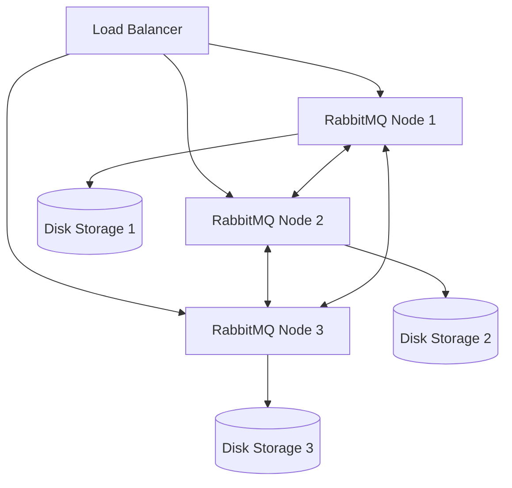

# RabbitMQ Sizing Guide

## Introduction

Properly sizing a RabbitMQ deployment is crucial for ensuring that your messaging system remains stable, performs well, and can handle your application's workload. Unlike many other technologies, RabbitMQ doesn't have a simple "one-size-fits-all" formula. The right configuration depends on your specific message patterns, throughput requirements, and reliability needs.

This guide will walk you through the key considerations for sizing your RabbitMQ deployment, from memory requirements to disk space, CPU needs, and cluster planning. By the end, you'll understand how to properly dimension your RabbitMQ infrastructure for your specific use case.

## Understanding RabbitMQ Resource Usage

Before diving into sizing specifics, it's important to understand how RabbitMQ uses system resources:

### Memory Usage

RabbitMQ uses memory for:
- **Message storage**: Unacknowledged messages are kept in memory
- **Queue indexes**: Metadata about messages
- **Connection state**: Each connection and channel consumes memory
- **Internal operation**: Various internal bookkeeping operations

### CPU Usage

RabbitMQ is CPU-intensive for:
- **Routing decisions**: Particularly with complex exchange-to-queue bindings
- **Message persistence**: Writing messages to disk
- **SSL processing**: For encrypted connections
- **Queue operations**: Message acknowledgments, deliveries, etc.

### Disk Space

RabbitMQ needs disk space for:
- **Message persistence**: Durable messages and queues
- **Message paging**: When memory pressure is high
- **Transaction logs**: For message reliability
- **Mnesia database**: Storing exchange and queue metadata

## Sizing Guidelines

### Memory Sizing

Memory is often the most critical resource for RabbitMQ. Here's how to estimate your needs:

1. **Base memory**: Start with 128MB as a minimum for the Erlang VM
2. **Per-connection memory**: Add ~100KB per client connection
3. **Per-channel memory**: Add ~50KB per channel
4. **Message memory**: Calculate based on average message size × peak message count

```javascript
// Example memory calculation
const baseMemory = 128; // MB
const connectionsMemory = (numberOfConnections * 0.1); // MB (100KB per connection)
const channelsMemory = (numberOfChannels * 0.05); // MB (50KB per channel)
const messagesMemory = (avgMessageSizeKB * peakMessageCount) / 1024; // MB

const totalMemoryMB = baseMemory + connectionsMemory + channelsMemory + messagesMemory;
console.log(`Estimated memory requirement: ${totalMemoryMB} MB`);
```

It's recommended to set the RabbitMQ memory high watermark to 40-60% of system RAM to leave room for the operating system and other processes:

```bash
# Example rabbitmq.conf setting for 40% high watermark on a 16GB system
vm_memory_high_watermark.relative = 0.4
```

### CPU Sizing

CPU requirements depend on your throughput and workload type:

1. **Light workload** (< 1,000 msgs/sec): 2 CPU cores
2. **Medium workload** (1,000-10,000 msgs/sec): 4 CPU cores
3. **Heavy workload** (> 10,000 msgs/sec): 8+ CPU cores

Factors that increase CPU usage:
- Complex routing patterns
- Many exchanges and queues
- High message rates
- Message persistence
- SSL/TLS connections

### Disk Sizing

Calculate disk requirements based on:

1. **Message persistence**: Average message size × persistence duration × message rate
2. **Queue indexing**: Approximately 10% overhead on top of message storage
3. **Node database**: Usually small (1-2GB) unless you have thousands of queues/exchanges

Example calculation for a system with 1KB messages, keeping messages for up to 1 day with a rate of 100 msgs/sec:

```javascript
// Example disk space calculation
const msgSizeKB = 1;
const msgRatePerSec = 100;
const retentionPeriodDays = 1;
const secondsInDay = 86400;

const dailyMessages = msgRatePerSec * secondsInDay;
const rawStorageGB = (msgSizeKB * dailyMessages * retentionPeriodDays) / (1024 * 1024);
const totalStorageGB = rawStorageGB * 1.2; // Adding 20% for overhead

console.log(`Estimated disk requirement: ${totalStorageGB.toFixed(2)} GB`);
```

For production systems, it's wise to allocate at least:
- 10GB for a small deployment
- 50GB for a medium deployment
- 100GB+ for a large deployment

### Network Sizing

Network throughput requirements can be calculated as:

```javascript
// Network throughput calculation
const msgSizeKB = 1;
const msgRatePerSec = 1000;
const networkOverhead = 1.1; // 10% overhead for protocol headers

const throughputKBps = msgSizeKB * msgRatePerSec * networkOverhead;
const throughputMbps = (throughputKBps * 8) / 1000; // Convert to Mbps

console.log(`Required network throughput: ${throughputMbps.toFixed(2)} Mbps`);
```

For cluster communication, ensure low-latency (`<1ms`) and high-bandwidth (at least 1Gbps) connections between nodes.

## Cluster Sizing

RabbitMQ clusters help with both scalability and high availability. Here's how to approach cluster sizing:

### High Availability (HA) Clusters

For HA, follow these guidelines:

1. **Minimum 3 nodes**: To maintain quorum in case of a node failure
2. **Mirror all critical queues**: Using policies to ensure message durability

```bash
# Example policy to mirror all queues with auto-sync mode
rabbitmqctl set_policy ha-all ".*" '{"ha-mode":"all", "ha-sync-mode":"automatic"}'
```

### Scalability Clusters

For throughput scaling:

1. **Add nodes** as throughput needs increase
2. **Distribute connections** across cluster nodes
3. **Shard queues** for high-volume message patterns

Here's a diagram showing a simple RabbitMQ cluster architecture:



## Real-World Sizing Examples

Let's look at some practical examples to understand sizing in real-world scenarios:

### Example 1: Small Web Service

**Workload characteristics:**
- 100 concurrent connections
- 10 messages/sec on average
- 5KB average message size
- Messages stored for up to 1 hour

**Recommended sizing:**
- Memory: 512MB RAM
- CPU: 2 cores
- Disk: 10GB SSD
- Deployment: Single node with periodic backups

```bash
# rabbitmq.conf for small deployment
vm_memory_high_watermark.relative = 0.4
disk_free_limit.absolute = 5GB
```

### Example 2: Medium E-commerce Platform

**Workload characteristics:**
- 1,000 concurrent connections
- 500 messages/sec during peak
- 10KB average message size
- 24-hour message persistence required

**Recommended sizing:**
- Memory: 4GB RAM per node
- CPU: 4 cores per node
- Disk: 50GB SSD per node
- Deployment: 3-node cluster for HA

```bash
# rabbitmq.conf for medium deployment
vm_memory_high_watermark.relative = 0.5
disk_free_limit.absolute = 20GB
```

### Example 3: Large-Scale Event Processing

**Workload characteristics:**
- 5,000+ concurrent connections
- 5,000+ messages/sec
- Various message sizes (2KB-50KB)
- 7-day message retention

**Recommended sizing:**
- Memory: 16GB RAM per node
- CPU: 8+ cores per node
- Disk: 200GB+ SSD per node
- Deployment: 5+ node cluster with queue sharding

```bash
# rabbitmq.conf for large deployment
vm_memory_high_watermark.relative = 0.6
disk_free_limit.absolute = 100GB
```

## Monitoring and Scaling Indicators

Once deployed, monitor these key metrics to determine if you need to scale:

1. **Memory high watermark alarms**: If triggered frequently, increase RAM
2. **CPU utilization**: If consistently >70%, add more cores or nodes
3. **Message backlog growth**: If consistently increasing, add more consumer capacity
4. **Network saturation**: If approaching NIC capacity, upgrade network or add nodes

Here's how to check the current status in RabbitMQ:

```bash
# Check memory usage
rabbitmqctl status | grep memory

# Check number of connections
rabbitmqctl list_connections | wc -l

# Check for memory alarms
rabbitmqctl list_node_memory_alarms
```

## Performance Testing

Before finalizing your sizing, conduct performance tests with realistic workloads:

```javascript
// Example Node.js producer for performance testing
const amqp = require('amqplib');

async function runTest() {
  const connection = await amqp.connect('amqp://localhost');
  const channel = await connection.createChannel();
  const queue = 'performance_test_queue';
  
  await channel.assertQueue(queue, { durable: true });
  
  const messageCount = 100000;
  const messageSize = 1024; // 1KB
  const message = Buffer.alloc(messageSize, 'x');
  
  console.time('publish');
  
  for (let i = 0; i < messageCount; i++) {
    channel.publish('', queue, message);
    
    if (i % 10000 === 0) {
      console.log(`Published ${i} messages`);
    }
  }
  
  console.timeEnd('publish');
  
  await channel.close();
  await connection.close();
}

runTest().catch(console.error);
```

## Summary

Proper RabbitMQ sizing is essential for stable, reliable messaging systems. Remember these key points:

1. **Start with memory**: It's usually the most critical resource
2. **Consider persistence needs**: Disk I/O can become a bottleneck
3. **Monitor and adjust**: Sizing is an ongoing process, not a one-time decision
4. **Test with realistic workloads**: Use performance testing to validate your sizing
5. **Plan for growth**: Add a 30-50% buffer to your calculated requirements

By following these guidelines, you'll be able to properly size your RabbitMQ deployment to handle your specific messaging workload while ensuring stability and performance.

## Additional Resources

To continue learning about RabbitMQ sizing and optimization:

- [RabbitMQ Performance Documentation](https://www.rabbitmq.com/performance.html)
- [RabbitMQ Monitoring Guidelines](https://www.rabbitmq.com/monitoring.html)
- [RabbitMQ Clustering Guide](https://www.rabbitmq.com/clustering.html)

## Exercises

1. Calculate the memory requirements for a RabbitMQ server handling 500 connections, 2000 channels, and 100,000 queued messages with an average size of 2KB.

2. Design a RabbitMQ cluster for a system that needs to process 2,000 messages per second with 99.99% uptime requirements.

3. Create a monitoring plan for a RabbitMQ deployment, listing the key metrics to watch and thresholds that would trigger scaling actions.