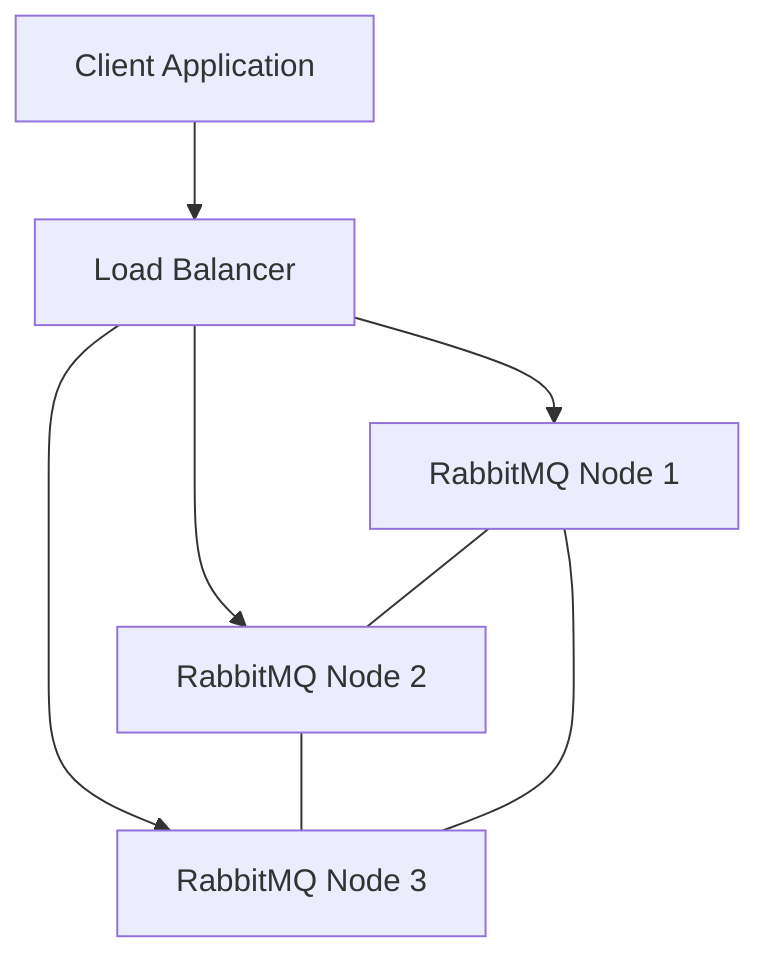

# RabbitMQ Performance Tuning

## Introduction

RabbitMQ is a popular open-source message broker that implements the Advanced Message Queuing Protocol (AMQP). While RabbitMQ works well with default configurations for many use cases, performance tuning becomes crucial as your application scales and message throughput increases. This guide will walk you through various strategies and best practices to optimize RabbitMQ performance for your specific needs.

## Understanding RabbitMQ Performance Factors

Before diving into tuning techniques, it's important to understand the key factors that affect RabbitMQ performance:

1. **Message Throughput**: The number of messages that can be processed per unit of time
2. **Latency**: The time it takes for a message to travel from producer to consumer
3. **Resource Utilization**: CPU, memory, disk I/O, and network usage
4. **Scalability**: The system's ability to handle increased load

Let's explore how to optimize each of these aspects.

## Hardware Considerations

### Memory

RabbitMQ is memory-intensive, particularly when handling persistent messages or when messages accumulate in queues.

```bash
# Set memory high watermark to 0.6 (60% of system RAM)
rabbitmqctl set_vm_memory_high_watermark 0.6
```

For production servers, consider:
- At least 8GB RAM for moderate workloads
- 16-32GB RAM for high-throughput systems
- Setting appropriate memory watermarks to prevent swapping

### CPU

RabbitMQ benefits from multiple CPU cores, especially when using multiple queues:

- 4-8 cores for moderate workloads
- 8-16 cores for high-throughput systems

### Disk

For persistent messaging:
- Use SSDs instead of HDDs
- Consider RAID configurations for better performance and reliability
- Separate RabbitMQ data directory from the OS partition

## Connection Management

### Connection Pooling

Establishing connections is expensive. Implement connection pooling in your client applications:

```javascript
// Node.js example using amqplib with connection pooling
const amqp = require('amqplib');

class RabbitMQConnectionPool {
  constructor(url, maxConnections = 5) {
    this.url = url;
    this.maxConnections = maxConnections;
    this.connections = [];
    this.channelPool = [];
  }

  async getConnection() {
    if (this.connections.length < this.maxConnections) {
      const connection = await amqp.connect(this.url);
      this.connections.push(connection);
      return connection;
    }
    // Return least used connection
    return this.connections[0];
  }

  async getChannel() {
    if (this.channelPool.length > 0) {
      return this.channelPool.pop();
    }
    
    const connection = await this.getConnection();
    return await connection.createChannel();
  }

  async releaseChannel(channel) {
    this.channelPool.push(channel);
  }
}

// Usage
const pool = new RabbitMQConnectionPool('amqp://localhost');
const channel = await pool.getChannel();
// Use channel for operations
await pool.releaseChannel(channel);
```

### Heartbeats and TCP Keepalives

Configure heartbeats to detect dead connections:

```javascript
// Set heartbeat to 30 seconds
const connection = await amqp.connect('amqp://localhost', { 
  heartbeat: 30 
});
```

## Queue Optimization

### Queue Length

Long queues consume more memory. Monitor and control queue length:

```bash
# Get queue information including message count
rabbitmqctl list_queues name messages consumers
```

### Queue Durability Trade-offs

Durable queues (those that survive broker restarts) are slower than transient ones:

```javascript
// Creating a durable queue
channel.assertQueue('important_queue', { durable: true });

// Creating a transient queue (faster but messages lost on restart)
channel.assertQueue('temp_queue', { durable: false });
```

### Lazy Queues

For queues that might grow large, use lazy queues to reduce memory pressure:

```bash
# Declare a lazy queue using policy
rabbitmqctl set_policy lazy-queue "^lazy-" '{"queue-mode":"lazy"}' --apply-to queues
```

## Message Delivery Optimization

### Publisher Confirms

Use publisher confirms to ensure message delivery:

```javascript
// Enable publisher confirms
await channel.confirmSelect();

// Publish with confirmation
channel.publish('exchange', 'routing_key', Buffer.from('message'), {}, (err, ok) => {
  if (err) {
    console.error('Message was nacked!');
  } else {
    console.log('Message was confirmed');
  }
});
```

### Consumer Prefetch (QoS)

Set appropriate prefetch values to control how many messages consumers receive at once:

```javascript
// Set prefetch count to 10 messages per consumer
await channel.prefetch(10);
```

## Using Flow Control

RabbitMQ implements flow control to prevent consumers or publishers from overwhelming the broker.

```javascript
// Listen for blocked connection notifications
connection.on('blocked', (reason) => {
  console.log(`Connection blocked: ${reason}`);
  // Pause publishing
});

connection.on('unblocked', () => {
  console.log('Connection unblocked');
  // Resume publishing
});
```

## Clustering and High Availability

### Cluster Setup

For high throughput, set up a RabbitMQ cluster:



Basic cluster setup commands:

```bash
# On first node
rabbitmqctl stop_app
rabbitmqctl reset
rabbitmqctl start_app

# On other nodes
rabbitmqctl stop_app
rabbitmqctl reset
rabbitmqctl join_cluster rabbit@node1
rabbitmqctl start_app
```

### Quorum Queues

For high availability, use quorum queues instead of classic mirrored queues:

```javascript
// Declare a quorum queue
channel.assertQueue('critical_queue', { 
  arguments: {
    'x-queue-type': 'quorum',
    'x-quorum-initial-group-size': 3
  } 
});
```

## Monitoring and Benchmarking

### Management UI and API

Enable the management plugin for monitoring:

```bash
rabbitmq-plugins enable rabbitmq_management
```

Access the management UI at `http://server-name:15672/` with default credentials `guest/guest`.

### Performance Testing Tool

RabbitMQ provides a PerfTest tool for benchmarking:

```bash
# Basic performance test (1 million messages)
rabbitmq-perf-test --producers 4 --consumers 2 --queue perf-test --rate 5000 --size 1000 --autoack --time 60
```

## Practical Example: Optimizing for High Throughput

Let's build a complete example optimizing RabbitMQ for a high-throughput scenario:

```javascript
// High-performance producer setup
const amqp = require('amqplib');

async function setupOptimizedProducer() {
  // Connection with tuned parameters
  const connection = await amqp.connect('amqp://localhost', {
    heartbeat: 30,
    channelMax: 100
  });
  
  // Handle connection issues
  connection.on('error', (err) => {
    console.error('Connection error', err);
  });
  
  connection.on('blocked', (reason) => {
    console.log(`Producer blocked: ${reason}`);
  });
  
  // Create channel with confirms
  const channel = await connection.createConfirmChannel();
  
  // Optimize exchange and queue
  await channel.assertExchange('optimized-exchange', 'direct', {durable: true});
  
  await channel.assertQueue('optimized-queue', {
    durable: true,
    arguments: {
      'x-queue-type': 'quorum',
      'x-max-length': 1000000,
      'x-overflow': 'reject-publish'
    }
  });
  
  await channel.bindQueue('optimized-queue', 'optimized-exchange', 'optimized-key');
  
  // Example batch publishing function
  const publishBatch = async (messages, batchSize = 100) => {
    for (let i = 0; i < messages.length; i += batchSize) {
      const batch = messages.slice(i, i + batchSize);
      
      const publishPromises = batch.map((message, index) => {
        return new Promise((resolve) => {
          channel.publish(
            'optimized-exchange',
            'optimized-key',
            Buffer.from(JSON.stringify(message)),
            { persistent: true },
            (err) => resolve(!err)
          );
        });
      });
      
      await Promise.all(publishPromises);
      console.log(`Published batch of ${batch.length} messages`);
    }
  };
  
  return { connection, channel, publishBatch };
}

// High-performance consumer setup
async function setupOptimizedConsumer() {
  const connection = await amqp.connect('amqp://localhost', {
    heartbeat: 30
  });
  
  connection.on('error', (err) => {
    console.error('Consumer connection error', err);
  });
  
  const channel = await connection.createChannel();
  
  // Set optimal prefetch for your workload
  await channel.prefetch(50);
  
  // Setup consumer with manual acknowledgment
  await channel.consume('optimized-queue', async (msg) => {
    if (msg) {
      try {
        // Process message
        const content = JSON.parse(msg.content.toString());
        await processMessage(content);
        
        // Acknowledge successful processing
        channel.ack(msg);
      } catch (error) {
        // Handle processing errors
        console.error('Processing error', error);
        
        // Negative acknowledgment with requeue
        channel.nack(msg, false, true);
      }
    }
  }, { noAck: false });
  
  async function processMessage(content) {
    // Simulate processing
    await new Promise(resolve => setTimeout(resolve, 10));
    return true;
  }
  
  return { connection, channel };
}

// Usage example
async function runOptimizedExample() {
  const producer = await setupOptimizedProducer();
  const consumer = await setupOptimizedConsumer();
  
  // Generate test messages
  const messages = Array(10000).fill().map((_, i) => ({
    id: i,
    timestamp: Date.now(),
    data: `Message content ${i}`
  }));
  
  console.log('Starting optimized publishing...');
  const startTime = Date.now();
  
  await producer.publishBatch(messages, 200);
  
  const elapsed = Date.now() - startTime;
  console.log(`Published 10,000 messages in ${elapsed}ms (${Math.floor(10000 / (elapsed / 1000))} msg/sec)`);
  
  // Let consumer process for a while
  await new Promise(resolve => setTimeout(resolve, 5000));
  
  // Clean up
  await producer.channel.close();
  await producer.connection.close();
  await consumer.channel.close();
  await consumer.connection.close();
}

// Run example
runOptimizedExample().catch(console.error);
```

## Configuration Checklist

Use this checklist to ensure you've covered all performance tuning aspects:

1. **Hardware**
   - [ ] Sufficient memory allocated
   - [ ] Memory high watermark set appropriately
   - [ ] Multiple CPU cores available
   - [ ] Fast disk storage (SSD preferred)

2. **Connections**
   - [ ] Connection pooling implemented
   - [ ] Appropriate heartbeat intervals set
   - [ ] TCP keepalives enabled

3. **Queues**
   - [ ] Queue length monitored and limited
   - [ ] Durability settings optimized for workload
   - [ ] Lazy queues used where appropriate
   - [ ] Queue TTL set for temporary data

4. **Messages**
   - [ ] Message persistence configured based on importance
   - [ ] Publisher confirms enabled for critical messages
   - [ ] Appropriate consumer prefetch values set
   - [ ] Batch publishing used for high throughput

5. **Clustering**
   - [ ] Proper cluster setup for scalability
   - [ ] Quorum queues used for high availability
   - [ ] Load balanced appropriately

6. **Monitoring**
   - [ ] Management interface enabled
   - [ ] Alarms set for queue length, memory usage
   - [ ] Regular performance testing

## Summary

Optimizing RabbitMQ performance requires a holistic approach that considers hardware resources, connection management, queue configuration, message delivery parameters, and appropriate monitoring. By implementing the techniques covered in this guide, you can significantly improve your RabbitMQ server's throughput and reliability.

Remember that every application has unique requirements, so benchmark different configurations to find the optimal settings for your specific workload. Start with conservative settings and gradually tune parameters while monitoring system performance.

## Additional Resources

- [RabbitMQ Official Performance Guide](https://www.rabbitmq.com/performance.html)
- [RabbitMQ PerfTest Tool Documentation](https://rabbitmq.github.io/rabbitmq-perf-test/stable/htmlsingle/)
- [Monitoring RabbitMQ](https://www.rabbitmq.com/monitoring.html)
- [RabbitMQ Clustering Guide](https://www.rabbitmq.com/clustering.html)

## Exercises

1. Set up a RabbitMQ server with optimized memory and disk settings.
2. Create a benchmark script to test throughput with different prefetch values.
3. Implement a connection pool in your preferred programming language.
4. Compare the performance of durable vs. non-durable queues with a test application.
5. Configure and test a RabbitMQ cluster with three nodes.