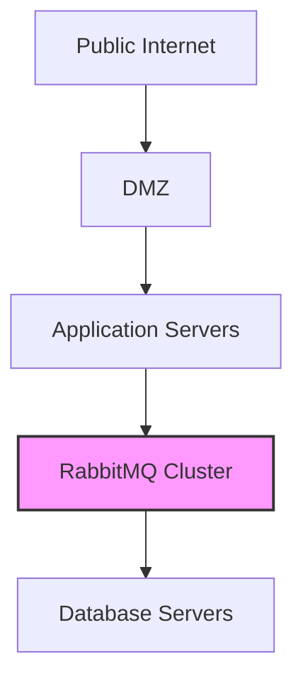

# RabbitMQ Security Hardening

## Introduction

RabbitMQ is a popular open-source message broker that enables applications to communicate through asynchronous messaging. As with any system that handles communication between components, securing RabbitMQ is crucial, especially in production environments. This guide will walk you through essential security practices to protect your RabbitMQ installations from common vulnerabilities and threats.

Security hardening is the process of strengthening a system's configuration to reduce its attack surface. For RabbitMQ, this involves several layers of protection, from network security to authentication and authorization mechanisms.

## Why Security Matters for Message Brokers

Message brokers like RabbitMQ often handle sensitive data and form critical infrastructure in modern applications. A compromised message broker can lead to:

- Data breaches and information leakage
- Service disruptions affecting business operations
- Potential lateral movement by attackers to other systems
- Compliance violations

Let's explore how to properly secure your RabbitMQ deployment.

## Network Security

### Enable TLS for Connections

One of the first steps in securing RabbitMQ is enabling TLS (Transport Layer Security) to encrypt communications between clients and the broker.

#### Configuration Example

```ini
# In rabbitmq.conf
listeners.ssl.default = 5671

ssl_options.cacertfile = /path/to/ca_certificate.pem
ssl_options.certfile = /path/to/server_certificate.pem
ssl_options.keyfile = /path/to/server_key.pem
ssl_options.verify = verify_peer
ssl_options.fail_if_no_peer_cert = true
```

#### Testing TLS Configuration

You can verify your TLS setup using the `openssl` command:

```bash
openssl s_client -connect localhost:5671 -tls1_2
```

Output should include certificate information and an "SSL handshake" success message.

### Firewall Configuration

Restrict access to RabbitMQ ports using firewall rules. Only allow necessary connections from authorized clients.

```bash
# Using iptables (Linux)
iptables -A INPUT -p tcp --dport 5672 -s trusted_ip_range -j ACCEPT
iptables -A INPUT -p tcp --dport 5672 -j DROP

# For management interface
iptables -A INPUT -p tcp --dport 15672 -s admin_ip_range -j ACCEPT
iptables -A INPUT -p tcp --dport 15672 -j DROP
```

### Network Segregation

Place your RabbitMQ servers in a separate network segment where possible, limiting their exposure to potential attackers.



## Authentication and Authorization

### Use Strong Credentials

Avoid using default credentials. Create unique, complex passwords for all accounts.

```bash
# Create a new administrator with a strong password
rabbitmqctl add_user admin_user strong_password_here
rabbitmqctl set_user_tags admin_user administrator
```

### Implement User Access Controls

Create specific users for different applications and limit their permissions.

```bash
# Create application-specific users
rabbitmqctl add_user app1_user app1_password
rabbitmqctl set_permissions -p / app1_user "^app1.*" "^app1.*" "^app1.*"

rabbitmqctl add_user app2_user app2_password
rabbitmqctl set_permissions -p / app2_user "^app2.*" "^app2.*" "^app2.*"
```

This configuration ensures:
- `app1_user` can only access resources starting with "app1"
- `app2_user` can only access resources starting with "app2"

### Implement OAuth or LDAP Authentication

For enterprise environments, integrate with existing authentication systems.

```ini
# In rabbitmq.conf for LDAP integration
auth_backends.1 = rabbit_auth_backend_ldap
auth_backends.2 = rabbit_auth_backend_internal

# LDAP server configuration
auth_ldap.servers.1 = ldap-server.example.com
auth_ldap.user_dn_pattern = cn=${username},ou=People,dc=example,dc=com
auth_ldap.use_ssl = true
auth_ldap.port = 636
```

## Advanced Security Measures

### Enable Plugin Security

Carefully manage which plugins are enabled, especially management interfaces.

```bash
# Only enable necessary plugins
rabbitmq-plugins enable rabbitmq_management
rabbitmq-plugins enable rabbitmq_auth_backend_ldap

# Disable unnecessary plugins
rabbitmq-plugins disable rabbitmq_mqtt
rabbitmq-plugins disable rabbitmq_stomp
```

### Implement Resource Limits

Prevent denial-of-service attacks by setting resource limits.

```ini
# In rabbitmq.conf
channel_max = 100
max_connections = 500
```

### Log Monitoring and Auditing

Configure comprehensive logging and regularly review for suspicious activities.

```ini
# In rabbitmq.conf
log.file = rabbit.log
log.dir = /var/log/rabbitmq
log.file.level = info
```

Use a log analysis tool to monitor for unusual patterns:

```bash
# Example using grep for failed login attempts
grep "failed authentication" /var/log/rabbitmq/rabbit.log
```

## Secure Configuration Example

Here's a more comprehensive security-focused configuration file:

```ini
# rabbitmq.conf with security hardening

# Network settings
listeners.tcp = none
listeners.ssl.default = 5671

# SSL/TLS configuration
ssl_options.cacertfile = /path/to/ca_certificate.pem
ssl_options.certfile = /path/to/server_certificate.pem
ssl_options.keyfile = /path/to/server_key.pem
ssl_options.verify = verify_peer
ssl_options.fail_if_no_peer_cert = true
ssl_options.versions.1 = tlsv1.2
ssl_options.versions.2 = tlsv1.3

# Authentication backends
auth_backends.1 = rabbit_auth_backend_internal
# auth_backends.2 = rabbit_auth_backend_ldap  # Uncomment for LDAP

# Resource limits
channel_max = 100
max_connections = 500
max_message_size = 134217728  # 128MB

# Management plugin security
management.listener.port = 15672
management.listener.ssl = true
management.listener.ssl_opts.cacertfile = /path/to/ca_certificate.pem
management.listener.ssl_opts.certfile = /path/to/server_certificate.pem
management.listener.ssl_opts.keyfile = /path/to/server_key.pem

# Logging
log.file.level = info
log.connection.level = info
log.channel.level = info

# Disallow guest user on non-localhost connections
loopback_users.guest = true
```

## Applying Security Policies with RabbitMQ CLI

You can use RabbitMQ's command-line tools to apply security policies:

```bash
# Create a policy that enforces message TTL and queue length limits
rabbitmqctl set_policy TTL ".*" '{"message-ttl":86400000, "max-length":10000}' --apply-to queues

# Enable queue mirroring for high availability
rabbitmqctl set_policy HA "^important\." '{"ha-mode":"exactly","ha-params":2,"ha-sync-mode":"automatic"}' --priority 1 --apply-to queues
```

## Implementing Security in Client Applications

Security isn't just server-side. Clients should also follow best practices:

```javascript
// JavaScript example (using amqplib)
const amqp = require('amqplib');

// Use TLS and credentials
const connect = async () => {
  try {
    // Security best practices in connection options
    const connection = await amqp.connect({
      protocol: 'amqps', // Use AMQPS (TLS)
      hostname: 'rabbitmq.example.com',
      port: 5671,
      username: 'app_specific_user',
      password: 'strong_password',
      vhost: 'app_vhost',
      
      // TLS options
      tls: {
        ca: [fs.readFileSync('/path/to/ca_certificate.pem')],
        rejectUnauthorized: true // Always validate server certificate
      }
    });
    
    const channel = await connection.createChannel();
    // Rest of the application logic
    
    // Implement proper connection error handling
    connection.on('error', (err) => {
      console.error('Connection error', err);
      // Implement appropriate error handling and reconnection strategy
    });
    
    // Implement proper shutdown
    process.on('SIGINT', () => {
      channel.close();
      connection.close();
    });
    
    return channel;
  } catch (error) {
    console.error('Failed to connect to RabbitMQ', error);
    // Implement appropriate retry strategy
  }
};
```

## Security Monitoring and Maintenance

### Regular Auditing

Implement regular security audits of your RabbitMQ configuration:

```bash
# Export current configuration for review
rabbitmqctl environment > rabbitmq_environment.txt
rabbitmqctl list_users > rabbitmq_users.txt
rabbitmqctl list_permissions > rabbitmq_permissions.txt
rabbitmqctl list_policies > rabbitmq_policies.txt
```

### Keep RabbitMQ Updated

Always use the latest stable release of RabbitMQ:

```bash
# Example update on Debian/Ubuntu
apt-get update
apt-get install rabbitmq-server

# Verify version after update
rabbitmqctl version
```

## Common Security Pitfalls to Avoid

1. **Default credentials**: Never use the default guest/guest account in production
2. **Exposing management interface**: Limit access to the management UI
3. **Using outdated TLS versions**: Ensure you're using TLS 1.2 or higher
4. **Overly permissive permissions**: Follow the principle of least privilege
5. **Neglecting logs**: Regularly review logs for suspicious activities
6. **Missing queue and message limits**: Set appropriate resource constraints

## Summary

Securing RabbitMQ requires a multi-layered approach:

1. **Network security**: Enable TLS, configure firewalls, implement network segregation
2. **Authentication and authorization**: Use strong credentials, implement proper access controls
3. **Configuration hardening**: Disable unnecessary features, apply resource limits
4. **Client security**: Implement proper security practices in client applications
5. **Monitoring and maintenance**: Regular audits, updates, and log reviews

By implementing these security measures, you can significantly reduce the risk of security incidents involving your RabbitMQ infrastructure.

## Additional Resources

- [Official RabbitMQ Security Documentation](https://www.rabbitmq.com/security.html)
- [OWASP Secure Configuration Guide](https://owasp.org/www-project-web-security-testing-guide/)
- [NIST Cybersecurity Framework](https://www.nist.gov/cyberframework)

## Practice Exercises

1. Set up a RabbitMQ instance with TLS encryption and test connectivity using openssl.
2. Create a proper user permission structure for an application with multiple components.
3. Configure RabbitMQ to integrate with an existing authentication system (LDAP or OAuth).
4. Implement a log monitoring solution to alert on suspicious RabbitMQ activities.
5. Perform a security audit of an existing RabbitMQ deployment and identify potential improvements.