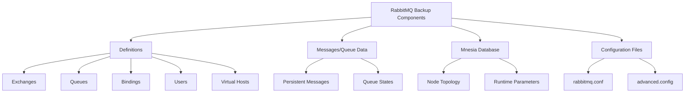
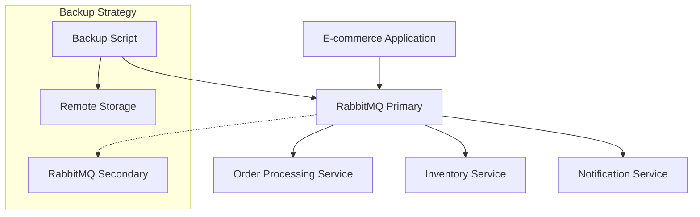

# RabbitMQ Backup Strategies

## Introduction

Message brokers like RabbitMQ form critical infrastructure in modern distributed systems. They manage message queues that connect various components of your application, making them essential to your system's reliability. Any data loss or downtime can significantly impact your business operations. This guide explores comprehensive backup strategies for RabbitMQ to help you protect your messaging infrastructure against failures.

## Why Backup RabbitMQ?

Before diving into specific strategies, let's understand why backing up RabbitMQ is crucial:

- **Data Protection**: Preserves messages, queues, exchanges, and bindings
- **Disaster Recovery**: Enables recovery after hardware failures or data corruption
- **Configuration Management**: Safeguards custom configurations and user permissions
- **Minimal Downtime**: Reduces service interruption during recovery operations
- **Compliance Requirements**: Helps meet regulatory data retention policies

## RabbitMQ Components to Backup

When planning your backup strategy, you need to consider different components of RabbitMQ:



## Backup Strategy 1: Definition Backups

The simplest form of backup involves exporting RabbitMQ definitions, which include exchanges, queues, bindings, users, and virtual hosts.

### Exporting Definitions

Use the RabbitMQ Management plugin to export definitions:

```bash
rabbitmqadmin export /path/to/definitions.json
```

Or via the HTTP API:

```bash
curl -u admin:password http://localhost:15672/api/definitions > definitions.json
```

Example output (definitions.json):

```json
{
  "rabbit_version": "3.10.0",
  "rabbitmq_version": "3.10.0",
  "product_name": "RabbitMQ",
  "product_version": "3.10.0",
  "users": [
    {
      "name": "admin",
      "password_hash": "...",
      "hashing_algorithm": "rabbit_password_hashing_sha256",
      "tags": "administrator"
    }
  ],
  "vhosts": [
    {
      "name": "/"
    }
  ],
  "permissions": [
    {
      "user": "admin",
      "vhost": "/",
      "configure": ".*",
      "write": ".*",
      "read": ".*"
    }
  ],
  "queues": [
    {
      "name": "important_queue",
      "vhost": "/",
      "durable": true,
      "auto_delete": false,
      "arguments": {}
    }
  ],
  "exchanges": [
    {
      "name": "orders",
      "vhost": "/",
      "type": "direct",
      "durable": true,
      "auto_delete": false,
      "internal": false,
      "arguments": {}
    }
  ],
  "bindings": [
    {
      "source": "orders",
      "vhost": "/",
      "destination": "important_queue",
      "destination_type": "queue",
      "routing_key": "new_order",
      "arguments": {}
    }
  ]
}
```

### Restoring Definitions

To restore definitions from a backup:

```bash
rabbitmqadmin import /path/to/definitions.json
```

Or via the HTTP API:

```bash
curl -u admin:password -X POST -H "Content-Type: application/json" \
  -d @definitions.json http://localhost:15672/api/definitions
```

### Limitations

Definition backups have important limitations:

- They don't include message data
- Queue contents are not preserved
- Configuration files are not included

## Backup Strategy 2: RabbitMQ Management Plugin Snapshots

The RabbitMQ Management plugin can create more comprehensive backups including messages, but only for a single node.

```bash
# Create a backup
rabbitmqctl export_definitions /path/to/backup.json

# Restore from backup
rabbitmqctl import_definitions /path/to/backup.json
```

## Backup Strategy 3: File System Level Backups

For a comprehensive backup strategy, you need to back up the underlying file system. RabbitMQ stores its data in several locations:

1. **Mnesia Database Directory**: Contains node configuration and topology
2. **Message Store Directory**: Contains persistent message data

### Finding Data Directories

Locate your RabbitMQ data directories:

```bash
rabbitmqctl eval 'rabbit_mnesia:dir().'
rabbitmqctl eval 'rabbit:data_dir().'
```

### Creating File System Backups

For a complete backup, follow these steps:

1. **Stop the RabbitMQ server**:

```bash
rabbitmqctl stop_app
```

2. **Copy the data directories**:

```bash
# Backing up the Mnesia database
cp -r /var/lib/rabbitmq/mnesia /backup/rabbitmq/mnesia

# Backing up message store (if separate)
cp -r /var/lib/rabbitmq/msg_store_data /backup/rabbitmq/msg_store_data

# Backing up configuration files
cp /etc/rabbitmq/rabbitmq.conf /backup/rabbitmq/config/
cp /etc/rabbitmq/advanced.config /backup/rabbitmq/config/ # if exists
```

3. **Restart RabbitMQ**:

```bash
rabbitmqctl start_app
```

> **Warning**: File system backups require downtime, which might not be acceptable for production systems.

### Restoring from File System Backups

To restore from a file system backup:

1. **Stop the RabbitMQ server**:

```bash
rabbitmqctl stop_app
```

2. **Remove existing data**:

```bash
rm -rf /var/lib/rabbitmq/mnesia/*
```

3. **Restore from backup**:

```bash
cp -r /backup/rabbitmq/mnesia/* /var/lib/rabbitmq/mnesia/
cp -r /backup/rabbitmq/config/* /etc/rabbitmq/
```

4. **Set correct permissions**:

```bash
chown -R rabbitmq:rabbitmq /var/lib/rabbitmq/mnesia
```

5. **Start RabbitMQ**:

```bash
rabbitmqctl start_app
```

## Backup Strategy 4: Shovel Plugin for Live Backups

For minimal-downtime backups, use the Shovel plugin to replicate messages to a backup RabbitMQ instance.

### Setting Up Shovel

1. **Enable the plugin on both RabbitMQ instances**:

```bash
rabbitmq-plugins enable rabbitmq_shovel rabbitmq_shovel_management
```

2. **Configure the shovel** (via rabbitmq.conf or management UI):

```
shovel.name = backup_shovel
shovel.source-broker = amqp://source-rabbitmq-host
shovel.source-queue = important_queue
shovel.destination-broker = amqp://backup-rabbitmq-host
shovel.destination-queue = important_queue_backup
shovel.reconnect-delay = 5
```

This creates a live replica of your messages on a secondary RabbitMQ instance.

## Backup Strategy 5: Clustering with Mirrored Queues

For high-availability and implicit backups, configure RabbitMQ clustering with mirrored queues:

```bash
# On the first node
rabbitmqctl cluster_status

# On additional nodes
rabbitmqctl stop_app
rabbitmqctl join_cluster rabbit@first-node-hostname
rabbitmqctl start_app
```

Then configure queue mirroring:

```bash
rabbitmqctl set_policy ha-all ".*" '{"ha-mode":"all"}' --apply-to queues
```

This ensures that queue data is replicated across all nodes in the cluster, providing redundancy.

## Backup Strategy 6: Automated Backups with Scripts

Create a shell script to automate regular backups:

```bash
#!/bin/bash

# Configuration
BACKUP_DIR="/path/to/backups"
TIMESTAMP=$(date +%Y%m%d_%H%M%S)
BACKUP_FILE="$BACKUP_DIR/rabbitmq_backup_$TIMESTAMP.json"
CONFIG_BACKUP="$BACKUP_DIR/config_backup_$TIMESTAMP"

# Create backup directory if it doesn't exist
mkdir -p $BACKUP_DIR
mkdir -p $CONFIG_BACKUP

# Export definitions
rabbitmqadmin export $BACKUP_FILE

# Backup configuration files
cp /etc/rabbitmq/rabbitmq.conf $CONFIG_BACKUP/
cp /etc/rabbitmq/advanced.config $CONFIG_BACKUP/ 2>/dev/null || true

# Optional: Cleanup old backups (keep last 7 days)
find $BACKUP_DIR -name "rabbitmq_backup_*" -mtime +7 -delete
find $BACKUP_DIR -name "config_backup_*" -mtime +7 -delete

echo "Backup completed: $BACKUP_FILE"
```

Schedule this script with cron:

```bash
# Run backup daily at 2 AM
0 2 * * * /path/to/rabbitmq_backup.sh >> /var/log/rabbitmq_backup.log 2>&1
```

## Best Practices for RabbitMQ Backups

1. **Schedule Regular Backups**: Automate backups on a consistent schedule
2. **Diversify Backup Locations**: Store backups on separate physical hardware
3. **Test Recovery Regularly**: Validate your backups by performing test recoveries
4. **Document Procedures**: Create step-by-step recovery procedures
5. **Monitor Backup Success**: Implement alerting for backup failures
6. **Encrypt Sensitive Data**: Protect credentials and sensitive message content
7. **Retain Multiple Versions**: Keep several iterations of backups
8. **Plan for Different Failure Scenarios**: Have specific recovery plans for different types of failures

## Real-World Backup Implementation Example

Let's look at a real-world example of implementing a comprehensive backup strategy for a production RabbitMQ system:

### Scenario: E-commerce Message Processing System

An e-commerce company processes orders through RabbitMQ queues and needs a reliable backup strategy:



### Implementation

1. **Daily Definition Exports**: Automated export of definitions at 2 AM

```bash
# In rabbitmq_backup.sh
rabbitmqadmin export $BACKUP_DIR/definitions_$TIMESTAMP.json
```

2. **Message Replication**: Shovel plugin to replicate critical queues

```bash
# Shovel configuration
rabbitmqctl set_parameter shovel order_backup \
  '{"src-uri": "amqp://", "src-queue": "orders", 
    "dest-uri": "amqp://backup-server", "dest-queue": "orders_backup"}'
```

3. **Configuration Backup**: Versioned configuration files

```bash
# In rabbitmq_backup.sh
cp /etc/rabbitmq/*.conf $BACKUP_DIR/config_$TIMESTAMP/
```

4. **Offsite Storage**: Copy backups to cloud storage

```bash
# In rabbitmq_backup.sh
aws s3 cp $BACKUP_DIR/definitions_$TIMESTAMP.json s3://company-backups/rabbitmq/
```

5. **Monitoring**: Alert on backup failures

```bash
# In rabbitmq_backup.sh
if [ $? -ne 0 ]; then
  send_alert "RabbitMQ backup failed!"
  exit 1
fi
```

## Troubleshooting Recovery Issues

When restoring RabbitMQ from backups, you might encounter these common issues:

| Issue | Possible Cause | Solution |
|-------|----------------|----------|
| Erlang Cookie Mismatch | Different Erlang cookie after restore | Copy the original `.erlang.cookie` file |
| Permission Errors | Incorrect file ownership | `chown -R rabbitmq:rabbitmq /var/lib/rabbitmq` |
| Node Name Conflicts | Different hostname after restore | Update `RABBITMQ_NODENAME` in environment |
| Corrupt Mnesia Database | Incomplete backup or corruption | Use clean install and restore definitions |
| Queue Recovery Failure | Message store corruption | Re-create queues and handle message loss |

## Summary

Implementing a robust RabbitMQ backup strategy is essential for ensuring message data persistence and system reliability. By combining multiple approaches such as definition exports, file system backups, and replication strategies, you can create a comprehensive protection plan tailored to your specific needs.

Remember that the best backup strategy combines:
- Regular automated backups
- Redundancy through clustering or shovel plugins
- Proper testing of recovery procedures
- Monitoring of backup processes

Implementing these practices will significantly improve your ability to recover from failures and minimize service disruption.

## Additional Resources

- [RabbitMQ Official Documentation on Backup](https://www.rabbitmq.com/backup.html)
- [RabbitMQ Management HTTP API](https://www.rabbitmq.com/management.html#http-api)
- [RabbitMQ Clustering Guide](https://www.rabbitmq.com/clustering.html)
- [RabbitMQ Shovel Plugin Documentation](https://www.rabbitmq.com/shovel.html)

## Exercises

1. Create a shell script that performs a complete RabbitMQ backup, including definitions and configuration files.
2. Set up a test environment with two RabbitMQ instances and configure the Shovel plugin to replicate messages.
3. Perform a disaster recovery test: corrupt your RabbitMQ data directory intentionally and restore from your backups.
4. Design a backup rotation strategy for a production RabbitMQ environment with limited storage.
5. Create a monitoring solution that verifies the success of your RabbitMQ backups and alerts on failures.