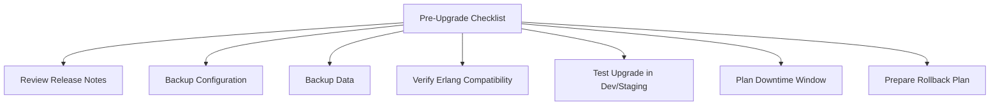
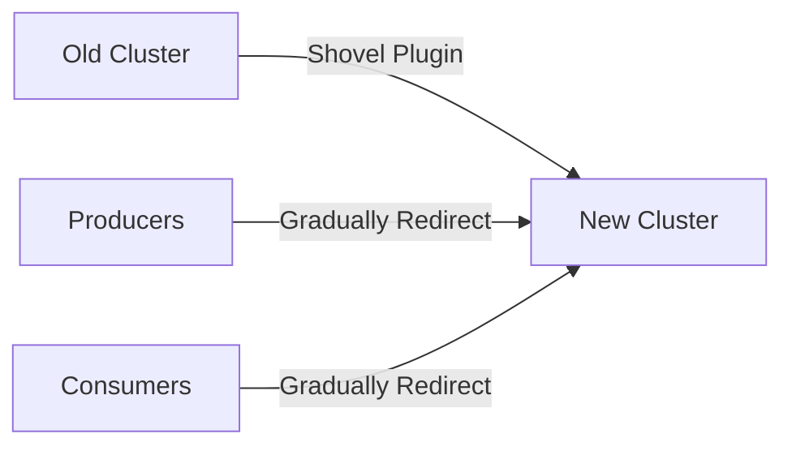

# RabbitMQ Upgrade Procedures

## Introduction

RabbitMQ is a popular open-source message broker that implements the Advanced Message Queuing Protocol (AMQP). Like any critical infrastructure component, RabbitMQ requires occasional upgrades to benefit from security patches, bug fixes, and new features. However, upgrading a message broker in a production environment requires careful planning and execution to minimize downtime and prevent message loss.

This guide walks through the best practices for upgrading RabbitMQ, whether you're running a single node for development or a clustered setup in production.

## Understanding RabbitMQ Versioning

Before diving into upgrade procedures, it's important to understand RabbitMQ's versioning scheme:

- **Major version**: Significant changes that may include backward-incompatible API changes (e.g., 3.x.x to 4.x.x)
- **Minor version**: New features with backward compatibility (e.g., 3.8.x to 3.9.x)
- **Patch version**: Bug fixes and security patches (e.g., 3.9.1 to 3.9.2)

Generally, patch version upgrades are safest, while major version upgrades require more careful planning.

## Pre-Upgrade Checklist

Before upgrading RabbitMQ, complete the following checklist:



### 1. Review Release Notes

Always read the release notes for the version you're upgrading to. Pay special attention to:

- Breaking changes
- Deprecated features
- New default settings
- Performance improvements

Example:

```bash
# Visit the official release notes at
# https://github.com/rabbitmq/rabbitmq-server/releases
```

### 2. Backup Configuration

Back up your RabbitMQ configuration files:

```bash
# Backup rabbitmq.conf and advanced.config
cp /etc/rabbitmq/rabbitmq.conf /etc/rabbitmq/rabbitmq.conf.backup
cp /etc/rabbitmq/advanced.config /etc/rabbitmq/advanced.config.backup

# Export definitions (includes users, vhosts, queues, exchanges, bindings)
rabbitmqctl export_definitions /path/to/definitions.json
```

### 3. Back Up Data

Ensure that your message data is backed up:

```bash
# Stop RabbitMQ
rabbitmqctl stop_app

# Copy the mnesia directory
cp -r /var/lib/rabbitmq/mnesia /var/lib/rabbitmq/mnesia.backup

# Start RabbitMQ again
rabbitmqctl start_app
```

### 4. Verify Erlang Compatibility

RabbitMQ requires specific Erlang/OTP versions. Check the [compatibility matrix](https://www.rabbitmq.com/which-erlang.html) to ensure your target RabbitMQ version is compatible with your Erlang version.

Example compatibility check:

```bash
# Check current Erlang version
erl -eval '{ok, Version} = file:read_file(filename:join([code:root_dir(), "releases", erlang:system_info(otp_release), "OTP_VERSION"])), io:fwrite(Version), halt().' -noshell

# Check RabbitMQ version
rabbitmqctl version
```

### 5. Test in Development/Staging

Always test the upgrade process in a development or staging environment that mirrors your production setup as closely as possible.

## Upgrade Procedures

RabbitMQ can be upgraded using different strategies depending on your deployment scenario.

### Single Node Upgrade

For a standalone RabbitMQ node:

```bash
# 1. Stop RabbitMQ application (keeps Erlang VM running)
rabbitmqctl stop_app

# 2. Install the new RabbitMQ version
# For Debian/Ubuntu:
apt-get update
apt-get install rabbitmq-server

# For RHEL/CentOS:
yum update rabbitmq-server

# For Windows, install the new version over the existing one

# 3. Start RabbitMQ application
rabbitmqctl start_app

# 4. Verify the new version
rabbitmqctl version
```

### Rolling Cluster Upgrade (Minimal Downtime)

For RabbitMQ clusters, a rolling upgrade minimizes downtime:

```bash
# For each node in the cluster, starting with non-master nodes:

# 1. Stop the node
rabbitmqctl -n rabbit@[node_name] stop_app

# 2. Upgrade RabbitMQ on this node
# (using your package manager)

# 3. Start the node
rabbitmqctl -n rabbit@[node_name] start_app

# 4. Wait for node synchronization
# Check cluster status 
rabbitmqctl cluster_status

# 5. Move to the next node once synchronized
```

Example of checking cluster status:

```bash
rabbitmqctl cluster_status
```

Output:

```
Cluster status of node rabbit@node1 ...
[{nodes,[{disc,['rabbit@node1','rabbit@node2','rabbit@node3']}]},
 {running_nodes,['rabbit@node3','rabbit@node2','rabbit@node1']},
 {cluster_name,<<"rabbit@node1">>},
 {partitions,[]},
 {alarms,[{'rabbit@node1',[]},
          {'rabbit@node2',[]},
          {'rabbit@node3',[]}]}]
```

### Blue-Green Deployment for Major Upgrades

For major version upgrades or when maximum safety is required:

1. Set up a parallel RabbitMQ cluster with the new version
2. Configure shovel or federation plugins to transfer messages
3. Redirect producers to the new cluster
4. Wait for the old cluster to process remaining messages
5. Decommission the old cluster



## Post-Upgrade Verification

After upgrading, verify that everything is working correctly:

```bash
# Check RabbitMQ version
rabbitmqctl version

# Check if RabbitMQ is running
rabbitmqctl status

# Verify cluster status (if applicable)
rabbitmqctl cluster_status

# Check for any warnings in the logs
grep -i warning /var/log/rabbitmq/rabbit@hostname.log

# Test basic operations
rabbitmqadmin declare queue name=test_queue
rabbitmqadmin publish exchange=amq.default routing_key=test_queue payload="test message"
rabbitmqadmin get queue=test_queue
```

## Handling Common Upgrade Issues

### Problem: Node Fails to Join Cluster After Upgrade

If a node fails to rejoin the cluster after an upgrade:

```bash
# Reset the node
rabbitmqctl stop_app
rabbitmqctl reset
rabbitmqctl join_cluster rabbit@master_node
rabbitmqctl start_app
```

### Problem: Missing Plugins After Upgrade

If plugins are missing after an upgrade:

```bash
# List enabled plugins
rabbitmq-plugins list --enabled

# Re-enable missing plugins
rabbitmq-plugins enable rabbitmq_management rabbitmq_shovel
```

### Problem: Queue Synchronization Issues

If queues aren't synchronizing properly:

```bash
# Check queue synchronization status
rabbitmqctl list_queues name slave_pids synchronised_slave_pids

# Force synchronization for a specific queue (use cautiously)
rabbitmqctl sync_queue queue_name
```

## Practical Example: Upgrading from 3.8.9 to 3.9.7

Let's walk through a complete example of upgrading a three-node RabbitMQ cluster from version 3.8.9 to 3.9.7.

### Step 1: Preparation

```bash
# Check current versions
$ rabbitmqctl version
3.8.9

$ erl -eval '{ok, Version} = file:read_file(filename:join([code:root_dir(), "releases", erlang:system_info(otp_release), "OTP_VERSION"])), io:fwrite(Version), halt().' -noshell
23.2.1

# Verify Erlang compatibility with 3.9.7 (requires Erlang 23.2 or newer)
# Back up configurations on all nodes
$ cp /etc/rabbitmq/rabbitmq.conf /etc/rabbitmq/rabbitmq.conf.3.8.9.backup
$ rabbitmqctl export_definitions /var/backups/rabbitmq-definitions-3.8.9.json
```

### Step 2: Rolling Upgrade

For each node (rabbit1, rabbit2, rabbit3) in sequence:

```bash
# On rabbit3 (a non-master node)
$ rabbitmqctl stop_app
Stopping rabbit application on node rabbit@rabbit3 ...

# Update packages
$ apt-get update
$ apt-get install rabbitmq-server=3.9.7-1

# Start application
$ rabbitmqctl start_app
Starting node rabbit@rabbit3 ...

# Verify version and wait for synchronization
$ rabbitmqctl version
3.9.7

# Check cluster status
$ rabbitmqctl cluster_status
Cluster status of node rabbit@rabbit3 ...
[{nodes,[{disc,['rabbit@rabbit1','rabbit@rabbit2','rabbit@rabbit3']}]},
 {running_nodes,['rabbit@rabbit1','rabbit@rabbit2','rabbit@rabbit3']},
 {cluster_name,<<"rabbit@rabbit1">>},
 {partitions,[]},
 {alarms,[{'rabbit@rabbit1',[]},
          {'rabbit@rabbit2',[]},
          {'rabbit@rabbit3',[]}]}]

# Repeat for rabbit2, then finally for rabbit1 (master node)
```

### Step 3: Verification

```bash
# Check versions of all nodes
$ rabbitmqctl eval 'rabbit_misc:version_info().'

# Verify all expected plugins are enabled
$ rabbitmq-plugins list --enabled

# Verify queues are synchronized
$ rabbitmqctl list_queues name slave_pids synchronised_slave_pids

# Check for any warnings or errors in the logs
$ grep -i "warning\|error" /var/log/rabbitmq/rabbit@*.log
```

## Best Practices Summary

1. **Always read release notes** before any upgrade
2. **Backup both configuration and data** before upgrading
3. **Verify Erlang compatibility** with your target RabbitMQ version
4. **Test upgrades in staging** before applying to production
5. **Use rolling upgrades** for clustered environments to minimize downtime
6. **Have a rollback plan** ready in case of unexpected issues
7. **Monitor system performance** after the upgrade
8. **Keep your RabbitMQ version reasonably current** (avoid skipping multiple minor versions)

## Additional Resources

- [Official RabbitMQ Upgrade Documentation](https://www.rabbitmq.com/upgrade.html)
- [RabbitMQ Release Notes](https://github.com/rabbitmq/rabbitmq-server/releases)
- [RabbitMQ Erlang Version Requirements](https://www.rabbitmq.com/which-erlang.html)
- [RabbitMQ Clustering Guide](https://www.rabbitmq.com/clustering.html)

## Practice Exercises

1. Create a test RabbitMQ environment and practice upgrading it from one minor version to another (e.g., 3.9.7 to 3.9.13).
2. Set up a two-node RabbitMQ cluster and perform a rolling upgrade.
3. Practice a rollback procedure in case an upgrade fails.
4. Implement monitoring to track RabbitMQ performance metrics before and after an upgrade.

Happy upgrading!