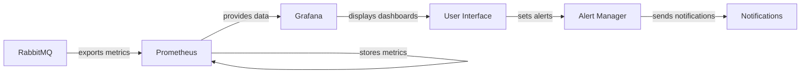
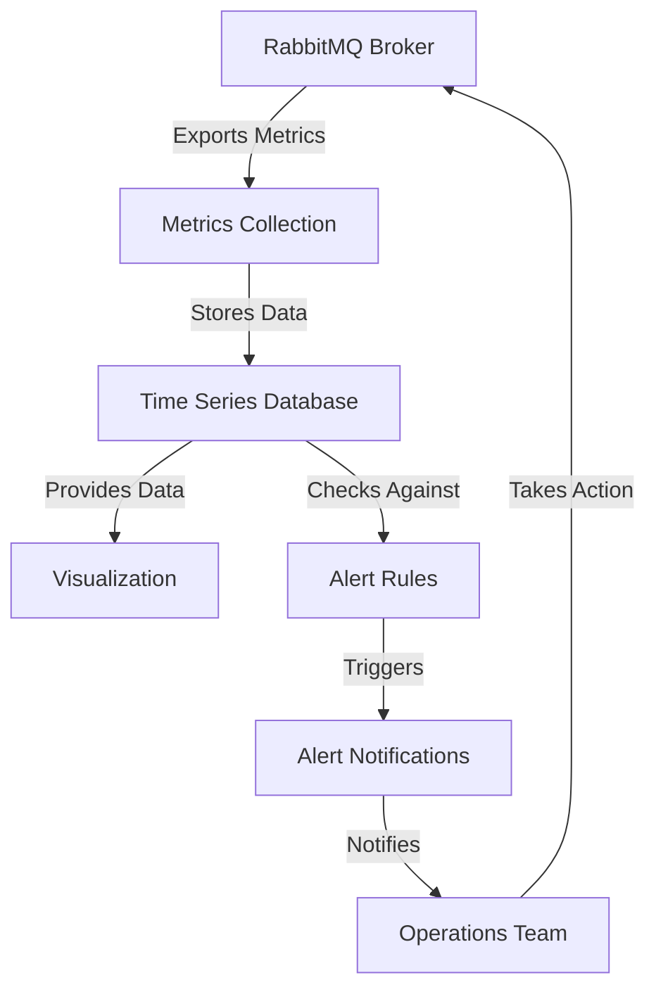

# RabbitMQ Monitoring Strategy

## Introduction

Monitoring is a critical aspect of maintaining a healthy RabbitMQ deployment. Without proper monitoring, issues can go undetected until they cause service disruptions or performance degradation. This guide will walk you through setting up a comprehensive monitoring strategy for your RabbitMQ instances, helping you ensure reliability and performance for your message-based applications.

RabbitMQ is a message broker that enables applications to communicate with each other by passing messages. As your system grows in complexity and traffic increases, proper monitoring becomes essential to:

- Detect potential problems before they impact users
- Track performance metrics to guide scaling decisions
- Troubleshoot issues when they occur
- Plan capacity based on historical data
- Ensure high availability and reliability

## Core Metrics to Monitor

### Node Health Metrics

These metrics help you understand the overall health of your RabbitMQ nodes.

| Metric | Description | Warning Threshold | Critical Threshold |
|--------|-------------|-------------------|-------------------|
| Memory Usage | Amount of memory used by the RabbitMQ process | 80% of configured limit | 90% of configured limit |
| Disk Space | Free disk space available to RabbitMQ | 20% remaining | 10% remaining |
| File Descriptors | Number of open file handles | 80% of limit | 90% of limit |
| Socket Descriptors | Number of open network sockets | 80% of limit | 90% of limit |
| Process Limit | Number of Erlang processes | 80% of limit | 90% of limit |
| Uptime | Time since the node was started | N/A | N/A |

### Queue Metrics

Queue metrics help you understand the flow of messages through your system.

| Metric | Description | Warning Threshold | Critical Threshold |
|--------|-------------|-------------------|-------------------|
| Queue Depth | Number of messages in a queue | Varies by queue purpose | Varies by queue purpose |
| Queue Growth Rate | Rate at which messages are added | Sustained growth | Exponential growth |
| Consumer Utilization | Percentage of time consumers are active | Below 80% | Below 50% |
| Publish Rate | Number of messages published per second | N/A (baseline dependent) | N/A (baseline dependent) |
| Delivery Rate | Number of messages delivered per second | N/A (baseline dependent) | N/A (baseline dependent) |
| Redelivery Rate | Number of messages redelivered | >10% of delivery rate | >25% of delivery rate |

### Exchange Metrics

| Metric | Description | Warning Threshold | Critical Threshold |
|--------|-------------|-------------------|-------------------|
| Message Rate In | Rate of messages published to an exchange | N/A (baseline dependent) | N/A (baseline dependent) |
| Message Rate Out | Rate of messages routed from an exchange | N/A (baseline dependent) | N/A (baseline dependent) |
| Unroutable Messages | Messages that couldn't be routed to any queue | >0 | Sustained non-zero values |

### Connection and Channel Metrics

| Metric | Description | Warning Threshold | Critical Threshold |
|--------|-------------|-------------------|-------------------|
| Connection Count | Number of open connections | >80% of planned capacity | >90% of planned capacity |
| Channel Count | Number of open channels | >1000 per connection | >2000 per connection |
| Connection Churn | Rate of connections opening/closing | High variability | Very high variability |
| Blocked Connections | Connections blocked due to resource constraints | >0 | Sustained non-zero values |

## Setting Up Monitoring Tools

### Using RabbitMQ Management Plugin

The RabbitMQ Management plugin is the simplest way to start monitoring your RabbitMQ instance.

#### Enabling the Management Plugin

```bash
# Enable the management plugin
rabbitmq-plugins enable rabbitmq_management

# Verify the plugin is enabled
rabbitmq-plugins list
```

Once enabled, you can access the management interface at `http://your-server:15672` with default credentials (guest/guest for local access).

#### Using Management HTTP API

The management plugin also provides a comprehensive HTTP API for programmatic monitoring.

```javascript
// Example: Fetching queue metrics using the HTTP API
async function getQueueMetrics(queueName) {
  const response = await fetch(
    `http://localhost:15672/api/queues/%2F/${queueName}`,
    {
      headers: {
        'Authorization': 'Basic ' + btoa('guest:guest')
      }
    }
  );
  
  const data = await response.json();
  return {
    messages: data.messages,
    messagesReady: data.messages_ready,
    messagesUnacknowledged: data.messages_unacknowledged,
    messageRate: data.message_stats?.publish_details?.rate || 0,
    consumerCount: data.consumers
  };
}
```

### Prometheus and Grafana Integration

For more comprehensive monitoring, Prometheus and Grafana provide powerful visualization and alerting capabilities.

#### Installing RabbitMQ Prometheus Plugin

```bash
# Enable the Prometheus plugin
rabbitmq-plugins enable rabbitmq_prometheus

# Restart RabbitMQ to apply changes
systemctl restart rabbitmq-server
```

This exposes metrics at `http://your-server:15692/metrics`.

#### Sample Prometheus Configuration

```yaml
# prometheus.yml
scrape_configs:
  - job_name: 'rabbitmq'
    scrape_interval: 5s
    static_configs:
      - targets: ['rabbitmq:15692']
```

#### Setting Up Grafana Dashboard

Grafana provides pre-built dashboards for RabbitMQ monitoring. You can import the official RabbitMQ dashboard using ID 10991.



## Creating a Monitoring Strategy

### Basic Monitoring Plan

For smaller deployments or development environments:

1. **Daily Check**: Review the management UI dashboard once per day
2. **Key Metrics**: Focus on queue depth, memory usage, and disk space
3. **Simple Alerting**: Set up basic email alerts for critical thresholds

### Advanced Monitoring Plan

For production or mission-critical environments:

1. **Real-time Monitoring**: Use Prometheus and Grafana for continuous monitoring
2. **Comprehensive Metrics**: Track all metrics mentioned above
3. **Multi-level Alerting**: Configure different alert levels based on severity
4. **Automated Responses**: Implement automatic scaling or recovery procedures
5. **Historical Analysis**: Maintain historical data for capacity planning

## Writing a Custom Monitoring Script

Here's an example of a custom monitoring script that checks queue depths and sends alerts:

```python
#!/usr/bin/env python3
import requests
import time
import smtplib
from email.message import EmailMessage

# Configuration
RABBITMQ_API = "http://localhost:15672/api"
USERNAME = "monitoring_user"
PASSWORD = "monitoring_password"
CHECK_INTERVAL = 60  # seconds
QUEUE_DEPTH_THRESHOLD = 1000
EMAIL_FROM = "alerts@example.com"
EMAIL_TO = "oncall@example.com"

def check_queues():
    # Get all queues
    response = requests.get(
        f"{RABBITMQ_API}/queues",
        auth=(USERNAME, PASSWORD)
    )
    
    if response.status_code != 200:
        send_alert(f"Error monitoring RabbitMQ: {response.status_code}")
        return
    
    queues = response.json()
    problem_queues = []
    
    for queue in queues:
        queue_name = queue["name"]
        message_count = queue["messages"]
        
        # Check if queue depth exceeds threshold
        if message_count > QUEUE_DEPTH_THRESHOLD:
            problem_queues.append({
                "name": queue_name,
                "depth": message_count
            })
    
    # Send alert if there are problem queues
    if problem_queues:
        message = "The following queues have exceeded depth threshold:

"
        for queue in problem_queues:
            message += f"Queue: {queue['name']}, Depth: {queue['depth']}
"
        
        send_alert(message)

def send_alert(message):
    msg = EmailMessage()
    msg.set_content(message)
    msg['Subject'] = 'RabbitMQ Queue Alert'
    msg['From'] = EMAIL_FROM
    msg['To'] = EMAIL_TO
    
    s = smtplib.SMTP('localhost')
    s.send_message(msg)
    s.quit()
    
    print(f"Alert sent: {message}")

if __name__ == "__main__":
    print("RabbitMQ monitoring started")
    
    while True:
        try:
            check_queues()
        except Exception as e:
            print(f"Error: {e}")
        
        time.sleep(CHECK_INTERVAL)
```

## Troubleshooting Common Issues

### High Queue Depth

**Symptoms:**
- Increasing number of messages in queues
- Consumer utilization below 50%

**Potential Causes:**
- Insufficient consumers
- Slow consumer processing
- Message publishing rate exceeds consumption rate

**Solutions:**
- Add more consumers
- Optimize consumer code
- Implement flow control with publisher confirms

```javascript
// Example: Implementing publisher confirms in Node.js
const amqp = require('amqplib');

async function publishWithConfirm(message) {
  const connection = await amqp.connect('amqp://localhost');
  const channel = await connection.createConfirmChannel();
  
  try {
    await channel.assertQueue('important_queue');
    
    // Publish with confirmation
    await new Promise((resolve, reject) => {
      channel.publish('', 'important_queue', Buffer.from(message), 
                     { persistent: true },
                     (err, ok) => {
                       if (err) reject(err);
                       else resolve();
                     });
    });
    
    console.log("Message confirmed by broker");
  } finally {
    await channel.close();
    await connection.close();
  }
}
```

### Memory Alarms

**Symptoms:**
- RabbitMQ memory usage above threshold
- Connections blocked due to resource constraints

**Potential Causes:**
- Unbounded queues with persistent messages
- Memory leaks in RabbitMQ plugins
- Insufficient memory allocation

**Solutions:**
- Implement queue length limits
- Set appropriate memory high watermark
- Increase allocated memory
- Use lazy queues for large backlogs

```bash
# Setting memory high watermark to 0.7 (70% of available RAM)
rabbitmqctl set_vm_memory_high_watermark 0.7

# Declaring a queue with max-length
rabbitmqadmin declare queue name=limited_queue arguments='{"x-max-length":10000}'
```

### Connection Churn

**Symptoms:**
- High rate of connections opening/closing
- Increased CPU usage

**Potential Causes:**
- Applications not reusing connections
- Network issues causing disconnections
- Misconfigured clients

**Solutions:**
- Implement connection pools
- Use fewer, long-lived connections with multiple channels
- Check network stability

## Best Practices

1. **Monitor at Multiple Levels**: Track node health, queues, exchanges, and channels
2. **Set Appropriate Thresholds**: Customize alert thresholds based on your specific requirements
3. **Implement Trending**: Monitor trends over time, not just current values
4. **Use Automation**: Set up automated responses for common issues
5. **Document Patterns**: Keep records of normal behavior patterns for better anomaly detection
6. **Regular Review**: Periodically review monitoring strategies and update as needed
7. **Test Failure Scenarios**: Simulate failures to ensure monitoring catches them

## Visualizing RabbitMQ Monitoring Data Flow



## Monitoring in High-Availability Clusters

For clustered RabbitMQ deployments, additional monitoring considerations include:

1. **Cluster Partition Detection**: Monitor for network partitions in the cluster
2. **Quorum Status**: Check queue quorum status for quorum queues
3. **Synchronization Status**: Monitor queue synchronization between nodes
4. **Cross-Node Metrics**: Compare metrics across different nodes

```bash
# Check cluster status
rabbitmqctl cluster_status

# Check synchronization status for a specific queue
rabbitmqctl list_queues name synchronised_slave_nodes
```

## Summary

Effective RabbitMQ monitoring is essential for maintaining a healthy messaging system. By monitoring key metrics across node health, queues, connections, and exchanges, you can ensure optimal performance and quickly identify potential issues.

Remember these key points:
- Start with basic monitoring using the Management UI
- Progress to advanced monitoring with Prometheus and Grafana
- Focus on trends and patterns rather than isolated values
- Set up multi-level alerting for different severity levels
- Implement automated responses for common issues
- Regularly review and update your monitoring strategy

By following these guidelines, you can create a robust monitoring strategy that helps maintain the reliability and performance of your RabbitMQ messaging infrastructure.

## Additional Resources

- Official RabbitMQ Monitoring Documentation: [RabbitMQ Monitoring Guide](https://www.rabbitmq.com/monitoring.html)
- Prometheus Integration: [RabbitMQ Prometheus Plugin](https://www.rabbitmq.com/prometheus.html)
- Grafana Dashboard Templates: [Grafana Dashboard Repository](https://grafana.com/grafana/dashboards/)

## Practice Exercises

1. Set up the RabbitMQ Management plugin and explore the web UI
2. Create a simple monitoring script that checks queue depths and logs warnings
3. Install Prometheus and Grafana, then integrate them with RabbitMQ
4. Configure alerts for critical RabbitMQ metrics
5. Create a dashboard that displays your most important metrics