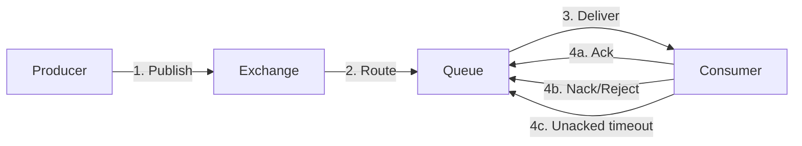
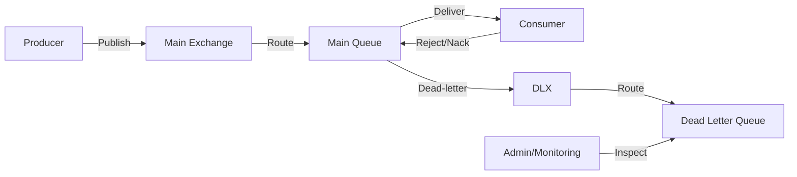

# RabbitMQ Error Handling

## Introduction

Error handling is a critical aspect of building robust messaging systems with RabbitMQ. Even in well-designed applications, failures can occur due to network issues, server outages, application bugs, or invalid message formats. Without proper error handling strategies, these failures can lead to message loss, system instability, and cascading errors.

In this guide, we'll explore various error handling patterns and best practices for RabbitMQ applications. By implementing these techniques, you'll build more resilient systems that can gracefully handle failures, recover automatically, and provide better observability.

## Understanding RabbitMQ Message Lifecycle

Before diving into error handling strategies, let's understand the lifecycle of a message in RabbitMQ:



Errors can occur at any stage of this lifecycle:
- **Publishing errors**: When a producer fails to publish a message
- **Routing errors**: When a message cannot be routed to any queue
- **Processing errors**: When a consumer fails to process a message correctly
- **Infrastructure errors**: When RabbitMQ nodes or the network fail

Let's explore how to handle each of these error scenarios.

## Basic Message Acknowledgment

The most fundamental error handling mechanism in RabbitMQ is message acknowledgment. When a consumer receives a message, it should acknowledge it only after successful processing. If processing fails, the consumer can reject or negatively acknowledge the message.

### Message Acknowledgment Patterns

RabbitMQ provides three acknowledgment options:

1. **Acknowledge (ack)**: Indicates successful processing
2. **Negative Acknowledge (nack)**: Indicates failed processing
3. **Reject**: Similar to nack but with fewer options

Here's a simple example using Node.js with the `amqplib` library:

```javascript
// Connect to RabbitMQ
const amqp = require('amqplib');

async function consumeMessages() {
  try {
    // Create a connection
    const connection = await amqp.connect('amqp://localhost');
    const channel = await connection.createChannel();
    
    // Define the queue
    const queueName = 'task_queue';
    await channel.assertQueue(queueName, { durable: true });
    
    // Set prefetch count to 1 to ensure fair dispatch
    await channel.prefetch(1);
    
    console.log(" [*] Waiting for messages. To exit press CTRL+C");
    
    // Consume messages
    channel.consume(queueName, async (msg) => {
      const content = msg.content.toString();
      console.log(` [x] Received '${content}'`);
      
      try {
        // Process the message
        await processMessage(content);
        
        // Acknowledge the message on success
        channel.ack(msg);
        console.log(` [✓] Processed '${content}'`);
      } catch (error) {
        console.error(` [✗] Error processing '${content}':`, error.message);
        
        // Reject the message on failure
        // The third parameter (false) means "don't requeue"
        channel.reject(msg, false);
      }
    });
  } catch (error) {
    console.error('Consumer error:', error);
  }
}

async function processMessage(content) {
  // Simulate processing (might throw an error)
  if (content.includes('error')) {
    throw new Error('Processing failed');
  }
  
  // Simulate work
  await new Promise(resolve => setTimeout(resolve, 1000));
}

// Start consuming
consumeMessages();
```

In this example:
- If the message is processed successfully, we acknowledge it with `channel.ack(msg)`
- If processing fails, we reject it with `channel.reject(msg, false)`

## Dead Letter Exchanges

When a message is rejected without requeuing, it's discarded by default. To prevent message loss, you can use Dead Letter Exchanges (DLX) to capture these failed messages for later analysis or retry.



### Setting Up a Dead Letter Exchange

Here's how to configure a queue with a dead letter exchange in Node.js:

```javascript
const amqp = require('amqplib');

async function setupDeadLetterExchange() {
  try {
    // Create a connection
    const connection = await amqp.connect('amqp://localhost');
    const channel = await connection.createChannel();
    
    // Create the dead letter exchange
    const deadLetterExchange = 'dead_letter_exchange';
    await channel.assertExchange(deadLetterExchange, 'direct', { durable: true });
    
    // Create the dead letter queue
    const deadLetterQueue = 'dead_letter_queue';
    await channel.assertQueue(deadLetterQueue, { durable: true });
    await channel.bindQueue(deadLetterQueue, deadLetterExchange, 'dead_letter');
    
    // Create the main queue with dead letter configuration
    const mainQueue = 'task_queue';
    await channel.assertQueue(mainQueue, {
      durable: true,
      arguments: {
        'x-dead-letter-exchange': deadLetterExchange,
        'x-dead-letter-routing-key': 'dead_letter'
      }
    });
    
    console.log(' [*] Dead letter exchange setup complete');
    
    // Close the connection
    await channel.close();
    await connection.close();
  } catch (error) {
    console.error('Setup error:', error);
  }
}

// Run the setup
setupDeadLetterExchange();
```

With this configuration, any rejected or expired messages from `task_queue` will be automatically routed to `dead_letter_queue`.

## Retry Patterns

For transient failures (like temporary network issues), it's often useful to retry message processing. RabbitMQ doesn't provide built-in retry functionality, but you can implement it using several patterns.

### Pattern 1: Immediate Requeue

The simplest retry approach is to requeue the message immediately:

```javascript
// In the consumer's error handler
try {
  await processMessage(content);
  channel.ack(msg);
} catch (error) {
  console.error('Processing error:', error);
  // Requeue the message
  channel.reject(msg, true); // The second parameter (true) means "requeue"
}
```

However, this can lead to "hot loops" where the same message is repeatedly requeued and reprocessed, consuming resources without making progress.

### Pattern 2: Delayed Retry with Dead Letter Exchange

A better approach is to use TTL (Time-To-Live) with a dead letter exchange to implement delayed retries:

```javascript
const amqp = require('amqplib');

async function setupRetryMechanism() {
  const connection = await amqp.connect('amqp://localhost');
  const channel = await connection.createChannel();
  
  // Main exchange
  const mainExchange = 'main_exchange';
  await channel.assertExchange(mainExchange, 'direct', { durable: true });
  
  // Retry exchange (for delayed retries)
  const retryExchange = 'retry_exchange';
  await channel.assertExchange(retryExchange, 'direct', { durable: true });
  
  // Dead letter exchange (for messages that exceed retry limits)
  const deadLetterExchange = 'dead_letter_exchange';
  await channel.assertExchange(deadLetterExchange, 'direct', { durable: true });
  
  // Create the main queue
  const mainQueue = 'main_queue';
  await channel.assertQueue(mainQueue, {
    durable: true,
    arguments: {
      'x-dead-letter-exchange': retryExchange,
      'x-dead-letter-routing-key': 'retry'
    }
  });
  await channel.bindQueue(mainQueue, mainExchange, 'main');
  
  // Create retry queues with different TTLs
  const retryDelays = [1000, 5000, 10000]; // Delays in milliseconds
  
  for (let i = 0; i < retryDelays.length; i++) {
    const retryQueue = `retry_queue_${i}`;
    await channel.assertQueue(retryQueue, {
      durable: true,
      arguments: {
        'x-dead-letter-exchange': mainExchange,
        'x-dead-letter-routing-key': 'main',
        'x-message-ttl': retryDelays[i]
      }
    });
    await channel.bindQueue(retryQueue, retryExchange, `retry.${i}`);
  }
  
  // Create the final dead letter queue for messages that exceed retry limits
  const deadLetterQueue = 'dead_letter_queue';
  await channel.assertQueue(deadLetterQueue, { durable: true });
  await channel.bindQueue(deadLetterQueue, deadLetterExchange, 'dead_letter');
  
  // Consumer logic
  channel.consume(mainQueue, async (msg) => {
    try {
      // Get retry count from headers (or initialize to 0)
      const headers = msg.properties.headers || {};
      const retryCount = headers['x-retry-count'] || 0;
      
      // Process the message
      await processMessage(msg.content.toString());
      
      // Acknowledge on success
      channel.ack(msg);
      console.log(` [✓] Successfully processed message`);
    } catch (error) {
      console.error(` [✗] Error processing message:`, error.message);
      
      // Check retry count
      const headers = msg.properties.headers || {};
      const retryCount = headers['x-retry-count'] || 0;
      
      if (retryCount < retryDelays.length) {
        // Publish to retry exchange with incremented retry count
        channel.publish(retryExchange, `retry.${retryCount}`, msg.content, {
          headers: {
            'x-retry-count': retryCount + 1,
            ...headers
          },
          persistent: true
        });
        
        // Acknowledge the original message
        channel.ack(msg);
        console.log(` [↻] Scheduled retry ${retryCount + 1} with delay ${retryDelays[retryCount]}ms`);
      } else {
        // Max retries exceeded, send to dead letter queue
        channel.publish(deadLetterExchange, 'dead_letter', msg.content, {
          headers: {
            'x-retry-count': retryCount,
            'x-last-error': error.message,
            ...headers
          },
          persistent: true
        });
        
        // Acknowledge the original message
        channel.ack(msg);
        console.log(` [☠] Max retries exceeded, sent to dead letter queue`);
      }
    }
  });
}
```

This implementation provides an exponential backoff pattern for retries, preventing resource exhaustion while still allowing recovery from transient failures.

## Error Handling for Publishers

So far, we've focused on error handling for consumers, but publishers also need error handling strategies.

### Confirmed Publishes

RabbitMQ provides a "publisher confirms" mechanism to ensure messages are successfully received by the broker:

```javascript
const amqp = require('amqplib');

async function publishWithConfirmation() {
  try {
    const connection = await amqp.connect('amqp://localhost');
    const channel = await connection.createChannel();
    
    // Enable publisher confirms
    await channel.confirmChannel();
    
    const exchange = 'main_exchange';
    await channel.assertExchange(exchange, 'direct', { durable: true });
    
    // Publish a message
    const message = 'Test message';
    try {
      const result = await channel.publish(
        exchange,
        'main',
        Buffer.from(message),
        { persistent: true }
      );
      
      if (result) {
        console.log(' [✓] Message published and confirmed');
      } else {
        console.log(' [?] Message published but not confirmed');
      }
    } catch (error) {
      console.error(' [✗] Failed to publish message:', error);
      // Implement recovery logic (e.g., retry, store locally, alert)
    }
    
    // Close connection
    await channel.close();
    await connection.close();
  } catch (error) {
    console.error('Publisher error:', error);
  }
}

publishWithConfirmation();
```

### Alternate Exchanges for Unroutable Messages

If a message cannot be routed to any queue, it's lost by default. You can use Alternate Exchanges to capture these unroutable messages:

```javascript
const amqp = require('amqplib');

async function setupAlternateExchange() {
  try {
    const connection = await amqp.connect('amqp://localhost');
    const channel = await connection.createChannel();
    
    // Create the alternate exchange for unroutable messages
    const alternateExchange = 'alternate_exchange';
    await channel.assertExchange(alternateExchange, 'fanout', { durable: true });
    
    // Create a queue bound to the alternate exchange
    const unroutableQueue = 'unroutable_queue';
    await channel.assertQueue(unroutableQueue, { durable: true });
    await channel.bindQueue(unroutableQueue, alternateExchange, '');
    
    // Create the main exchange with alternate exchange configuration
    const mainExchange = 'main_exchange';
    await channel.assertExchange(mainExchange, 'direct', {
      durable: true,
      alternateExchange: alternateExchange
    });
    
    // Now publish a message with an invalid routing key
    await channel.publish(
      mainExchange,
      'invalid_key', // No queue is bound with this key
      Buffer.from('This is an unroutable message')
    );
    
    console.log(' [*] Published message with invalid routing key');
    
    // Close connection
    setTimeout(async () => {
      await channel.close();
      await connection.close();
    }, 1000);
  } catch (error) {
    console.error('Setup error:', error);
  }
}

setupAlternateExchange();
```

## Connection Recovery

Network issues or RabbitMQ server restarts can cause connection failures. Your application should automatically reconnect when this happens.

Most client libraries provide automatic connection recovery. Here's how to implement it in Node.js:

```javascript
const amqp = require('amqplib');

// Connection parameters
const connectionOptions = {
  protocol: 'amqp',
  hostname: 'localhost',
  port: 5672,
  username: 'guest',
  password: 'guest',
  vhost: '/',
};

// Connection variables
let connection = null;
let channel = null;

// Connect and setup function
async function connectAndSetup() {
  try {
    // Close existing connection if any
    if (connection) {
      try {
        await connection.close();
      } catch (error) {
        console.error('Error closing existing connection:', error);
      }
    }
    
    // Create a new connection
    connection = await amqp.connect(connectionOptions);
    console.log(' [✓] Connected to RabbitMQ');
    
    // Handle connection close
    connection.on('close', (err) => {
      console.error(' [!] Connection closed', err ? `with error: ${err.message}` : 'without error');
      scheduleReconnect();
    });
    
    // Handle connection errors
    connection.on('error', (err) => {
      console.error(' [!] Connection error:', err.message);
      // No need to call scheduleReconnect here - the close event will be emitted
    });
    
    // Create a channel
    channel = await connection.createChannel();
    console.log(' [✓] Channel created');
    
    // Setup exchanges, queues, etc.
    await setupInfrastructure(channel);
    
    // Start consumers
    await startConsumers(channel);
    
    return { connection, channel };
  } catch (error) {
    console.error(' [!] Connection attempt failed:', error.message);
    scheduleReconnect();
    return null;
  }
}

// Schedule reconnection
function scheduleReconnect() {
  console.log(' [*] Scheduling reconnection in 5 seconds');
  setTimeout(connectAndSetup, 5000);
}

// Setup infrastructure
async function setupInfrastructure(channel) {
  // Declare exchanges, queues, and bindings here
  const queue = 'task_queue';
  await channel.assertQueue(queue, { durable: true });
  console.log(' [✓] Infrastructure setup complete');
}

// Start consumers
async function startConsumers(channel) {
  const queue = 'task_queue';
  
  await channel.consume(queue, async (msg) => {
    if (!msg) return; // Channel closed or consumer canceled
    
    try {
      const content = msg.content.toString();
      console.log(` [x] Received '${content}'`);
      
      // Process the message
      await processMessage(content);
      
      // Acknowledge on success
      channel.ack(msg);
    } catch (error) {
      console.error(` [✗] Processing error:`, error.message);
      
      // Reject without requeue
      channel.reject(msg, false);
    }
  });
  
  console.log(' [✓] Consumers started');
}

// Initial connection
connectAndSetup();
```

This implementation automatically reconnects after connection failures, with exponential backoff.

## Handling Poison Messages

A "poison message" is a message that cannot be processed correctly, no matter how many times it's retried. These messages can block your consumers and should be identified and handled specially.

```javascript
async function handleMessage(channel, msg) {
  try {
    const content = msg.content.toString();
    const headers = msg.properties.headers || {};
    const retryCount = headers['x-retry-count'] || 0;
    
    // Check for potential poison message
    if (isPotentialPoisonMessage(content)) {
      throw new Error('Identified potential poison message');
    }
    
    // Regular processing
    await processMessage(content);
    
    // Acknowledge on success
    channel.ack(msg);
  } catch (error) {
    console.error(` [✗] Processing error:`, error.message);
    
    // Check retry count
    const headers = msg.properties.headers || {};
    const retryCount = headers['x-retry-count'] || 0;
    
    if (retryCount >= 3 || isPermanentError(error)) {
      // Move to poison message queue for manual inspection
      await handlePoisonMessage(channel, msg, error);
      channel.ack(msg); // Remove from the original queue
    } else {
      // Normal retry logic
      // ...
    }
  }
}

function isPotentialPoisonMessage(content) {
  // Implement logic to identify potential poison messages
  // For example, messages with invalid JSON
  try {
    if (content.startsWith('{')) {
      JSON.parse(content);
    }
    return false;
  } catch (e) {
    return true;
  }
}

function isPermanentError(error) {
  // Identify errors that won't be resolved by retrying
  return error.message.includes('validation failed') || 
         error.message.includes('not authorized') ||
         error.message.includes('invalid format');
}

async function handlePoisonMessage(channel, msg, error) {
  // Create a poison message queue if not exists
  const poisonQueue = 'poison_message_queue';
  await channel.assertQueue(poisonQueue, { durable: true });
  
  // Add error information to headers
  const headers = msg.properties.headers || {};
  
  // Publish to poison message queue
  await channel.sendToQueue(poisonQueue, msg.content, {
    headers: {
      ...headers,
      'x-error-message': error.message,
      'x-failed-at': new Date().toISOString(),
      'x-original-exchange': msg.fields.exchange,
      'x-original-routing-key': msg.fields.routingKey
    },
    persistent: true
  });
  
  console.log(` [☠] Message sent to poison queue: ${error.message}`);
}
```

## Monitoring and Alerting

To maintain a healthy RabbitMQ system, you need to monitor key metrics and set up alerts for potential issues.

### Key Metrics to Monitor

1. **Queue metrics**:
   - Queue depth (number of messages)
   - Message rate (publishing and consuming)
   - Message age (how long messages stay in the queue)

2. **Node metrics**:
   - Memory usage
   - Disk space
   - File descriptors
   - Connection count

3. **Connection and channel metrics**:
   - Connection churn
   - Channel count
   - Message acknowledgment rate

### Implementation Example: Queue Monitoring

```javascript
const amqp = require('amqplib');
const http = require('http');

async function monitorQueues() {
  try {
    const connection = await amqp.connect('amqp://localhost');
    const channel = await connection.createChannel();
    
    // Queues to monitor
    const queues = ['task_queue', 'dead_letter_queue', 'poison_message_queue'];
    
    // Check queue stats every 30 seconds
    setInterval(async () => {
      for (const queue of queues) {
        try {
          // Get queue information
          const queueInfo = await channel.assertQueue(queue, { durable: true });
          
          console.log(`Queue: ${queue}`);
          console.log(`  Message count: ${queueInfo.messageCount}`);
          console.log(`  Consumer count: ${queueInfo.consumerCount}`);
          
          // Alert if message count exceeds threshold
          if (queueInfo.messageCount > 1000) {
            sendAlert(`Queue ${queue} has ${queueInfo.messageCount} messages!`);
          }
          
          // Alert if no consumers
          if (queueInfo.consumerCount === 0) {
            sendAlert(`Queue ${queue} has no consumers!`);
          }
        } catch (error) {
          console.error(`Error checking queue ${queue}:`, error);
        }
      }
    }, 30000);
    
  } catch (error) {
    console.error('Monitor error:', error);
  }
}

function sendAlert(message) {
  console.error(`ALERT: ${message}`);
  
  // Implement your alerting logic here
  // Examples: send email, send Slack message, call webhook, etc.
  const webhookUrl = process.env.ALERT_WEBHOOK_URL;
  
  if (webhookUrl) {
    const data = JSON.stringify({ text: `RabbitMQ Alert: ${message}` });
    
    const req = http.request(webhookUrl, {
      method: 'POST',
      headers: {
        'Content-Type': 'application/json',
        'Content-Length': data.length
      }
    });
    
    req.on('error', (error) => {
      console.error('Error sending alert:', error);
    });
    
    req.write(data);
    req.end();
  }
}

// Start monitoring
monitorQueues();
```

## Error Handling Best Practices

Here's a summary of RabbitMQ error handling best practices:

1. **For consumers**:
   - Always use explicit acknowledgments instead of auto-ack
   - Implement a retry strategy with backoff
   - Use dead letter exchanges to capture failed messages
   - Create a poison message queue for permanently failed messages
   - Set appropriate prefetch values to prevent overload

2. **For publishers**:
   - Use publisher confirms to ensure delivery
   - Implement alternate exchanges for unroutable messages
   - Consider implementing a transactional outbox pattern for critical messages
   - Use persistent messages for important data

3. **For connections**:
   - Implement automatic reconnection with exponential backoff
   - Handle connection and channel errors gracefully
   - Monitor connection usage to prevent leaks

4. **For monitoring**:
   - Set up alerts for queue length, error rates, and node health
   - Regularly audit dead letter and poison message queues
   - Implement circuit breakers to prevent system overload

## Real-World Example: E-commerce Order Processing

Let's look at a real-world example of RabbitMQ error handling in an e-commerce application's order processing system:

```javascript
const amqp = require('amqplib');
const { processOrder, updateInventory, sendNotification } = require('./orderService');

// Connect to RabbitMQ
async function startOrderProcessor() {
  try {
    const connection = await amqp.connect('amqp://localhost');
    
    // Handle connection close (expected or unexpected)
    connection.on('close', (err) => {
      console.error('Connection closed, reconnecting in 5 seconds...');
      setTimeout(startOrderProcessor, 5000);
    });
    
    const channel = await connection.createChannel();
    
    // Setup queues and exchanges
    const orderExchange = 'order_exchange';
    await channel.assertExchange(orderExchange, 'direct', { durable: true });
    
    const deadLetterExchange = 'dl_order_exchange';
    await channel.assertExchange(deadLetterExchange, 'direct', { durable: true });
    
    // Setup dead letter queue
    const deadLetterQueue = 'dl_order_queue';
    await channel.assertQueue(deadLetterQueue, { durable: true });
    await channel.bindQueue(deadLetterQueue, deadLetterExchange, 'order.error');
    
    // Setup order queue with dead letter config
    const orderQueue = 'order_queue';
    await channel.assertQueue(orderQueue, {
      durable: true,
      arguments: {
        'x-dead-letter-exchange': deadLetterExchange,
        'x-dead-letter-routing-key': 'order.error'
      }
    });
    await channel.bindQueue(orderQueue, orderExchange, 'order.new');
    
    // Setup prefetch count
    await channel.prefetch(1);
    
    // Consume order messages
    channel.consume(orderQueue, async (msg) => {
      if (!msg) return; // Channel closed or consumer canceled
      
      try {
        const orderData = JSON.parse(msg.content.toString());
        console.log(`Processing order ${orderData.orderId}`);
        
        // Step 1: Process the order
        await processOrder(orderData);
        
        // Step 2: Update inventory
        await updateInventory(orderData.items);
        
        // Step 3: Send confirmation
        await sendNotification({
          type: 'ORDER_CONFIRMATION',
          orderId: orderData.orderId,
          customer: orderData.customer
        });
        
        // Acknowledge success
        channel.ack(msg);
        console.log(`Order ${orderData.orderId} processed successfully`);
      } catch (error) {
        console.error(`Error processing order:`, error);
        
        // Check if this is a retriable error
        if (isRetriableError(error)) {
          // Get retry count
          const headers = msg.properties.headers || {};
          const retryCount = headers['x-retry-count'] || 0;
          
          if (retryCount < 3) {
            // Publish back to the queue with delay
            setTimeout(() => {
              channel.publish(orderExchange, 'order.new', msg.content, {
                persistent: true,
                headers: {
                  ...headers,
                  'x-retry-count': retryCount + 1,
                  'x-last-error': error.message
                }
              });
              
              channel.ack(msg);
              console.log(`Order requeued for retry ${retryCount + 1}`);
            }, Math.pow(2, retryCount) * 1000); // Exponential backoff
          } else {
            // Max retries exceeded, send to dead letter queue
            channel.reject(msg, false);
            console.log(`Max retries exceeded, sent to dead letter queue`);
          }
        } else {
          // Non-retriable error, send directly to dead letter queue
          channel.reject(msg, false);
          console.log(`Non-retriable error, sent to dead letter queue`);
          
          // Alert for critical errors
          if (isCriticalError(error)) {
            sendAlert(`Critical order processing error: ${error.message}`);
          }
        }
      }
    });
    
    console.log('Order processor started');
  } catch (error) {
    console.error('Failed to start order processor:', error);
    console.log('Retrying in 5 seconds...');
    setTimeout(startOrderProcessor, 5000);
  }
}

function isRetriableError(error) {
  // Network errors, temporary database unavailability, etc.
  return error.code === 'ETIMEDOUT' || 
         error.code === 'ECONNREFUSED' ||
         error.message.includes('temporarily unavailable');
}

function isCriticalError(error) {
  // Data integrity issues, payment processor errors, etc.
  return error.message.includes('data integrity') ||
         error.message.includes('payment failed') ||
         error.message.includes('critical');
}

function sendAlert(message) {
  console.error(`ALERT: ${message}`);
  // Implement alerting logic here
}

// Start the order processor
startOrderProcessor();
```

This example demonstrates comprehensive error handling for a critical business process:
- Connection recovery
- Message retry with exponential backoff
- Dead letter queues for failed messages
- Differentiation between retriable and non-retriable errors
- Critical error alerting

## Summary

Effective error handling is essential for building robust RabbitMQ applications. By implementing these patterns and best practices, you can create resilient systems that can recover from failures, provide visibility into issues, and prevent message loss.

Key takeaways:
- Use acknowledgments properly to ensure message delivery
- Implement retry strategies with backoff for transient failures
- Use dead letter exchanges to capture failed messages
- Monitor queue depths and error rates
- Implement automatic connection recovery
- Handle poison messages to prevent blocking

## Additional Resources

- [RabbitMQ Documentation: Reliability Guide](https://www.rabbitmq.com/reliability.html)
- [RabbitMQ Documentation: Publisher Confirms](https://www.rabbitmq.com/confirms.html)
- [RabbitMQ Documentation: Dead Letter Exchanges](https://www.rabbitmq.com/dlx.html)
- [RabbitMQ Documentation: Monitoring](https://www.rabbitmq.com/monitoring.html)

## Exercises

1. Implement a retry mechanism with exponential backoff using dead letter exchanges and TTL.
2. Create a monitoring system that alerts when dead letter queues exceed a certain threshold.
3. Implement a system to analyze and reprocess messages from a dead letter queue.
4. Design a circuit breaker pattern for RabbitMQ consumers to prevent system overload during high error rates.
5. Create a producer that uses the transactional outbox pattern for critical messages that must not be lost.