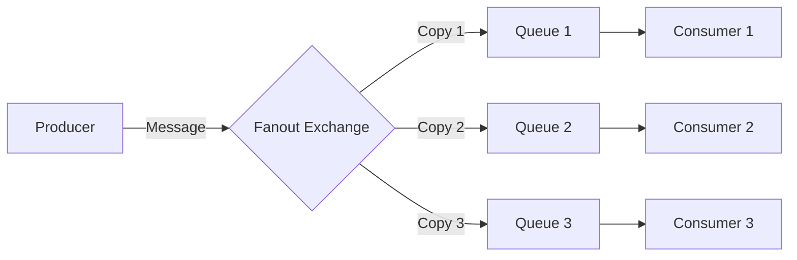

# RabbitMQ Fanout Exchange

## Introduction

In the world of message brokers, RabbitMQ stands out as a powerful and flexible solution for handling asynchronous communication between applications. One of the key features that makes RabbitMQ so versatile is its support for different exchange types, each designed to handle specific message routing patterns.

The **Fanout Exchange** is perhaps the simplest of all exchange types in RabbitMQ, but it's also one of the most powerful for certain use cases. Think of it as a broadcast system - when a message arrives at a fanout exchange, it simply sends a copy of that message to all queues that are bound to it, regardless of any routing keys or patterns.

## How Fanout Exchanges Work

A fanout exchange follows a simple broadcasting model:

1. A producer sends a message to the fanout exchange
2. The exchange makes a copy of the message
3. The exchange sends the copy to **all** queues bound to it
4. Consumers connected to those queues receive the message

The key characteristic of a fanout exchange is that it completely ignores routing keys. Even if you specify a routing key when publishing a message, the fanout exchange will disregard it and broadcast the message to all bound queues anyway.

Let's visualize this with a diagram:



## Creating a Fanout Exchange

Let's see how to create and use a fanout exchange in code. We'll use the popular `amqplib` package for Node.js in our examples.

### Step 1: Setting up the Connection

First, let's establish a connection to our RabbitMQ server:

```javascript
const amqp = require('amqplib');

async function setupFanoutExample() {
  // Connect to RabbitMQ server
  const connection = await amqp.connect('amqp://localhost');
  const channel = await connection.createChannel();
  
  // Rest of the code will go here
}

setupFanoutExample().catch(console.error);
```

### Step 2: Declaring the Fanout Exchange

Now, let's declare our fanout exchange:

```javascript
// Declare a fanout exchange
const exchangeName = 'logs';
await channel.assertExchange(exchangeName, 'fanout', {
  durable: false
});
```

Here, we're creating a non-durable exchange named 'logs'. In a production environment, you might want to make it durable so that it survives broker restarts.

### Step 3: Creating and Binding Queues

For a fanout exchange, we'll create multiple queues and bind them all to our exchange:

```javascript
// Create queues
const queue1 = await channel.assertQueue('', { exclusive: true });
const queue2 = await channel.assertQueue('', { exclusive: true });
const queue3 = await channel.assertQueue('', { exclusive: true });

// Bind queues to the exchange
await channel.bindQueue(queue1.queue, exchangeName, '');
await channel.bindQueue(queue2.queue, exchangeName, '');
await channel.bindQueue(queue3.queue, exchangeName, '');

console.log(`Queue ${queue1.queue} bound to ${exchangeName}`);
console.log(`Queue ${queue2.queue} bound to ${exchangeName}`);
console.log(`Queue ${queue3.queue} bound to ${exchangeName}`);
```

Notice that we're using empty strings (`''`) for the queue names, which tells RabbitMQ to generate unique queue names for us. We're also setting `exclusive: true`, which means these queues will be deleted once the connection closes.

The most important thing to note is that when binding the queues, we use an empty string for the routing key. With fanout exchanges, the routing key is ignored, but we still need to provide a value.

### Step 4: Publishing Messages

Now let's publish a message to our fanout exchange:

```javascript
// Publish a message
const message = 'Hello to all subscribers!';
channel.publish(exchangeName, '', Buffer.from(message));
console.log(`Message sent: ${message}`);
```

Again, notice that we're using an empty string for the routing key, since it will be ignored by the fanout exchange.

### Step 5: Consuming Messages

Finally, let's set up consumers to receive messages from each queue:

```javascript
// Set up consumers
channel.consume(queue1.queue, (msg) => {
  console.log(`Consumer 1 received: ${msg.content.toString()}`);
}, { noAck: true });

channel.consume(queue2.queue, (msg) => {
  console.log(`Consumer 2 received: ${msg.content.toString()}`);
}, { noAck: true });

channel.consume(queue3.queue, (msg) => {
  console.log(`Consumer 3 received: ${msg.content.toString()}`);
}, { noAck: true });
```

When we run this complete example, we should see all three consumers receive the same message.

## Complete Example

Here's the complete code example:

```javascript
const amqp = require('amqplib');

async function setupFanoutExample() {
  try {
    // Connect to RabbitMQ server
    const connection = await amqp.connect('amqp://localhost');
    const channel = await connection.createChannel();
    
    // Declare a fanout exchange
    const exchangeName = 'logs';
    await channel.assertExchange(exchangeName, 'fanout', {
      durable: false
    });
    
    // Create queues
    const queue1 = await channel.assertQueue('', { exclusive: true });
    const queue2 = await channel.assertQueue('', { exclusive: true });
    const queue3 = await channel.assertQueue('', { exclusive: true });
    
    // Bind queues to the exchange
    await channel.bindQueue(queue1.queue, exchangeName, '');
    await channel.bindQueue(queue2.queue, exchangeName, '');
    await channel.bindQueue(queue3.queue, exchangeName, '');
    
    console.log(`Queue ${queue1.queue} bound to ${exchangeName}`);
    console.log(`Queue ${queue2.queue} bound to ${exchangeName}`);
    console.log(`Queue ${queue3.queue} bound to ${exchangeName}`);
    
    // Publish a message
    const message = 'Hello to all subscribers!';
    channel.publish(exchangeName, '', Buffer.from(message));
    console.log(`Message sent: ${message}`);
    
    // Set up consumers
    channel.consume(queue1.queue, (msg) => {
      console.log(`Consumer 1 received: ${msg.content.toString()}`);
    }, { noAck: true });
    
    channel.consume(queue2.queue, (msg) => {
      console.log(`Consumer 2 received: ${msg.content.toString()}`);
    }, { noAck: true });
    
    channel.consume(queue3.queue, (msg) => {
      console.log(`Consumer 3 received: ${msg.content.toString()}`);
    }, { noAck: true });
    
    // Send more messages (for testing)
    setTimeout(() => {
      const follow_up = 'This is another broadcast message!';
      channel.publish(exchangeName, '', Buffer.from(follow_up));
      console.log(`Message sent: ${follow_up}`);
    }, 1000);
  } catch (error) {
    console.error(error);
  }
}

setupFanoutExample();
```

## Expected Output

When you run the above example, you should see output similar to this:

```
Queue amq.gen-JzTY4wZlQlLv4Wo7jTZEfw bound to logs
Queue amq.gen-QM6YUIgHRh_xCEVUBGvbCw bound to logs
Queue amq.gen-tJxDzGDTaJSs2TXDxIj3Nw bound to logs
Message sent: Hello to all subscribers!
Consumer 1 received: Hello to all subscribers!
Consumer 2 received: Hello to all subscribers!
Consumer 3 received: Hello to all subscribers!
Message sent: This is another broadcast message!
Consumer 1 received: This is another broadcast message!
Consumer 2 received: This is another broadcast message!
Consumer 3 received: This is another broadcast message!
```

## Real-World Applications

Fanout exchanges are incredibly useful in many real-world scenarios. Here are some common use cases:

### 1. Log Broadcasting

One classic use case is distributing log messages to multiple consumers. For example, you might want to:
- Send logs to a service that stores them in a database
- Send the same logs to a monitoring service that watches for errors
- Send logs to an analytics service that tracks trends

With a fanout exchange, one log message can be delivered to all these services simultaneously.

### 2. Real-time Updates

Fanout exchanges are perfect for broadcasting real-time updates:
- Sports score updates to multiple clients
- Stock price changes to different dashboard applications
- Chat messages in a chat room with multiple participants

### 3. Notifications System

When you need to notify multiple services about an event:
- User signup notifications that trigger welcome emails, analytics tracking, and CRM updates
- Order placement events that need to update inventory, accounting, and shipping systems
- Content changes that need to invalidate caches, update search indexes, and notify subscribers

## Implementation Tips

Here are some tips for working with fanout exchanges effectively:

1. **Use Temporary Queues for Transient Consumers**: For applications like real-time dashboards where you only need messages while connected, use exclusive, auto-delete queues.

2. **Consider Message Persistence**: If your use case requires reliability, make sure to use durable exchanges and queues, and publish messages as persistent.

3. **Be Mindful of Performance**: Remember that each message is copied to each bound queue, which can impact performance if you have many queues or large messages.

4. **Don't Rely on Routing Keys**: Even though you can specify routing keys with fanout exchanges, they'll be ignored. Don't build logic that depends on them.

## Fanout vs. Other Exchange Types

How does the fanout exchange compare to other RabbitMQ exchange types?

- **Direct Exchange**: Routes messages based on an exact match between the routing key and binding key. Fanout ignores routing keys completely.
- **Topic Exchange**: Routes messages based on patterns in the routing key. Fanout broadcasts to all queues regardless of pattern.
- **Headers Exchange**: Routes messages based on header values instead of routing keys. Fanout ignores headers and routing keys.

## Summary

The fanout exchange is the broadcasting powerhouse of RabbitMQ, delivering messages to all bound queues regardless of routing keys. Its simple but effective design makes it perfect for scenarios where you need to distribute the same message to multiple recipients, such as logging systems, notifications, and real-time updates.

When to use a fanout exchange:
- You need to send the same message to multiple consumers
- Routing based on keys or patterns isn't necessary
- The broadcasting pattern fits your application's needs

## Exercises

To solidify your understanding of fanout exchanges, try these exercises:

1. Modify the example to create a simple chat room application where messages from one client are broadcast to all others.

2. Create a logging system where different types of logs (info, warning, error) are all broadcast to multiple consumers.

3. Implement a basic publish-subscribe pattern for a news feed where new articles are broadcast to all subscribers.

4. Compare the performance of a fanout exchange with many bound queues versus a direct exchange with many bindings using the same routing key.

## Additional Resources

- [RabbitMQ Exchanges Documentation](https://www.rabbitmq.com/tutorials/amqp-concepts.html#exchanges)
- [RabbitMQ Publish/Subscribe Tutorial](https://www.rabbitmq.com/tutorials/tutorial-three-javascript.html)
- [Advanced Message Queuing Protocol (AMQP) Specification](https://www.rabbitmq.com/resources/specs/amqp0-9-1.pdf)