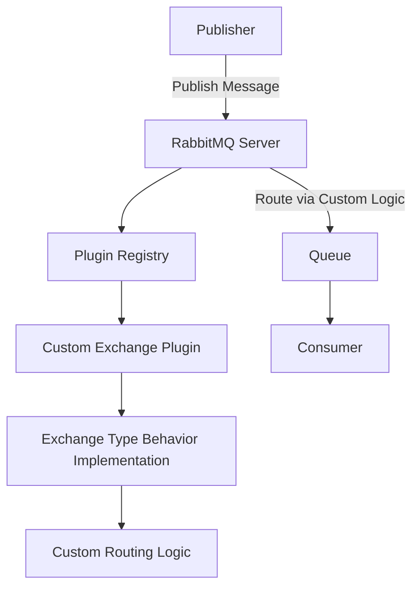

# RabbitMQ Custom Exchanges

## Introduction

In RabbitMQ, exchanges are the routing components responsible for directing messages to the appropriate queues. While RabbitMQ provides several built-in exchange types (direct, fanout, topic, and headers), there are scenarios where these standard types may not fully meet your application's specific routing requirements.

This is where custom exchanges come into play. Custom exchanges allow you to implement specialized routing logic tailored to your unique needs. In this tutorial, we'll explore how to create and use custom exchanges in RabbitMQ, giving you greater flexibility and control over your messaging architecture.

## Prerequisites

Before diving into custom exchanges, you should be familiar with:
- Basic RabbitMQ concepts (exchanges, queues, bindings)
- Standard exchange types and their routing patterns
- RabbitMQ plugin development basics

## Understanding Custom Exchanges

### What is a Custom Exchange?

A custom exchange is an exchange type that implements routing behavior not available in the standard exchange types. Custom exchanges are created as plugins for RabbitMQ and can implement any routing logic you can code.

### When to Use Custom Exchanges

Consider creating a custom exchange when:
- Standard exchange types don't provide the routing pattern you need
- You need to implement complex routing decisions based on message content or metadata
- You want to integrate external systems or services into your routing decisions
- You need to implement business-specific routing rules

### Custom Exchange Architecture

Custom exchanges are implemented as RabbitMQ plugins written in Erlang (RabbitMQ's native language) or Elixir. Each custom exchange must implement the `rabbit_exchange_type` behavior, which defines the interface for exchange types.



## Creating a Custom Exchange Plugin

Let's walk through creating a simple custom exchange plugin. Our example will be a "random" exchange that routes messages randomly to one of the bound queues.

### Step 1: Set Up the Development Environment

First, ensure you have Erlang and RabbitMQ installed. You'll also need the RabbitMQ plugin development tools:

```bash
# Install Erlang (on Debian/Ubuntu)
apt-get install erlang

# Install RabbitMQ server
apt-get install rabbitmq-server

# Enable RabbitMQ management plugin for easier testing
rabbitmq-plugins enable rabbitmq_management
```

### Step 2: Create the Plugin Structure

RabbitMQ plugins follow a specific structure. Create a new directory for your plugin:

```bash
mkdir rabbitmq_random_exchange
cd rabbitmq_random_exchange
```

Create the following files:

- `Makefile`
- `rabbitmq-components.mk`
- `src/rabbitmq_random_exchange.app.src`
- `src/rabbit_exchange_type_random.erl`

### Step 3: Implement the Exchange Type

Here's the implementation of our random exchange type in `src/rabbit_exchange_type_random.erl`:

```erlang
-module(rabbit_exchange_type_random).
-include_lib("rabbit_common/include/rabbit.hrl").

-behaviour(rabbit_exchange_type).

-export([description/0, serialise_events/0, route/2]).
-export([validate/1, validate_binding/2,
         create/2, delete/3, policy_changed/2,
         add_binding/3, remove_bindings/3, assert_args_equivalence/2]).

description() ->
    [{name, <<"random">>},
     {description, <<"Random Exchange">>}].

serialise_events() -> false.

route(#exchange{name = Name}, #delivery{message = Message}) ->
    Bindings = rabbit_router:match_routing_key(Name, ['_']),
    case length(Bindings) of
        0 -> [];
        N -> [lists:nth(rand:uniform(N), Bindings)]
    end.

validate(_X) -> ok.
validate_binding(_X, _B) -> ok.
create(_Tx, _X) -> ok.
delete(_Tx, _X, _Bs) -> ok.
policy_changed(_X1, _X2) -> ok.
add_binding(_Tx, _X, _B) -> ok.
remove_bindings(_Tx, _X, _Bs) -> ok.
assert_args_equivalence(X, Args) ->
    rabbit_exchange:assert_args_equivalence(X, Args).
```

### Step 4: Create the Application Source File

In `src/rabbitmq_random_exchange.app.src`:

```erlang
{application, rabbitmq_random_exchange,
 [{description, "RabbitMQ Random Exchange Type"},
  {vsn, "0.1.0"},
  {modules, []},
  {registered, []},
  {applications, [kernel, stdlib, rabbit]},
  {env, []},
  {broker_version_requirements, []}
 ]}.
```

### Step 5: Create the Makefile

In your `Makefile`:

```makefile
PROJECT = rabbitmq_random_exchange
PROJECT_DESCRIPTION = RabbitMQ Random Exchange Type

DEPS = rabbit
DEP_PLUGINS = rabbit_common/mk/rabbitmq-plugin.mk

include rabbitmq-components.mk
include erlang.mk
```

Download the `rabbitmq-components.mk` file from the RabbitMQ GitHub repository.

### Step 6: Build and Install the Plugin

Build the plugin:

```bash
make
make dist
```

This will create a `.ez` file in the `plugins` directory. Copy this file to RabbitMQ's plugin directory:

```bash
cp plugins/rabbitmq_random_exchange-0.1.0.ez /usr/lib/rabbitmq/plugins/
```

Enable the plugin:

```bash
rabbitmq-plugins enable rabbitmq_random_exchange
```

## Using Your Custom Exchange

Now let's see how to use our custom random exchange in a real application. We'll create a simple system that distributes work randomly among multiple workers.

### Step 1: Declare the Custom Exchange

```javascript
// JavaScript with amqplib
const amqp = require('amqplib');

async function setup() {
  const connection = await amqp.connect('amqp://localhost');
  const channel = await connection.createChannel();
  
  // Declare our custom random exchange
  await channel.assertExchange('random_tasks', 'random', { durable: true });
  
  // Create worker queues
  await channel.assertQueue('worker1', { durable: true });
  await channel.assertQueue('worker2', { durable: true });
  await channel.assertQueue('worker3', { durable: true });
  
  // Bind queues to the exchange
  await channel.bindQueue('worker1', 'random_tasks', '');
  await channel.bindQueue('worker2', 'random_tasks', '');
  await channel.bindQueue('worker3', 'random_tasks', '');
  
  console.log('Setup completed');
  
  return { connection, channel };
}
```

### Step 2: Send Messages to the Custom Exchange

```javascript
// Publisher code
async function publishTasks() {
  const { connection, channel } = await setup();
  
  for (let i = 1; i <= 10; i++) {
    const task = { id: i, data: `Task ${i} payload` };
    const message = Buffer.from(JSON.stringify(task));
    
    channel.publish('random_tasks', '', message);
    console.log(`Published task ${i}`);
    
    // Wait a bit between messages
    await new Promise(resolve => setTimeout(resolve, 1000));
  }
  
  await channel.close();
  await connection.close();
}

publishTasks();
```

### Step 3: Set Up Consumers

```javascript
// Consumer code for one worker
async function startWorker(workerName) {
  const connection = await amqp.connect('amqp://localhost');
  const channel = await connection.createChannel();
  
  await channel.assertQueue(workerName, { durable: true });
  
  console.log(`${workerName} waiting for tasks...`);
  
  channel.consume(workerName, (msg) => {
    if (msg !== null) {
      const task = JSON.parse(msg.content.toString());
      console.log(`${workerName} received task ${task.id}`);
      
      // Process the task (simulating work)
      setTimeout(() => {
        console.log(`${workerName} completed task ${task.id}`);
        channel.ack(msg);
      }, 2000);
    }
  });
}

// Start three workers
startWorker('worker1');
startWorker('worker2');
startWorker('worker3');
```

### Output

When running the above example, you'll see tasks distributed randomly among the three workers:

```
worker1 waiting for tasks...
worker2 waiting for tasks...
worker3 waiting for tasks...
Published task 1
worker2 received task 1
Published task 2
worker3 received task 2
Published task 3
worker1 received task 3
Published task 4
worker3 received task 4
worker2 completed task 1
worker3 completed task 2
worker1 completed task 3
worker3 completed task 4
...
```

## Real-World Custom Exchange Examples

Let's explore some practical custom exchange implementations:

### 1. Geolocation-Based Routing Exchange

This exchange routes messages based on geolocation data in the message:

```erlang
route(Exchange, Delivery) ->
    #delivery{message = #basic_message{content = Content}} = Delivery,
    #content{payload_fragments_rev = PayloadRev} = Content,
    Payload = lists:reverse(PayloadRev),
    
    % Parse JSON payload to extract location
    Message = jsx:decode(Payload, [return_maps]),
    Location = maps:get(<<"location">>, Message, undefined),
    
    % Find bindings that match this location
    rabbit_router:match_bindings(Exchange, [{<<"location">>, Location}]).
```

This could be used in distributed systems where messages need to be processed by services located in specific geographic regions.

### 2. Time-Based Routing Exchange

This exchange routes messages based on the time of day:

```erlang
route(Exchange, _Delivery) ->
    {H, _, _} = erlang:time(),
    RoutingKey = case H of
        _ when H >= 9, H < 17 -> <<"business_hours">>;
        _ -> <<"after_hours">>
    end,
    rabbit_router:match_routing_key(Exchange#exchange.name, [RoutingKey]).
```

This could be used for scheduling different handling of messages during business hours versus after hours.

### 3. Load-Balancing Exchange

This exchange implements a more sophisticated load-balancing strategy than our simple random exchange:

```erlang
route(Exchange, _Delivery) ->
    % Get all bindings for this exchange
    Bindings = rabbit_router:match_routing_key(Exchange#exchange.name, ['_']),
    
    % Get queue lengths
    QueueLengths = [{B, queue_length(B)} || B <- Bindings],
    
    % Sort by queue length (ascending)
    SortedQueues = lists:keysort(2, QueueLengths),
    
    % Return the binding with the shortest queue
    case SortedQueues of
        [] -> [];
        [{Binding, _}|_] -> [Binding]
    end.

queue_length(#binding{destination = Destination}) ->
    case rabbit_amqqueue:lookup(Destination) of
        {ok, Q} ->
            {_, Length, _} = rabbit_amqqueue:info(Q, [messages]),
            Length;
        _ -> 0
    end.
```

## Performance Considerations

When implementing custom exchanges, keep these performance considerations in mind:

1. **Routing Complexity**: Complex routing logic can increase message processing time. Keep your routing algorithms efficient.

2. **State Management**: If your exchange maintains state, ensure it's properly synchronized across RabbitMQ nodes in a cluster.

3. **Error Handling**: Robust error handling is crucial, as errors in the exchange can affect all messages passing through it.

4. **Testing Under Load**: Test your custom exchange with realistic message volumes to ensure it performs well under load.

## Debugging Custom Exchanges

Debug your custom exchange using RabbitMQ's logging system:

```erlang
route(Exchange, Delivery) ->
    rabbit_log:info("Routing message through custom exchange: ~p", [Exchange#exchange.name]),
    % Your routing logic here
    Result = calculate_route(Exchange, Delivery),
    rabbit_log:debug("Routing result: ~p", [Result]),
    Result.
```

You can view these logs in the RabbitMQ log file, typically located at `/var/log/rabbitmq/rabbit@hostname.log`.

## Deploying Custom Exchanges

To deploy your custom exchange to a production RabbitMQ server:

1. Build your plugin with `make dist`
2. Copy the resulting `.ez` file to the RabbitMQ plugins directory on each node
3. Enable the plugin with `rabbitmq-plugins enable your_plugin_name`
4. Restart RabbitMQ if necessary

For clustered environments, ensure the plugin is installed and enabled on all nodes.

## Summary

Custom exchanges in RabbitMQ provide a powerful way to implement specialized message routing behavior beyond what's possible with the standard exchange types. By creating custom exchanges, you can:

- Implement complex routing patterns tailored to your specific requirements
- Integrate with external systems for routing decisions
- Optimize message distribution based on custom criteria
- Add business-specific routing logic to your messaging system

While implementing custom exchanges requires knowledge of Erlang and RabbitMQ's plugin architecture, the flexibility they provide can be invaluable for complex messaging scenarios.

## Additional Resources

- [RabbitMQ Plugin Development Guide](https://www.rabbitmq.com/plugin-development.html)
- [Erlang Programming Language](https://www.erlang.org/)
- [RabbitMQ GitHub Repository](https://github.com/rabbitmq/rabbitmq-server)
- [RabbitMQ Discussion Forum](https://groups.google.com/g/rabbitmq-users)

## Exercises

1. **Basic**: Modify the random exchange example to use a weighted random algorithm, where some queues have a higher probability of receiving messages.

2. **Intermediate**: Implement a "header-pattern" exchange that routes based on regular expression matches against header values.

3. **Advanced**: Create a "content-based" exchange that inspects JSON or XML message bodies and routes based on the values of specific fields.

4. **Expert**: Implement a "learning" exchange that adjusts its routing behavior over time based on message processing times in different queues.