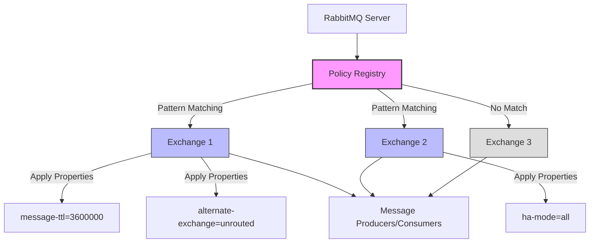

# RabbitMQ Exchange Policies

## Introduction

Exchange policies in RabbitMQ are powerful configuration rules that allow you to control the behavior of exchanges without modifying your application code. These policies can dynamically alter exchange properties, set limits, and enforce governance across your messaging infrastructure.

If you're familiar with RabbitMQ exchanges but find yourself repeatedly configuring the same properties or needing to implement consistent rules across multiple exchanges, exchange policies will make your life significantly easier.

## What Are Exchange Policies?

Exchange policies are server-side rules that apply specific configurations to exchanges that match certain criteria. Unlike directly setting properties when declaring an exchange, policies can be added, modified, or removed without changing your application code or restarting your services.

Think of exchange policies as a centralized configuration system for your exchanges - they help separate operational concerns from application logic.

## Key Benefits of Exchange Policies

- **Centralized management**: Configure multiple exchanges from a single location
- **Runtime changes**: Modify behaviors without application restarts
- **Operational flexibility**: Separate application code from infrastructure configuration
- **Consistent governance**: Apply the same rules across your entire messaging ecosystem

## Creating and Managing Exchange Policies

Exchange policies can be managed through the RabbitMQ management UI, HTTP API, or using the `rabbitmqctl` command-line tool.

### Using the Management UI

The management UI provides a user-friendly way to create and manage policies:

1. Log in to the RabbitMQ Management interface (typically at http://localhost:15672)
2. Navigate to "Admin" → "Policies"
3. Click "Add / update a policy"

### Using rabbitmqctl

For command-line management, you can use the `rabbitmqctl` tool:

```bash
rabbitmqctl set_policy [--vhost <vhost>] [--priority <priority>] [--apply-to <exchanges|queues|all>] <name> <pattern> <definition>
```

For example, to create a policy that applies to all exchanges with names starting with "logs":

```bash
rabbitmqctl set_policy log-ttl "^logs\." '{"message-ttl":86400000}' --apply-to exchanges
```

### Using the HTTP API

You can also use the HTTP API for programmatic management:

```bash
curl -i -u guest:guest -H "content-type:application/json" \
    -X PUT http://localhost:15672/api/policies/%2F/log-ttl \
    -d '{"pattern":"^logs\.","definition":{"message-ttl":86400000},"apply-to":"exchanges"}'
```

## Common Exchange Policy Properties

Let's explore some of the most useful properties you can set with exchange policies:

### Alternate Exchange

An alternate exchange receives messages that couldn't be routed to any queue:

```bash
rabbitmqctl set_policy ae-policy "^my-exchange$" \
    '{"alternate-exchange":"unrouted-messages"}' --apply-to exchanges
```

This policy configures `my-exchange` to send unroutable messages to an exchange named `unrouted-messages`.

### Message TTL

You can set a time-to-live for messages on certain exchanges:

```bash
rabbitmqctl set_policy ttl-policy "^logs\." \
    '{"message-ttl":3600000}' --apply-to exchanges
```

This sets a 1-hour (3,600,000 milliseconds) TTL for all messages going through exchanges whose names start with "logs.".

### Federation Upstream

For distributed RabbitMQ setups, you can configure federation:

```bash
rabbitmqctl set_policy federate-logs "^logs\." \
    '{"federation-upstream-set":"all"}' --apply-to exchanges
```

This federates all exchanges starting with "logs." across all configured upstreams.

## Policy Patterns and Matching

Policies use regular expression patterns to match exchange names. Some examples:

- `^amq\.` - matches exchanges whose names start with "amq."
- `\.logs$` - matches exchanges whose names end with ".logs"
- `^notifications$` - matches exactly one exchange named "notifications"
- `.*` - matches all exchanges

## Priority and Conflicts

When multiple policies match the same exchange, RabbitMQ uses the policy with the highest priority. If policies have the same priority, the policy with the longest name is used.

```bash
rabbitmqctl set_policy --priority 10 high-priority "^important\." '{"message-ttl":86400000}' --apply-to exchanges
```

The policy above will have priority 10, which is higher than the default priority of 0.

## Practical Examples

Let's walk through some real-world examples of exchange policies:

### Example 1: Dead Letter Configuration

Dead letter exchanges handle messages that are rejected or expire. Here's how to configure them with policies:

```bash
# Create the dead letter exchange first
rabbitmqctl set_policy dlx-policy "^business\." \
    '{"dead-letter-exchange":"dlx.business"}' --apply-to exchanges
```

With this policy, any message that can't be delivered through exchanges starting with "business." will be redirected to "dlx.business" exchange.

### Example 2: Setting Up High Availability

For critical exchanges, you might want to ensure high availability:

```bash
rabbitmqctl set_policy ha-logs "^logs\." \
    '{"ha-mode":"all"}' --apply-to exchanges
```

This policy ensures that all exchanges with names starting with "logs." are mirrored across all nodes in the RabbitMQ cluster.

### Example 3: Implementing Expiry Policies

For temporary exchanges:

```bash
rabbitmqctl set_policy temp-exchanges "^temp\." \
    '{"expires":3600000}' --apply-to exchanges
```

This policy automatically removes exchanges starting with "temp." after 1 hour of inactivity.

## Visualizing Exchange Policies

Here's a diagram showing how exchange policies work in a RabbitMQ system:



## Example Node.js Application Using Exchange Policies

Here's a complete example showing how to work with an exchange that has policies applied to it:

First, ensure you have set up the policy (this would typically be done by an administrator):

```bash
rabbitmqctl set_policy ttl-policy "^logs$" \
    '{"message-ttl":10000, "alternate-exchange":"unrouted"}' --apply-to exchanges
```

Now, let's look at a Node.js application that publishes to this exchange:

```javascript
const amqp = require('amqplib');

async function run() {
  try {
    // Connect to RabbitMQ
    const connection = await amqp.connect('amqp://localhost');
    const channel = await connection.createChannel();
    
    // Declare exchanges
    // Note: The exchange will automatically have the policy applied because it matches
    await channel.assertExchange('logs', 'topic', {durable: true});
    await channel.assertExchange('unrouted', 'fanout', {durable: true});
    
    // Declare a queue for the unrouted messages
    const qUnrouted = await channel.assertQueue('catch_all', {durable: true});
    await channel.bindQueue(qUnrouted.queue, 'unrouted', '');
    
    // Declare a queue for specific log messages
    const qErrors = await channel.assertQueue('error_logs', {durable: true});
    await channel.bindQueue(qErrors.queue, 'logs', 'error.#');
    
    // Publish some messages
    channel.publish('logs', 'error.system', Buffer.from('System error occurred'));
    channel.publish('logs', 'info.system', Buffer.from('Just some info')); // This will go to unrouted

    console.log('Messages published. Check the queues in RabbitMQ management UI.');
    
    // Wait a bit and close the connection
    setTimeout(() => {
      connection.close();
      process.exit(0);
    }, 1000);
  }
  catch (err) {
    console.error('Error:', err);
  }
}

run();
```

Let's also create a consumer to see the messages:

```javascript
const amqp = require('amqplib');

async function run() {
  try {
    const connection = await amqp.connect('amqp://localhost');
    const channel = await connection.createChannel();
    
    // Consume error logs
    await channel.consume('error_logs', (msg) => {
      console.log(`Error log received: ${msg.content.toString()}`);
      channel.ack(msg);
    });
    
    // Consume unrouted messages
    await channel.consume('catch_all', (msg) => {
      console.log(`Unrouted message caught: ${msg.content.toString()}`);
      channel.ack(msg);
    });
    
    console.log('Waiting for messages...');
  }
  catch (err) {
    console.error('Error:', err);
  }
}

run();
```

What's special about this example is that we didn't need to specify any TTL in our code - it's applied automatically by the policy.

## Monitoring Exchange Policies

To ensure your policies are working correctly, you can monitor them through:

1. RabbitMQ Management UI - navigate to the "Policies" tab
2. HTTP API:

```bash
curl -u guest:guest http://localhost:15672/api/policies
```

3. Command-line:

```bash
rabbitmqctl list_policies
```

## Common Pitfalls and Best Practices

### Pitfalls to Avoid

1. **Conflicting policies**: Multiple matching policies with the same priority can lead to unpredictable behavior
2. **Overly broad patterns**: Using patterns like `.*` might apply policies too broadly
3. **Performance impact**: Some policy settings (like message TTL) can impact performance

### Best Practices

1. **Use specific naming conventions**: This makes it easier to create targeted policies
2. **Document your policies**: Keep track of what policies exist and why
3. **Use priorities strategically**: Assign higher priorities to more specific policies
4. **Test policy changes**: Verify behavior after adding or modifying policies
5. **Start with a UAT environment**: Test policies in a non-production environment first

## Summary

Exchange policies in RabbitMQ provide a powerful way to manage exchange behavior without modifying application code. They allow for centralized configuration, runtime changes, and consistent governance across your messaging infrastructure.

Key takeaways:
- Policies apply settings to exchanges based on name patterns
- They can be managed through the UI, API, or command line
- Common policy settings include alternate exchanges, message TTL, and federation
- Priority determines which policy applies when multiple patterns match

By effectively using exchange policies, you can create more flexible, maintainable, and operationally efficient RabbitMQ deployments.

## Additional Resources

To learn more about RabbitMQ exchange policies, check out:

- RabbitMQ official documentation on policies
- RabbitMQ management plugin documentation
- Books like "RabbitMQ in Depth" by Gavin M. Roy

## Exercises

1. Create a policy that applies a message TTL of 5 minutes to all exchanges whose names start with "temp."
2. Set up a policy that configures an alternate exchange for all exchanges in your system
3. Create a federation policy that links exchanges across multiple RabbitMQ instances
4. Experiment with policy priorities by creating two conflicting policies and observing which one takes effect
5. Write a script that uses the HTTP API to list all current policies and their details