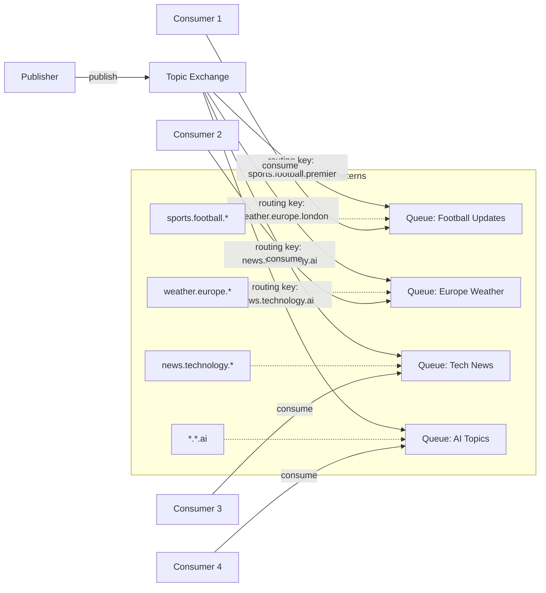

# RabbitMQ Topic Exchange

## Introduction

The Topic Exchange is one of the most flexible and powerful exchange types in RabbitMQ. It routes messages to queues based on wildcard matches between the routing key used when publishing a message and the routing pattern specified when binding a queue to the exchange.

Topic exchanges are especially useful when you need to implement complex routing scenarios where messages should be selectively sent to different queues based on multiple criteria or categories.

## How Topic Exchange Works

In a Topic exchange, the routing key is a list of words separated by dots, such as `"stock.usd.nyse"`, `"news.technology.ai"`, or `"weather.europe.italy"`. 

When binding a queue to a Topic exchange, you can use two special wildcard characters in the binding pattern:

- `*` (asterisk): Matches exactly one word
- `#` (hash): Matches zero or more words

For example, a queue bound with `"*.technology.*"` would receive messages with routing keys like `"news.technology.ai"` or `"blog.technology.security"`, but not `"news.ai"` (not enough segments) or `"news.technology.ai.trends"` (too many segments).

A queue bound with `"news.#"` would receive messages with routing keys like `"news"`, `"news.technology"`, or `"news.technology.ai.trends"`.

## Basic Topic Exchange Setup

Let's create a basic Topic exchange using Node.js with the `amqplib` library:

```javascript
const amqp = require('amqplib');

async function setupTopicExchange() {
  try {
    // Connect to RabbitMQ server
    const connection = await amqp.connect('amqp://localhost');
    const channel = await connection.createChannel();
    
    // Declare the topic exchange
    const exchangeName = 'topic_logs';
    await channel.assertExchange(exchangeName, 'topic', { durable: false });
    
    console.log('Topic exchange created successfully');
    
    // Close the connection
    await channel.close();
    await connection.close();
  } catch (error) {
    console.error('Error:', error);
  }
}

setupTopicExchange();
```

## Publishing Messages to a Topic Exchange

To publish messages to a Topic exchange, you need to specify a routing key that the exchange will use to determine which queues should receive the message:

```javascript
const amqp = require('amqplib');

async function publishMessage(routingKey, message) {
  try {
    // Connect to RabbitMQ server
    const connection = await amqp.connect('amqp://localhost');
    const channel = await connection.createChannel();
    
    // Declare the topic exchange
    const exchangeName = 'topic_logs';
    await channel.assertExchange(exchangeName, 'topic', { durable: false });
    
    // Publish message with the given routing key
    channel.publish(exchangeName, routingKey, Buffer.from(message));
    console.log(`Sent message: "${message}" with routing key: ${routingKey}`);
    
    // Close the connection
    setTimeout(() => {
      connection.close();
    }, 500);
  } catch (error) {
    console.error('Error:', error);
  }
}

// Example usage
publishMessage('sports.football.premier', 'Manchester United won 3-0!');
publishMessage('weather.europe.london', 'Rainy weather expected in London');
publishMessage('news.technology.ai', 'New AI breakthrough announced');
```

## Consuming Messages from Topic Exchange Queues

Now let's create a consumer that binds to the Topic exchange with specific binding patterns:

```javascript
const amqp = require('amqplib');

async function consumeMessages(bindingPatterns) {
  try {
    // Connect to RabbitMQ server
    const connection = await amqp.connect('amqp://localhost');
    const channel = await connection.createChannel();
    
    // Declare the topic exchange
    const exchangeName = 'topic_logs';
    await channel.assertExchange(exchangeName, 'topic', { durable: false });
    
    // Create an exclusive queue with a generated name
    const { queue } = await channel.assertQueue('', { exclusive: true });
    
    // Bind the queue to the exchange with the provided binding patterns
    for (const pattern of bindingPatterns) {
      await channel.bindQueue(queue, exchangeName, pattern);
      console.log(`Bound queue to exchange with pattern: ${pattern}`);
    }
    
    console.log('Waiting for messages...');
    
    // Consume messages
    channel.consume(queue, (msg) => {
      if (msg) {
        console.log(`Received message: ${msg.content.toString()}`);
        console.log(`Routing key: ${msg.fields.routingKey}`);
        console.log('---');
      }
    }, { noAck: true });
  } catch (error) {
    console.error('Error:', error);
  }
}

// Example usage for different consumers
// Consumer interested in all technology news
consumeMessages(['news.technology.*']);

// Consumer interested in all weather forecasts
consumeMessages(['weather.#']);

// Consumer interested in both football and basketball
consumeMessages(['sports.football.*', 'sports.basketball.*']);
```

## Real-World Example: Weather Alert System

Let's create a more practical example - a weather alert system that routes different types of weather updates to various subscribers based on location and severity:

```javascript
// Publisher: Weather monitoring service
const amqp = require('amqplib');

async function publishWeatherAlert(region, country, alertType, message) {
  try {
    const connection = await amqp.connect('amqp://localhost');
    const channel = await connection.createChannel();
    
    const exchangeName = 'weather_alerts';
    await channel.assertExchange(exchangeName, 'topic', { durable: true });
    
    // Routing key format: region.country.alertType
    const routingKey = `${region}.${country}.${alertType}`;
    
    channel.publish(exchangeName, routingKey, Buffer.from(message));
    console.log(`Published weather alert: ${routingKey}`);
    
    setTimeout(() => {
      connection.close();
    }, 500);
  } catch (error) {
    console.error('Error:', error);
  }
}

// Example weather alerts
publishWeatherAlert('europe', 'uk', 'flood', 'Flood warning for Northern England');
publishWeatherAlert('europe', 'france', 'storm', 'Severe storm approaching Southern France');
publishWeatherAlert('northamerica', 'usa', 'tornado', 'Tornado warning for Oklahoma state');
publishWeatherAlert('asia', 'japan', 'tsunami', 'Tsunami alert for eastern coastline');
```

Now let's create various consumers with different interests:

```javascript
// Consumer: Regional Emergency Services
const amqp = require('amqplib');

async function setupEmergencyService(serviceName, region, alertTypes) {
  try {
    const connection = await amqp.connect('amqp://localhost');
    const channel = await connection.createChannel();
    
    const exchangeName = 'weather_alerts';
    await channel.assertExchange(exchangeName, 'topic', { durable: true });
    
    const { queue } = await channel.assertQueue(`emergency_${serviceName}`, { durable: true });
    
    // Bind to all specified alert types in the region
    for (const alertType of alertTypes) {
      const bindingPattern = `${region}.*.${alertType}`;
      await channel.bindQueue(queue, exchangeName, bindingPattern);
      console.log(`${serviceName} bound to ${bindingPattern}`);
    }
    
    console.log(`${serviceName} waiting for alerts...`);
    
    channel.consume(queue, (msg) => {
      if (msg) {
        console.log(`[${serviceName}] Alert received: ${msg.fields.routingKey}`);
        console.log(`Message: ${msg.content.toString()}`);
        channel.ack(msg);
      }
    });
  } catch (error) {
    console.error('Error:', error);
  }
}

// Setup different emergency services
setupEmergencyService('European Flood Response', 'europe', ['flood']);
setupEmergencyService('Global Tsunami Center', '#', ['tsunami']);
setupEmergencyService('US Weather Monitoring', 'northamerica.usa', ['tornado', 'hurricane', 'flood']);
```

## Visualizing Topic Exchange Routing

Let's use a Mermaid diagram to visualize how Topic exchanges route messages:



## Topic Exchange vs Direct Exchange

While Direct exchanges route messages based on an exact match of the routing key, Topic exchanges provide more flexibility with wildcard patterns:

| Feature | Direct Exchange | Topic Exchange |
|---------|----------------|----------------|
| Routing Mechanism | Exact routing key match | Pattern matching with wildcards |
| Use Case | Simple point-to-point routing | Complex routing scenarios |
| Binding | Single routing key | Pattern with wildcards (`*` and `#`) |
| Flexibility | Limited | High |

## When to Use Topic Exchange

Topic exchanges are ideal for:

1. **Category-based routing**: When messages belong to multiple categories
2. **Hierarchical routing**: When routing keys have a hierarchical structure
3. **Multi-criteria filtering**: When consumers need to filter messages based on multiple attributes
4. **Broadcasting with filtering**: When you need both broadcasting capabilities and selective filtering

## Common Patterns and Best Practices

1. **Design your routing keys carefully**: Create a consistent scheme that can scale with your application
2. **Keep routing keys concise**: Aim for 2-4 segments in most cases
3. **Document your routing key structure**: Help team members understand the routing taxonomy
4. **Don't overuse wildcards**: Too many wildcard bindings can reduce the efficiency of filtering
5. **Consider message TTL**: For time-sensitive updates like weather alerts or sports scores

## Summary

The Topic exchange is a powerful routing mechanism in RabbitMQ that enables complex message routing based on pattern matching. With the flexible wildcard system, you can implement sophisticated publish/subscribe scenarios where messages are selectively delivered to interested consumers.

By using a structured routing key format with dot-separated segments, and binding queues with patterns using the `*` and `#` wildcards, you can create highly adaptable messaging systems that efficiently distribute information to the right subscribers.

Topic exchanges are particularly useful for systems dealing with:
- Categorized events
- Hierarchical data structures
- Multi-dimensional filtering needs
- Region or category-based routing

## Exercises

1. Create a news distribution system with topics for different categories (sports, technology, politics) and regions (americas, europe, asia), and implement subscribers with different interest combinations.

2. Implement a monitoring system for different services (database, web server, caching) with severity levels (info, warning, error), using a Topic exchange to route notifications to appropriate handling services.

3. Design a stock market data system where updates are published with routing keys containing market, industry, and company information, and subscribers can listen for specific patterns of interest.

## Additional Resources

- [RabbitMQ Topic Exchange Documentation](https://www.rabbitmq.com/tutorials/tutorial-five-python.html)
- [Advanced Message Queuing Protocol (AMQP) Specification](https://www.amqp.org/resources/specifications)
- [Node.js amqplib library](https://www.npmjs.com/package/amqplib)