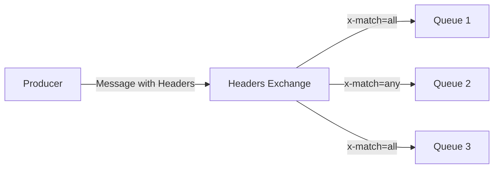

# RabbitMQ Headers Exchange

## Introduction

In RabbitMQ, exchanges are responsible for routing messages to the appropriate queues. While many developers are familiar with Direct, Topic, and Fanout exchanges, the Headers Exchange is often overlooked despite its powerful capabilities.

A Headers Exchange routes messages based on their header attributes rather than routing keys. This makes it especially useful when you need to route messages based on multiple criteria or complex conditions that can't be easily expressed in a routing key string.

## What is a Headers Exchange?

A Headers Exchange is a type of exchange that uses message header attributes for routing decisions. Unlike other exchange types that depend on routing keys, the Headers Exchange examines the headers table (a dictionary of key-value pairs) in the message properties.

Key characteristics of Headers Exchanges:

- They ignore the routing key property completely
- They use the message header attributes for routing
- They can match on multiple header values
- They support exact matching and pattern matching through binding arguments

## How Headers Exchange Works

<br />



<br />

When binding a queue to a Headers Exchange, you provide a table of key-value pairs that specify which headers to match. Additionally, you must include a special binding argument called `x-match` that determines how the headers should be matched:

- `x-match = all`: All header pairs must match (logical AND)
- `x-match = any`: At least one header pair must match (logical OR)

## Creating and Using a Headers Exchange

Let's walk through how to create and use a Headers Exchange in practice:

### Step 1: Create a Headers Exchange

```javascript
// Using amqplib for Node.js
const amqp = require('amqplib');

async function setup() {
  const connection = await amqp.connect('amqp://localhost');
  const channel = await connection.createChannel();
  
  // Create a headers exchange
  await channel.assertExchange('user-events', 'headers', {
    durable: true
  });
  
  // Rest of the code...
}

setup();
```

### Step 2: Create Queues and Bind Them with Header Conditions

```javascript
// Create queues
await channel.assertQueue('premium-user-events', { durable: true });
await channel.assertQueue('new-user-events', { durable: true });
await channel.assertQueue('admin-notifications', { durable: true });

// Bind queues with header conditions
await channel.bindQueue('premium-user-events', 'user-events', '', {
  'x-match': 'all',
  'user-type': 'premium'
});

await channel.bindQueue('new-user-events', 'user-events', '', {
  'x-match': 'all',
  'account-age': 'new'
});

await channel.bindQueue('admin-notifications', 'user-events', '', {
  'x-match': 'any',
  'priority': 'high',
  'require-attention': 'yes'
});
```

### Step 3: Publish Messages with Headers

```javascript
// Publish a message with headers
await channel.publish('user-events', '', Buffer.from(JSON.stringify({
  action: 'profile-update',
  userId: 12345
})), {
  headers: {
    'user-type': 'premium',
    'priority': 'high'
  }
});

// This message will go to 'premium-user-events' and 'admin-notifications' queues
```

## Real-World Example: Multi-criteria Document Processing System

Let's consider a document processing system that handles various types of documents (invoices, contracts, reports) for different departments (finance, legal, marketing).

### Setting Up the Exchange and Queues

```javascript
// Create the headers exchange
await channel.assertExchange('document-processor', 'headers', { durable: true });

// Create department-specific queues
await channel.assertQueue('finance-documents', { durable: true });
await channel.assertQueue('legal-documents', { durable: true });
await channel.assertQueue('urgent-processing', { durable: true });

// Bind queues with appropriate header conditions
await channel.bindQueue('finance-documents', 'document-processor', '', {
  'x-match': 'all',
  'department': 'finance'
});

await channel.bindQueue('legal-documents', 'document-processor', '', {
  'x-match': 'all',
  'department': 'legal'
});

await channel.bindQueue('urgent-processing', 'document-processor', '', {
  'x-match': 'all',
  'priority': 'urgent'
});
```

### Publishing Documents

```javascript
// Publish an urgent finance document
await channel.publish('document-processor', '', Buffer.from(JSON.stringify({
  documentId: 'FIN-2023-05-123',
  title: 'Q2 Financial Report'
})), {
  headers: {
    'department': 'finance',
    'document-type': 'report',
    'priority': 'urgent'
  }
});

// This will go to both 'finance-documents' and 'urgent-processing' queues
```

## Headers Exchange vs Topic Exchange

While both Headers and Topic exchanges can be used for complex routing scenarios, they have distinct differences:

| Headers Exchange | Topic Exchange |
|-----------------|----------------|
| Routes based on message headers | Routes based on routing keys |
| Can match on multiple attributes | Matches on a single string with wildcards |
| Supports exact value matching | Supports pattern matching with `*` and `#` |
| More flexible for complex conditions | More efficient for simple hierarchical routing |
| Ignores routing key | Requires carefully structured routing keys |

## Common Use Cases for Headers Exchange

1. **Multi-criteria filtering**: When you need to route messages based on multiple attributes
2. **Complex routing conditions**: When routing logic can't be expressed in a single string
3. **Content-based routing**: When routing should depend on the message properties, not just its destination
4. **Dynamic routing systems**: When routing rules may change frequently

## Best Practices

- Use descriptive header names to make the routing logic clear
- Document your header schema to ensure consistency
- Consider performance implications when using many complex header matches
- Use `x-match=all` for strict filtering and `x-match=any` for more flexible routing
- Remember that header matching is case-sensitive

## Limitations to Be Aware Of

- Headers matching can be more resource-intensive than simpler exchange types
- Complex header matching patterns can be difficult to debug
- No built-in wildcard support for header values (unlike topic exchange routing keys)

## Summary

Headers Exchanges provide a powerful and flexible way to route messages in RabbitMQ based on message metadata rather than routing keys. They excel in scenarios where routing decisions need to consider multiple attributes or complex conditions.

By using header attributes and the special `x-match` parameter, you can implement sophisticated message routing systems that would be difficult to achieve with other exchange types.

## Additional Exercises

1. Create a notification system that routes messages to different queues based on both urgency and category using a Headers Exchange.

2. Implement a document processing system where documents are routed to queues based on multiple criteria like document type, department, and priority.

3. Compare the performance of a Headers Exchange with a Topic Exchange for your specific use case - which one handles your routing patterns more efficiently?

## Further Resources

- [RabbitMQ Official Documentation on Exchanges](https://www.rabbitmq.com/tutorials/amqp-concepts.html#exchanges)
- [Advanced Messaging Patterns with RabbitMQ](https://www.rabbitmq.com/tutorials/tutorial-five-javascript.html)
- [Message Properties and Headers in AMQP](https://www.rabbitmq.com/publishers.html#message-properties)