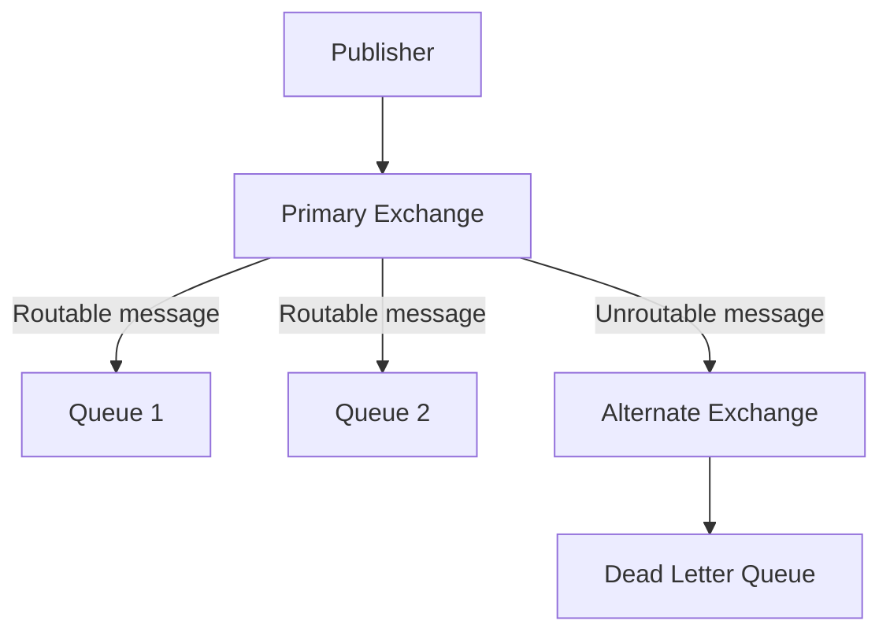
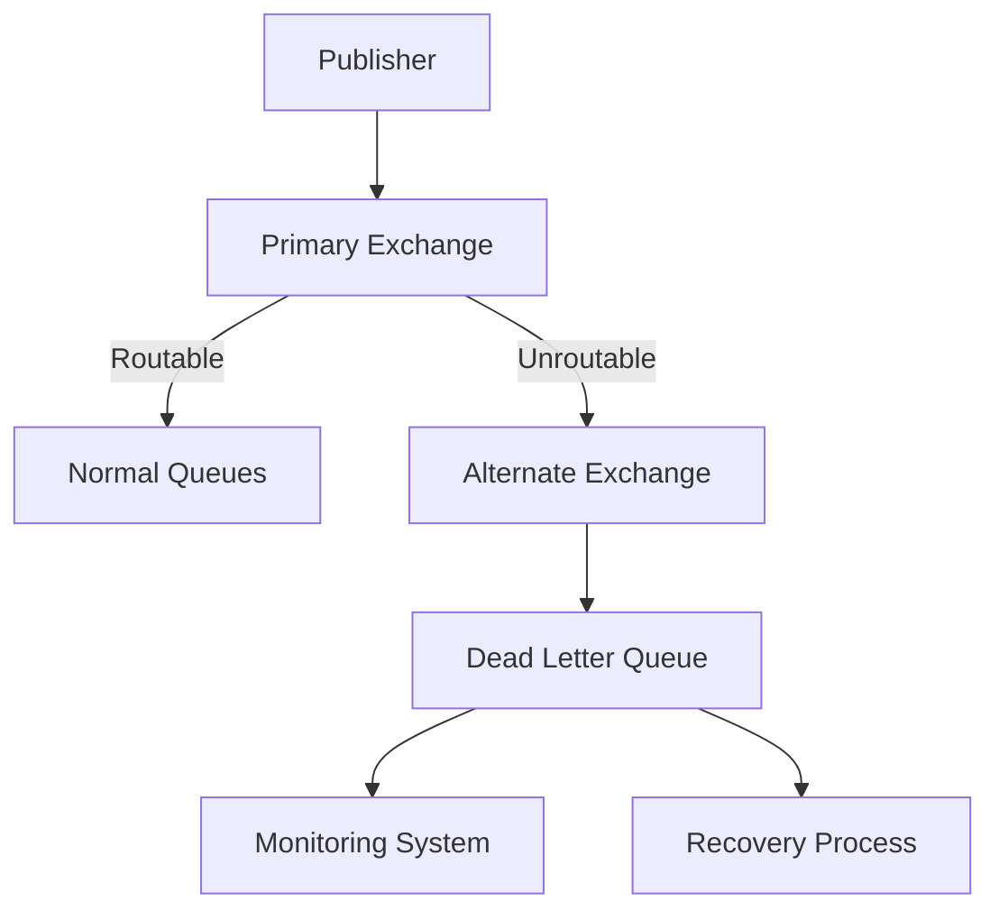

# RabbitMQ Alternate Exchange

## Introduction

When working with message brokers like RabbitMQ, one challenge you might face is handling messages that can't be routed to any queue. By default, when a message is published to an exchange but can't be routed (for example, no matching binding exists), RabbitMQ silently drops the message. This behavior can lead to lost information and debugging challenges.

**Alternate Exchanges** (often abbreviated as AE) provide an elegant solution to this problem. They act as a safety net for messages that would otherwise be lost, redirecting unroutable messages to a designated exchange where they can be captured and processed.

## What is an Alternate Exchange?

An Alternate Exchange is a special type of exchange that receives messages that couldn't be routed by another exchange. When you configure an exchange with an alternate exchange, any messages that the primary exchange cannot route will be sent to the alternate exchange instead of being discarded.



## How to Set Up an Alternate Exchange

Setting up an alternate exchange involves two main steps:

1. Creating the alternate exchange that will handle unrouted messages
2. Configuring the primary exchange to use the alternate exchange

### Using the RabbitMQ Management UI

1. First, create an exchange that will serve as your alternate exchange
2. When creating or editing your primary exchange, specify the alternate exchange name in the "Alternate Exchange" field

### Using Code

Here's how to set up alternate exchanges programmatically using different languages:

#### JavaScript (with amqplib)

```javascript
const amqp = require('amqplib');

async function setupAlternateExchange() {
  try {
    // Connect to RabbitMQ server
    const connection = await amqp.connect('amqp://localhost');
    const channel = await connection.createChannel();
    
    // Create the alternate exchange (a fanout exchange works well for this purpose)
    await channel.assertExchange('alt.exchange', 'fanout', { durable: true });
    
    // Create a queue to capture unrouted messages
    await channel.assertQueue('unrouted.messages', { durable: true });
    
    // Bind the queue to the alternate exchange
    await channel.bindQueue('unrouted.messages', 'alt.exchange', '');
    
    // Create the primary exchange with alternate exchange configuration
    await channel.assertExchange('primary.exchange', 'direct', {
      durable: true,
      arguments: {
        'alternate-exchange': 'alt.exchange'
      }
    });
    
    console.log('Exchanges and queue set up successfully');
    
    // Close the connection
    await connection.close();
  } catch (error) {
    console.error('Error setting up alternate exchange:', error);
  }
}

setupAlternateExchange();
```

#### Python (with pika)

```python
import pika

# Connect to RabbitMQ
connection = pika.BlockingConnection(pika.ConnectionParameters('localhost'))
channel = connection.create_channel()

# Create the alternate exchange (fanout type)
channel.exchange_declare(
    exchange='alt.exchange',
    exchange_type='fanout',
    durable=True
)

# Create a queue to capture unrouted messages
channel.queue_declare(queue='unrouted.messages', durable=True)

# Bind the queue to the alternate exchange
channel.queue_bind(
    exchange='alt.exchange',
    queue='unrouted.messages',
    routing_key=''
)

# Create the primary exchange with alternate exchange configuration
channel.exchange_declare(
    exchange='primary.exchange',
    exchange_type='direct',
    durable=True,
    arguments={'alternate-exchange': 'alt.exchange'}
)

print("Exchanges and queue set up successfully")
connection.close()
```

#### Java (with RabbitMQ Java Client)

```java
import com.rabbitmq.client.Channel;
import com.rabbitmq.client.Connection;
import com.rabbitmq.client.ConnectionFactory;

import java.io.IOException;
import java.util.HashMap;
import java.util.Map;
import java.util.concurrent.TimeoutException;

public class AlternateExchangeExample {
    public static void main(String[] args) throws IOException, TimeoutException {
        ConnectionFactory factory = new ConnectionFactory();
        factory.setHost("localhost");
        
        try (Connection connection = factory.newConnection();
             Channel channel = connection.createChannel()) {
            
            // Create the alternate exchange (fanout type)
            channel.exchangeDeclare("alt.exchange", "fanout", true);
            
            // Create a queue to capture unrouted messages
            channel.queueDeclare("unrouted.messages", true, false, false, null);
            
            // Bind the queue to the alternate exchange
            channel.queueBind("unrouted.messages", "alt.exchange", "");
            
            // Create the primary exchange with alternate exchange configuration
            Map<String, Object> args = new HashMap<>();
            args.put("alternate-exchange", "alt.exchange");
            channel.exchangeDeclare("primary.exchange", "direct", true, false, args);
            
            System.out.println("Exchanges and queue set up successfully");
        }
    }
}
```

## Testing the Alternate Exchange

To test that your alternate exchange is working correctly, follow these steps:

1. Set up the exchanges and queue as shown in the examples above
2. Publish a message to the primary exchange with a routing key that doesn't match any bindings
3. Check the "unrouted.messages" queue to verify the message was captured

### Example Test in JavaScript

```javascript
const amqp = require('amqplib');

async function testAlternateExchange() {
  try {
    // Connect to RabbitMQ
    const connection = await amqp.connect('amqp://localhost');
    const channel = await connection.createChannel();
    
    // Publish a message with a non-matching routing key
    const message = Buffer.from('This is a test message that should be unrouted');
    channel.publish('primary.exchange', 'non.existing.key', message, {
      persistent: true
    });
    
    console.log("Message published with non-matching routing key");
    
    // Wait briefly for message to be processed
    setTimeout(async () => {
      // Check if the message arrived in the unrouted messages queue
      const { messageCount } = await channel.assertQueue('unrouted.messages');
      console.log(`Unrouted messages queue has ${messageCount} message(s)`);
      
      // Consume the message to see its content
      channel.consume('unrouted.messages', (msg) => {
        console.log("Received unrouted message:", msg.content.toString());
        channel.ack(msg);
        
        // Close the connection
        connection.close();
      }, { noAck: false });
    }, 1000);
  } catch (error) {
    console.error('Error testing alternate exchange:', error);
  }
}

testAlternateExchange();
```

**Output:**
```
Message published with non-matching routing key
Unrouted messages queue has 1 message(s)
Received unrouted message: This is a test message that should be unrouted
```

## Practical Use Cases for Alternate Exchanges

### 1. Message Auditing and Logging

Alternate exchanges are excellent for setting up message auditing systems. By capturing unrouted messages, you can:
- Track message routing failures
- Analyze patterns in undeliverable messages
- Create alerts for unexpected routing issues

### 2. Dead Letter Handling

Combined with a dead letter queue (DLQ), alternate exchanges provide a comprehensive error handling strategy:



### 3. Fallback Processing

You can implement fallback processing logic for messages that can't be routed to their preferred destination:

```javascript
// Consumer for the unrouted messages queue
channel.consume('unrouted.messages', (msg) => {
  try {
    const content = JSON.parse(msg.content.toString());
    const originalRoutingKey = msg.properties.headers.originalRoutingKey;
    
    console.log(`Processing fallback for message intended for ${originalRoutingKey}`);
    
    // Apply fallback processing logic
    processFallback(content);
    
    channel.ack(msg);
  } catch (error) {
    console.error('Error in fallback processing:', error);
    channel.nack(msg, false, false); // Don't requeue
  }
}, { noAck: false });
```

## Best Practices for Using Alternate Exchanges

1. **Choose the Right Exchange Type**: For your alternate exchange, a fanout exchange is usually the simplest choice as it broadcasts all messages to all bound queues without concern for routing keys.

2. **Include Original Message Metadata**: When publishing messages that might be unrouted, include headers with context information:

```javascript
channel.publish('primary.exchange', routingKey, message, {
  persistent: true,
  headers: {
    'original-exchange': 'primary.exchange',
    'original-routing-key': routingKey,
    'timestamp': new Date().toISOString()
  }
});
```

3. **Monitor Your Alternate Exchange Queues**: Set up alerts for unexpected increases in unrouted messages, as they might indicate configuration problems or unexpected application behavior.

4. **Consider Message TTL**: To prevent your alternate exchange queues from growing too large, consider setting a message TTL (Time-To-Live):

```javascript
channel.assertQueue('unrouted.messages', {
  durable: true,
  arguments: {
    'x-message-ttl': 86400000 // 24 hours in milliseconds
  }
});
```

## Limitations and Considerations

1. **Performance Impact**: Each unrouted message requires additional processing, which can impact performance under high load.

2. **Chain of Alternate Exchanges**: You can create a chain of alternate exchanges, but be careful not to create cycles which could cause infinite message loops.

3. **Default Exchange Limitations**: You cannot set an alternate exchange for the default exchange.

4. **Exchange Type Compatibility**: Any exchange type can have an alternate exchange, and the alternate exchange itself can be any type.

## Summary

RabbitMQ Alternate Exchanges provide a powerful mechanism for handling messages that would otherwise be lost due to routing failures. By implementing an alternate exchange:

- You create a safety net for unrouted messages
- You gain visibility into message routing issues
- You enable fallback processing and error recovery

This pattern fits well within a comprehensive messaging error handling strategy, especially when combined with other RabbitMQ features like dead letter queues and message TTLs.

## Further Learning

To deepen your understanding of RabbitMQ Alternate Exchanges, try these exercises:

1. Set up a topology with different exchange types (direct, topic, headers) all using the same alternate exchange.
2. Implement a monitoring system that alerts when the rate of unrouted messages exceeds a threshold.
3. Create a recovery process that attempts to reprocess messages from an alternate exchange queue after fixing routing configuration issues.

Remember that mastering message routing in RabbitMQ takes practice, but the investment pays off with more robust and reliable messaging systems.