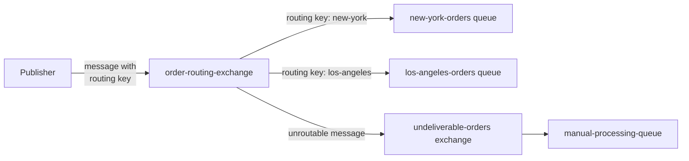
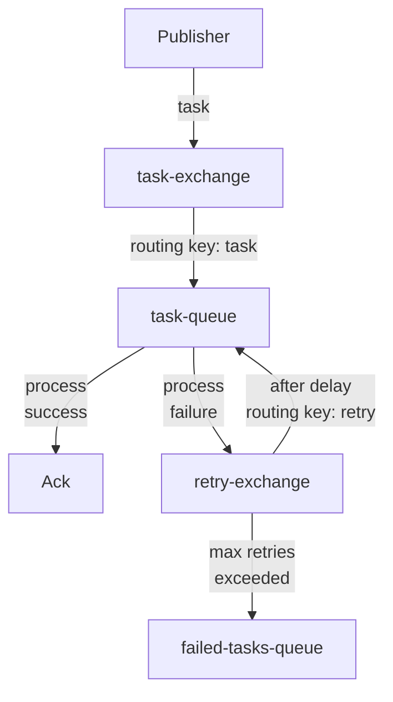

# RabbitMQ Exchange Arguments

## Introduction

When working with RabbitMQ, exchanges are responsible for routing messages to queues based on specific criteria. While the exchange type (direct, fanout, topic, or headers) defines the basic routing mechanism, **exchange arguments** provide additional customization options that modify the behavior of these exchanges.

Exchange arguments are optional parameters passed during exchange declaration that help fine-tune how exchanges handle messages. These arguments allow you to implement advanced messaging patterns and solve specific messaging challenges without having to build complex custom solutions.

In this guide, we'll explore the most useful exchange arguments in RabbitMQ, understand when and how to use them, and examine real-world examples of their application.

## Understanding Exchange Arguments

Exchange arguments are key-value pairs passed when creating an exchange. These arguments are passed as a table (a dictionary or map in most programming languages) when declaring an exchange.

```javascript
// Example of exchange declaration with arguments in JavaScript
channel.assertExchange('my-exchange', 'direct', {
  arguments: {
    'alternate-exchange': 'unrouted-messages-exchange',
    'x-delayed-type': 'fanout'
  }
});
```

The arguments can be standard ones defined by the AMQP protocol or RabbitMQ-specific extensions that typically start with the `x-` prefix.

## Common Exchange Arguments

### 1. alternate-exchange

One of the most widely used exchange arguments is `alternate-exchange`, which provides a solution for handling messages that cannot be routed to any queue (unroutable messages).

#### Purpose

By default, when a message cannot be routed to any queue, it is discarded. The `alternate-exchange` argument lets you specify another exchange to which unroutable messages should be sent instead of being discarded.

#### Syntax

```javascript
channel.assertExchange('main-exchange', 'direct', {
  arguments: {
    'alternate-exchange': 'fallback-exchange'
  }
});
```

#### Example Scenario

Let's imagine we have a messaging system for a logistics application where orders are routed based on their destination city:

```javascript
// Create a fallback exchange for unroutable messages
channel.assertExchange('undeliverable-orders', 'fanout', {
  durable: true
});

// Create a queue for handling undeliverable orders
channel.assertQueue('manual-processing-queue', { durable: true });
channel.bindQueue('manual-processing-queue', 'undeliverable-orders', '');

// Create the main exchange with an alternate-exchange for unroutable messages
channel.assertExchange('order-routing-exchange', 'direct', {
  durable: true,
  arguments: {
    'alternate-exchange': 'undeliverable-orders'
  }
});

// Bind queues for known cities
channel.assertQueue('new-york-orders', { durable: true });
channel.bindQueue('new-york-orders', 'order-routing-exchange', 'new-york');

channel.assertQueue('los-angeles-orders', { durable: true });
channel.bindQueue('los-angeles-orders', 'order-routing-exchange', 'los-angeles');
```

In this example, if an order comes in for "chicago" (which has no queue bound with that routing key), instead of being lost, it will be sent to the `undeliverable-orders` exchange and end up in the `manual-processing-queue` for human intervention.

Here's a diagram to visualize the flow:



### 2. x-delayed-type

This argument is used with the `x-delayed-message` exchange type, which is provided by the [rabbitmq-delayed-message-exchange](https://github.com/rabbitmq/rabbitmq-delayed-message-exchange) plugin.

#### Purpose

The `x-delayed-type` argument specifies what type of exchange the delayed exchange should behave as after the delay period. This allows you to introduce time-based message delivery in your RabbitMQ setup.

#### Syntax

```javascript
channel.assertExchange('delayed-exchange', 'x-delayed-message', {
  arguments: {
    'x-delayed-type': 'direct'
  }
});
```

#### Example Scenario

Imagine you're building a notification system that needs to send reminders at specific times:

```javascript
// Create a delayed exchange for scheduling notifications
channel.assertExchange('scheduled-notifications', 'x-delayed-message', {
  durable: true,
  arguments: {
    'x-delayed-type': 'topic'
  }
});

// Create queues for different notification types
channel.assertQueue('email-notifications', { durable: true });
channel.bindQueue('email-notifications', 'scheduled-notifications', 'notification.email.#');

channel.assertQueue('sms-notifications', { durable: true });
channel.bindQueue('sms-notifications', 'scheduled-notifications', 'notification.sms.#');

// Publishing a message with a 30-minute delay
channel.publish('scheduled-notifications', 'notification.email.reminder', 
  Buffer.from(JSON.stringify({
    user_id: 'user123',
    subject: 'Meeting Reminder',
    body: 'Your meeting starts in 30 minutes'
  })), 
  {
    headers: {
      'x-delay': 1800000  // 30 minutes in milliseconds
    }
  }
);
```

In this example, the message will be held by the exchange for 30 minutes before being routed to the `email-notifications` queue.

### 3. x-message-ttl (for Exchange-Wide TTL)

While Time-To-Live (TTL) is more commonly set on queues, you can also set a default TTL for all messages routed through an exchange.

#### Purpose

The `x-message-ttl` argument sets a default expiration time for messages passing through the exchange, ensuring messages don't stay in queues indefinitely if not consumed.

#### Syntax

```javascript
channel.assertExchange('short-lived-exchange', 'direct', {
  arguments: {
    'x-message-ttl': 60000  // 60 seconds in milliseconds
  }
});
```

#### Example Scenario

Let's say you're building a real-time data dashboard where outdated data isn't useful:

```javascript
// Create an exchange with message TTL of 5 minutes
channel.assertExchange('live-market-data', 'topic', {
  durable: true,
  arguments: {
    'x-message-ttl': 300000  // 5 minutes
  }
});

// Create queues for different dashboard components
channel.assertQueue('stock-ticker-data', { durable: true });
channel.bindQueue('stock-ticker-data', 'live-market-data', 'market.stocks.#');

channel.assertQueue('forex-data', { durable: true });
channel.bindQueue('forex-data', 'live-market-data', 'market.forex.#');

// Publish market data
channel.publish('live-market-data', 'market.stocks.nasdaq', 
  Buffer.from(JSON.stringify({
    symbol: 'AAPL',
    price: 150.75,
    timestamp: Date.now()
  }))
);
```

With this setup, all market data messages will automatically expire after 5 minutes, ensuring dashboards don't display stale data if consumers disconnect temporarily.

### 4. internal

The `internal` argument is a boolean flag that can be set when declaring an exchange.

#### Purpose

When set to `true`, the exchange cannot be directly published to by clients; it can only receive messages from other exchanges. This is useful for creating internal routing topologies that publishers shouldn't interact with directly.

#### Syntax

```javascript
channel.assertExchange('internal-routing-exchange', 'topic', {
  internal: true
});
```

#### Example Scenario

Imagine you're building a logging system with different processing pipelines:

```javascript
// Create a public-facing exchange for log input
channel.assertExchange('logs-input', 'topic', {
  durable: true
});

// Create an internal exchange for error processing
channel.assertExchange('error-logs-processing', 'direct', {
  durable: true,
  internal: true
});

// Bind the internal exchange to the input exchange
channel.bindExchange('error-logs-processing', 'logs-input', 'log.error.#');

// Create queues for different error handling tasks
channel.assertQueue('critical-errors', { durable: true });
channel.bindQueue('critical-errors', 'error-logs-processing', 'critical');

channel.assertQueue('application-errors', { durable: true });
channel.bindQueue('application-errors', 'error-logs-processing', 'application');

// Set up another exchange to do the internal routing
channel.assertExchange('error-classifier', 'direct', {
  durable: true
});
channel.bindExchange('error-logs-processing', 'error-classifier', '');

// Now publish error messages to the public exchange
channel.publish('logs-input', 'log.error.database', 
  Buffer.from(JSON.stringify({
    service: 'user-service',
    error: 'Connection timeout',
    severity: 'critical'
  }))
);
```

In this example, the `error-logs-processing` exchange can only receive messages from the `logs-input` exchange, not directly from publishers, ensuring proper flow through the classification system.

## Advanced Usage: Combining Exchange Arguments

Exchange arguments become particularly powerful when combined to solve complex messaging requirements. Let's look at an example that uses multiple arguments together:

```javascript
// Create a delayed exchange with fallback routing and internal restrictions
channel.assertExchange('scheduled-tasks', 'x-delayed-message', {
  durable: true,
  internal: true,
  arguments: {
    'x-delayed-type': 'direct',
    'alternate-exchange': 'dead-letter-exchange',
    'x-message-ttl': 86400000  // 24 hours
  }
});
```

This creates an advanced exchange that:
1. Supports delayed message delivery
2. Routes undeliverable messages to a dead letter exchange
3. Ensures messages expire after 24 hours
4. Can only be published to by other exchanges, not directly by clients

## Practical Application: Implementing a Retry Mechanism

One real-world application of exchange arguments is implementing a message retry system for handling transient failures:

```javascript
// Create the main task exchange
channel.assertExchange('task-exchange', 'direct', {
  durable: true,
  arguments: {
    'alternate-exchange': 'unroutable-tasks'
  }
});

// Create a delayed exchange for retries
channel.assertExchange('retry-exchange', 'x-delayed-message', {
  durable: true,
  arguments: {
    'x-delayed-type': 'direct'
  }
});

// Create main task queue with dead-letter configuration
channel.assertQueue('task-queue', { 
  durable: true,
  arguments: {
    'x-dead-letter-exchange': 'retry-exchange',
    'x-dead-letter-routing-key': 'retry'
  }
});
channel.bindQueue('task-queue', 'task-exchange', 'task');

// Bind the retry exchange back to the main task exchange
channel.bindQueue('task-queue', 'retry-exchange', 'retry');

// Process a message with retry logic
channel.consume('task-queue', async (msg) => {
  try {
    // Process the message
    const task = JSON.parse(msg.content.toString());
    await processTask(task);
    channel.ack(msg);
  } catch (error) {
    // Get retry count from headers or initialize to 0
    const headers = msg.properties.headers || {};
    const retryCount = (headers['x-retry-count'] || 0) + 1;
    
    if (retryCount <= 3) {
      // Reject the message and send to dead-letter exchange (retry-exchange)
      console.log(`Retrying task (attempt ${retryCount}/3) in 5 seconds...`);
      
      // Publish to retry exchange with delay and updated retry count
      channel.publish('retry-exchange', 'retry', msg.content, {
        headers: {
          'x-retry-count': retryCount,
          'x-delay': 5000  // 5 second delay
        }
      });
      
      channel.ack(msg);  // Remove from original queue
    } else {
      // Max retries exceeded, send to failure queue
      console.log('Max retries exceeded, sending to failure queue');
      channel.publish('failed-tasks', '', msg.content);
      channel.ack(msg);
    }
  }
});
```

This implementation creates a sophisticated retry mechanism that:
1. Processes messages from a main task queue
2. Automatically retries failed tasks with a 5-second delay
3. Limits retries to a maximum of 3 attempts
4. Sends persistently failing messages to a failure queue

Here's a diagram visualizing this retry flow:



## Summary

Exchange arguments provide powerful tools for customizing message routing behavior in RabbitMQ. The most commonly used arguments include:

1. **alternate-exchange**: For handling unroutable messages
2. **x-delayed-type**: For creating exchanges that deliver messages after a delay
3. **x-message-ttl**: For setting default message expiration times
4. **internal**: For creating exchanges that can only receive messages from other exchanges

By combining these arguments, you can implement sophisticated messaging patterns such as:
- Message retry mechanisms
- Dead letter handling
- Time-based message processing
- Multi-stage processing pipelines

## Exercises

1. Create a message scheduling system using the `x-delayed-message` exchange type that allows messages to be delivered at specific times of day.

2. Implement a priority-based message processing system where high-priority messages are processed before lower-priority ones.

3. Build a message filtering system that routes messages to different queues based on content size using exchange arguments.

4. Create a demo application that shows how to combine `alternate-exchange` with message TTL to implement a "wait and retry" pattern for transient failures.

## Additional Resources

- [RabbitMQ Exchange Arguments Documentation](https://www.rabbitmq.com/parameters.html#exchange-arguments)
- [RabbitMQ Delayed Message Plugin](https://github.com/rabbitmq/rabbitmq-delayed-message-exchange)
- [AMQP 0-9-1 Protocol Specification](https://www.rabbitmq.com/amqp-0-9-1-reference.html)

By mastering exchange arguments, you'll be able to implement elegant solutions to complex messaging requirements without having to build custom infrastructure or workarounds.