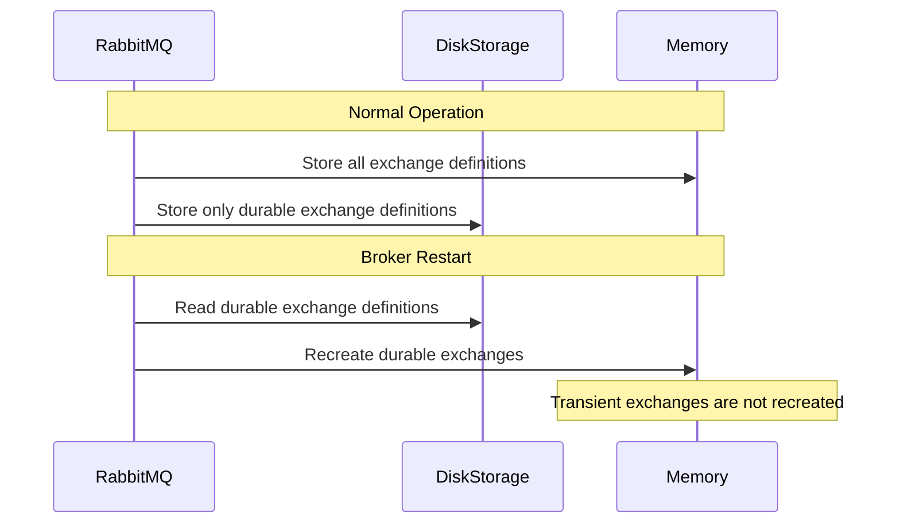

# RabbitMQ Exchange Durability

## Introduction

When working with RabbitMQ, understanding exchange durability is crucial for building reliable messaging systems. Exchange durability determines whether an exchange survives broker restarts, which directly impacts your application's reliability during system failures.

In this guide, we'll explore what exchange durability means, how to create durable and transient exchanges, and when to use each type. By the end, you'll understand how to implement the right durability settings for your messaging needs.

## What is Exchange Durability?

Exchange durability is a property that determines whether an exchange persists after a RabbitMQ broker restart. There are two durability options:

1. **Durable exchanges**: Survive broker restarts
2. **Transient (non-durable) exchanges**: Lost during broker restarts

The durability setting affects only the exchange definition itself, not the messages flowing through it. Message persistence is a separate concept configured independently.

## Creating Durable and Transient Exchanges

When declaring an exchange, you specify the durability using the `durable` parameter. Let's see how to create both types:

```javascript
// In JavaScript using amqplib
// Creating a durable exchange
channel.assertExchange('logs_durable', 'direct', {
  durable: true
});

// Creating a transient exchange
channel.assertExchange('logs_transient', 'direct', {
  durable: false
});
```

```python
# In Python using pika
# Creating a durable exchange
channel.exchange_declare(
    exchange='logs_durable',
    exchange_type='direct',
    durable=True
)

# Creating a transient exchange
channel.exchange_declare(
    exchange='logs_transient',
    exchange_type='direct',
    durable=False
)
```

The default value for the `durable` parameter is `true` in most client libraries. However, it's a good practice to explicitly set it to ensure clarity.

## How Durability Works Behind the Scenes

RabbitMQ stores information about durable exchanges on disk. When the broker starts up, it reads this information and recreates the exchanges. Here's what happens during a restart:



## Durability vs. Message Persistence

It's important to understand that exchange durability is different from message persistence:

1. **Exchange durability**: Determines if the exchange definition survives restarts
2. **Message persistence**: Determines if messages survive restarts

For a completely reliable messaging system, you need:
- Durable exchanges
- Durable queues
- Persistent messages

## Practical Example: Building a Reliable Logging System

Let's implement a reliable logging system using durable exchanges:

```javascript
// publisher.js
const amqp = require('amqplib');

async function setupLoggingPublisher() {
  try {
    const connection = await amqp.connect('amqp://localhost');
    const channel = await connection.createChannel();
    
    // Create a durable exchange
    await channel.assertExchange('system_logs', 'topic', {
      durable: true
    });
    
    // Function to publish logs
    function publishLog(severity, message) {
      channel.publish(
        'system_logs',
        severity, // routing key
        Buffer.from(message),
        {
          persistent: true // Make messages persistent too
        }
      );
      console.log(`Published ${severity} log: ${message}`);
    }
    
    // Example usage
    publishLog('error', 'Database connection failed');
    publishLog('info', 'User profile updated');
    
    // Close connection after some time
    setTimeout(() => {
      connection.close();
      process.exit(0);
    }, 1000);
    
    return publishLog;
  } catch (error) {
    console.error('Error:', error);
  }
}

setupLoggingPublisher();
```

```javascript
// consumer.js
const amqp = require('amqplib');

async function setupLoggingConsumer() {
  try {
    const connection = await amqp.connect('amqp://localhost');
    const channel = await connection.createChannel();
    
    // Reference the same durable exchange
    await channel.assertExchange('system_logs', 'topic', {
      durable: true
    });
    
    // Create a durable queue
    const { queue } = await channel.assertQueue('error_logs', {
      durable: true
    });
    
    // Bind to error logs only
    await channel.bindQueue(queue, 'system_logs', 'error');
    
    console.log(`Waiting for error logs. To exit press CTRL+C`);
    
    // Consume messages
    channel.consume(queue, (msg) => {
      if (msg !== null) {
        console.log(`Received error: ${msg.content.toString()}`);
        channel.ack(msg);
      }
    });
  } catch (error) {
    console.error('Error:', error);
  }
}

setupLoggingConsumer();
```

In this example:
1. We create a durable topic exchange called `system_logs`
2. The publisher sends logs with different routing keys for severity
3. The consumer creates a durable queue and binds to error logs only
4. Messages are marked as persistent with `persistent: true`

This system ensures that:
- The exchange survives broker restarts (durable exchange)
- The queue survives broker restarts (durable queue)
- The messages survive broker restarts (persistent messages)

## When to Use Durable vs. Transient Exchanges

### Use Durable Exchanges When:
- Processing business-critical messages
- Implementing systems that must survive broker restarts
- Building reliable event-driven architectures
- Working with financial transactions or important data

### Use Transient Exchanges When:
- Processing ephemeral data (like real-time metrics)
- Building temporary or debugging features
- You want to optimize for performance (transient exchanges are slightly faster)
- The data loss during restart is acceptable

## Best Practices for Exchange Durability

1. **Make critical exchanges durable**: Any exchange handling important business operations should be durable
2. **Consider the complete durability chain**: Remember that durable exchanges alone don't guarantee message durability
3. **Document your durability decisions**: Make clear which exchanges are durable vs. transient
4. **Be consistent**: If using durable queues, generally use durable exchanges too
5. **Test restart scenarios**: Verify your system behaves correctly during broker restarts

## Summary

Exchange durability is a fundamental concept in RabbitMQ that determines whether exchanges survive broker restarts. By choosing the appropriate durability settings, you can build systems that meet your reliability requirements while optimizing for performance.

Remember these key points:
- Durable exchanges survive broker restarts; transient ones don't
- Exchange durability is separate from message persistence
- For complete reliability, use durable exchanges, durable queues, and persistent messages
- The durability choice depends on your specific use case and reliability requirements

## Exercises

1. Create a durable fanout exchange and verify it survives a broker restart
2. Build a complete messaging system with durable exchanges, durable queues, and persistent messages
3. Compare the performance of durable vs. transient exchanges under high load
4. Implement a hybrid system where critical messages use durable exchanges and non-critical messages use transient exchanges

## Additional Resources

- [RabbitMQ Documentation on Durability](https://www.rabbitmq.com/tutorials/amqp-concepts.html)
- [Reliability Guide for RabbitMQ](https://www.rabbitmq.com/reliability.html)
- [RabbitMQ Management UI](https://www.rabbitmq.com/management.html) - Use this to inspect your exchanges and their durability settings