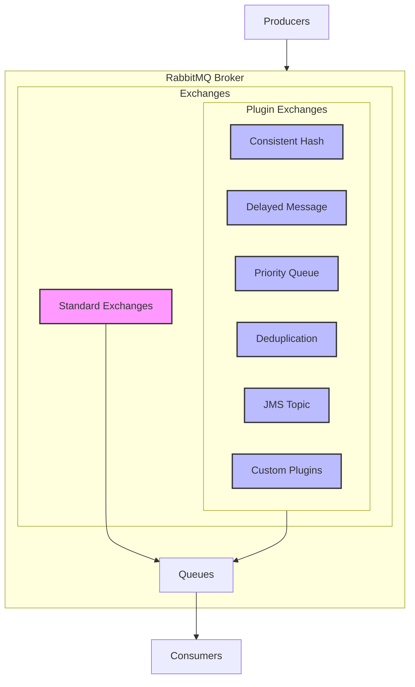

# RabbitMQ Exchange Plugins

## Introduction

RabbitMQ is a powerful and versatile message broker that implements the Advanced Message Queuing Protocol (AMQP). At its core, RabbitMQ uses exchanges to route messages to queues according to various rules. While the standard exchange types (direct, fanout, topic, and headers) provide robust functionality, RabbitMQ's plugin system allows for extending this functionality with specialized exchange types.

In this guide, we'll explore some of the most useful exchange plugins available for RabbitMQ, how they work, and when you might want to use them in your applications.

## What Are RabbitMQ Exchange Plugins?

Exchange plugins are extensions to RabbitMQ that introduce new exchange types with specialized routing capabilities beyond the standard types. These plugins can add features like:

- Advanced message filtering
- Message transformation
- Integration with other systems
- Custom routing algorithms
- Performance optimizations

Let's dive into some of the most popular exchange plugins and how they can enhance your messaging architecture.

## Consistent Hashing Exchange

### Overview

The Consistent Hashing Exchange is one of the most widely used exchange plugins. It distributes messages across queues using a consistent hashing algorithm, which is particularly useful for load balancing.

### Installation

To enable the Consistent Hashing Exchange plugin, run:

```bash
rabbitmq-plugins enable rabbitmq_consistent_hash_exchange
```

### How It Works

1. The exchange uses a hashing function on a routing key or message header
2. Messages are distributed across queues based on this hash
3. If a queue is added or removed, only a small fraction of messages are rerouted

### Example Implementation

Here's how to declare and use a consistent hash exchange in JavaScript using amqplib:

```javascript
const amqp = require('amqplib');

async function setupConsistentHashExchange() {
  const connection = await amqp.connect('amqp://localhost');
  const channel = await connection.createChannel();
  
  // Declare the consistent hash exchange
  await channel.assertExchange('orders_distribution', 'x-consistent-hash', {
    durable: true
  });
  
  // Create multiple queues
  const queue1 = await channel.assertQueue('worker_queue_1', { durable: true });
  const queue2 = await channel.assertQueue('worker_queue_2', { durable: true });
  const queue3 = await channel.assertQueue('worker_queue_3', { durable: true });
  
  // Bind queues to the exchange with a weight
  await channel.bindQueue('worker_queue_1', 'orders_distribution', '1');
  await channel.bindQueue('worker_queue_2', 'orders_distribution', '1');
  await channel.bindQueue('worker_queue_3', 'orders_distribution', '2'); // This queue gets ~2x messages
  
  // Publish a message (the routing key is used for hashing)
  await channel.publish('orders_distribution', '12345', Buffer.from('Order processing request'));
  
  console.log('Message sent through consistent hash exchange');
}

setupConsistentHashExchange().catch(console.error);
```

In this example, the routing key `'12345'` is hashed, and based on that hash, the message is routed to one of the three queues. Queue 3 has a weight of 2, so it receives approximately twice as many messages as the other queues.

### Real-World Use Case

A common application of the Consistent Hashing Exchange is in processing systems where you need to:

- Scale horizontally by adding more consumer instances
- Ensure that related messages (e.g., from the same user) always go to the same queue
- Minimize redistribution when adding or removing queues

For example, in an e-commerce system, you might use customer IDs as routing keys to ensure all orders from the same customer are processed by the same worker, improving cache locality and preventing race conditions.

## Delayed Message Exchange

### Overview

The Delayed Message Exchange allows you to delay the delivery of messages to their destination queues, which is helpful for implementing scheduled tasks or retry mechanisms.

### Installation

Enable the plugin with:

```bash
rabbitmq-plugins enable rabbitmq_delayed_message_exchange
```

### How It Works

1. Messages are published to the exchange with an `x-delay` header specifying delay in milliseconds
2. The exchange holds the message for the specified time
3. After the delay, the message is routed according to the exchange's type (direct, topic, etc.)

### Example Implementation

Here's a Python example using the pika library:

```python
import pika
import json
from datetime import datetime

connection = pika.BlockingConnection(pika.ConnectionParameters('localhost'))
channel = connection.channel()

# Declare a delayed message exchange
channel.exchange_declare(
    exchange='delayed_tasks',
    exchange_type='x-delayed-message',
    arguments={'x-delayed-type': 'direct'}
)

# Declare a queue
channel.queue_declare(queue='scheduled_tasks')
channel.queue_bind(exchange='delayed_tasks', queue='scheduled_tasks', routing_key='task.scheduled')

# Send a message with a 10-second delay
message = {
    'task': 'send_reminder_email',
    'user_id': 12345,
    'timestamp': datetime.utcnow().isoformat()
}

channel.basic_publish(
    exchange='delayed_tasks',
    routing_key='task.scheduled',
    body=json.dumps(message),
    properties=pika.BasicProperties(
        headers={'x-delay': 10000}  # 10 seconds delay
    )
)

print(f"Scheduled task for execution in 10 seconds at {datetime.utcnow().isoformat()}")
connection.close()
```

### Real-World Use Case

The Delayed Message Exchange is ideal for:

- Scheduling emails or notifications
- Implementing retry logic with exponential backoff
- Scheduling future tasks without a separate scheduler service
- Rate limiting by delaying certain message types

For instance, when a user signs up, you might want to send a welcome email immediately but schedule a follow-up email for 3 days later. The Delayed Message Exchange makes this straightforward without requiring a separate scheduling system.

## Priority Queue Exchange

### Overview

While RabbitMQ supports message priorities at the queue level, the Priority Queue Exchange plugin offers more sophisticated priority handling at the exchange level.

### Installation

To enable the plugin:

```bash
rabbitmq-plugins enable rabbitmq_priority_queue
```

### How It Works

1. Messages are assigned priorities through message properties
2. Higher priority messages are delivered before lower priority ones
3. Queues are configured with a maximum priority level

### Example Implementation

Here's a Java example using the RabbitMQ Java client:

```java
import com.rabbitmq.client.*;

import java.io.IOException;
import java.util.HashMap;
import java.util.Map;
import java.util.concurrent.TimeoutException;

public class PriorityQueueExample {
    public static void main(String[] args) throws IOException, TimeoutException {
        ConnectionFactory factory = new ConnectionFactory();
        factory.setHost("localhost");
        
        try (Connection connection = factory.newConnection();
             Channel channel = connection.createChannel()) {
            
            // Declare a priority queue with max priority 10
            Map<String, Object> args = new HashMap<>();
            args.put("x-max-priority", 10);
            channel.queueDeclare("priority_tasks", true, false, false, args);
            
            // Send a high priority message
            AMQP.BasicProperties highPriorityProps = new AMQP.BasicProperties.Builder()
                .priority(8)
                .build();
                
            channel.basicPublish("", "priority_tasks", highPriorityProps, 
                                "HIGH PRIORITY TASK".getBytes());
            
            // Send a low priority message
            AMQP.BasicProperties lowPriorityProps = new AMQP.BasicProperties.Builder()
                .priority(1)
                .build();
                
            channel.basicPublish("", "priority_tasks", lowPriorityProps, 
                                "low priority task".getBytes());
            
            System.out.println("Sent messages with different priorities");
        }
    }
}
```

### Real-World Use Case

Priority queues are valuable in systems where:

- Certain operations are more time-sensitive than others
- You need to ensure VIP customers get faster service
- System alerts should be processed before routine messages
- Resource-intensive tasks should yield to interactive requests

For example, in a customer support system, you might use priorities to ensure that messages from paying customers are processed before free-tier users, or that account suspension appeals are handled before routine inquiries.

## Message Deduplication Exchange

### Overview

The Message Deduplication Exchange plugin helps prevent duplicate message processing by filtering out repeated messages based on a message property or content.

### Installation

Enable the plugin with:

```bash
rabbitmq-plugins enable rabbitmq_message_deduplication
```

### How It Works

1. The exchange tracks message identifiers in a cache
2. If a message with the same identifier is received within the cache timeframe, it's discarded
3. Only unique messages within the specified time window are forwarded

### Example Implementation

Here's a Node.js example:

```javascript
const amqp = require('amqplib');

async function setupDeduplicationExchange() {
  const connection = await amqp.connect('amqp://localhost');
  const channel = await connection.createChannel();
  
  // Declare the deduplication exchange
  await channel.assertExchange('payments_processing', 'x-message-deduplication', {
    durable: true,
    arguments: {
      'x-cache-size': 1000,          // Cache size
      'x-cache-ttl': 3600000,        // Cache TTL in ms (1 hour)
      'x-key-type': 'header',        // Use a header for deduplication
      'x-key-name': 'x-transaction-id' // The header field to use
    }
  });
  
  // Create and bind a queue
  await channel.assertQueue('unique_payments', { durable: true });
  await channel.bindQueue('unique_payments', 'payments_processing', '');
  
  // Publish a message with a transaction ID
  await channel.publish(
    'payments_processing', 
    '', 
    Buffer.from(JSON.stringify({ amount: 100, user: 'john' })),
    {
      headers: {
        'x-transaction-id': 'tx-12345' // Deduplication key
      }
    }
  );
  
  console.log('Payment message sent');
  
  // If this is published again with the same transaction ID within the TTL,
  // it will be discarded by the exchange
}

setupDeduplicationExchange().catch(console.error);
```

### Real-World Use Case

The Deduplication Exchange is crucial in:

- Payment processing systems to prevent double charges
- Event-driven architectures where events might be published multiple times
- Systems with at-least-once delivery semantics
- IoT applications where devices might send duplicate data

For instance, in a microservices architecture, if a service crashes after publishing an event but before recording that it did so, it might republish the same event when it recovers. The Deduplication Exchange would prevent downstream systems from processing this duplicate event.

## JMS Topic Exchange

### Overview

The JMS Topic Exchange plugin provides Java Message Service (JMS) style topic exchanges, making it easier to integrate RabbitMQ with Java applications that use JMS.

### Installation

Enable with:

```bash
rabbitmq-plugins enable rabbitmq_jms_topic_exchange
```

### How It Works

1. Implements JMS topic selector syntax
2. Supports hierarchical topic names with wildcards
3. Allows for complex routing patterns based on message properties

### Example Implementation

Here's how to use it with a Java JMS client:

```java
import javax.jms.*;
import javax.naming.*;
import java.util.Properties;

public class JMSTopicExample {
    public static void main(String[] args) throws Exception {
        // Set up JNDI context
        Properties props = new Properties();
        props.setProperty(Context.INITIAL_CONTEXT_FACTORY, 
                         "org.apache.qpid.jms.jndi.JmsInitialContextFactory");
        props.setProperty("connectionfactory.qpidConnectionFactory", 
                         "amqp://localhost:5672");
        props.setProperty("topic.stockQuotes", "stock.quotes");
        
        Context context = new InitialContext(props);
        
        // Create connection
        ConnectionFactory factory = 
            (ConnectionFactory) context.lookup("qpidConnectionFactory");
        Connection connection = factory.createConnection();
        connection.start();
        
        // Create session and topic
        Session session = connection.createSession(false, Session.AUTO_ACKNOWLEDGE);
        Topic topic = (Topic) context.lookup("stockQuotes");
        
        // Create producer and publish message
        MessageProducer producer = session.createProducer(topic);
        TextMessage message = session.createTextMessage("AAPL:150.75");
        message.setStringProperty("symbol", "AAPL");
        message.setDoubleProperty("price", 150.75);
        
        producer.send(message);
        System.out.println("Sent stock quote message");
        
        // Create consumer with selector
        MessageConsumer consumer = 
            session.createConsumer(topic, "symbol = 'AAPL' AND price > 150.0");
        
        // Receive message
        TextMessage receivedMessage = (TextMessage) consumer.receive(5000);
        if (receivedMessage != null) {
            System.out.println("Received: " + receivedMessage.getText());
        }
        
        connection.close();
    }
}
```

### Real-World Use Case

The JMS Topic Exchange is particularly valuable when:

- Integrating with existing Java applications that use JMS
- Migrating from a JMS-based system to RabbitMQ
- Implementing complex filtering based on message properties
- Creating hierarchical topic structures

For example, a financial system might use JMS-style topics like `stock.quotes.nasdaq` and `stock.quotes.nyse` with selectors to filter based on price ranges or trading volumes.

## Implementing Custom Exchange Plugins

For advanced use cases, you can develop your own RabbitMQ exchange plugins.

### Basic Steps to Create a Custom Exchange Plugin

1. Set up the RabbitMQ plugin development environment
2. Create an Erlang module implementing the exchange behavior
3. Define how messages should be routed
4. Build and package the plugin
5. Deploy and enable it in your RabbitMQ server

### Example: Simple Custom Exchange Plugin Structure

```erlang
-module(rabbitmq_exchange_my_custom).
-behaviour(rabbit_exchange_type).

-export([
    description/0,
    serialise_events/0,
    route/2,
    validate/1,
    validate_binding/2,
    create/2,
    delete/3,
    policy_changed/2,
    add_binding/3,
    remove_bindings/3,
    assert_args_equivalence/2
]).

description() ->
    [{name, <<"x-my-custom">>},
     {description, <<"My custom exchange type">>}].

serialise_events() -> false.

route(Exchange, Delivery) ->
    % Custom routing logic here
    % Example: Route based on message size
    #delivery{message = #basic_message{content = Content}} = Delivery,
    Size = rabbit_msg_record:body_size(Content),
    
    Bindings = rabbit_exchange:route(Exchange, Delivery),
    % Apply custom filtering based on Size
    [B || B <- Bindings, binding_matches_size(B, Size)].

binding_matches_size(#binding{args = Args}, Size) ->
    case rabbit_misc:table_lookup(Args, <<"x-min-size">>) of
        {longlong, MinSize} when Size >= MinSize -> true;
        _ -> false
    end.

% Other required functions...
```

### Considerations for Custom Plugins

- Exchange plugins run within the RabbitMQ broker process, so they can impact overall performance
- Error handling is critical to prevent broker instability
- Consider distribution and failover scenarios in clustered environments
- Thorough testing is essential before production deployment

## Architecture Diagram: Exchange Plugins in RabbitMQ

The following diagram illustrates how exchange plugins fit into the RabbitMQ architecture:



## Best Practices for Using Exchange Plugins

1. **Performance Considerations**
   - Exchange plugins can add overhead, so benchmark before production use
   - Monitor broker performance after enabling plugins

2. **Plugin Management**
   - Use management commands to enable/disable plugins:
     ```bash
     rabbitmqctl list_plugins
     rabbitmq-plugins enable plugin_name
     rabbitmq-plugins disable plugin_name
     ```
   - Restart RabbitMQ after changing plugins in some cases
   - Consider plugin compatibility with your RabbitMQ version

3. **High Availability**
   - Ensure plugins are enabled on all nodes in a cluster
   - Test failover scenarios with plugins enabled
   - Some plugins maintain state that must be considered during failover

4. **Security**
   - Plugins may introduce new security considerations
   - Apply appropriate permissions to plugin exchanges
   - Consider data sensitivity when using plugins that store message data

## Summary

RabbitMQ exchange plugins significantly enhance the capabilities of your messaging infrastructure by providing specialized routing and message handling abilities. We've explored several popular plugins:

- **Consistent Hashing Exchange**: For load balancing and ensuring related messages go to the same queue
- **Delayed Message Exchange**: For scheduling messages to be delivered in the future
- **Priority Queue Exchange**: For handling messages based on their importance
- **Message Deduplication Exchange**: For preventing duplicate message processing
- **JMS Topic Exchange**: For JMS-style topic routing and selection

Each plugin addresses specific use cases and can help solve complex messaging challenges without requiring custom application code. By leveraging these plugins, you can build more robust, efficient, and feature-rich messaging systems with RabbitMQ.

## Additional Resources

- RabbitMQ Plugin Development Guide: [RabbitMQ Documentation](https://www.rabbitmq.com/plugin-development.html)
- Community Plugins Repository: [GitHub - RabbitMQ Community Plugins](https://github.com/rabbitmq/rabbitmq-server/tree/master/deps)
- RabbitMQ Management UI (which can help manage and monitor plugins)

## Exercises

1. **Basic Exercise**: Enable the Consistent Hashing Exchange and create a simple producer that distributes messages across three queues.

2. **Intermediate Exercise**: Implement a retry mechanism using the Delayed Message Exchange that retries failed messages with exponential backoff.

3. **Advanced Exercise**: Create a message processing system that uses the Priority Queue Exchange to handle different types of tasks based on their urgency.

4. **Integration Exercise**: Develop a system that combines multiple exchange plugins - for example, use Delayed Message Exchange with Deduplication Exchange to schedule unique events.

5. **Challenge Exercise**: If you're feeling adventurous, try creating a simple custom exchange plugin that routes messages based on a custom algorithm.