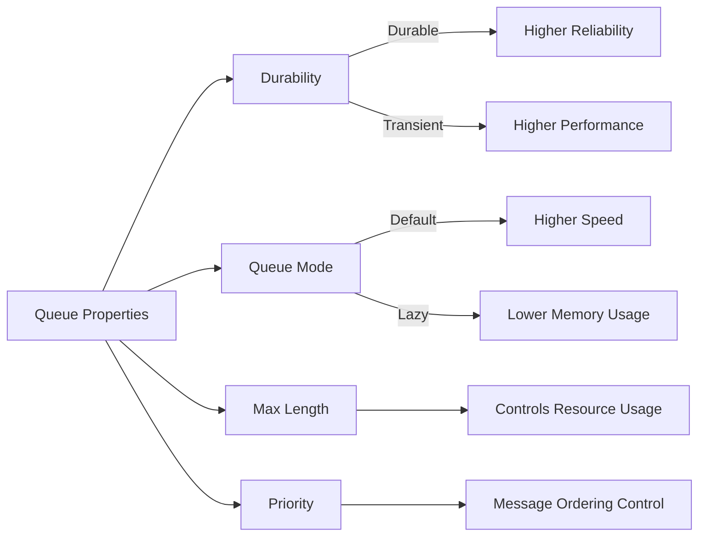

# RabbitMQ Queue Properties

## Introduction

When working with message queues in RabbitMQ, understanding queue properties is essential for building reliable, efficient, and scalable applications. Queue properties define how messages are stored, delivered, and processed within your messaging system. These properties allow you to fine-tune your queues to meet specific requirements such as durability, message expiration, and delivery behavior.

In this guide, we'll explore the various properties you can configure when creating and managing RabbitMQ queues, and how these properties affect your messaging system's behavior.

## Core Queue Properties

### Durability

Durability determines whether a queue survives a broker restart. This is one of the most important properties to consider when designing your messaging architecture.

```javascript
// Creating a durable queue
channel.assertQueue('durable_queue', {
  durable: true
});

// Creating a non-durable (transient) queue
channel.assertQueue('transient_queue', {
  durable: false
});
```

**When to use durable queues:**
- For critical messages that must not be lost
- In production environments where message persistence is required
- When implementing reliable work queues

**When to use non-durable queues:**
- For temporary or ephemeral messages
- In development/testing environments
- For scenarios where message loss is acceptable

### Exclusive

An exclusive queue can only be used by the connection that created it and will be deleted when that connection closes.

```javascript
channel.assertQueue('exclusive_queue', {
  exclusive: true
});
```

Exclusive queues are useful for:
- Temporary reply queues (for RPC patterns)
- Client-specific temporary data streams
- Preventing other connections from consuming from a queue

### Auto-delete

An auto-delete queue is automatically removed when its last consumer is canceled or the connection closes.

```javascript
channel.assertQueue('auto_delete_queue', {
  autoDelete: true
});
```

This property is ideal for:
- Temporary queues that should clean up after themselves
- Scenarios where queues should exist only as long as they're being used
- Reducing clutter in your RabbitMQ management interface

## Message Handling Properties

### TTL (Time-to-Live)

You can set a TTL for messages in a queue, after which they'll be automatically discarded.

```javascript
// Set TTL for individual messages (in milliseconds)
channel.sendToQueue('my_queue', Buffer.from('message'), {
  expiration: '60000' // 60 seconds
});

// Set a default TTL for all messages in a queue
channel.assertQueue('ttl_queue', {
  arguments: {
    'x-message-ttl': 60000 // 60 seconds
  }
});
```

TTL is particularly useful for:
- Time-sensitive data that becomes irrelevant after a certain period
- Preventing queue build-up by automatically removing stale messages
- Implementing message expiration policies

### Max Length

You can limit the number of messages or the total size of messages in a queue.

```javascript
// Limit by message count
channel.assertQueue('limited_queue', {
  arguments: {
    'x-max-length': 1000
  }
});

// Limit by total byte size
channel.assertQueue('size_limited_queue', {
  arguments: {
    'x-max-length-bytes': 1048576 // 1MB
  }
});
```

**Overflow behavior:** When a queue reaches its maximum length, RabbitMQ's default behavior is to discard messages from the head of the queue (oldest messages). You can change this with the `x-overflow` argument:

```javascript
// Reject new messages when queue is full
channel.assertQueue('reject_overflow_queue', {
  arguments: {
    'x-max-length': 1000,
    'x-overflow': 'reject-publish'
  }
});
```

Max length properties help with:
- Preventing memory issues on the RabbitMQ server
- Implementing a "recent messages only" pattern
- Controlling resource usage

## Advanced Queue Properties

### Dead Letter Exchange

A dead letter exchange (DLX) receives messages that are rejected, expired, or exceeded the maximum queue length.

```javascript
// First, create a dead letter exchange
channel.assertExchange('dlx_exchange', 'direct');

// Then create a queue with dead lettering configured
channel.assertQueue('main_queue', {
  arguments: {
    'x-dead-letter-exchange': 'dlx_exchange',
    'x-dead-letter-routing-key': 'dead.messages'
  }
});

// Create a queue to catch the dead-lettered messages
channel.assertQueue('dead_letter_queue', {
  durable: true
});
channel.bindQueue('dead_letter_queue', 'dlx_exchange', 'dead.messages');
```

Dead letter exchanges are essential for:
- Error handling and message retry mechanisms
- Monitoring failed messages
- Implementing complex message workflows

### Queue Mode

RabbitMQ offers two queue modes: default and lazy.

```javascript
// Create a lazy queue
channel.assertQueue('lazy_queue', {
  arguments: {
    'x-queue-mode': 'lazy'
  }
});
```

**Lazy queues** keep as many messages as possible on disk to reduce RAM usage. They are ideal for:
- Queues with many messages
- Scenarios where processing speed is less critical
- Systems with memory constraints

**Default queues** keep messages in memory when possible for faster processing.

## Priority Queues

RabbitMQ allows you to prioritize certain messages over others using priority queues.

```javascript
// Create a priority queue with priorities 0-10
channel.assertQueue('priority_queue', {
  arguments: {
    'x-max-priority': 10
  }
});

// Send a high-priority message
channel.sendToQueue('priority_queue', Buffer.from('important message'), {
  priority: 10
});

// Send a low-priority message
channel.sendToQueue('priority_queue', Buffer.from('less important message'), {
  priority: 1
});
```

Priority queues are useful for:
- Ensuring critical messages are processed first
- Implementing different service levels
- Managing resource allocation between different types of work

## Queue Properties in Action: Real-World Examples

### Example 1: E-commerce Order Processing

```javascript
// Order processing queue with durability and dead-lettering
async function setupOrderProcessingQueue(channel) {
  // Create the dead letter exchange for failed orders
  await channel.assertExchange('order.dlx', 'direct');
  
  // Create a queue for failed orders
  await channel.assertQueue('failed_orders', { durable: true });
  await channel.bindQueue('failed_orders', 'order.dlx', 'order.failed');
  
  // Create the main order processing queue
  await channel.assertQueue('order_processing', {
    durable: true,
    arguments: {
      'x-dead-letter-exchange': 'order.dlx',
      'x-dead-letter-routing-key': 'order.failed',
      'x-message-ttl': 3600000 // 1 hour TTL
    }
  });
  
  console.log("Order processing queue setup complete");
}
```

In this e-commerce example:
- Orders are stored in a durable queue to prevent loss during server restarts
- A TTL ensures that orders are processed within a reasonable timeframe
- Dead-lettering captures failed orders for manual review or automatic retry

### Example 2: Real-time Notification System

```javascript
// Setting up a notification system with different priorities
async function setupNotificationSystem(channel) {
  // Create a priority queue for notifications
  await channel.assertQueue('notifications', {
    durable: true,
    arguments: {
      'x-max-priority': 5,
      'x-max-length': 10000,
      'x-overflow': 'reject-publish'
    }
  });
  
  // Send notifications with different priorities
  function sendNotification(message, priority) {
    channel.sendToQueue('notifications', Buffer.from(JSON.stringify(message)), {
      priority: priority
    });
  }
  
  // Example usage
  sendNotification({ type: 'critical_alert', content: 'System outage detected' }, 5);
  sendNotification({ type: 'info', content: 'New feature available' }, 1);
  
  console.log("Notification system ready");
}
```

This notification system:
- Uses priorities to ensure critical alerts are delivered before informational messages
- Limits queue size to prevent memory issues during notification spikes
- Rejects new messages when the queue is full to prevent system overload

## Performance Considerations

Different queue properties can significantly impact RabbitMQ performance:



When optimizing for performance:
- Non-durable queues are faster but risk message loss
- Default queue mode is faster than lazy mode
- Message TTLs and max length settings help prevent resource exhaustion
- Priority queues have a performance overhead
- Exclusive and auto-delete queues reduce management overhead

## Summary

RabbitMQ queue properties provide powerful tools for tailoring message handling to your specific requirements. By understanding and correctly configuring these properties, you can build robust messaging systems that balance reliability, performance, and resource utilization.

The key properties to consider when designing your queuing system are:
- Durability for message persistence
- Exclusive and auto-delete for queue lifecycle management
- TTL and max length for resource control
- Dead letter exchanges for error handling
- Queue mode for memory optimization
- Priority queues for message importance

## Further Learning

To deepen your understanding of RabbitMQ queue properties, try these exercises:

1. Set up a durable queue with a dead letter exchange and implement a retry mechanism for failed messages.
2. Create a priority queue system for handling tasks with different importance levels.
3. Compare the performance of default and lazy queues with a large number of messages.
4. Implement a TTL-based message expiration system for time-sensitive data.

By mastering queue properties, you'll be able to design more efficient, reliable, and scalable messaging systems with RabbitMQ.