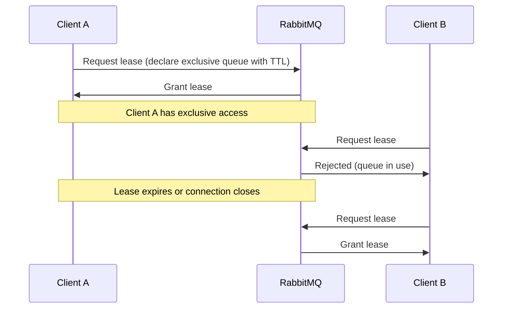

# RabbitMQ Queue Leases

## Introduction

Queue leases are a powerful concept in RabbitMQ that help manage temporary ownership of queues in distributed systems. Think of a queue lease as a rental agreement - it gives an application exclusive rights to a queue for a specific period of time. When working with distributed applications that need to coordinate access to shared resources, queue leases provide a controlled way to manage which component can interact with a queue at any given time.

In this guide, we'll explore how queue leases work in RabbitMQ, how to implement them in your applications, and best practices for managing queue ownership in distributed environments.

## What Are Queue Leases?

A queue lease is a temporary claim on a queue that grants an application or service exclusive rights to perform operations on that queue. When a client holds a lease on a queue, it effectively "owns" that queue until the lease expires or is explicitly released.

Queue leases are particularly valuable in scenarios where:

- Multiple components need to coordinate access to shared queues
- You need to ensure only one service is processing a particular queue at a time
- Your system requires fault tolerance and graceful handover when services go down

## How Queue Leases Work in RabbitMQ

RabbitMQ doesn't have a built-in "lease" primitive, but leases can be implemented using a combination of:

1. **Exclusive queues**: RabbitMQ allows queues to be declared as exclusive to a connection
2. **Queue TTL (Time-To-Live)**: Setting expiration times on queues
3. **Dead letter exchanges**: Redirecting messages when queues expire
4. **Custom metadata**: Using queue arguments to track lease information

Let's break down how these components work together to create a lease system.



## Implementing Queue Leases

Let's implement a basic queue leasing system in RabbitMQ using Java and the RabbitMQ Java client library.

### Basic Queue Lease Implementation

Here's how to create a queue with a lease:

```java
import com.rabbitmq.client.*;

import java.io.IOException;
import java.util.HashMap;
import java.util.Map;
import java.util.concurrent.TimeoutException;

public class QueueLeaseExample {

    public static void main(String[] args) throws IOException, TimeoutException {
        // Create connection
        ConnectionFactory factory = new ConnectionFactory();
        factory.setHost("localhost");
        Connection connection = factory.newConnection();
        Channel channel = connection.createChannel();

        // Set queue properties for lease
        Map<String, Object> arguments = new HashMap<>();
        arguments.put("x-expires", 30000); // Lease expires after 30 seconds
        arguments.put("x-message-ttl", 30000); // Messages expire after 30 seconds
        arguments.put("x-dead-letter-exchange", "expired_leases"); // Where to send messages when lease expires

        // Declare the queue with lease properties
        String queueName = "leased_queue";
        boolean durable = false;
        boolean exclusive = true; // Make it exclusive to this connection
        boolean autoDelete = false;
        
        try {
            channel.queueDeclare(queueName, durable, exclusive, autoDelete, arguments);
            System.out.println("Successfully acquired lease on queue: " + queueName);
            
            // Do work with the leased queue
            // ...
            
            // Keep the lease active
            while (true) {
                Thread.sleep(10000);
                System.out.println("Lease still active...");
                // Optionally, you can extend the lease here
            }
        } catch (Exception e) {
            System.out.println("Failed to acquire lease: " + e.getMessage());
        } finally {
            // Release the lease by closing the connection
            channel.close();
            connection.close();
        }
    }
}
```

### Expected Output

When you run this code, you'll see output similar to:

```
Successfully acquired lease on queue: leased_queue
Lease still active...
Lease still active...
```

If you run a second instance of this program while the first is still running, it will fail with:
```
Failed to acquire lease: com.rabbitmq.client.ShutdownSignalException: channel error; protocol method: #method<channel.close>(reply-code=405, reply-text=RESOURCE_LOCKED - cannot obtain exclusive access to locked queue 'leased_queue', class-id=50, method-id=10)
```

## Monitoring and Renewing Leases

To maintain ownership of a queue, the client holding the lease must either:

1. Keep its connection open (since exclusive queues are tied to a connection)
2. Regularly renew the lease before it expires

Here's how to implement a lease renewal mechanism:

```java
public class LeaseRenewal {

    private final Channel channel;
    private final String queueName;
    private final int leaseDuration; // in milliseconds
    private volatile boolean running = true;
    
    public LeaseRenewal(Channel channel, String queueName, int leaseDuration) {
        this.channel = channel;
        this.queueName = queueName;
        this.leaseDuration = leaseDuration;
    }
    
    public void startRenewalProcess() {
        Thread renewalThread = new Thread(() -> {
            try {
                while (running) {
                    // Sleep for 1/2 of the lease duration
                    Thread.sleep(leaseDuration / 2);
                    
                    if (running) {
                        // Check that we still have the queue
                        try {
                            // We can't modify TTL of an existing queue,
                            // so we check if it exists and is accessible to us
                            channel.queueDeclarePassive(queueName);
                            System.out.println("Lease on " + queueName + " still valid");
                        } catch (IOException e) {
                            System.out.println("Lost lease on " + queueName);
                            running = false;
                        }
                    }
                }
            } catch (InterruptedException e) {
                Thread.currentThread().interrupt();
            }
        });
        
        renewalThread.setDaemon(true);
        renewalThread.start();
    }
    
    public void stopRenewal() {
        running = false;
    }
}
```

## Real-World Application: Distributed Task Processor

Let's look at a practical example of how queue leases can be used in a real-world application.

Imagine you have a system with multiple worker nodes that need to process tasks from various queues. You want to ensure that each queue is processed by exactly one worker at a time, but if a worker fails, another should take over.

Here's how you might implement this:

```java
public class TaskProcessorNode {
    private final String nodeId;
    private final Connection connection;
    private final Channel channel;
    private final Map<String, LeaseRenewal> activeLeases = new HashMap<>();
    
    public TaskProcessorNode(String nodeId) throws IOException, TimeoutException {
        this.nodeId = nodeId;
        
        ConnectionFactory factory = new ConnectionFactory();
        factory.setHost("localhost");
        // Set automatic recovery for fault tolerance
        factory.setAutomaticRecoveryEnabled(true);
        
        this.connection = factory.newConnection();
        this.channel = connection.createChannel();
        
        // Set up handler for when we lose connection
        connection.addShutdownListener(cause -> {
            if (!cause.isInitiatedByApplication()) {
                System.out.println("Connection lost, leases will be released: " + cause.getReason());
            }
        });
    }
    
    public boolean acquireQueueLease(String queueName, int leaseDuration) {
        try {
            Map<String, Object> args = new HashMap<>();
            args.put("x-expires", leaseDuration);
            args.put("x-message-ttl", leaseDuration);
            
            // Add metadata about who owns this lease
            args.put("x-lease-owner", nodeId);
            args.put("x-lease-acquired", System.currentTimeMillis());
            
            channel.queueDeclare(queueName, true, true, false, args);
            
            // Start lease renewal process
            LeaseRenewal renewal = new LeaseRenewal(channel, queueName, leaseDuration);
            renewal.startRenewalProcess();
            activeLeases.put(queueName, renewal);
            
            System.out.println("Node " + nodeId + " acquired lease on " + queueName);
            
            // Start processing the queue
            channel.basicConsume(queueName, false, (consumerTag, delivery) -> {
                // Process the message
                String message = new String(delivery.getBody(), "UTF-8");
                System.out.println("Processing message: " + message);
                
                // Acknowledge processing
                channel.basicAck(delivery.getEnvelope().getDeliveryTag(), false);
            }, consumerTag -> {
                System.out.println("Consumer cancelled: " + consumerTag);
                releaseQueueLease(queueName);
            });
            
            return true;
        } catch (Exception e) {
            System.out.println("Failed to acquire lease on " + queueName + ": " + e.getMessage());
            return false;
        }
    }
    
    public void releaseQueueLease(String queueName) {
        LeaseRenewal renewal = activeLeases.remove(queueName);
        if (renewal != null) {
            renewal.stopRenewal();
            try {
                // Note: The queue will be auto-deleted when we close the channel
                // if we used the exclusive flag
                System.out.println("Released lease on " + queueName);
            } catch (Exception e) {
                System.out.println("Error releasing lease: " + e.getMessage());
            }
        }
    }
    
    public void shutdown() {
        // Release all leases
        for (String queueName : new ArrayList<>(activeLeases.keySet())) {
            releaseQueueLease(queueName);
        }
        
        try {
            channel.close();
            connection.close();
        } catch (Exception e) {
            System.out.println("Error during shutdown: " + e.getMessage());
        }
    }
}
```

## Best Practices for Queue Leases

When working with queue leases in RabbitMQ, consider these best practices:

1. **Choose appropriate lease durations**:
   - Too short: Excessive renewal overhead
   - Too long: Delayed failover when a service crashes

2. **Implement proper error handling**:
   - Handle connection losses gracefully
   - Be prepared for lease acquisition failures

3. **Add lease metadata**:
   - Store information about who holds the lease
   - Track when the lease was acquired

4. **Monitor lease activity**:
   - Log lease acquisitions, renewals, and releases
   - Set up alerting for unexpected lease losses

5. **Implement a lease takeover protocol**:
   - Define how a new service takes over when a lease expires
   - Ensure clean handovers without duplicate processing

## Diagnosing Queue Lease Issues

If you encounter problems with your queue leasing system, here are some common issues and solutions:

### Problem: Leases expire too quickly

**Symptoms**: Services frequently lose their leases even though they're still running.

**Solutions**:
- Increase the lease duration
- Ensure renewal happens well before expiration
- Check for network issues that might delay renewals

### Problem: Failed services don't release leases

**Symptoms**: When a service crashes, its queues remain locked for too long.

**Solutions**:
- Ensure you're using a reasonable TTL value
- Consider using a heartbeat system
- Implement a lease manager service that can forcefully release stale leases

## Summary

Queue leases provide a powerful mechanism for managing exclusive access to RabbitMQ queues in distributed systems. By combining exclusive queues, TTLs, and custom metadata, you can create a robust system for coordinating queue ownership across multiple services.

The key concepts we covered include:

- How queue leases work in RabbitMQ
- Implementing basic queue leasing
- Monitoring and renewing leases
- Real-world applications of queue leases
- Best practices for lease management

With these techniques, you can build more resilient distributed systems that gracefully handle service failures and coordinate work across multiple components.

## Additional Resources

To deepen your understanding of RabbitMQ queue management:

- Explore the [RabbitMQ official documentation](https://www.rabbitmq.com/documentation.html)
- Practice implementing queue leases with different lease durations
- Experiment with different queue configurations and arguments
- Try building a distributed system that uses queue leases for coordination

## Exercise: Implementing a Fault-Tolerant Worker Pool

Try creating a system with multiple worker nodes that coordinate using queue leases:

1. Create a central task queue that publishes work items
2. Implement multiple worker nodes that use leases to claim chunks of work
3. Test what happens when workers gracefully shutdown
4. Simulate crashes and observe how the system recovers
5. Measure the time it takes for a new worker to take over when one fails