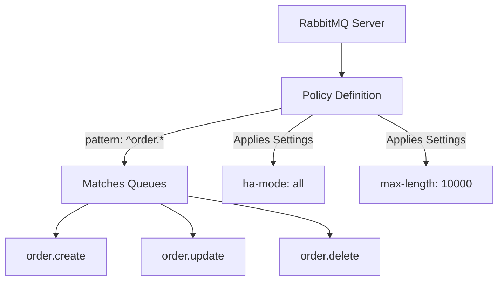

# RabbitMQ Queue Policies

## Introduction

Queue policies in RabbitMQ are a powerful way to configure and manage queue properties without directly modifying the queues themselves. Instead of setting properties when declaring a queue, policies allow you to apply configuration to queues that match certain criteria. This approach makes queue management more flexible and centralized, especially in environments with many queues.

In this tutorial, you'll learn:
- What queue policies are and why they're useful
- How to create and manage policies
- Common policy settings and their impacts
- Best practices for implementing queue policies

## What Are Queue Policies?

Queue policies are rules that automatically apply specific settings to queues that match a pattern. They provide a way to:

- Configure queue properties after queue creation
- Apply the same settings to multiple queues at once
- Modify queue behavior without requiring application code changes
- Centrally manage queue configurations



## Creating Queue Policies

Policies can be created using the management UI, the rabbitmqctl command-line tool, or the HTTP API.

### Using the Management UI

1. Log in to the RabbitMQ Management Interface
2. Navigate to "Admin" > "Policies"
3. Click "Add / update a policy"
4. Fill in the following fields:
   - Name: A descriptive name for the policy
   - Pattern: A regular expression to match queue names
   - Apply to: Choose "Queues" (can also be "Exchanges" or "All")
   - Priority: Numerical priority (higher numbers win when multiple policies match)
   - Definition: Key-value pairs defining the settings to apply

### Using rabbitmqctl

```bash
rabbitmqctl set_policy [--vhost <vhost>] [--priority <priority>] [--apply-to <exchanges|queues|all>] <name> <pattern> <definition>
```

Example:

```bash
rabbitmqctl set_policy --vhost / --priority 10 --apply-to queues high-throughput "^high-.*" \
'{"max-length":100000, "max-length-bytes":1073741824}'
```

### Using the HTTP API

```bash
curl -u guest:guest -X PUT http://localhost:15672/api/policies/%2F/high-throughput \
  -H "Content-Type: application/json" \
  -d '{
    "pattern": "^high-.*",
    "definition": {
      "max-length": 100000,
      "max-length-bytes": 1073741824
    },
    "priority": 10,
    "apply-to": "queues"
  }'
```

## Common Policy Settings

Here are some of the most commonly used policy settings:

### Message TTL (`message-ttl`)

Sets the time-to-live for messages in the queue, after which they will be automatically deleted.

```javascript
{"message-ttl": 60000}  // Messages expire after 60 seconds
```

### Queue TTL (`expires`)

Sets how long a queue can be unused before it is automatically deleted.

```javascript
{"expires": 1800000}  // Queue expires after 30 minutes of no activity
```

### Queue Length Limits

Controls maximum queue size by number of messages or total byte size.

```javascript
{
  "max-length": 10000,         // Maximum 10,000 messages
  "max-length-bytes": 1048576, // Maximum 1MB total size
  "overflow": "reject-publish" // Reject new messages when limit reached
}
```

### High Availability (Mirroring)

Configures queue mirroring across RabbitMQ nodes for high availability.

```javascript
{
  "ha-mode": "all",           // Mirror to all nodes in the cluster
  "ha-sync-mode": "automatic" // Automatically synchronize new mirrors
}
```

### Lazy Queues

Configures whether messages should be kept in memory or moved to disk as soon as possible.

```javascript
{"queue-mode": "lazy"}  // Optimizes for larger queues by moving messages to disk
```

## Practical Examples

Let's look at some common real-world use cases for queue policies.

### Example 1: Temporary Processing Queues

For queues that handle temporary processing tasks, you might want to ensure they clean up automatically:

```bash
rabbitmqctl set_policy temp-queues "^temp-" \
'{"expires": 3600000, "message-ttl": 1800000}' \
--priority 1 --apply-to queues
```

This policy:
- Matches all queues starting with "temp-"
- Sets messages to expire after 30 minutes
- Deletes the entire queue after 1 hour of inactivity

### Example 2: High-Priority Order Processing

For critical order processing queues that need guaranteed delivery:

```bash
rabbitmqctl set_policy order-processing "^order\." \
'{"ha-mode": "all", "ha-sync-mode": "automatic", "queue-mode": "lazy", "overflow": "reject-publish"}' \
--priority 10 --apply-to queues
```

This policy:
- Applies to all queues starting with "order."
- Mirrors the queues across all nodes for high availability
- Optimizes for durability with lazy mode
- Rejects new messages when queue limits are reached

### Example 3: Implementing Dead Letter Queues

```bash
rabbitmqctl set_policy dlx-policy "^(?!dead-letter).*" \
'{"dead-letter-exchange": "dlx", "dead-letter-routing-key": "dead-letter"}' \
--priority 5 --apply-to queues
```

This policy:
- Applies to all queues except those starting with "dead-letter"
- Sends expired or rejected messages to the "dlx" exchange with routing key "dead-letter"

## Creating a Complete Queue Management System

Let's build a simple Node.js application that demonstrates how to work with queue policies:

First, let's create a function to set up our queues and policies:

```javascript
const amqp = require('amqplib');
const axios = require('axios');

async function setupQueueSystem() {
  // Connect to RabbitMQ
  const connection = await amqp.connect('amqp://localhost');
  const channel = await connection.createChannel();
  
  // Create our queues
  await channel.assertQueue('orders.priority', { durable: true });
  await channel.assertQueue('orders.regular', { durable: true });
  await channel.assertQueue('orders.bulk', { durable: true });
  await channel.assertQueue('dead-letter-queue', { durable: true });
  
  // Create dead letter exchange
  await channel.assertExchange('dlx', 'fanout', { durable: true });
  await channel.bindQueue('dead-letter-queue', 'dlx', '');
  
  // Set policies using the HTTP API
  const apiUrl = 'http://localhost:15672/api/policies/%2F/';
  const auth = { username: 'guest', password: 'guest' };
  
  // High priority order policy
  await axios.put(apiUrl + 'priority-orders', {
    pattern: "^orders.priority$",
    definition: {
      "max-length": 1000,
      "message-ttl": 3600000, // 1 hour
      "ha-mode": "all"
    },
    priority: 10,
    "apply-to": "queues"
  }, { auth });
  
  // Regular order policy
  await axios.put(apiUrl + 'regular-orders', {
    pattern: "^orders.regular$",
    definition: {
      "max-length": 10000,
      "message-ttl": 86400000, // 24 hours
      "dead-letter-exchange": "dlx",
      "queue-mode": "lazy"
    },
    priority: 5,
    "apply-to": "queues"
  }, { auth });
  
  // Bulk order policy
  await axios.put(apiUrl + 'bulk-orders', {
    pattern: "^orders.bulk$",
    definition: {
      "max-length": 100000,
      "message-ttl": 259200000, // 3 days
      "dead-letter-exchange": "dlx",
      "queue-mode": "lazy"
    },
    priority: 5,
    "apply-to": "queues"
  }, { auth });
  
  console.log('Queue system setup complete!');
  await channel.close();
  await connection.close();
}

setupQueueSystem().catch(console.error);
```

Now let's create a simple message producer to demonstrate how the policies affect message handling:

```javascript
const amqp = require('amqplib');

async function sendMessages() {
  const connection = await amqp.connect('amqp://localhost');
  const channel = await connection.createChannel();
  
  // Send messages to each queue
  for (let i = 0; i < 10; i++) {
    const priority = {
      orderId: `p-${i}`,
      customer: 'VIP Customer',
      timestamp: new Date().toISOString()
    };
    
    const regular = {
      orderId: `r-${i}`,
      customer: 'Regular Customer',
      timestamp: new Date().toISOString()
    };
    
    const bulk = {
      orderId: `b-${i}`,
      customer: 'Wholesale Customer',
      items: Array(100).fill('Bulk Item'),
      timestamp: new Date().toISOString()
    };
    
    channel.sendToQueue('orders.priority', Buffer.from(JSON.stringify(priority)));
    channel.sendToQueue('orders.regular', Buffer.from(JSON.stringify(regular)));
    channel.sendToQueue('orders.bulk', Buffer.from(JSON.stringify(bulk)));
  }
  
  console.log('Messages sent to all queues');
  await channel.close();
  await connection.close();
}

sendMessages().catch(console.error);
```

Finally, let's create a consumer to process messages from each queue:

```javascript
const amqp = require('amqplib');

async function consumeMessages() {
  const connection = await amqp.connect('amqp://localhost');
  const channel = await connection.createChannel();
  
  // Process priority orders immediately
  channel.consume('orders.priority', (msg) => {
    if (msg) {
      const order = JSON.parse(msg.content.toString());
      console.log(`PRIORITY: Processing order ${order.orderId} for ${order.customer}`);
      channel.ack(msg);
    }
  });
  
  // Process regular orders with a slight delay
  channel.consume('orders.regular', (msg) => {
    if (msg) {
      const order = JSON.parse(msg.content.toString());
      console.log(`REGULAR: Processing order ${order.orderId} for ${order.customer}`);
      // Simulate some processing time
      setTimeout(() => {
        channel.ack(msg);
      }, 500);
    }
  });
  
  // Process bulk orders with a longer delay
  channel.consume('orders.bulk', (msg) => {
    if (msg) {
      const order = JSON.parse(msg.content.toString());
      console.log(`BULK: Processing order ${order.orderId} for ${order.customer}`);
      // Simulate longer processing time for bulk orders
      setTimeout(() => {
        channel.ack(msg);
      }, 1000);
    }
  });
  
  // Also consume from dead letter queue
  channel.consume('dead-letter-queue', (msg) => {
    if (msg) {
      console.log('DEAD LETTER: Received failed message');
      console.log(msg.content.toString());
      channel.ack(msg);
    }
  });
  
  console.log('Consumer started');
}

consumeMessages().catch(console.error);
```

This example demonstrates how different types of orders can be processed with different priorities and settings, all controlled through queue policies.

## Best Practices for Queue Policies

1. **Use Descriptive Policy Names**: Choose names that make it clear what the policy does.

2. **Be Careful with Regular Expressions**: Make your patterns specific enough to only match the intended queues.

3. **Set Appropriate Priorities**: When multiple policies could match a queue, ensure the priority values make sense.

4. **Monitor the Effects**: After applying policies, monitor queue metrics to ensure they're having the desired effect.

5. **Document Your Policies**: Keep documentation of what policies are in place and why.

6. **Use Policies for Cross-Cutting Concerns**: Use policies for settings that apply to multiple queues, but set queue-specific settings during queue declaration.

7. **Test Before Production**: Always test policy changes in a staging environment before applying to production.

## Checking and Managing Existing Policies

To list all existing policies:

```bash
rabbitmqctl list_policies
```

To remove a policy:

```bash
rabbitmqctl clear_policy [--vhost <vhost>] <name>
```

Example:
```bash
rabbitmqctl clear_policy high-throughput
```

## Summary

RabbitMQ queue policies provide a powerful and flexible way to manage queue behavior without modifying application code. By using policies, you can:

- Apply consistent settings across multiple queues
- Implement high availability and durability requirements
- Set intelligent limits on resource usage
- Control message lifecycle
- Implement dead letter queues for failed messages

Queue policies are particularly valuable in complex environments where many queues need similar configurations, or where queue settings need to be adjusted without deploying application changes.

## Additional Resources

To continue your learning about RabbitMQ queue policies:

- Read the [official RabbitMQ documentation on policies](https://www.rabbitmq.com/parameters.html#policies)
- Try implementing different policy types in a test environment
- Practice creating policies through different interfaces (UI, CLI, HTTP API)

## Exercises

1. Create a policy that applies message TTL of 1 hour to all queues that start with "temp_".

2. Implement a policy that ensures all queues with "critical" in their name are mirrored across at least 2 nodes in a cluster.

3. Set up a dead letter exchange policy that routes expired messages from all queues to a monitoring queue.

4. Create a policy that limits the maximum size of log queues to 10MB.

5. Implement a queue policy system that classifies queues by priority level and assigns appropriate resources to each.