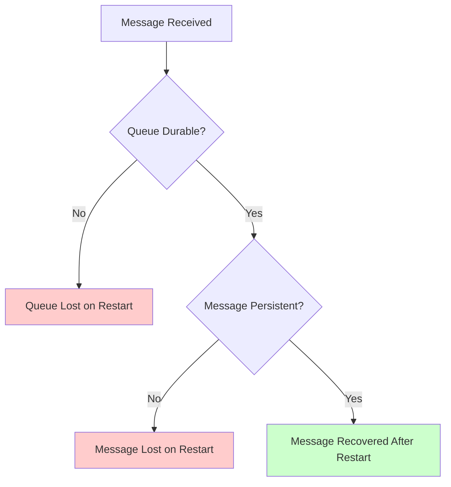

# RabbitMQ Queue Durability

## Introduction

In message broker systems like RabbitMQ, durability is a critical concept that determines whether your queues and messages survive if the broker restarts or crashes. Without proper durability settings, you might lose important messages during system failures, leading to data loss and inconsistent application states.

In this guide, we'll explore how queue durability works in RabbitMQ, how to implement it correctly, and why it matters for production applications.

## Understanding Queue Durability

In RabbitMQ, durability is defined at two levels:

1. **Queue durability** - Whether the queue definition survives a broker restart
2. **Message persistence** - Whether individual messages survive a broker restart

Let's first understand what happens when a broker restarts:

- **Non-durable queues**: Will be deleted during restart
- **Durable queues**: Will be recreated during restart
- **Non-persistent messages**: Will be lost even in durable queues
- **Persistent messages**: Will be recovered if they were in a durable queue

This distinction is crucial - durability is not a single setting but a combination of queue configuration and message properties.

## Creating Durable Queues

To create a durable queue in RabbitMQ, you need to set the `durable` parameter to `true` when declaring your queue.

### Node.js Example

```javascript
// Using amqplib for Node.js
const amqp = require('amqplib');

async function createDurableQueue() {
  try {
    const connection = await amqp.connect('amqp://localhost');
    const channel = await connection.createChannel();
    
    // The second parameter sets durability to true
    await channel.assertQueue('my_durable_queue', { durable: true });
    
    console.log('Durable queue created successfully');
    await channel.close();
    await connection.close();
  } catch (error) {
    console.error('Error:', error);
  }
}

createDurableQueue();
```

### Python Example

```python
# Using pika for Python
import pika

connection = pika.BlockingConnection(pika.ConnectionParameters('localhost'))
channel = connection.channel()

# The second parameter sets durability
channel.queue_declare(queue='my_durable_queue', durable=True)

print("Durable queue created successfully")
connection.close()
```

## Making Messages Persistent

Creating a durable queue isn't enough - you also need to mark your messages as persistent to ensure they survive a broker restart.

### Node.js Example

```javascript
// Using amqplib for Node.js
const amqp = require('amqplib');

async function sendPersistentMessage() {
  try {
    const connection = await amqp.connect('amqp://localhost');
    const channel = await connection.createChannel();
    
    const queue = 'my_durable_queue';
    await channel.assertQueue(queue, { durable: true });
    
    const message = 'This message will survive a restart';
    
    // The persistent property is set in the options
    channel.sendToQueue(queue, Buffer.from(message), {
      persistent: true
    });
    
    console.log("Sent persistent message:", message);
    
    setTimeout(() => {
      connection.close();
      process.exit(0);
    }, 500);
  } catch (error) {
    console.error('Error:', error);
  }
}

sendPersistentMessage();
```

### Python Example

```python
# Using pika for Python
import pika

connection = pika.BlockingConnection(pika.ConnectionParameters('localhost'))
channel = connection.channel()

queue = 'my_durable_queue'
channel.queue_declare(queue=queue, durable=True)

message = 'This message will survive a restart'

# DeliveryMode = 2 marks the message as persistent
channel.basic_publish(
    exchange='',
    routing_key=queue,
    body=message,
    properties=pika.BasicProperties(
        delivery_mode=2,  # makes message persistent
    )
)

print("Sent persistent message:", message)
connection.close()
```

## Queue Durability vs Message Persistence Flow

This diagram illustrates the relationship between queue durability and message persistence:



## When to Use Durable Queues

You should use durable queues and persistent messages when:

1. You cannot afford to lose messages during a broker restart
2. You're handling financial transactions or other critical data
3. Your system requires guaranteed message delivery

However, durability comes with a performance cost:

- Persistent messages require disk writes
- Durable queues require more resources to maintain
- Recovery after a restart takes longer

## Real-World Example: Order Processing System

Let's consider a real-world scenario of an e-commerce order processing system:

```javascript
// Using amqplib for Node.js
const amqp = require('amqplib');

async function setupOrderProcessing() {
  try {
    const connection = await amqp.connect('amqp://localhost');
    const channel = await connection.createChannel();
    
    // Create a durable queue for orders
    const orderQueue = 'order_processing';
    await channel.assertQueue(orderQueue, { durable: true });
    
    // Set prefetch to 1 to ensure one worker processes one message at a time
    channel.prefetch(1);
    
    console.log('Waiting for orders...');
    
    // Consume messages from the queue
    channel.consume(orderQueue, (msg) => {
      const order = JSON.parse(msg.content.toString());
      console.log(`Processing order ${order.id} for ${order.customer}`);
      
      // Simulate processing time
      setTimeout(() => {
        console.log(`Order ${order.id} processed successfully`);
        // Acknowledge the message only after processing is complete
        channel.ack(msg);
      }, 3000);
    });
  } catch (error) {
    console.error('Error:', error);
  }
}

// Publish a sample order
async function placeOrder() {
  try {
    const connection = await amqp.connect('amqp://localhost');
    const channel = await connection.createChannel();
    
    const orderQueue = 'order_processing';
    await channel.assertQueue(orderQueue, { durable: true });
    
    const order = {
      id: Math.floor(Math.random() * 1000),
      customer: 'John Doe',
      items: ['Product A', 'Product B'],
      total: 85.99
    };
    
    // Send the order as a persistent message
    channel.sendToQueue(
      orderQueue, 
      Buffer.from(JSON.stringify(order)), 
      { persistent: true }
    );
    
    console.log(`Order ${order.id} placed for ${order.customer}`);
    setTimeout(() => connection.close(), 500);
  } catch (error) {
    console.error('Error:', error);
  }
}

// Run the consumer
setupOrderProcessing();

// Run the publisher after a delay
setTimeout(placeOrder, 1000);
```

In this example:
- Orders are critical data that should not be lost
- We use a durable queue (`order_processing`)
- Each order message is marked as persistent
- Messages are only acknowledged after processing completes

If the RabbitMQ server crashes while processing orders, the unacknowledged messages will be requeued when the server restarts, ensuring no orders are lost.

## Performance Considerations

While durability provides data safety, it does impact performance. Here are some considerations:

1. **Disk I/O**: Persistent messages require disk writes, which are slower than memory operations
2. **Throughput**: You'll achieve lower message throughput with persistent messages
3. **Latency**: Message publishing takes longer due to disk operations

For high-throughput scenarios where some message loss is acceptable (like metric collection), you might choose non-durable queues with non-persistent messages.

For critical data where message loss is unacceptable (like financial transactions), always use durable queues with persistent messages despite the performance impact.

## Combining with Publisher Confirms

For even greater reliability, combine queue durability with publisher confirms:

```javascript
// Using amqplib for Node.js
const amqp = require('amqplib');

async function reliableSend() {
  try {
    const connection = await amqp.connect('amqp://localhost');
    const channel = await connection.createChannel();
    
    // Enable publisher confirms
    await channel.confirmChannel();
    
    const queue = 'critical_data';
    await channel.assertQueue(queue, { durable: true });
    
    const message = 'Critical data that must not be lost';
    
    // Send persistent message
    channel.sendToQueue(queue, Buffer.from(message), { persistent: true });
    
    // Wait for confirmation
    await channel.waitForConfirms();
    console.log('Message was confirmed by the broker');
    
    connection.close();
  } catch (error) {
    console.error('Error or message was rejected:', error);
  }
}

reliableSend();
```

## Checking Queue Durability Status

You can verify if a queue is durable using the RabbitMQ Management UI or via the API:

```javascript
// Using amqplib for Node.js
const amqp = require('amqplib');

async function checkQueueStatus(queueName) {
  try {
    const connection = await amqp.connect('amqp://localhost');
    const channel = await connection.createChannel();
    
    // This will return information about the queue
    const queueInfo = await channel.checkQueue(queueName);
    
    console.log(`Queue: ${queueName}`);
    console.log(`Durable: ${queueInfo.durable}`);
    console.log(`Messages: ${queueInfo.messageCount}`);
    console.log(`Consumers: ${queueInfo.consumerCount}`);
    
    connection.close();
  } catch (error) {
    console.error('Error or queue does not exist:', error);
  }
}

checkQueueStatus('my_durable_queue');
```

## Summary

Queue durability in RabbitMQ is essential for ensuring that your messaging system can recover from crashes and restarts without data loss. Remember these key points:

1. Queue durability and message persistence are separate settings
2. To ensure messages survive a broker restart:
   - Create queues with `durable: true`
   - Publish messages with `persistent: true` or `delivery_mode: 2`
3. Durability comes with a performance cost due to disk I/O
4. Critical systems should always use durable queues with persistent messages
5. Combine with publisher confirms for maximum reliability

By properly configuring durability in your RabbitMQ setup, you can build robust messaging systems that maintain data integrity even in the face of failures.

## Practice Exercises

1. Create a durable queue and send 10 persistent messages to it
2. Restart your RabbitMQ server and verify that the messages are still there
3. Create a simple producer-consumer application that uses durable queues
4. Implement a system that logs when messages are recovered after a restart
5. Compare the performance of durable vs non-durable queues with a simple benchmark

## Additional Resources

- [RabbitMQ Documentation on Durability](https://www.rabbitmq.com/queues.html)
- [RabbitMQ Reliability Guide](https://www.rabbitmq.com/reliability.html)
- [AMQP Protocol Specification](https://www.rabbitmq.com/resources/specs/amqp0-9-1.pdf)