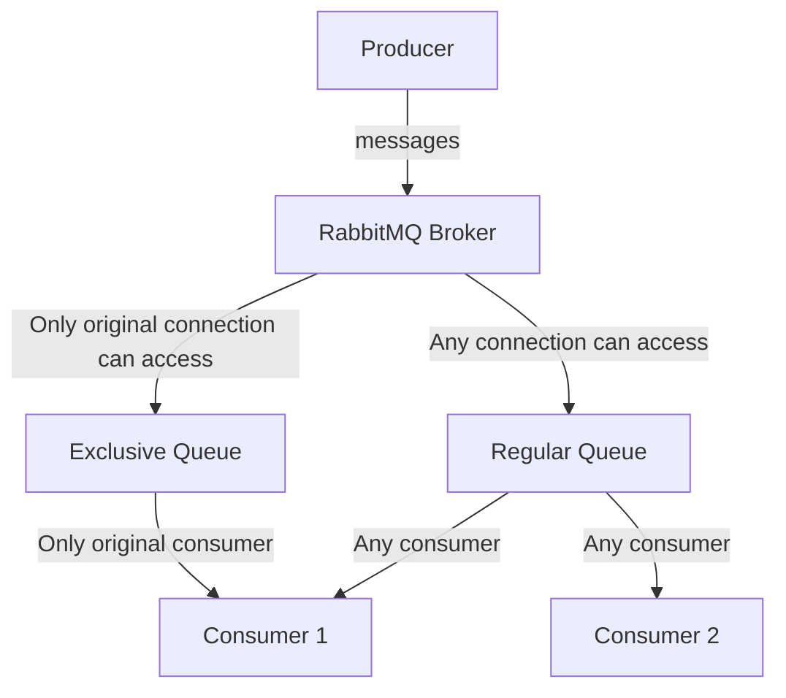

# RabbitMQ Queue Exclusivity

## Introduction

When working with RabbitMQ, you'll often need fine-grained control over how your queues behave. One powerful feature that RabbitMQ offers is **queue exclusivity**. An exclusive queue is a special type of queue that can only be used (consumed from, purged, deleted, etc.) by the connection that created it.

In this guide, we'll explore what exclusive queues are, when to use them, and how they can solve specific messaging challenges in your applications.

## What is Queue Exclusivity?

An exclusive queue in RabbitMQ has the following characteristics:

1. **Single Connection** - Only the connection that created the queue can consume from it
2. **Automatic Deletion** - The queue is automatically deleted when the creating connection closes
3. **Binding Restrictions** - Only the creating connection can create bindings for the queue

Exclusivity is a property set at queue declaration time and cannot be changed later.

## Declaring an Exclusive Queue

You can declare an exclusive queue by setting the `exclusive` parameter to `true` when creating a queue:

```javascript
// JavaScript (using amqplib)
channel.assertQueue('my-exclusive-queue', { 
  exclusive: true 
});
```

```python
# Python (using pika)
channel.queue_declare(
    queue='my-exclusive-queue',
    exclusive=True
)
```

```java
// Java (using RabbitMQ Java client)
channel.queueDeclare(
    "my-exclusive-queue",
    false,  // durable
    true,   // exclusive
    true,   // auto-delete
    null    // arguments
);
```

## How Exclusive Queues Work

Let's visualize how exclusive queues behave compared to regular queues:



When you create an exclusive queue:

1. The RabbitMQ broker associates that queue with the connection ID that created it
2. Any attempts to consume from or modify the queue from other connections will result in a channel-level exception
3. When the original connection closes (either intentionally or due to failure), the queue is automatically deleted

## Use Cases for Exclusive Queues

### 1. Temporary Response Queues

One of the most common uses of exclusive queues is for implementing the Request-Reply pattern (RPC):

```javascript
// JavaScript implementation of an RPC client
async function rpcCall(message) {
  // Create exclusive response queue
  const { queue: replyQueueName } = await channel.assertQueue('', { 
    exclusive: true 
  });
  
  // Generate unique correlation ID
  const correlationId = generateUuid();
  
  // Setup consumer for replies
  const responsePromise = new Promise(resolve => {
    channel.consume(replyQueueName, msg => {
      if (msg.properties.correlationId === correlationId) {
        resolve(msg.content.toString());
      }
    }, { noAck: true });
  });
  
  // Send request
  channel.sendToQueue('rpc_queue', 
    Buffer.from(message), 
    { 
      correlationId: correlationId, 
      replyTo: replyQueueName 
    }
  );
  
  // Wait for response
  return responsePromise;
}
```

Since the reply queue is exclusive, it:
- Won't receive messages meant for other clients
- Will be automatically cleaned up if the client disconnects
- Provides a private channel for responses

### 2. Temporary Work Queues

Exclusive queues are useful for short-lived processing tasks:

```python
# Python example of a temporary work queue
def process_temporary_batch(batch_id, items):
    connection = pika.BlockingConnection(pika.ConnectionParameters('localhost'))
    channel = connection.channel()
    
    # Create an exclusive queue for this batch
    result = channel.queue_declare(
        queue=f'batch-{batch_id}',
        exclusive=True
    )
    queue_name = result.method.queue
    
    # Bind to relevant topics
    channel.queue_bind(
        exchange='batch-processing',
        queue=queue_name,
        routing_key=f'batch.{batch_id}'
    )
    
    # Process all items
    for item in items:
        channel.basic_publish(
            exchange='batch-processing',
            routing_key=f'batch.{batch_id}',
            body=json.dumps(item)
        )
    
    # Wait for processing to complete
    # ... processing logic here ...
    
    # Close connection - queue will be automatically deleted
    connection.close()
```

### 3. Application Instance-Specific Queues

When you need a queue that belongs to a specific application instance:

```java
// Java example of instance-specific queue
public class WorkerInstance {
    private final String instanceId = UUID.randomUUID().toString();
    
    public void initialize() {
        ConnectionFactory factory = new ConnectionFactory();
        factory.setHost("localhost");
        Connection connection = factory.newConnection();
        Channel channel = connection.createChannel();
        
        // Create queue specific to this worker instance
        String queueName = "worker-" + instanceId;
        channel.queueDeclare(queueName, false, true, true, null);
        channel.queueBind(queueName, "work-exchange", "tasks.*");
        
        // Set up consumer
        channel.basicConsume(queueName, false, new DefaultConsumer(channel) {
            @Override
            public void handleDelivery(String consumerTag, Envelope envelope,
                                       AMQP.BasicProperties properties, byte[] body) throws IOException {
                // Handle message
                // ...
                
                channel.basicAck(envelope.getDeliveryTag(), false);
            }
        });
    }
}
```

## Common Patterns and Best Practices

### Naming Conventions

For exclusive queues:

1. **Empty name** (`""`) - Let the server generate a unique name:
   ```python
   result = channel.queue_declare(queue='', exclusive=True)
   queue_name = result.method.queue
   print(f"Generated queue name: {queue_name}")
   # Output: Generated queue name: amq.gen-JzTY20BRgKO-HjmUJj0wLg
   ```

2. **Descriptive prefixes** - Add meaning to auto-generated names:
   ```javascript
   const { queue } = await channel.assertQueue(
     'response-' + process.pid, 
     { exclusive: true }
   );
   ```

### Error Handling

Be prepared to handle these common errors:

1. **ACCESS_REFUSED** - Attempting to use an exclusive queue from another connection:

   ```python
   try:
       # This will fail if the queue exists and was created by another connection
       channel.queue_declare(queue='existing-exclusive-queue', exclusive=True)
   except pika.exceptions.ChannelClosedByBroker as e:
       if e.reply_code == 403:  # ACCESS_REFUSED
           print("Cannot access exclusive queue owned by another connection")
   ```

2. **Queue disappearance** - Handling cases when exclusive queues are deleted:

   ```javascript
   // Set up consumer recovery
   channel.on('error', function(err) {
     if (err.message.includes('exclusive queue')) {
       console.log('Exclusive queue was deleted, recreating...');
       reconnectAndSetupQueue();
     }
   });
   ```

## Limitations and Considerations

When working with exclusive queues, keep these limitations in mind:

1. **Not Suitable for Persistent Workloads** - Since exclusive queues are deleted when the connection closes, they aren't appropriate for tasks that need to survive client restarts.

2. **Network Partitions** - In a clustered environment, network partitions can cause exclusive queues to be recreated if a client reconnects to a different node.

3. **Connection Failures** - If a connection fails abruptly, any messages in the exclusive queue will be lost.

4. **Scalability Constraints** - Each exclusive queue is tied to a single connection, which can limit throughput for high-volume scenarios.

## Exclusive vs Auto-delete Queues

It's important to understand the difference between exclusive and auto-delete properties:

| Property | Exclusive | Auto-delete |
|----------|-----------|-------------|
| Access | Limited to creating connection | Any connection can access |
| Deletion trigger | When creating connection closes | When last consumer unsubscribes |
| Can have multiple consumers | Yes, but only from same connection | Yes, from any connection |

You can combine both properties:

```python
channel.queue_declare(
    queue='temporary-queue',
    exclusive=True,
    auto_delete=True
)
```

## Practical Example: Chat Application

Let's examine how exclusive queues can be used in a simple chat application:

```javascript
// Creating a private message channel for a user session
async function setupUserMessageQueue(userId, sessionId) {
  // Create an exclusive queue for this user session
  const { queue: privateQueueName } = await channel.assertQueue(
    `user.${userId}.session.${sessionId}`, 
    { exclusive: true }
  );
  
  // Bind to user-specific messages
  await channel.bindQueue(
    privateQueueName,
    'chat-exchange',
    `user.${userId}`
  );
  
  // Bind to rooms this user has joined
  const userRooms = await getUserRooms(userId);
  for (const roomId of userRooms) {
    await channel.bindQueue(
      privateQueueName,
      'chat-exchange',
      `room.${roomId}`
    );
  }
  
  // Set up consumer for user messages
  channel.consume(privateQueueName, async (msg) => {
    if (!msg) return;
    
    const messageData = JSON.parse(msg.content.toString());
    
    // Process message
    await displayMessageToUser(userId, messageData);
    
    channel.ack(msg);
  });
  
  return {
    addRoom: async (roomId) => {
      await channel.bindQueue(
        privateQueueName,
        'chat-exchange',
        `room.${roomId}`
      );
    },
    removeRoom: async (roomId) => {
      await channel.unbindQueue(
        privateQueueName,
        'chat-exchange',
        `room.${roomId}`
      );
    }
  };
}
```

This implementation:
1. Creates a user-specific message queue that's exclusive to their connection
2. Automatically cleans up when the user disconnects
3. Prevents other users from consuming messages meant for this user
4. Provides methods to join or leave chat rooms

## Summary

Exclusive queues in RabbitMQ provide a powerful mechanism for creating private, temporary queues that are tied to a specific connection. They excel in scenarios like:

- Implementing the Request-Reply pattern
- Creating temporary processing queues
- Handling client-specific message channels
- Building short-lived communication channels

Remember that exclusive queues are automatically deleted when the creating connection closes, making them unsuitable for persistent workloads. However, their automatic cleanup behavior makes them perfect for ephemeral, client-specific messaging needs.

## Additional Resources

- Experiment with RabbitMQ's official tutorials to deepen your understanding: [RabbitMQ Tutorials](https://www.rabbitmq.com/getstarted.html)
- Explore the AMQP 0-9-1 protocol specification to understand the underlying mechanisms: [AMQP 0-9-1 Reference](https://www.rabbitmq.com/amqp-0-9-1-reference.html)

## Exercises

1. Implement a simple RPC (Remote Procedure Call) system using exclusive queues for replies.
2. Create a chat application where each user gets an exclusive queue for their messages.
3. Build a distributed task processor that uses exclusive queues for worker-specific tasks.
4. Experiment with combining exclusive and auto-delete properties and observe the behavior.