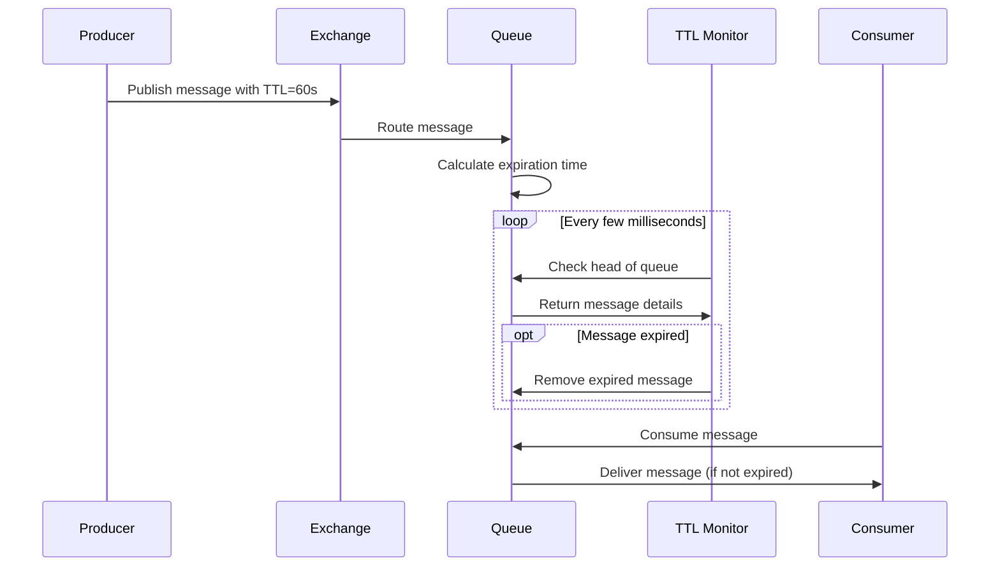

# RabbitMQ Queue TTL

Time-to-Live (TTL) is an essential feature in RabbitMQ that allows you to set expiration times for both messages and queues. This automatic cleanup mechanism helps you manage system resources efficiently and implement time-sensitive messaging patterns.

## Introduction to Queue TTL

In message-oriented applications, not all messages remain relevant forever. Some data becomes stale after a period, while other messages might only be useful within a specific timeframe. RabbitMQ's TTL feature addresses this need by automatically removing expired messages and queues from the system.

There are two main types of TTL in RabbitMQ:

1. **Message TTL**: Defines how long a message can remain in a queue before being discarded
2. **Queue TTL**: Specifies how long an unused queue should exist before being automatically deleted

Let's explore both types in detail.

## Message TTL

Message TTL defines the maximum time a message can remain in a queue before RabbitMQ automatically removes it. You can set Message TTL in two ways:

### 1. Setting TTL for Individual Messages

When publishing a message, you can specify its TTL using the `expiration` property:

```javascript
// JavaScript example using amqplib
channel.publish('exchange_name', 'routing_key', 
  Buffer.from('Hello World!'), 
  { 
    expiration: '60000' // TTL in milliseconds (60 seconds)
  }
);
```

```python
# Python example using pika
properties = pika.BasicProperties(
    expiration='60000'  # TTL in milliseconds (60 seconds)
)
channel.basic_publish(
    exchange='exchange_name',
    routing_key='routing_key',
    body='Hello World!',
    properties=properties
)
```

With this approach, each message can have its own custom expiration time.

### 2. Setting TTL for All Messages in a Queue

Alternatively, you can set a default TTL for all messages entering a specific queue using the `x-message-ttl` argument when declaring the queue:

```javascript
// JavaScript example using amqplib
channel.assertQueue('my_queue', {
  arguments: {
    'x-message-ttl': 60000 // TTL in milliseconds (60 seconds)
  }
});
```

```python
# Python example using pika
channel.queue_declare(
    queue='my_queue',
    arguments={
        'x-message-ttl': 60000  # TTL in milliseconds (60 seconds)
    }
)
```

This method applies the same TTL to all messages entering the queue.

:::note
When both queue-level and message-level TTL are specified, RabbitMQ uses the **lower value** of the two.
:::

## Queue TTL

Queue TTL (also known as Auto-expire) defines how long a queue can remain unused before RabbitMQ automatically deletes it. A queue is considered "unused" when it has:
- No consumers
- No basic.get operations performed on it
- No new messages published to it

You set Queue TTL using the `x-expires` argument when declaring the queue:

```javascript
// JavaScript example using amqplib
channel.assertQueue('temporary_queue', {
  arguments: {
    'x-expires': 1800000 // TTL in milliseconds (30 minutes)
  }
});
```

```python
# Python example using pika
channel.queue_declare(
    queue='temporary_queue',
    arguments={
        'x-expires': 1800000  # TTL in milliseconds (30 minutes)
    }
)
```

Once the specified period of inactivity is reached, RabbitMQ automatically removes the queue.

## How Message TTL Works Under the Hood

When a message with TTL enters a queue, RabbitMQ:

1. Calculates the absolute expiration time (current time + TTL)
2. Stores this timestamp with the message
3. Periodically checks messages at the head of each queue
4. Discards messages whose expiration time has passed

Let's visualize this process:



:::caution
RabbitMQ only checks messages at the **head of the queue** for expiration. If expired messages are behind non-expired ones in the queue, they won't be removed until they reach the front.
:::

## Practical Examples

Let's look at some real-world applications of RabbitMQ Queue TTL.

### Example 1: Time-Sensitive Notifications

Imagine a system that sends time-sensitive notifications to users. After a certain period, these notifications become irrelevant and should be discarded.

```javascript
// Creating a notification queue with message TTL
channel.assertQueue('notifications_queue', {
  arguments: {
    'x-message-ttl': 3600000 // 1 hour in milliseconds
  }
});

// Sending a notification
channel.sendToQueue('notifications_queue', 
  Buffer.from(JSON.stringify({
    userId: '12345',
    message: 'Your food delivery will arrive in 30 minutes!',
    timestamp: new Date().toISOString()
  }))
);
```

In this example, notifications automatically disappear after one hour, preventing consumers from processing outdated information.

### Example 2: Temporary Processing Queue

For batch processing jobs that run periodically, you might want temporary queues that self-delete when inactive:

```javascript
// Creating a temporary processing queue
channel.assertQueue('daily_report_processing', {
  arguments: {
    'x-expires': 7200000 // Queue expires after 2 hours of inactivity
  }
});

// Producer code - Add jobs to the queue
for (const report of reportsToProcess) {
  channel.sendToQueue('daily_report_processing', 
    Buffer.from(JSON.stringify(report))
  );
}

// Consumer code in a separate process
channel.consume('daily_report_processing', (msg) => {
  if (msg) {
    const report = JSON.parse(msg.content.toString());
    processReport(report);
    channel.ack(msg);
  }
});
```

After the daily processing is complete and the queue remains unused for 2 hours, RabbitMQ automatically cleans it up.

### Example 3: Dead Letter Exchange with TTL

TTL is often used with Dead Letter Exchanges (DLX) to implement retry mechanisms:

```javascript
// Step 1: Declare the main queue with TTL and DLX configuration
channel.assertQueue('processing_queue', {
  arguments: {
    'x-message-ttl': 30000, // 30 seconds
    'x-dead-letter-exchange': 'retry_exchange',
    'x-dead-letter-routing-key': 'retry'
  }
});

// Step 2: Declare the retry queue with longer TTL
channel.assertQueue('retry_queue', {
  arguments: {
    'x-message-ttl': 60000, // 60 seconds
    'x-dead-letter-exchange': '',
    'x-dead-letter-routing-key': 'processing_queue'
  }
});

// Step 3: Declare and bind the retry exchange
channel.assertExchange('retry_exchange', 'direct');
channel.bindQueue('retry_queue', 'retry_exchange', 'retry');
```

This pattern creates a message flow where:
1. Messages in the processing queue expire after 30 seconds if not consumed
2. Expired messages move to the retry queue
3. After 60 seconds in the retry queue, messages return to the processing queue
4. This cycle repeats until a consumer successfully processes the message

## Best Practices for Using Queue TTL

When implementing TTL in your RabbitMQ setup, consider these best practices:

1. **Choose Appropriate TTL Values**: 
   - Too short: Messages might expire before consumers can process them
   - Too long: Unnecessary resource consumption

2. **Consider Queue Position**: 
   Remember that messages only expire when they reach the front of the queue. Design your system accordingly.

3. **Combine with Dead Letter Exchanges**: 
   Use DLX to capture expired messages for logging, analysis, or retry mechanisms.

4. **Monitor Expiration Rate**: 
   Track how many messages are expiring to identify potential processing bottlenecks.

5. **Be Cautious with Long-lived Queues**: 
   For persistent queues that must survive broker restarts, use message TTL instead of queue TTL.

## TTL Limitations

Be aware of these limitations when working with RabbitMQ TTL:

1. **Precision**: TTL timing is not guaranteed to be precise to the millisecond.

2. **Performance Impact**: Excessive TTL checking on very busy queues can impact performance.

3. **Queue Position**: As mentioned earlier, messages only expire when they reach the front of the queue.

4. **Modification Restrictions**: You cannot change the TTL of a queue after it has been created. You must delete and recreate the queue with new settings.

## Summary

RabbitMQ Queue TTL is a powerful feature that helps you manage message and queue lifetimes automatically. By implementing appropriate TTL values, you can:

- Prevent the accumulation of stale messages
- Ensure time-sensitive data is handled appropriately
- Manage system resources efficiently
- Implement sophisticated messaging patterns

Whether you're building real-time notification systems, workflow automation, or event-driven architectures, understanding and leveraging RabbitMQ's TTL capabilities will help you create more resilient and resource-efficient applications.

## Additional Resources

To deepen your understanding of RabbitMQ Queue TTL, consider exploring these related topics:

- Dead Letter Exchanges (DLX)
- Message priorities in RabbitMQ
- Queue length limits and memory-based flow control
- Publisher confirms and consumer acknowledgments

## Practice Exercises

1. Create a queue with a message TTL of 5 minutes and observe the behavior when messages expire.

2. Implement a retry mechanism using TTL and Dead Letter Exchanges that attempts to process messages three times before sending them to a "failed" queue.

3. Design a notification system where different types of notifications have different TTL values based on their urgency.

4. Create temporary queues that auto-delete after 24 hours of inactivity, regardless of whether they contain messages.