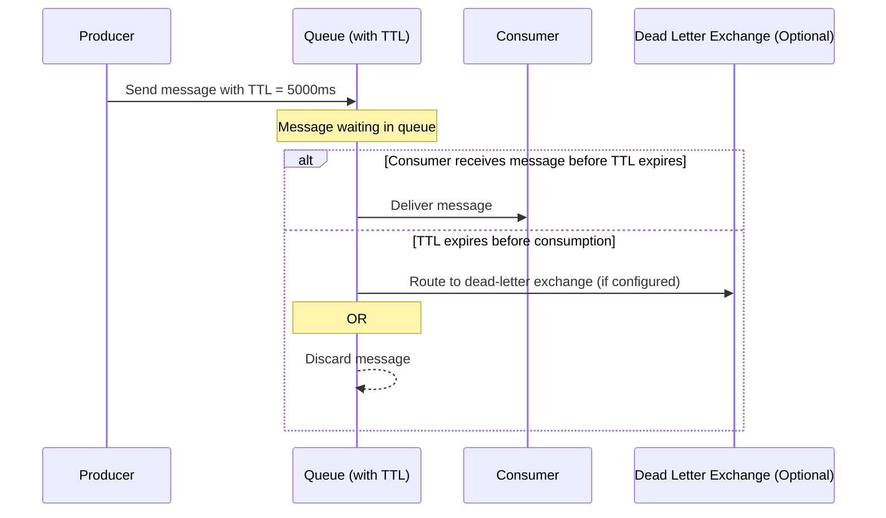

# RabbitMQ Message TTL

## Introduction

Time-To-Live (TTL) in RabbitMQ is a powerful feature that allows you to control how long messages remain in a queue before they expire. When a message reaches its TTL limit, RabbitMQ automatically removes it from the queue, either discarding it or routing it to a dead-letter exchange if configured.

Message TTL helps you:
- Prevent the buildup of stale messages in your queues
- Implement timeout patterns for time-sensitive operations
- Manage resource consumption by automatically purging old messages
- Create expiring offers or notifications in your applications

In this guide, we'll explore how to set message TTL in RabbitMQ, understand its behavior, and implement practical examples.

## Understanding Message TTL

Message TTL is the maximum time a message can remain in a queue waiting to be consumed. You can specify TTL in milliseconds at:

1. **Queue level**: All messages entering a queue receive the same TTL
2. **Message level**: Individual messages receive specific TTL values

When both queue and message-level TTLs are defined, RabbitMQ uses the **lower** value.

### How Message Expiration Works

Let's visualize the message TTL process:



## Setting Message TTL

### Queue-Level TTL

You can set TTL for all messages in a queue when declaring the queue:

```javascript
// JavaScript with amqplib
channel.assertQueue('my_ttl_queue', {
  arguments: {
    'x-message-ttl': 60000 // TTL of 60 seconds in milliseconds
  }
});
```

```python
# Python with pika
channel.queue_declare(
    queue='my_ttl_queue',
    arguments={
        'x-message-ttl': 60000  # TTL of 60 seconds in milliseconds
    }
)
```

```java
// Java with RabbitMQ Java client
Map<String, Object> args = new HashMap<>();
args.put("x-message-ttl", 60000); // TTL of 60 seconds in milliseconds
channel.queueDeclare("my_ttl_queue", true, false, false, args);
```

### Message-Level TTL

To set TTL for individual messages, use the `expiration` property when publishing:

```javascript
// JavaScript with amqplib
channel.publish('my_exchange', 'routing_key', Buffer.from('Hello World!'), {
  expiration: '30000' // TTL of 30 seconds as string in milliseconds
});
```

```python
# Python with pika
properties = pika.BasicProperties(
    expiration='30000'  # TTL of 30 seconds as string in milliseconds
)
channel.basic_publish(
    exchange='my_exchange',
    routing_key='routing_key',
    body='Hello World!',
    properties=properties
)
```

```java
// Java with RabbitMQ Java client
AMQP.BasicProperties properties = new AMQP.BasicProperties.Builder()
    .expiration("30000") // TTL of 30 seconds as string in milliseconds
    .build();
channel.basicPublish("my_exchange", "routing_key", properties, "Hello World!".getBytes());
```

:::note
The message-level `expiration` property must be a **string** representation of the TTL in milliseconds, not a number.
:::

## Combining with Dead-Letter Exchanges

TTL becomes even more powerful when combined with Dead-Letter Exchanges (DLX). Instead of simply discarding expired messages, you can route them to a different exchange:

```javascript
// JavaScript with amqplib
channel.assertQueue('my_ttl_queue', {
  arguments: {
    'x-message-ttl': 60000, // TTL of 60 seconds
    'x-dead-letter-exchange': 'my_dlx', // Dead-letter exchange
    'x-dead-letter-routing-key': 'expired' // Routing key for expired messages
  }
});
```

```python
# Python with pika
channel.queue_declare(
    queue='my_ttl_queue',
    arguments={
        'x-message-ttl': 60000,
        'x-dead-letter-exchange': 'my_dlx',
        'x-dead-letter-routing-key': 'expired'
    }
)
```

## Practical Examples

### Example 1: Implementing a Delayed Message System

One common use case for message TTL is implementing delayed processing. Here's how you can create a simple delay mechanism:

```javascript
// JavaScript with amqplib
// Step 1: Set up the dead-letter exchange and target queue
channel.assertExchange('processing_exchange', 'direct');
channel.assertQueue('processing_queue');
channel.bindQueue('processing_queue', 'processing_exchange', 'process');

// Step 2: Set up the delay queue with TTL and DLX
channel.assertExchange('delay_exchange', 'direct');
channel.assertQueue('delay_queue', {
  arguments: {
    'x-message-ttl': 10000, // 10 second delay
    'x-dead-letter-exchange': 'processing_exchange',
    'x-dead-letter-routing-key': 'process'
  }
});
channel.bindQueue('delay_queue', 'delay_exchange', 'delay');

// Step 3: Send a message to the delay queue
channel.publish('delay_exchange', 'delay', Buffer.from(JSON.stringify({
  orderId: '12345',
  action: 'send_reminder'
})));

console.log("Message scheduled for processing in 10 seconds");

// Step 4: Process the message after the delay
channel.consume('processing_queue', (msg) => {
  if (msg) {
    const content = JSON.parse(msg.content.toString());
    console.log(`Processing delayed action: ${content.action} for order: ${content.orderId}`);
    channel.ack(msg);
  }
});
```

This setup creates a delay mechanism where:
1. Messages are published to the `delay_queue` with a 10-second TTL
2. After 10 seconds, expired messages are automatically moved to the `processing_queue`
3. The consumer processes messages from the `processing_queue`

### Example 2: Time-Sensitive Notifications

Imagine you're building a system that sends time-sensitive notifications (like flash sales) that should expire after a certain period:

```python
# Python with pika
import pika
import json

# Connect to RabbitMQ
connection = pika.BlockingConnection(pika.ConnectionParameters('localhost'))
channel = connection.channel()

# Create a queue for time-sensitive notifications with 1-hour TTL
channel.queue_declare(
    queue='flash_sale_notifications',
    arguments={
        'x-message-ttl': 3600000  # 1 hour in milliseconds
    }
)

# Send a notification about a flash sale
notification = {
    'type': 'flash_sale',
    'title': 'Flash Sale: 50% Off All Items',
    'description': 'For the next hour only, all items are 50% off!',
    'url': '/sales/flash'
}

channel.basic_publish(
    exchange='',
    routing_key='flash_sale_notifications',
    body=json.dumps(notification)
)

print("Flash sale notification sent!")

# In your consumer application:
def process_notification(ch, method, properties, body):
    notification = json.loads(body)
    print(f"Sending notification to user: {notification['title']}")
    ch.basic_ack(delivery_tag=method.delivery_tag)

channel.basic_consume(
    queue='flash_sale_notifications',
    on_message_callback=process_notification
)

print("Waiting for notifications. To exit press CTRL+C")
channel.start_consuming()
```

In this example:
- We create a queue with a 1-hour TTL for flash sale notifications
- Messages automatically expire after an hour, ensuring users don't receive outdated offers
- Consumers process the notifications while they're still valid

## Best Practices and Considerations

### Performance Implications

1. **Queue Scanning**: RabbitMQ scans the queue from the head to find expired messages, which can impact performance for large queues.

2. **Message Pileup**: If consumers are slower than producers and TTL is long, messages can pile up, consuming memory and disk space.

### Usage Guidelines

1. **Choose Appropriate TTL Values**: Set TTL based on the actual time relevance of your messages. Too short might cause premature expiration; too long defeats the purpose.

2. **Monitor Queue Sizes**: Regularly monitor queues with TTL to ensure they don't grow too large.

3. **Queue vs. Message TTL**: Use queue-level TTL for consistent expiry policies and message-level TTL for varying expiration needs.

4. **Dead-Letter Handling**: Always consider what happens to expired messages. For important messages, use a dead-letter exchange with appropriate logging.

### Limitations

1. **No Dynamic Updates**: You cannot change the TTL of a queue after it's created without deleting and recreating it.

2. **No Retroactive Application**: Setting a new message TTL doesn't affect messages already in the queue.

3. **String Format for Message TTL**: Remember that message-level TTL must be a string, not a number.

## Summary

RabbitMQ Message TTL provides a powerful mechanism for controlling the lifespan of messages in your queues. By implementing TTL, you can create more efficient, resource-friendly messaging systems and implement time-sensitive business logic.

Key points to remember:
- TTL can be set at both queue and message levels
- TTL is specified in milliseconds
- Expired messages are either discarded or sent to a dead-letter exchange
- Combining TTL with dead-letter exchanges enables powerful patterns like delayed processing
- Performance considerations should be taken into account for large-scale systems

## Additional Resources

For more information on RabbitMQ Message TTL:

- [Official RabbitMQ TTL Documentation](https://www.rabbitmq.com/ttl.html)
- [Dead Letter Exchanges](https://www.rabbitmq.com/dlx.html)
- [RabbitMQ Best Practices](https://www.rabbitmq.com/production-checklist.html)

## Exercises

1. Set up a RabbitMQ queue with different TTL values and observe the expiration behavior.
2. Implement a priority notification system where high-priority messages have longer TTL than low-priority ones.
3. Create a delayed processing system for orders where processing happens 30 minutes after order placement.
4. Build a message archiving system that moves expired messages to an archive queue instead of discarding them.