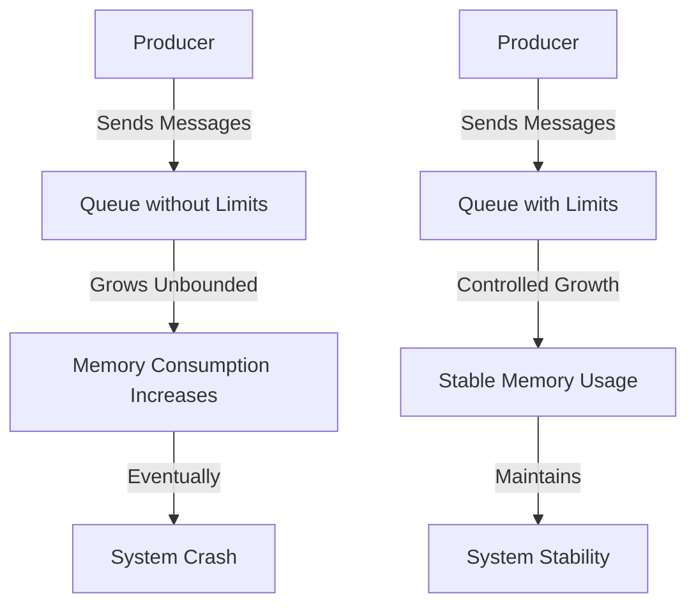

# RabbitMQ Queue Limits

## Introduction

When working with message brokers like RabbitMQ, it's essential to understand how to manage resources effectively. One crucial aspect of this management is setting appropriate queue limits. Without proper limits, queues can grow unchecked, consuming excessive memory and potentially causing system-wide performance issues or even crashes.

In this guide, we'll explore RabbitMQ queue limits - what they are, why they matter, and how to configure them to maintain a healthy messaging system. By the end, you'll have a solid understanding of how to prevent common problems associated with unbounded queue growth.

## Why Queue Limits Matter

Before diving into implementation details, let's understand why queue limits are crucial:

1. **Resource Protection**: Without limits, a single queue can consume all available memory, affecting other queues and the entire system.

2. **Backpressure Mechanism**: Limits provide feedback to producers when the system can't keep up with incoming messages.

3. **Preventing Cascading Failures**: When a RabbitMQ node runs out of memory, it can trigger node failures that affect your entire application.

4. **Operational Predictability**: Well-configured limits make system behavior more predictable during traffic spikes.

Let's visualize the problem of unbounded queues:



## Types of Queue Limits in RabbitMQ

RabbitMQ offers several types of limits to control queue growth:

### 1. Length Limit (Maximum Number of Messages)

This limit controls the maximum number of messages a queue can hold.

```javascript
// Setting max-length to 10,000 messages
channel.assertQueue('my-queue', {
  arguments: {
    'x-max-length': 10000
  }
});
```

### 2. Byte Size Limit (Maximum Queue Size in Bytes)

This limit controls the total size of all messages in a queue.

```javascript
// Setting max-length-bytes to 10MB (10,485,760 bytes)
channel.assertQueue('my-queue', {
  arguments: {
    'x-max-length-bytes': 10485760
  }
});
```

### 3. Time-To-Live (TTL) for Messages

While not a queue limit per se, setting a TTL ensures messages don't stay in the queue forever.

```javascript
// Setting message TTL to 1 hour (3,600,000 milliseconds)
channel.assertQueue('my-queue', {
  arguments: {
    'x-message-ttl': 3600000
  }
});
```

### 4. Time-To-Live (TTL) for Queues

You can also set a TTL for the entire queue if it remains unused.

```javascript
// Setting queue TTL to 24 hours (86,400,000 milliseconds)
channel.assertQueue('my-queue', {
  arguments: {
    'x-expires': 86400000
  }
});
```

## Overflow Behavior Options

When a queue reaches its limits, RabbitMQ needs to decide what to do with new messages. This behavior is controlled by the `x-overflow` argument:

### Drop Head (Default)

When a queue reaches its limit, the oldest messages (at the head of the queue) are dropped to make room for new ones.

```javascript
channel.assertQueue('my-queue', {
  arguments: {
    'x-max-length': 1000,
    'x-overflow': 'drop-head'  // This is the default
  }
});
```

### Reject Publish

With this setting, new messages are rejected when the queue reaches its limit, causing the publisher to receive a negative acknowledgment.

```javascript
channel.assertQueue('my-queue', {
  arguments: {
    'x-max-length': 1000,
    'x-overflow': 'reject-publish'
  }
});
```

## Practical Examples

Let's explore some real-world scenarios and how to configure appropriate queue limits for each.

### Example 1: High-Throughput Event Processing System

Imagine you're building a system that processes website analytics events. You might want to ensure the queue doesn't grow too large during traffic spikes.

```javascript
// High-throughput event queue with limits
const queueOptions = {
  durable: true,
  arguments: {
    'x-max-length': 500000,           // Maximum 500K messages
    'x-max-length-bytes': 1073741824, // Maximum 1GB total size
    'x-overflow': 'drop-head',        // Drop oldest events if limit reached
    'x-message-ttl': 86400000         // Messages expire after 24 hours
  }
};

channel.assertQueue('analytics-events', queueOptions);
```

### Example 2: Critical Transaction Processing

For processing important transactions where no message should be lost:

```javascript
// Critical transaction queue with backpressure
const queueOptions = {
  durable: true,
  arguments: {
    'x-max-length': 100000,           // Maximum 100K messages
    'x-overflow': 'reject-publish',   // Reject new messages when full (backpressure)
    'x-message-ttl': 259200000        // Messages expire after 3 days
  }
};

channel.assertQueue('payment-transactions', queueOptions);
```

### Example 3: Complete Node.js Application with Queue Limits

Here's a more complete example showing how to set up a Node.js application with proper queue limits:

```javascript
const amqp = require('amqplib');

async function setupRabbitMQ() {
  try {
    // Connect to RabbitMQ
    const connection = await amqp.connect('amqp://localhost');
    const channel = await connection.createChannel();
    
    // Define queue with appropriate limits
    const queueOptions = {
      durable: true,
      arguments: {
        'x-max-length': 50000,         // Maximum 50K messages
        'x-max-length-bytes': 104857600, // Maximum 100MB total size
        'x-overflow': 'reject-publish', // Apply backpressure when full
        'x-message-ttl': 3600000        // Messages expire after 1 hour
      }
    };
    
    // Create the queue with limits
    await channel.assertQueue('task-queue', queueOptions);
    console.log('Queue created with limits');
    
    // Example producer: sending messages
    for (let i = 0; i < 10; i++) {
      const message = { id: i, data: `Task ${i}`, timestamp: Date.now() };
      channel.sendToQueue(
        'task-queue',
        Buffer.from(JSON.stringify(message)),
        { persistent: true }
      );
    }
    console.log('Sent test messages');
    
    // Example consumer: processing messages
    channel.consume('task-queue', (msg) => {
      if (msg) {
        const content = JSON.parse(msg.content.toString());
        console.log(`Processing: ${content.data}`);
        // Process the message...
        
        // Acknowledge the message when done
        channel.ack(msg);
      }
    });
    
    console.log('Consumer started');
    
    // Handle application shutdown
    process.on('SIGINT', async () => {
      await channel.close();
      await connection.close();
      process.exit(0);
    });
    
  } catch (error) {
    console.error('Error:', error);
  }
}

setupRabbitMQ();
```

## Monitoring Queue Limits

It's important to monitor your queues to ensure your limits are appropriate. RabbitMQ provides several ways to monitor queue metrics:

### RabbitMQ Management UI

The Management UI shows current queue lengths and memory usage.

### HTTP API

You can query queue information programmatically:

```javascript
// Using axios to query the RabbitMQ API
const axios = require('axios');

async function getQueueInfo(queueName) {
  try {
    const response = await axios.get(
      `http://localhost:15672/api/queues/%2F/${queueName}`,
      {
        auth: {
          username: 'guest',
          password: 'guest'
        }
      }
    );
    
    const { messages, messages_ready, messages_unacknowledged, memory } = response.data;
    
    console.log(`Queue: ${queueName}`);
    console.log(`Total messages: ${messages}`);
    console.log(`Ready messages: ${messages_ready}`);
    console.log(`Unacknowledged messages: ${messages_unacknowledged}`);
    console.log(`Memory used: ${memory} bytes`);
    
  } catch (error) {
    console.error('Error fetching queue info:', error.message);
  }
}

getQueueInfo('my-queue');
```

## Best Practices for Queue Limits

Here are some guidelines for setting effective queue limits:

1. **Start Conservative**: Begin with lower limits and adjust based on monitoring data.

2. **Consider Message Size**: If your messages vary greatly in size, prefer byte-based limits over message count limits.

3. **Choose Overflow Strategy Carefully**: Use `reject-publish` for critical data where you can't afford to lose messages; use `drop-head` for time-sensitive data where older messages lose value.

4. **Combine Different Limit Types**: For comprehensive protection, use both message count and byte size limits together.

5. **Set TTLs Appropriately**: Configure message TTLs based on how long messages remain relevant to your use case.

6. **Monitor and Adjust**: Regularly review queue metrics and adjust limits as your application's needs evolve.

## Common Pitfalls

Be aware of these common issues when working with queue limits:

1. **Setting Limits Too Low**: Can cause unnecessary message rejection or deletion.

2. **Setting Limits Too High**: May not effectively protect your system from resource exhaustion.

3. **Ignoring Byte Limits**: Message count alone might not protect you if messages vary greatly in size.

4. **Not Planning for Failure**: Always design producers to handle rejected messages when using `reject-publish`.

5. **Forgetting About Dead Letter Exchanges**: Consider setting up dead letter exchanges for expired or dropped messages that require further handling.

## Summary

RabbitMQ queue limits are essential tools for building reliable, resilient messaging systems. By properly configuring limits on message count, byte size, and message lifetime, you can prevent resource exhaustion and ensure your system remains stable even under heavy load.

Remember these key points:

- Queue limits protect system resources and provide backpressure mechanisms
- Different limit types (length, bytes, TTL) serve different purposes
- Overflow behavior (`drop-head` vs `reject-publish`) determines how limits are enforced
- Monitoring queue metrics helps you refine limit settings over time

By applying these concepts in your RabbitMQ implementations, you'll build more robust applications that gracefully handle traffic spikes and resource constraints.

## Additional Exercises

1. **Experiment with Limits**: Set up a RabbitMQ instance locally and experiment with different queue limits to see how they affect system behavior.

2. **Implement Backpressure Handling**: Create a producer that handles rejected messages when queues are full.

3. **Build a Monitoring Dashboard**: Create a simple web dashboard that shows real-time queue metrics using the RabbitMQ HTTP API.

4. **Stress Test Your Limits**: Use a load testing tool to send messages at high rates and observe how your configured limits protect the system.

## Further Reading

- [RabbitMQ Official Documentation on Queue Length Limits](https://www.rabbitmq.com/maxlength.html)
- [RabbitMQ Message TTL and Expiration](https://www.rabbitmq.com/ttl.html)
- [Designing for Failure in Messaging Systems](https://www.rabbitmq.com/reliability.html)