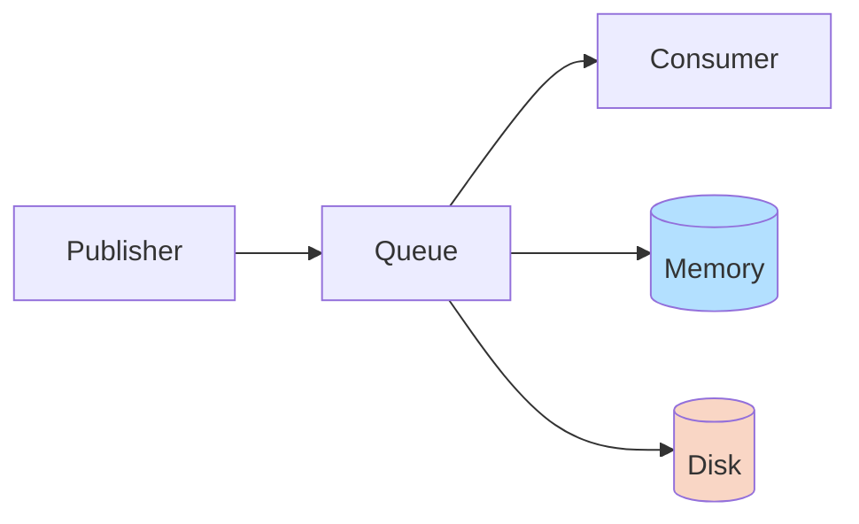
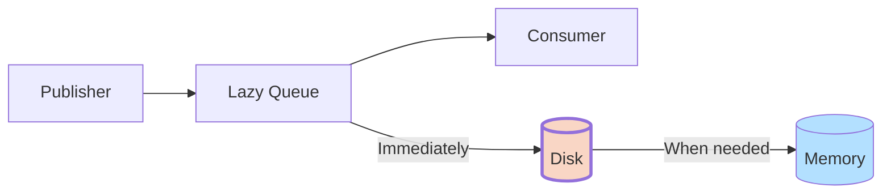

# RabbitMQ Lazy Queues

## Introduction

RabbitMQ is a popular message broker that helps applications communicate with each other. When processing messages, RabbitMQ typically keeps as many messages as possible in memory to ensure fast delivery. However, this can lead to high memory usage when dealing with large message backlogs.

**Lazy Queues** are a special type of queue in RabbitMQ designed to optimize memory usage by storing messages on disk as soon as possible rather than keeping them in memory. This makes lazy queues particularly valuable when:

- You expect occasional large backlogs of messages
- You prioritize memory efficiency over maximum throughput
- Your system processes messages at a slower rate than they arrive

## Understanding Regular vs. Lazy Queues

Before diving into lazy queues, let's understand how regular queues work in RabbitMQ:



In standard RabbitMQ queues:
1. Messages are kept in memory for fast access
2. Messages are written to disk for persistence (if the queue is durable)
3. When consumers request messages, they're read from memory when available
4. Only under memory pressure will messages be paged out to disk

In contrast, lazy queues behave differently:



In lazy queues:
1. Messages are written to disk as soon as possible
2. Only a small subset of messages at the head of the queue is kept in memory
3. This significantly reduces memory usage at the cost of some throughput

## Setting Up Lazy Queues

You can create a lazy queue in several ways:

### Method 1: Using Policy (Recommended)

The preferred way to configure lazy queues is using a policy:

```bash
rabbitmqctl set_policy Lazy "^lazy-" '{"queue-mode":"lazy"}' --apply-to queues
```

This command creates a policy named "Lazy" that applies to all queues whose names start with "lazy-" and sets their mode to lazy.

### Method 2: Declaring with Arguments in Code

You can also declare a lazy queue directly in your code:

#### JavaScript (using amqplib):

```javascript
// Connect to RabbitMQ
const amqp = require('amqplib');

async function setupLazyQueue() {
  try {
    const connection = await amqp.connect('amqp://localhost');
    const channel = await connection.createChannel();
    
    // Declare a lazy queue
    await channel.assertQueue('my-lazy-queue', {
      durable: true,
      arguments: {
        'x-queue-mode': 'lazy'
      }
    });
    
    console.log('Lazy queue created successfully');
  } catch (error) {
    console.error('Error:', error);
  }
}

setupLazyQueue();
```

#### Python (using pika):

```python
import pika

# Connect to RabbitMQ
connection = pika.BlockingConnection(pika.ConnectionParameters('localhost'))
channel = connection.channel()

# Declare a lazy queue
channel.queue_declare(
    queue='my-lazy-queue',
    durable=True,
    arguments={'x-queue-mode': 'lazy'}
)

print("Lazy queue created successfully")
connection.close()
```

#### Java (using RabbitMQ Java client):

```java
import com.rabbitmq.client.Channel;
import com.rabbitmq.client.Connection;
import com.rabbitmq.client.ConnectionFactory;

import java.util.HashMap;
import java.util.Map;

public class LazyQueueExample {
    public static void main(String[] args) throws Exception {
        ConnectionFactory factory = new ConnectionFactory();
        factory.setHost("localhost");
        
        try (Connection connection = factory.newConnection();
             Channel channel = connection.createChannel()) {
            
            Map<String, Object> arguments = new HashMap<>();
            arguments.put("x-queue-mode", "lazy");
            
            channel.queueDeclare(
                "my-lazy-queue",
                true,  // durable
                false, // exclusive
                false, // autoDelete
                arguments
            );
            
            System.out.println("Lazy queue created successfully");
        }
    }
}
```

## Performance Considerations

When using lazy queues, it's important to understand the performance implications:

### Advantages

1. **Lower memory usage**: Lazy queues use significantly less memory even with millions of messages.
2. **Better handling of large backlogs**: Systems can handle unexpected message surges without running out of memory.
3. **More predictable memory usage**: Memory consumption remains fairly stable regardless of queue size.

### Trade-offs

1. **Reduced throughput**: Publishing and consuming can be 10-40% slower than with regular queues.
2. **Increased disk I/O**: More disk operations are needed, which may affect system performance.
3. **Slower queue operations**: Operations like queue deletion may take longer.

## Real-World Example: Processing Log Events

Let's consider a practical example of using lazy queues to handle logs from multiple applications:

```javascript
// log-producer.js
const amqp = require('amqplib');

async function sendLogs() {
  const connection = await amqp.connect('amqp://localhost');
  const channel = await connection.createChannel();
  
  // Use the lazy queue we created
  const queue = 'my-lazy-queue';
  
  // Simulate sending 10,000 log messages
  for (let i = 0; i < 10000; i++) {
    const log = {
      timestamp: new Date().toISOString(),
      level: ['INFO', 'WARNING', 'ERROR'][Math.floor(Math.random() * 3)],
      service: ['web-app', 'api-server', 'database'][Math.floor(Math.random() * 3)],
      message: `Log message #${i}: Operation ${i % 100} completed`
    };
    
    channel.sendToQueue(queue, Buffer.from(JSON.stringify(log)), {
      persistent: true
    });
    
    if (i % 1000 === 0) {
      console.log(`Sent ${i} logs`);
    }
  }
  
  console.log('All logs sent!');
  setTimeout(() => connection.close(), 500);
}

sendLogs().catch(console.error);
```

```javascript
// log-consumer.js
const amqp = require('amqplib');

async function consumeLogs() {
  const connection = await amqp.connect('amqp://localhost');
  const channel = await connection.createChannel();
  
  const queue = 'my-lazy-queue';
  
  // Ensure we only process one message at a time
  channel.prefetch(1);
  
  console.log("Waiting for logs. To exit press CTRL+C");
  
  // Process logs at a slower rate to simulate processing delay
  await channel.consume(queue, (msg) => {
    if (msg !== null) {
      const logData = JSON.parse(msg.content.toString());
      
      // Simulate processing time
      setTimeout(() => {
        console.log(`Processed: ${logData.level} - ${logData.message}`);
        channel.ack(msg);
      }, 100); // Process 10 messages per second
    }
  });
}

consumeLogs().catch(console.error);
```

In this example:
1. The producer sends 10,000 logs very quickly
2. The consumer processes them at a slower rate (10 per second)
3. Without lazy queues, RabbitMQ would keep all messages in memory
4. With lazy queues, messages are stored on disk, saving memory

## When to Use Lazy Queues

Lazy queues are ideal in the following scenarios:

1. **Large backlogs expected**: When your system occasionally experiences message spikes
2. **Memory constraints**: When running RabbitMQ in environments with limited memory
3. **Long-lived messages**: When messages might stay in queues for extended periods
4. **Batch processing systems**: When processing happens in scheduled batches rather than continuously

## When Not to Use Lazy Queues

Lazy queues might not be appropriate when:

1. **High throughput is critical**: If you need maximum message processing speed
2. **Messages are short-lived**: If messages are typically consumed almost immediately
3. **Disk space is limited**: If you have more memory than disk space available

## Converting Between Queue Types

You can convert existing queues to lazy queues (and vice versa) using policies:

```bash
# Convert all queues to lazy
rabbitmqctl set_policy AllLazy ".*" '{"queue-mode":"lazy"}' --apply-to queues --priority 10

# Convert back to default
rabbitmqctl clear_policy AllLazy
```

Be aware that:
- Converting a queue with many messages can take time
- The queue will be unavailable during the conversion process
- It's often better to create a new queue with the desired settings

## Monitoring Lazy Queues

You can monitor your lazy queues through the RabbitMQ Management UI or via the HTTP API:

```bash
# Get information about a specific queue
curl -u guest:guest http://localhost:15672/api/queues/%2F/my-lazy-queue
```

Key metrics to watch:
- `messages`: Total number of messages in the queue
- `message_bytes`: Total size of messages in the queue
- `memory`: Memory used by the queue
- `state`: Current state of the queue

## Summary

RabbitMQ Lazy Queues provide an effective solution for managing large backlogs of messages without excessive memory usage. By prioritizing disk storage over memory caching, lazy queues trade some performance for significantly improved memory efficiency and stability.

Key points to remember:
- Lazy queues store messages on disk immediately
- They use less memory but have somewhat lower throughput
- They're ideal for systems with large or unpredictable message backlogs
- They can be configured via policies or during queue declaration

## Exercises

1. Create a lazy queue and a regular queue, then benchmark their performance with different message sizes.
2. Write a program that sends messages to a lazy queue faster than they're consumed, and monitor memory usage.
3. Use RabbitMQ's HTTP API to compare memory usage between lazy and regular queues.
4. Set up a policy that converts existing queues to lazy queues based on their name.
5. Design a system that uses both lazy and regular queues for different types of messages.

## Further Resources

- [RabbitMQ Lazy Queues Documentation](https://www.rabbitmq.com/lazy-queues.html)
- [RabbitMQ Performance Considerations](https://www.rabbitmq.com/performance.html)
- [RabbitMQ Monitoring](https://www.rabbitmq.com/monitoring.html)
- [RabbitMQ Policies](https://www.rabbitmq.com/parameters.html#policies)