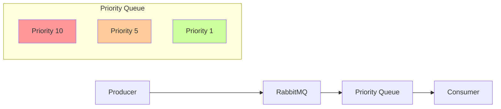

# RabbitMQ Queue Priority

## Introduction

When processing messages in a distributed system, not all messages are created equal. Some messages might need immediate attention, while others can wait. RabbitMQ's priority queue feature allows you to assign different priority levels to messages, ensuring that high-priority messages are processed before lower-priority ones, even if they arrived later.

In this tutorial, we'll explore how to implement and use priority queues in RabbitMQ, a powerful open-source message broker that implements the Advanced Message Queuing Protocol (AMQP).

## Understanding Queue Priority

By default, RabbitMQ processes messages in a first-in, first-out (FIFO) manner. This means the first message that enters the queue is the first one to be delivered to consumers. However, in real-world applications, this approach might not always be ideal.

Priority queues change this behavior by considering a message's priority level during consumption. Messages with higher priority values are delivered to consumers before messages with lower priority values, regardless of their arrival order.



## Enabling Priority Queues

To use priority queues in RabbitMQ, you need to declare a queue with the `x-max-priority` argument. This argument defines the maximum priority level that the queue will support (ranging from 0 to 255, with 0 being the lowest priority).

Here's how to declare a priority queue in different programming languages:

### JavaScript (with amqplib)

```javascript
const amqp = require('amqplib');

async function setupPriorityQueue() {
  try {
    // Connect to RabbitMQ server
    const connection = await amqp.connect('amqp://localhost');
    const channel = await connection.createChannel();
    
    // Declare a priority queue with maximum priority of 10
    await channel.assertQueue('priority_queue', {
      arguments: {
        'x-max-priority': 10
      }
    });
    
    console.log('Priority queue created successfully');
  } catch (error) {
    console.error('Error:', error);
  }
}

setupPriorityQueue();
```

### Python (with pika)

```python
import pika

# Connect to RabbitMQ server
connection = pika.BlockingConnection(pika.ConnectionParameters('localhost'))
channel = connection.channel()

# Declare a priority queue with maximum priority of 10
channel.queue_declare(
    queue='priority_queue',
    arguments={'x-max-priority': 10}
)

print('Priority queue created successfully')
connection.close()
```

### Java (with RabbitMQ Java Client)

```java
import com.rabbitmq.client.Channel;
import com.rabbitmq.client.Connection;
import com.rabbitmq.client.ConnectionFactory;

import java.io.IOException;
import java.util.HashMap;
import java.util.Map;
import java.util.concurrent.TimeoutException;

public class PriorityQueueExample {
    public static void main(String[] args) throws IOException, TimeoutException {
        ConnectionFactory factory = new ConnectionFactory();
        factory.setHost("localhost");
        
        try (Connection connection = factory.newConnection();
             Channel channel = connection.createChannel()) {
            
            // Define queue arguments
            Map<String, Object> arguments = new HashMap<>();
            arguments.put("x-max-priority", 10);
            
            // Declare the priority queue
            channel.queueDeclare("priority_queue", true, false, false, arguments);
            
            System.out.println("Priority queue created successfully");
        }
    }
}
```

## Publishing Messages with Priority

To assign a priority to a message, you need to set the `priority` property in the message properties when publishing.

### JavaScript (with amqplib)

```javascript
// Publish a high-priority message (priority 10)
channel.sendToQueue('priority_queue', Buffer.from('High priority message'), {
  priority: 10
});

// Publish a medium-priority message (priority 5)
channel.sendToQueue('priority_queue', Buffer.from('Medium priority message'), {
  priority: 5
});

// Publish a low-priority message (priority 1)
channel.sendToQueue('priority_queue', Buffer.from('Low priority message'), {
  priority: 1
});
```

### Python (with pika)

```python
# Publish a high-priority message (priority 10)
channel.basic_publish(
    exchange='',
    routing_key='priority_queue',
    body='High priority message',
    properties=pika.BasicProperties(priority=10)
)

# Publish a medium-priority message (priority 5)
channel.basic_publish(
    exchange='',
    routing_key='priority_queue',
    body='Medium priority message',
    properties=pika.BasicProperties(priority=5)
)

# Publish a low-priority message (priority 1)
channel.basic_publish(
    exchange='',
    routing_key='priority_queue',
    body='Low priority message',
    properties=pika.BasicProperties(priority=1)
)
```

### Java (with RabbitMQ Java Client)

```java
// Publish a high-priority message (priority 10)
AMQP.BasicProperties highPriorityProps = new AMQP.BasicProperties.Builder()
    .priority(10)
    .build();
channel.basicPublish("", "priority_queue", highPriorityProps, "High priority message".getBytes());

// Publish a medium-priority message (priority 5)
AMQP.BasicProperties mediumPriorityProps = new AMQP.BasicProperties.Builder()
    .priority(5)
    .build();
channel.basicPublish("", "priority_queue", mediumPriorityProps, "Medium priority message".getBytes());

// Publish a low-priority message (priority 1)
AMQP.BasicProperties lowPriorityProps = new AMQP.BasicProperties.Builder()
    .priority(1)
    .build();
channel.basicPublish("", "priority_queue", lowPriorityProps, "Low priority message".getBytes());
```

## Consuming Messages from a Priority Queue

Consuming messages from a priority queue is the same as consuming from a regular queue. The difference is in the order of message delivery, where higher priority messages are delivered first.

### JavaScript (with amqplib)

```javascript
// Consume messages from the priority queue
channel.consume('priority_queue', (msg) => {
  if (msg !== null) {
    console.log(`Received: ${msg.content.toString()}`);
    channel.ack(msg);
  }
});
```

### Python (with pika)

```python
# Callback function for message consumption
def callback(ch, method, properties, body):
    print(f"Received: {body.decode()}")
    ch.basic_ack(delivery_tag=method.delivery_tag)

# Consume messages from the priority queue
channel.basic_consume(queue='priority_queue', on_message_callback=callback)
print('Waiting for messages. To exit press CTRL+C')
channel.start_consuming()
```

### Java (with RabbitMQ Java Client)

```java
// Consume messages from the priority queue
DeliverCallback deliverCallback = (consumerTag, delivery) -> {
    String message = new String(delivery.getBody(), "UTF-8");
    System.out.println("Received: " + message);
    channel.basicAck(delivery.getEnvelope().getDeliveryTag(), false);
};

channel.basicConsume("priority_queue", false, deliverCallback, consumerTag -> {});
```

## Important Considerations and Best Practices

### 1. Priority Levels

While RabbitMQ supports priorities from 0 to 255, using too many priority levels can negatively impact performance. In most cases, 5-10 priority levels are sufficient.

```javascript
// Recommended: Use a reasonable number of priority levels
// arguments: { 'x-max-priority': 10 }

// Not recommended: Using too many priority levels
// arguments: { 'x-max-priority': 255 }
```

### 2. Default Priority

Messages published without a priority property are assigned a default priority of 0 (lowest priority).

```javascript
// This message will have the lowest priority (0)
channel.sendToQueue('priority_queue', Buffer.from('Message without priority'));
```

### 3. Performance Implications

Priority queues have a performance overhead compared to standard queues, especially when:
- The queue has many messages
- There are many different priority levels
- Messages are continuously published and consumed

### 4. Queue Monitoring

You can monitor your priority queues using RabbitMQ Management UI or through the HTTP API:

```bash
# Get information about the priority queue via HTTP API
curl -u guest:guest http://localhost:15672/api/queues/%2F/priority_queue
```

## Real-World Example: Customer Support Ticket System

Let's implement a simple customer support ticket system that prioritizes tickets based on their severity:

```javascript
const amqp = require('amqplib');

async function setupTicketSystem() {
  const connection = await amqp.connect('amqp://localhost');
  const channel = await connection.createChannel();
  
  // Declare a priority queue for support tickets
  await channel.assertQueue('support_tickets', {
    durable: true,
    arguments: {
      'x-max-priority': 10
    }
  });
  
  // Function to create a new support ticket
  async function createTicket(subject, description, severity) {
    // Map severity to priority
    let priority;
    switch (severity) {
      case 'critical': priority = 10; break;
      case 'high': priority = 7; break;
      case 'medium': priority = 5; break;
      case 'low': priority = 3; break;
      default: priority = 1;
    }
    
    const ticket = {
      id: Date.now().toString(),
      subject,
      description,
      severity,
      createdAt: new Date().toISOString()
    };
    
    // Publish ticket to the priority queue
    await channel.sendToQueue(
      'support_tickets',
      Buffer.from(JSON.stringify(ticket)),
      {
        persistent: true,
        priority
      }
    );
    
    console.log(`Ticket created: ${ticket.id} (${severity} severity)`);
    return ticket.id;
  }
  
  // Process tickets (in priority order)
  async function processTickets() {
    channel.prefetch(1);
    
    channel.consume('support_tickets', (msg) => {
      if (msg !== null) {
        const ticket = JSON.parse(msg.content.toString());
        console.log(`Processing ticket: ${ticket.id} (${ticket.severity})`);
        
        // Simulate ticket processing
        setTimeout(() => {
          console.log(`Ticket ${ticket.id} resolved`);
          channel.ack(msg);
        }, 1000);
      }
    });
  }
  
  // Create sample tickets
  await createTicket('Service unavailable', 'Our website is down', 'critical');
  await createTicket('Feature request', 'Add dark mode', 'low');
  await createTicket('Login issues', 'Cannot reset password', 'high');
  await createTicket('Billing question', 'Charged twice', 'medium');
  
  // Start processing tickets
  await processTickets();
}

setupTicketSystem().catch(console.error);
```

Expected output:

```
Ticket created: 1678912345000 (critical severity)
Ticket created: 1678912345001 (low severity)
Ticket created: 1678912345002 (high severity)
Ticket created: 1678912345003 (medium severity)
Processing ticket: 1678912345000 (critical)
Ticket 1678912345000 resolved
Processing ticket: 1678912345002 (high)
Ticket 1678912345002 resolved
Processing ticket: 1678912345003 (medium)
Ticket 1678912345003 resolved
Processing ticket: 1678912345001 (low)
Ticket 1678912345001 resolved
```

## Message Prioritization Strategies

Different applications may require different strategies for prioritizing messages:

### 1. Customer Tiers

Assign priorities based on customer tiers or subscription levels:

```javascript
function determineMessagePriority(customerId) {
  const customerTier = getCustomerTier(customerId); // Function to get customer tier
  
  switch (customerTier) {
    case 'enterprise': return 10;
    case 'business': return 7;
    case 'professional': return 5;
    case 'starter': return 3;
    default: return 1;
  }
}
```

### 2. Time-Sensitive Operations

Increase priority for operations that are time-sensitive:

```javascript
function determineOperationPriority(operationType, deadline) {
  // Calculate how soon the deadline is
  const timeUntilDeadline = deadline - Date.now();
  
  if (timeUntilDeadline < 60000) { // Less than 1 minute
    return 10;
  } else if (timeUntilDeadline < 300000) { // Less than 5 minutes
    return 8;
  } else if (timeUntilDeadline < 3600000) { // Less than 1 hour
    return 5;
  } else {
    return 3;
  }
}
```

### 3. Resource Utilization

Prioritize messages based on their resource requirements:

```javascript
function determineResourcePriority(resourceNeeded, currentResourceAvailability) {
  if (resourceNeeded > currentResourceAvailability * 0.8) {
    return 2; // Lower priority for resource-intensive operations
  } else {
    return 6; // Higher priority for lighter operations
  }
}
```

## Limitations and Considerations

### 1. Queue Creation

Priority queues must be defined when the queue is declared. You cannot change a regular queue into a priority queue without deleting and recreating it.

### 2. Message Re-queuing

When a message is rejected and re-queued, it retains its original priority.

### 3. Memory and CPU Overhead

Priority queues require more resources than standard queues, as RabbitMQ needs to maintain multiple internal queues (one for each priority level).

### 4. Consumer Cancellation

If a consumer is cancelled while consuming from a priority queue, RabbitMQ will requeue messages correctly, maintaining their priorities.

## Summary

RabbitMQ priority queues provide a powerful mechanism to ensure that important messages are processed first, which is essential for many real-world applications. By declaring queues with the `x-max-priority` argument and setting appropriate priority levels when publishing messages, you can implement sophisticated message processing systems that handle varying levels of urgency.

Key points to remember:
- Declare priority queues with `x-max-priority` argument
- Set reasonable priority levels (typically 0-10)
- Consider performance implications for large queues
- Use strategies to determine appropriate message priorities
- Monitor queue performance in production environments

## Exercises

1. Create a priority queue with 5 priority levels and publish 10 messages with random priorities. Verify that they are consumed in the correct order.

2. Implement a simple task scheduling system where tasks can have different priorities based on their deadline and importance.

3. Modify the customer support ticket example to include automatic priority escalation for tickets that remain unresolved for too long.

4. Compare the performance of a standard queue versus a priority queue by measuring message throughput with varying numbers of messages and priority levels.

## Additional Resources

- [RabbitMQ Priority Queue Documentation](https://www.rabbitmq.com/priority.html)
- [RabbitMQ Best Practices](https://www.rabbitmq.com/best-practices.html)
- [AMQP 0-9-1 Protocol Guide](https://www.rabbitmq.com/amqp-0-9-1-reference.html)
- [RabbitMQ Monitoring and Management](https://www.rabbitmq.com/monitoring.html)