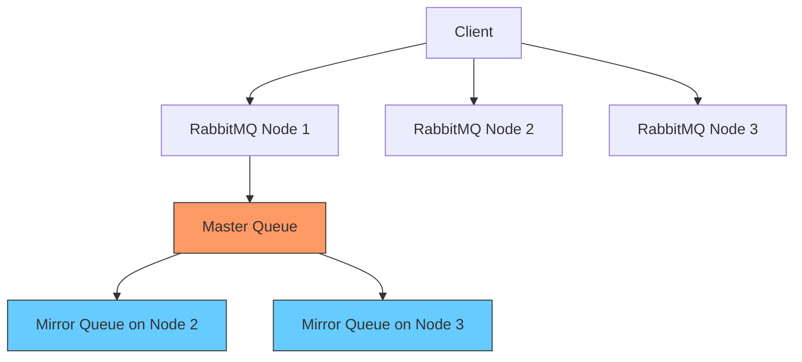

# RabbitMQ Queue Mirroring

## Introduction

Queue mirroring is a critical feature in RabbitMQ that provides high availability and data redundancy for your messaging system. When a queue is mirrored, its contents are replicated across multiple nodes in a RabbitMQ cluster. This ensures that even if one node fails, your messages and queue configurations remain accessible, providing resilience against hardware failures and network partitions.

In this guide, we'll explore how queue mirroring works, how to configure it properly, and best practices for implementing it in production environments.

## What is Queue Mirroring?

In a standard RabbitMQ setup, each queue exists on exactly one node. If that node becomes unavailable, the queue and all its messages become inaccessible until the node recovers. Queue mirroring addresses this vulnerability by maintaining copies (mirrors) of queues across multiple nodes.

### Key Concepts

- **Master queue**: The primary queue instance that receives all operations first
- **Mirror queues**: Secondary copies that replicate the master's contents
- **Synchronization**: The process of copying messages from the master to mirrors
- **Promotion**: When a mirror becomes the new master after the original master fails



## Configuring Queue Mirroring

There are two approaches to configuring queue mirroring in RabbitMQ: using policies or through the `x-ha-*` arguments when declaring a queue.

### Method 1: Using Policies (Recommended)

Policies are the recommended way to configure mirroring as they can be changed dynamically without requiring queue redeclaration.

#### Using the Management UI

1. Navigate to the RabbitMQ Management interface (typically at port 15672)
2. Go to "Admin" > "Policies" 
3. Add a new policy with the following details:
   - Pattern: `^` (to match all queues) or a specific pattern like `^important\.`
   - Definition: Add `ha-mode` and `ha-params` as needed
   - Priority: Set a numeric priority (higher numbers have precedence)

#### Using the Command Line

```bash
# Mirror all queues across all nodes
rabbitmqctl set_policy ha-all "^" '{"ha-mode":"all"}' --apply-to queues

# Mirror queues matching a pattern to exactly 2 nodes
rabbitmqctl set_policy ha-two "^important\." '{"ha-mode":"exactly","ha-params":2}' --apply-to queues

# Mirror queues to a specific set of nodes
rabbitmqctl set_policy ha-nodes "^critical\." '{"ha-mode":"nodes","ha-params":["rabbit@node1", "rabbit@node2"]}' --apply-to queues
```

### Method 2: Using Queue Arguments

When declaring a queue, you can specify mirroring parameters directly:

```javascript
// Node.js example using amqplib
channel.assertQueue('important-queue', {
  arguments: {
    'x-ha-policy': 'all'
  }
});
```

```python
# Python example using pika
channel.queue_declare(
    queue='important-queue',
    arguments={
        'x-ha-policy': 'all'
    }
)
```

## Mirroring Modes

RabbitMQ supports several mirroring modes that determine how many mirrors a queue should have:

### All Nodes Mirroring

Mirrors the queue to all nodes in the cluster.

```json
{"ha-mode": "all"}
```

### Exact Count Mirroring

Mirrors the queue to a specific number of nodes.

```json
{"ha-mode": "exactly", "ha-params": 3}
```

### Specific Nodes Mirroring

Mirrors the queue to an explicitly listed set of nodes.

```json
{"ha-mode": "nodes", "ha-params": ["rabbit@node1", "rabbit@node2"]}
```

## Synchronization

When a new mirror joins, it needs to copy all messages from the master. This process is called synchronization.

### Automatic vs. Manual Synchronization

By default, newly added mirrors will automatically synchronize with the master. However, for queues with many messages, this can cause significant network and CPU load.

You can control this behavior using the `ha-sync-mode` policy:

```bash
# Set automatic synchronization
rabbitmqctl set_policy ha-sync "^" '{"ha-mode":"all","ha-sync-mode":"automatic"}' --apply-to queues

# Set manual synchronization
rabbitmqctl set_policy ha-sync "^" '{"ha-mode":"all","ha-sync-mode":"manual"}' --apply-to queues
```

With manual synchronization, you need to trigger the synchronization explicitly:

```bash
rabbitmqctl sync_queue my_important_queue
```

## Handling Network Partitions

Network partitions (split-brain scenarios) can cause issues with mirrored queues. RabbitMQ offers several partition handling strategies:

```bash
# In rabbitmq.conf
cluster_partition_handling = pause_minority
```

Options include:
- `ignore`: Continue operating during a partition (not recommended)
- `pause_minority`: Pause the minority side of the partition 
- `pause_if_all_down`: Pause if specified nodes are unavailable
- `autoheal`: Automatically heal partitions when they recover

## Practical Example: Setting Up Mirrored Queues

Let's walk through a complete example of setting up mirrored queues in a three-node RabbitMQ cluster.

### Step 1: Create a RabbitMQ Cluster

First, set up a three-node cluster:

```bash
# On node1
rabbitmq-server -detached

# On node2
rabbitmq-server -detached
rabbitmqctl stop_app
rabbitmqctl join_cluster rabbit@node1
rabbitmqctl start_app

# On node3
rabbitmq-server -detached
rabbitmqctl stop_app
rabbitmqctl join_cluster rabbit@node1
rabbitmqctl start_app
```

### Step 2: Create Mirroring Policies

```bash
# Create a policy that mirrors all queues to all nodes
rabbitmqctl set_policy ha-all "^" '{"ha-mode":"all","ha-sync-mode":"automatic"}' --apply-to queues
```

### Step 3: Create and Use a Mirrored Queue

```javascript
// Node.js Producer
const amqp = require('amqplib');

async function sendMessage() {
  try {
    const connection = await amqp.connect('amqp://localhost');
    const channel = await connection.createChannel();
    
    const queue = 'mirrored-queue';
    
    // Queue will be mirrored according to the policy
    await channel.assertQueue(queue, { durable: true });
    
    // Send a message
    const message = 'Hello from mirrored queue!';
    channel.sendToQueue(queue, Buffer.from(message), { persistent: true });
    
    console.log(" [x] Sent '%s'", message);
    
    setTimeout(() => {
      connection.close();
      process.exit(0);
    }, 500);
  } catch (error) {
    console.error(error);
  }
}

sendMessage();
```

```javascript
// Node.js Consumer
const amqp = require('amqplib');

async function receiveMessages() {
  try {
    const connection = await amqp.connect('amqp://localhost');
    const channel = await connection.createChannel();
    
    const queue = 'mirrored-queue';
    
    // Queue will be mirrored according to the policy
    await channel.assertQueue(queue, { durable: true });
    
    console.log(" [*] Waiting for messages in %s", queue);
    
    channel.consume(queue, (msg) => {
      console.log(" [x] Received '%s'", msg.content.toString());
      channel.ack(msg);
    });
  } catch (error) {
    console.error(error);
  }
}

receiveMessages();
```

### Step 4: Monitor Mirroring Status

You can check the status of mirrored queues using the management UI or command line:

```bash
rabbitmqctl list_queues name slave_pids synchronised_slave_pids
```

Output might look like:

```
Listing queues ...
mirrored-queue	[[<rabbit@node2.10234>, <rabbit@node3.10897>]]	[[<rabbit@node2.10234>, <rabbit@node3.10897>]]
```

## Performance Considerations

Queue mirroring adds overhead and can impact performance. Consider these factors:

1. **Message throughput**: Each message must be replicated to all mirrors, which increases latency.
2. **Network usage**: Replication requires additional network bandwidth.
3. **Disk I/O**: For persistent messages, each node must write to disk.
4. **Number of mirrors**: More mirrors provide better redundancy but with higher overhead.

## Best Practices

1. **Be selective**: Don't mirror all queues if not necessary. Focus on critical queues.
2. **Use fewer mirrors**: Having 2-3 mirrors is often sufficient for redundancy.
3. **Consider using a quorum**: Set `ha-mode` to `exactly` with an odd number (3 or 5) for better failover behavior.
4. **Set up dead letter exchanges**: Configure `x-dead-letter-exchange` to handle messages that fail to be mirrored.
5. **Monitor synchronization**: Regularly check that mirrors are synchronized.
6. **Use lazy queues for large queues**: Consider using lazy queues (`queue-mode: lazy`) for mirrored queues with many messages.

```javascript
// Setting up a mirrored lazy queue (through policy)
rabbitmqctl set_policy lazy-ha "^large-queue$" '{"ha-mode":"all", "queue-mode":"lazy"}' --apply-to queues
```

## Common Issues and Troubleshooting

### Queue Synchronization Taking Too Long

If queue synchronization is taking too long:

1. Consider switching to manual synchronization during off-peak hours
2. Reduce the number of mirrors
3. Use lazy queues for very large queues

### Master Queue Node Failure

When a master queue node fails:

1. One of the synchronized mirrors will be promoted to master
2. RabbitMQ chooses the oldest synchronized mirror for promotion
3. If no synchronized mirrors exist, the oldest mirror will be promoted but may lose messages

### Checking Mirror Health

```bash
# Check which queues aren't synchronized
rabbitmqctl list_queues name synchronised_slave_pids slave_pids | grep -v "\[\]"
```

## Summary

Queue mirroring is a powerful feature of RabbitMQ that provides high availability for your messaging infrastructure. By creating redundant copies of queues across multiple nodes, you can ensure message durability even when individual nodes fail.

Key points to remember:
- Use policies rather than queue arguments for mirroring configuration
- Be selective about which queues to mirror to minimize performance impact
- Consider the tradeoff between availability and performance
- Monitor synchronization status to ensure redundancy is working
- Have a plan for handling network partitions

By properly implementing queue mirroring, you can build a robust messaging system that maintains operation even in the face of hardware failures and network issues.

## Additional Resources

- [Official RabbitMQ Documentation on Mirroring](https://www.rabbitmq.com/ha.html)
- [RabbitMQ Clustering Guide](https://www.rabbitmq.com/clustering.html)
- [Reliable Messaging with RabbitMQ](https://www.rabbitmq.com/reliability.html)

## Exercises

1. Set up a two-node RabbitMQ cluster and configure all queues to be mirrored.
2. Experiment with different mirroring modes (all, exactly, nodes) and observe their behavior.
3. Simulate a node failure by stopping one of your RabbitMQ nodes and observe how the system recovers.
4. Write a program that monitors the synchronization status of mirrored queues.
5. Compare the performance of mirrored vs. non-mirrored queues by measuring message throughput.