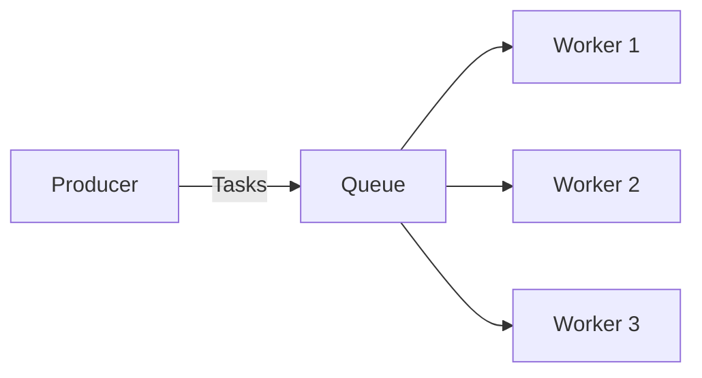

# RabbitMQ Work Queues

In this tutorial, we'll explore one of the fundamental RabbitMQ patterns: Work Queues (also known as Task Queues). Work queues are used to distribute time-consuming tasks among multiple workers, preventing immediate execution of resource-intensive tasks and avoiding potential system overload.

## What Are Work Queues?

Work queues provide a way to distribute tasks among multiple workers, similar to load balancing in web servers. They are particularly useful for resource-intensive operations that you don't want to perform immediately or within the main application thread.



The main idea is simple:

1. A producer creates tasks and sends them to a queue
2. Workers pick up tasks from the queue and process them
3. Multiple workers can run simultaneously, consuming tasks in parallel

Let's build a simple work queue system to understand how it works in practice.

## Prerequisites

Before we begin, make sure you have:
- RabbitMQ server installed and running
- Node.js installed (we'll use the `amqplib` package)

Install the required package:

```bash
npm install amqplib
```

## Creating a Work Queue

We'll create two programs:
- A producer (`new_task.js`) that creates tasks
- A consumer (`worker.js`) that processes tasks

### Producer (new_task.js)

Let's start by creating our task producer:

```javascript
const amqp = require('amqplib');

async function sendTask() {
  try {
    // Connect to RabbitMQ server
    const connection = await amqp.connect('amqp://localhost');
    const channel = await connection.createChannel();
    
    // Create a queue
    const queue = 'task_queue';
    await channel.assertQueue(queue, {
      durable: true  // Queue will survive a RabbitMQ restart
    });
    
    // Get message from command line or use default
    const msg = process.argv.slice(2).join(' ') || 'Hello World!';
    
    // Send message to queue
    channel.sendToQueue(queue, Buffer.from(msg), {
      persistent: true  // Message will survive a RabbitMQ restart
    });
    
    console.log(`[x] Sent: ${msg}`);
    
    // Close connection
    setTimeout(() => {
      connection.close();
      process.exit(0);
    }, 500);
  } catch (error) {
    console.error(error);
  }
}

sendTask();
```

Notice a few important details:
- We set `durable: true` when creating the queue to ensure it survives broker restarts
- We mark messages as `persistent: true` to save them to disk

### Worker (worker.js)

Now, let's create a worker to process tasks:

```javascript
const amqp = require('amqplib');

async function processTask() {
  try {
    // Connect to RabbitMQ server
    const connection = await amqp.connect('amqp://localhost');
    const channel = await connection.createChannel();
    
    // Create queue (same as in producer)
    const queue = 'task_queue';
    await channel.assertQueue(queue, {
      durable: true
    });
    
    // Only process one message at a time
    channel.prefetch(1);
    
    console.log('[*] Waiting for messages. To exit press CTRL+C');
    
    // Consume messages from queue
    channel.consume(queue, (msg) => {
      const content = msg.content.toString();
      console.log(`[x] Received: ${content}`);
      
      // Simulate task processing time
      const dotsCount = content.split('.').length - 1;
      const processingTime = dotsCount * 1000;
      
      setTimeout(() => {
        console.log('[x] Task completed');
        // Acknowledge the message (mark as done)
        channel.ack(msg);
      }, processingTime);
    }, {
      noAck: false  // Manual acknowledgment
    });
  } catch (error) {
    console.error(error);
  }
}

processTask();
```

This worker has some important features:
- We set `prefetch(1)` to limit each worker to process only one message at a time
- We use manual acknowledgments (`noAck: false`) to ensure tasks aren't lost
- We acknowledge messages only after successful processing

## Running the Work Queue

To see our work queue in action, we need to:

1. Open multiple terminal windows
2. Run one or more worker instances
3. Send some tasks using the producer

First, start the workers:

```bash
# Terminal 1
node worker.js

# Terminal 2
node worker.js
```

Then send some tasks with varying complexity (represented by dots):

```bash
# Terminal 3
node new_task.js "Task 1..."
node new_task.js "Task 2.."
node new_task.js "Task 3."
node new_task.js "Task 4...."
```

You should see the workers processing tasks in a round-robin fashion, with each task taking different amounts of time based on the number of dots.

### Example Output

Worker 1:
```
[*] Waiting for messages. To exit press CTRL+C
[x] Received: Task 1...
(waits 3 seconds)
[x] Task completed
[x] Received: Task 3.
(waits 1 second)
[x] Task completed
```

Worker 2:
```
[*] Waiting for messages. To exit press CTRL+C
[x] Received: Task 2..
(waits 2 seconds)
[x] Task completed
[x] Received: Task 4....
(waits 4 seconds)
[x] Task completed
```

## Key Concepts in Work Queues

### Message Acknowledgment

In our example, we used manual acknowledgments to ensure tasks aren't lost if a worker dies while processing. By default, RabbitMQ will redeliver messages to another worker when a worker connection is closed.

### Message Durability

We marked both the queue and messages as durable/persistent to ensure they survive even if RabbitMQ restarts. This is crucial for tasks that must not be lost.

### Fair Dispatch

The `prefetch(1)` setting ensures that workers only receive one task at a time. This prevents fast workers from being overwhelmed with tasks while slower workers remain idle.

## Real-World Applications

Work queues are incredibly useful in many scenarios:

1. **Image/Video Processing**: When users upload media files that need processing (resizing, filtering, transcoding)
2. **PDF Generation**: Creating complex documents that require significant CPU time
3. **Email Delivery**: Sending bulk emails without blocking the main application
4. **Data Import/Export**: Processing large data sets that need to be imported or exported
5. **Web Scraping**: Distributing scraping tasks across multiple workers

### Example: PDF Generation Service

Let's see a practical example of a PDF generation service:

```javascript
// pdf_producer.js
const amqp = require('amqplib');

async function requestPdfGeneration(userData) {
  const connection = await amqp.connect('amqp://localhost');
  const channel = await connection.createChannel();
  
  const queue = 'pdf_generation_queue';
  await channel.assertQueue(queue, { durable: true });
  
  // Send user data for PDF generation
  channel.sendToQueue(queue, Buffer.from(JSON.stringify(userData)), {
    persistent: true
  });
  
  console.log(`[x] Requested PDF generation for user: ${userData.name}`);
  
  setTimeout(() => {
    connection.close();
  }, 500);
}

// Example usage in web application
app.post('/generate-invoice', async (req, res) => {
  const userData = {
    id: req.user.id,
    name: req.user.name,
    items: req.body.items,
    total: req.body.total
  };
  
  await requestPdfGeneration(userData);
  
  res.status(200).json({
    message: 'Invoice generation in progress. You will be notified when ready.'
  });
});
```

```javascript
// pdf_worker.js
const amqp = require('amqplib');
const { generatePDF } = require('./pdf-service');
const { sendNotification } = require('./notification-service');

async function startPdfWorker() {
  const connection = await amqp.connect('amqp://localhost');
  const channel = await connection.createChannel();
  
  const queue = 'pdf_generation_queue';
  await channel.assertQueue(queue, { durable: true });
  
  channel.prefetch(1);
  
  console.log('[*] PDF generation worker ready');
  
  channel.consume(queue, async (msg) => {
    const userData = JSON.parse(msg.content.toString());
    console.log(`[x] Generating PDF for user: ${userData.name}`);
    
    try {
      // Generate PDF (this might take time)
      const pdfPath = await generatePDF(userData);
      
      // Notify user that PDF is ready
      await sendNotification(userData.id, {
        type: 'invoice_ready',
        pdfPath: pdfPath
      });
      
      console.log(`[x] PDF generated successfully for: ${userData.name}`);
      channel.ack(msg);
    } catch (error) {
      console.error(`Error processing PDF: ${error.message}`);
      // Reject and requeue the message if it's a temporary failure
      channel.reject(msg, true);
    }
  }, {
    noAck: false
  });
}

startPdfWorker();
```

This example shows how a web application can respond quickly to users while offloading heavy processing to background workers.

## Advanced Work Queue Patterns

Beyond the basic work queue, you can implement several advanced patterns:

### Priority Queues

You can set message priorities to ensure important tasks are processed first:

```javascript
channel.sendToQueue(queue, Buffer.from(message), {
  persistent: true,
  priority: 10  // Higher priority (0-10)
});
```

### Dead Letter Exchanges

Handle failed messages by routing them to a special "dead letter" queue:

```javascript
await channel.assertQueue(queue, {
  durable: true,
  deadLetterExchange: 'dlx',
  deadLetterRoutingKey: 'failed_tasks'
});
```

### Delayed Processing

Implement delayed task execution using RabbitMQ plugins or message TTL with dead-letter exchanges.

## Summary

In this tutorial, we've learned:

1. How work queues distribute tasks among multiple workers
2. How to create durable queues and persistent messages
3. How to use manual acknowledgments to ensure task reliability
4. How to distribute work fairly with the prefetch setting
5. Real-world applications of work queues
6. Advanced patterns for more complex scenarios

Work queues are a powerful pattern for building resilient, scalable applications that can handle resource-intensive tasks efficiently.

## Exercises

1. Modify the worker to log how long each task took to process
2. Implement a retry mechanism for failed tasks (retry up to 3 times)
3. Create a system that notifies an admin when a task fails repeatedly
4. Implement a priority queue where some tasks are processed before others
5. Add monitoring to track queue length and worker performance

## Additional Resources

- [RabbitMQ Official Documentation on Work Queues](https://www.rabbitmq.com/tutorials/tutorial-two-javascript.html)
- [amqplib Documentation](https://github.com/squaremo/amqp.node)
- [RabbitMQ Best Practices](https://www.cloudamqp.com/blog/part1-rabbitmq-best-practice.html)