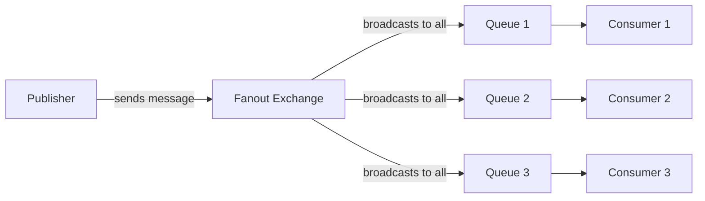

# RabbitMQ Publish/Subscribe Pattern

## Introduction

The Publish/Subscribe pattern (often abbreviated as Pub/Sub) is a messaging paradigm where senders (publishers) don't send messages directly to specific receivers. Instead, publishers categorize messages into classes without knowledge of which subscribers, if any, may receive them. Similarly, subscribers express interest in receiving messages of a particular class, consuming only those messages while remaining unaware of which publishers are generating them.

This pattern creates a powerful decoupling between message producers and consumers, allowing for flexible and scalable system architectures. In this guide, we'll explore how to implement the Publish/Subscribe pattern using RabbitMQ, a robust open-source message broker.

## Prerequisites

Before we dive in, make sure you have:
- RabbitMQ server installed and running
- A programming environment with a RabbitMQ client library (we'll use JavaScript/Node.js with `amqplib` in our examples)
- Basic understanding of messaging concepts

## How Publish/Subscribe Works in RabbitMQ

The key concept in the RabbitMQ Publish/Subscribe pattern is the **exchange**. 

In previous patterns like Work Queues, we sent messages directly to a queue. With Pub/Sub, we instead send messages to an exchange, which is responsible for routing these messages to one or more queues based on specific rules.

For the Publish/Subscribe pattern, we use a specific type of exchange called a **fanout exchange**. A fanout exchange broadcasts all messages it receives to all queues bound to it.



## Implementation: Step by Step

Let's build a complete Publish/Subscribe system using RabbitMQ and Node.js.

### Step 1: Set Up the Publisher

First, let's create our publisher that will send messages to a fanout exchange:

```javascript
// publisher.js
const amqp = require('amqplib');

async function publishMessage() {
  try {
    // Connect to RabbitMQ server
    const connection = await amqp.connect('amqp://localhost');
    const channel = await connection.createChannel();
    
    // Declare a fanout exchange
    const exchangeName = 'logs';
    await channel.assertExchange(exchangeName, 'fanout', {
      durable: false
    });
    
    // Create a message
    const message = process.argv.slice(2).join(' ') || 'Hello World!';
    
    // Publish the message to the exchange
    channel.publish(exchangeName, '', Buffer.from(message));
    console.log(`[x] Sent: ${message}`);
    
    // Close the connection after 500ms
    setTimeout(() => {
      connection.close();
      process.exit(0);
    }, 500);
  } catch (error) {
    console.error(error);
  }
}

publishMessage();
```

Key points about the publisher:
- We create a fanout exchange named 'logs'
- We publish messages to this exchange with an empty routing key (the second parameter)
- The exchange will broadcast these messages to all bound queues

### Step 2: Set Up the Subscriber

Now, let's create a subscriber that will listen for messages:

```javascript
// subscriber.js
const amqp = require('amqplib');

async function receiveMessages() {
  try {
    // Connect to RabbitMQ server
    const connection = await amqp.connect('amqp://localhost');
    const channel = await connection.createChannel();
    
    // Declare the same exchange as publisher
    const exchangeName = 'logs';
    await channel.assertExchange(exchangeName, 'fanout', {
      durable: false
    });
    
    // Create a non-durable, exclusive, auto-delete queue with a generated name
    const { queue } = await channel.assertQueue('', {
      exclusive: true
    });
    
    console.log(`[*] Waiting for messages in queue: ${queue}`);
    
    // Bind the queue to the exchange
    await channel.bindQueue(queue, exchangeName, '');
    
    // Consume messages
    channel.consume(queue, (message) => {
      if (message) {
        console.log(`[x] Received: ${message.content.toString()}`);
      }
    }, {
      noAck: true
    });
  } catch (error) {
    console.error(error);
  }
}

receiveMessages();
```

Key points about the subscriber:
- We connect to the same 'logs' fanout exchange
- We create a queue with a generated name (empty string as first parameter)
- We set the queue as `exclusive`, meaning it will be deleted when the connection closes
- We bind our queue to the exchange with an empty routing key
- We consume messages from our queue

### Step 3: Run the Example

To see the Publish/Subscribe pattern in action, open multiple terminal windows:

1. Start at least two subscriber instances:
```bash
node subscriber.js
```
```bash
node subscriber.js
```

2. Send a message using the publisher:
```bash
node publisher.js "This is a broadcast message"
```

You should see the same message appearing in all running subscriber instances, demonstrating the broadcast nature of the fanout exchange.

## Output Example

**Subscriber 1:**
```
[*] Waiting for messages in queue: amq.gen-JzTY20BRgKO-HZ0MKpgl7g
[x] Received: This is a broadcast message
```

**Subscriber 2:**
```
[*] Waiting for messages in queue: amq.gen-xfKUhQlMgRLe2y9SEpwn1A
[x] Received: This is a broadcast message
```

## Understanding Temporary Queues

In our subscriber code, we created a queue without providing a name. This has several important implications:

1. RabbitMQ generates a random queue name (something like `amq.gen-JzTY20BRgKO-HZ0MKpgl7g`)
2. When the consumer disconnects, the queue is automatically deleted (because of the `exclusive: true` option)

This behavior is perfect for the Publish/Subscribe pattern, where each subscriber typically needs its own queue to receive all messages.

## Real-World Applications

The Publish/Subscribe pattern with RabbitMQ has numerous practical applications:

### 1. Logging System

One common use case is a centralized logging system:
- Publisher: Your application's components emit log messages to a 'logs' exchange
- Subscribers: Different consumers process these logs for different purposes:
  - One subscriber writes logs to disk
  - Another sends critical errors as alerts
  - A third might aggregate logs for metrics

```javascript
// log_publisher.js (simplified)
function logMessage(severity, message) {
  // ... connection code ...
  channel.publish('logs', severity, Buffer.from(message));
}

logMessage('info', 'User logged in');
logMessage('error', 'Database connection failed');
```

### 2. Real-time Notifications

Another application is broadcasting notifications:
- Publisher: An event service publishes user events like "new comment"
- Subscribers: Various services react to these events:
  - Email notification service
  - Mobile push notification service
  - In-app notification service

### 3. Distributed System Coordination

The pattern is also useful for coordinating actions across distributed systems:
- Publisher: A master service publishes commands like "refresh cache"
- Subscribers: Multiple worker services receive and act on these commands simultaneously

## Limitations and Considerations

While powerful, the basic Publish/Subscribe pattern does have limitations:

1. **No Message Filtering**: With a fanout exchange, subscribers receive all messages, which may be inefficient if they're only interested in specific messages.

2. **Queue Management**: Temporary queues are great for many cases, but for applications that need to receive messages even when offline, you'll need to use named, durable queues.

3. **Guaranteed Delivery**: Our examples use `noAck: true` for simplicity, but production systems might need to implement acknowledgments and persistence for reliable message delivery.

To address some of these limitations, RabbitMQ offers more advanced exchange types like "direct," "topic," and "headers," which we'll explore in other guides.

## Summary

The Publish/Subscribe pattern in RabbitMQ provides a powerful way to broadcast messages to multiple consumers, enabling decoupled and distributed system architectures. By using fanout exchanges, we can easily implement one-to-many message distribution.

In this guide, we've learned:
- The core concepts of the Publish/Subscribe pattern
- How to create a fanout exchange in RabbitMQ
- How to publish messages to all subscribed consumers
- How to create temporary, exclusive queues for subscribers
- Real-world applications of the pattern

## Exercises

1. Modify the subscriber to save received logs to a file.
2. Create a system with multiple publishers and subscribers to simulate a chat application.
3. Implement a simple notification system that broadcasts events to multiple services.

## Further Resources

- [RabbitMQ Tutorials - Publish/Subscribe](https://www.rabbitmq.com/tutorials/tutorial-three-javascript.html)
- [RabbitMQ Exchange Types](https://www.rabbitmq.com/tutorials/amqp-concepts.html#exchanges)
- [Advanced Messaging with RabbitMQ](https://www.rabbitmq.com/getstarted.html)