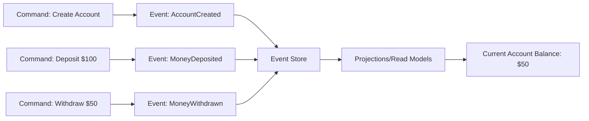
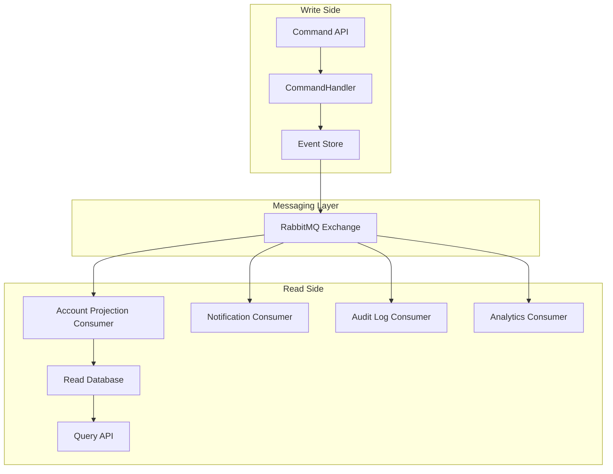

# RabbitMQ Event Sourcing

## Introduction

Event Sourcing is a powerful architectural pattern that fundamentally changes how we think about state in our applications. Rather than storing the current state of entities, event sourcing stores a sequence of state-changing events. This approach provides numerous benefits including complete audit trails, reliable event replay, and temporal querying.

In this guide, we'll explore how to implement event sourcing using RabbitMQ as the messaging backbone. RabbitMQ's reliability, flexibility, and performance make it an excellent choice for building event-sourced systems, especially for beginners looking to understand these concepts.

## What is Event Sourcing?

Event sourcing is an architectural pattern where:

1. **State changes are stored as events** rather than just updating a database
2. These events become the **source of truth** for the application
3. The current state is **derived by replaying events** in sequence

Think of event sourcing like maintaining a ledger or journal of everything that has happened in your system, instead of just keeping track of the final balance.



## Why Combine RabbitMQ with Event Sourcing?

RabbitMQ complements event sourcing by providing:

1. **Reliable message delivery** - ensuring events are not lost
2. **Decoupled architecture** - allowing systems to evolve independently
3. **Scalability** - distributing event processing across multiple consumers
4. **Message routing** - directing events to appropriate consumers
5. **Retry mechanisms** - handling failures gracefully

## Setting Up RabbitMQ for Event Sourcing

Before we start implementing, you'll need RabbitMQ installed and running. You can [install it locally](https://www.rabbitmq.com/download.html) or use a Docker container:

```bash
docker run -d --name rabbitmq -p 5672:5672 -p 15672:15672 rabbitmq:3-management
```

This command starts RabbitMQ with the management plugin enabled, accessible at `http://localhost:15672` (default credentials: guest/guest).

## Implementing Event Sourcing with RabbitMQ

Let's build a simple bank account system using event sourcing and RabbitMQ. We'll use Node.js with the `amqplib` library, but the concepts apply to any language.

### Step 1: Install Dependencies

```bash
npm init -y
npm install amqplib uuid
```

### Step 2: Define Events

First, let's define our event structure:

```javascript
// events.js
class BaseEvent {
  constructor(aggregateId) {
    this.id = require('uuid').v4();
    this.aggregateId = aggregateId;
    this.timestamp = new Date().toISOString();
    this.eventType = this.constructor.name;
  }
}

class AccountCreated extends BaseEvent {
  constructor(aggregateId, ownerName, initialBalance = 0) {
    super(aggregateId);
    this.ownerName = ownerName;
    this.initialBalance = initialBalance;
  }
}

class MoneyDeposited extends BaseEvent {
  constructor(aggregateId, amount) {
    super(aggregateId);
    this.amount = amount;
  }
}

class MoneyWithdrawn extends BaseEvent {
  constructor(aggregateId, amount) {
    super(aggregateId);
    this.amount = amount;
  }
}

module.exports = {
  AccountCreated,
  MoneyDeposited,
  MoneyWithdrawn
};
```

### Step 3: Create an Event Producer

Now, let's create a service that produces events and sends them to RabbitMQ:

```javascript
// eventProducer.js
const amqp = require('amqplib');
const { AccountCreated, MoneyDeposited, MoneyWithdrawn } = require('./events');

class EventProducer {
  constructor() {
    this.connection = null;
    this.channel = null;
    this.exchangeName = 'event_sourcing_exchange';
  }

  async connect() {
    this.connection = await amqp.connect('amqp://localhost');
    this.channel = await this.connection.createChannel();
    
    await this.channel.assertExchange(this.exchangeName, 'topic', { durable: true });
    console.log('EventProducer connected to RabbitMQ');
  }

  async publishEvent(event) {
    // Store in event store (could be a database in a real application)
    console.log(`Storing event in event store: ${event.eventType}`);
    
    // Publish to RabbitMQ
    const routingKey = `event.${event.eventType}`;
    await this.channel.publish(
      this.exchangeName,
      routingKey,
      Buffer.from(JSON.stringify(event)),
      { persistent: true }
    );
    
    console.log(`Published event: ${event.eventType} with routing key: ${routingKey}`);
    return event;
  }

  async createAccount(accountId, ownerName, initialBalance = 0) {
    const event = new AccountCreated(accountId, ownerName, initialBalance);
    return this.publishEvent(event);
  }

  async depositMoney(accountId, amount) {
    const event = new MoneyDeposited(accountId, amount);
    return this.publishEvent(event);
  }

  async withdrawMoney(accountId, amount) {
    const event = new MoneyWithdrawn(accountId, amount);
    return this.publishEvent(event);
  }

  async close() {
    if (this.channel) await this.channel.close();
    if (this.connection) await this.connection.close();
  }
}

module.exports = EventProducer;
```

### Step 4: Create an Event Consumer

Next, let's create a consumer that processes these events and builds a read model:

```javascript
// eventConsumer.js
const amqp = require('amqplib');

class EventConsumer {
  constructor() {
    this.connection = null;
    this.channel = null;
    this.exchangeName = 'event_sourcing_exchange';
    this.queueName = 'account_projection_queue';
    
    // In-memory account projections (in a real app, this would be a database)
    this.accounts = new Map();
  }

  async connect() {
    this.connection = await amqp.connect('amqp://localhost');
    this.channel = await this.connection.createChannel();
    
    // Set up exchange
    await this.channel.assertExchange(this.exchangeName, 'topic', { durable: true });
    
    // Set up queue and bindings
    const { queue } = await this.channel.assertQueue(this.queueName, { durable: true });
    await this.channel.bindQueue(queue, this.exchangeName, 'event.*');
    
    console.log('EventConsumer connected to RabbitMQ');
    
    // Start consuming events
    await this.channel.consume(queue, this.handleEvent.bind(this), { noAck: false });
    console.log('Waiting for events...');
  }

  handleEvent(msg) {
    try {
      const event = JSON.parse(msg.content.toString());
      console.log(`Received event: ${event.eventType} for account: ${event.aggregateId}`);
      
      // Apply event to projection
      this.applyEvent(event);
      
      // Acknowledge the message
      this.channel.ack(msg);
      
      // Log current state
      console.log(`Updated account state: ${JSON.stringify(this.accounts.get(event.aggregateId))}`);
    } catch (error) {
      console.error('Error processing event:', error);
      // Negative acknowledgment, requeue the message
      this.channel.nack(msg, false, true);
    }
  }

  applyEvent(event) {
    switch (event.eventType) {
      case 'AccountCreated': {
        this.accounts.set(event.aggregateId, {
          id: event.aggregateId,
          ownerName: event.ownerName,
          balance: event.initialBalance,
          createdAt: event.timestamp,
          updatedAt: event.timestamp
        });
        break;
      }
      
      case 'MoneyDeposited': {
        const account = this.accounts.get(event.aggregateId);
        if (!account) {
          throw new Error(`Account not found: ${event.aggregateId}`);
        }
        
        account.balance += event.amount;
        account.updatedAt = event.timestamp;
        break;
      }
      
      case 'MoneyWithdrawn': {
        const account = this.accounts.get(event.aggregateId);
        if (!account) {
          throw new Error(`Account not found: ${event.aggregateId}`);
        }
        
        if (account.balance < event.amount) {
          throw new Error(`Insufficient funds for account: ${event.aggregateId}`);
        }
        
        account.balance -= event.amount;
        account.updatedAt = event.timestamp;
        break;
      }
      
      default:
        console.warn(`Unknown event type: ${event.eventType}`);
    }
  }

  getAccount(accountId) {
    return this.accounts.get(accountId);
  }

  async close() {
    if (this.channel) await this.channel.close();
    if (this.connection) await this.connection.close();
  }
}

module.exports = EventConsumer;
```

### Step 5: Tying It All Together

Let's create a simple application that demonstrates the event sourcing pattern:

```javascript
// app.js
const EventProducer = require('./eventProducer');
const EventConsumer = require('./eventConsumer');

async function main() {
  // Create producer and consumer
  const producer = new EventProducer();
  const consumer = new EventConsumer();
  
  try {
    // Connect to RabbitMQ
    await producer.connect();
    await consumer.connect();
    
    // Generate a unique account ID
    const accountId = `acc_${Date.now()}`;
    
    // Wait a moment for the consumer to be ready
    await new Promise(resolve => setTimeout(resolve, 1000));
    
    console.log('
--- Creating a new account ---');
    await producer.createAccount(accountId, 'John Doe', 100);
    
    // Wait for event processing
    await new Promise(resolve => setTimeout(resolve, 500));
    
    console.log('
--- Depositing $50 ---');
    await producer.depositMoney(accountId, 50);
    
    // Wait for event processing
    await new Promise(resolve => setTimeout(resolve, 500));
    
    console.log('
--- Withdrawing $30 ---');
    await producer.withdrawMoney(accountId, 30);
    
    // Wait for event processing
    await new Promise(resolve => setTimeout(resolve, 500));
    
    // Final state
    console.log('
--- Final Account State ---');
    console.log(JSON.stringify(consumer.getAccount(accountId), null, 2));
    
  } catch (error) {
    console.error('Error:', error);
  } finally {
    // Clean up
    await new Promise(resolve => setTimeout(resolve, 1000));
    await producer.close();
    await consumer.close();
  }
}

// Run the example
main().catch(console.error);
```

### Running the Example

When you run the application with `node app.js`, you should see output similar to:

```
EventProducer connected to RabbitMQ
EventConsumer connected to RabbitMQ
Waiting for events...

--- Creating a new account ---
Storing event in event store: AccountCreated
Published event: AccountCreated with routing key: event.AccountCreated
Received event: AccountCreated for account: acc_1678912345678
Updated account state: {"id":"acc_1678912345678","ownerName":"John Doe","balance":100,"createdAt":"2023-03-15T12:34:56.789Z","updatedAt":"2023-03-15T12:34:56.789Z"}

--- Depositing $50 ---
Storing event in event store: MoneyDeposited
Published event: MoneyDeposited with routing key: event.MoneyDeposited
Received event: MoneyDeposited for account: acc_1678912345678
Updated account state: {"id":"acc_1678912345678","ownerName":"John Doe","balance":150,"createdAt":"2023-03-15T12:34:56.789Z","updatedAt":"2023-03-15T12:34:57.789Z"}

--- Withdrawing $30 ---
Storing event in event store: MoneyWithdrawn
Published event: MoneyWithdrawn with routing key: event.MoneyWithdrawn
Received event: MoneyWithdrawn for account: acc_1678912345678
Updated account state: {"id":"acc_1678912345678","ownerName":"John Doe","balance":120,"createdAt":"2023-03-15T12:34:56.789Z","updatedAt":"2023-03-15T12:34:58.789Z"}

--- Final Account State ---
{
  "id": "acc_1678912345678",
  "ownerName": "John Doe",
  "balance": 120,
  "createdAt": "2023-03-15T12:34:56.789Z",
  "updatedAt": "2023-03-15T12:34:58.789Z"
}
```

## Advanced Event Sourcing Patterns with RabbitMQ

Now that we understand the basics, let's explore some advanced patterns:

### Event Versioning

As your system evolves, events might change structure. To handle this, include a version in your events:

```javascript
class BaseEvent {
  constructor(aggregateId) {
    // ... existing properties
    this.version = 1; // Event schema version
  }
}
```

Consumers can then handle different versions appropriately:

```javascript
applyEvent(event) {
  if (event.eventType === 'AccountCreated') {
    if (event.version === 1) {
      // Handle v1 format
    } else if (event.version === 2) {
      // Handle v2 format
    }
  }
  // ...
}
```

### Snapshot Pattern

For aggregates with many events, replaying everything can be inefficient. The snapshot pattern periodically creates a snapshot of the current state:

```javascript
// snapshotService.js
class SnapshotService {
  constructor(eventStore) {
    this.eventStore = eventStore;
    this.snapshotFrequency = 100; // Take snapshot every 100 events
  }

  async createSnapshot(aggregateId) {
    const events = await this.eventStore.getEvents(aggregateId);
    
    // If enough events have accumulated
    if (events.length % this.snapshotFrequency === 0) {
      const aggregate = this.rebuildAggregateState(events);
      await this.saveSnapshot(aggregateId, aggregate, events.length);
    }
  }

  // Other methods like loadLatestSnapshot, rebuildAggregateState, etc.
}
```

### Event Upcasting

When event schemas change, you might need to transform old events:

```javascript
// eventUpcastingService.js
class EventUpcastingService {
  upcast(event) {
    // Convert older event versions to the latest format
    if (event.eventType === 'AccountCreated' && !event.version) {
      // This is an old event without versioning
      return {
        ...event,
        version: 1,
        initialBalance: event.initialBalance || 0, // Add default for new field
      };
    }
    return event;
  }
}
```

### Handling Failures with Dead Letter Exchanges

When event processing fails, we can use RabbitMQ's dead letter exchange feature:

```javascript
// Setup in consumer
async connect() {
  // ... existing setup
  
  // Set up dead letter exchange
  await this.channel.assertExchange('event_dlx', 'direct', { durable: true });
  await this.channel.assertQueue('event_dlq', { 
    durable: true,
    deadLetterExchange: '' // No more dead-lettering
  });
  
  // Bind the dead letter queue to the exchange
  await this.channel.bindQueue('event_dlq', 'event_dlx', '#');
  
  // Set up main queue with dead letter configuration
  const { queue } = await this.channel.assertQueue(this.queueName, { 
    durable: true,
    deadLetterExchange: 'event_dlx'
  });
  
  // ... continue with bindings and consumption
}
```

## Practical Event Sourcing System Architecture

In a real-world application, you'd likely have a more complex setup:



## Best Practices for RabbitMQ Event Sourcing

1. **Use durable exchanges and queues** to ensure messages survive broker restarts
2. **Implement idempotent event handlers** since events might be processed more than once
3. **Use message persistent mode** to ensure messages are written to disk
4. **Implement proper error handling** with dead letter queues
5. **Consider using publisher confirms** for critical events
6. **Monitor queue depths** to detect processing bottlenecks
7. **Implement circuit breakers** to handle downstream system failures
8. **Version your events** from the beginning

## Scaling Event Sourcing with RabbitMQ

As your system grows, you can scale by:

1. **Clustering RabbitMQ** for high availability
2. **Sharding events** by aggregate ID to distribute load
3. **Creating consumer groups** for parallel processing
4. **Implementing backpressure** to handle load spikes
5. **Using separate queues** for different projection types

For example, sharding based on aggregate ID:

```javascript
// Publish to a specific shard based on account ID
async publishEvent(event) {
  const shardId = this.getShardId(event.aggregateId);
  const routingKey = `event.${event.eventType}.shard-${shardId}`;
  // ... publish with sharded routing key
}

getShardId(aggregateId) {
  // Simple hash-based sharding
  return Math.abs(aggregateId.hashCode() % this.shardCount);
}
```

## Summary

Event sourcing with RabbitMQ provides a powerful pattern for building distributed, resilient, and scalable systems. Key takeaways include:

1. **Store events as facts** - Events are immutable records of what happened
2. **Use RabbitMQ for reliable event distribution** - Ensuring consumers receive all events
3. **Build read models from events** - Creating optimized views of data
4. **Implement versioning early** - Plan for change in your event schemas
5. **Consider advanced patterns** - Like snapshots and event upcasting for performance and evolution
6. **Handle failures gracefully** - Using dead letter queues and retry mechanisms

By combining event sourcing with RabbitMQ, you can build systems that are not only resilient but also provide complete audit trails and the ability to reconstruct state at any point in time.

## Additional Resources and Exercises

### Resources
- [RabbitMQ Official Documentation](https://www.rabbitmq.com/documentation.html)
- "Domain-Driven Design" by Eric Evans
- "Event Sourcing Pattern" by Martin Fowler
- "Enterprise Integration Patterns" by Gregor Hohpe and Bobby Woolf

### Exercises

1. **Add a new event type** - Extend the example to include an `AccountFrozen` event
2. **Implement snapshots** - Add snapshot functionality to improve performance
3. **Create a new projection** - Build a reporting projection that tracks total deposits/withdrawals per day
4. **Add validation** - Ensure commands meet business rules before creating events
5. **Implement event versioning** - Modify an event schema and handle both versions
6. **Build a replay mechanism** - Create a tool to replay events for a specific account

## Next Steps

After mastering event sourcing with RabbitMQ, you might want to explore:

- **CQRS** (Command Query Responsibility Segregation) - A natural companion to event sourcing
- **Event Store** - Specialized databases for event sourcing
- **Saga Pattern** - For coordinating distributed transactions
- **Event-driven microservices** - Building entire architectures around events