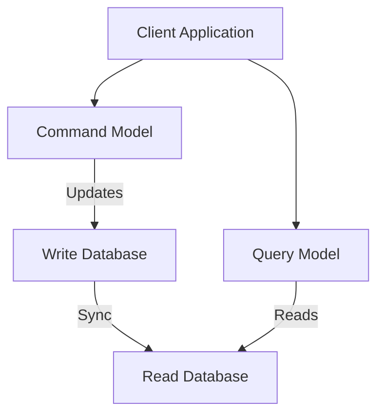
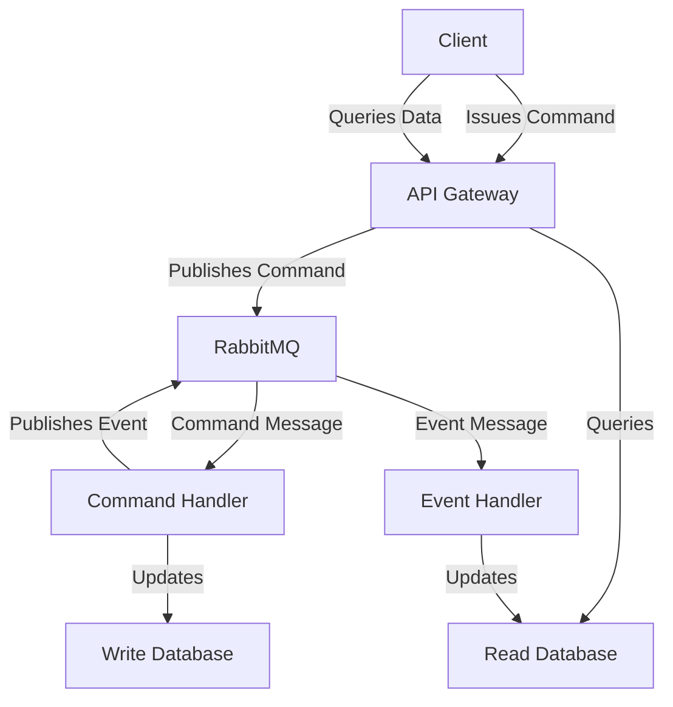
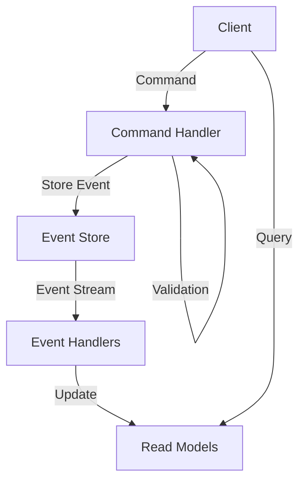

# RabbitMQ CQRS Pattern

## Introduction

The Command Query Responsibility Segregation (CQRS) pattern is a powerful architectural approach that separates the responsibility of handling commands (write operations) from queries (read operations). When implemented with RabbitMQ, this pattern can significantly enhance the scalability, performance, and maintainability of your applications.

In this tutorial, we'll explore how to implement the CQRS pattern using RabbitMQ as the messaging backbone. We'll cover the core concepts, benefits, implementation details, and provide practical examples to help you understand and apply this pattern in real-world scenarios.

## Understanding CQRS

Before diving into the implementation with RabbitMQ, let's understand what CQRS is and why it's useful.

### What is CQRS?

CQRS stands for Command Query Responsibility Segregation. As the name suggests, it separates an application's operations into two categories:

- **Commands**: Operations that change the state of the system (create, update, delete)
- **Queries**: Operations that retrieve data from the system without changing its state

In a traditional architecture, both commands and queries operate on the same data model. CQRS separates these concerns by using different models for reading and writing data.



### Benefits of CQRS

- **Scalability**: Read and write operations can be scaled independently
- **Performance optimization**: Query models can be optimized for specific read patterns
- **Flexibility**: Different storage technologies can be used for different needs
- **Maintainability**: Simpler, focused components with clear responsibilities
- **Evolution**: Read and write models can evolve independently

## Implementing CQRS with RabbitMQ

RabbitMQ fits naturally into a CQRS architecture as it provides reliable messaging between components. Here's how RabbitMQ enhances a CQRS implementation:

1. **Command handling**: Commands are published as messages to RabbitMQ queues
2. **Event propagation**: After processing commands, events are published to notify other components
3. **Eventual consistency**: Read models are updated asynchronously based on events
4. **Decoupling**: Components are loosely coupled through message exchange

### Basic Architecture



## Setting Up RabbitMQ for CQRS

Let's start by setting up the necessary RabbitMQ infrastructure for our CQRS implementation.

### Prerequisites

- RabbitMQ server installed and running
- A programming language with a RabbitMQ client library (we'll use Node.js with `amqplib` in our examples)

### Basic Setup

First, we need to establish a connection to RabbitMQ and create the necessary exchanges and queues.

```javascript
const amqp = require('amqplib');

async function setupRabbitMQ() {
  try {
    // Connect to RabbitMQ
    const connection = await amqp.connect('amqp://localhost');
    const channel = await connection.createChannel();
    
    // Declare exchanges
    await channel.assertExchange('commands', 'direct', { durable: true });
    await channel.assertExchange('events', 'fanout', { durable: true });
    
    // Declare command queues
    await channel.assertQueue('user-commands', { durable: true });
    await channel.bindQueue('user-commands', 'commands', 'user');
    
    // Declare event queues
    await channel.assertQueue('user-events-for-query-model', { durable: true });
    await channel.bindQueue('user-events-for-query-model', 'events', '');
    
    console.log('RabbitMQ setup completed');
    return { connection, channel };
  } catch (error) {
    console.error('Error setting up RabbitMQ:', error);
    throw error;
  }
}
```

This setup creates:
- A `commands` exchange for routing commands to appropriate handlers
- An `events` exchange for broadcasting events to interested components
- A queue for user-related commands
- A queue for events that update the query model

## Implementing the Command Side

The command side of CQRS handles write operations. Let's implement a simple user registration command.

### Command Producer

This component sends commands to RabbitMQ when users interact with your application.

```javascript
async function sendRegisterUserCommand(channel, userData) {
  try {
    const command = {
      type: 'RegisterUser',
      data: userData,
      metadata: {
        timestamp: new Date().toISOString(),
        id: generateUniqueId()
      }
    };
    
    await channel.publish(
      'commands',
      'user', // routing key
      Buffer.from(JSON.stringify(command)),
      { persistent: true }
    );
    
    console.log(`Command sent: ${command.type}`);
    return command.metadata.id;
  } catch (error) {
    console.error('Error sending command:', error);
    throw error;
  }
}
```

### Command Handler

This component processes commands from the queue and updates the write database.

```javascript
async function startUserCommandHandler(channel, db) {
  try {
    await channel.consume('user-commands', async (msg) => {
      if (!msg) return;
      
      const command = JSON.parse(msg.content.toString());
      console.log(`Processing command: ${command.type}`);
      
      try {
        switch (command.type) {
          case 'RegisterUser':
            // 1. Validate the command data
            const { username, email, password } = command.data;
            if (!username || !email || !password) {
              throw new Error('Invalid user data');
            }
            
            // 2. Apply business logic
            const hashedPassword = await hashPassword(password);
            
            // 3. Update the write database
            const userId = await db.users.insertOne({
              username,
              email,
              password: hashedPassword,
              createdAt: new Date()
            });
            
            // 4. Publish the event
            await publishUserRegisteredEvent(channel, {
              userId,
              username,
              email,
              createdAt: new Date().toISOString()
            });
            
            break;
            
          // Handle other command types
          default:
            console.warn(`Unknown command type: ${command.type}`);
        }
        
        // Acknowledge the message
        channel.ack(msg);
      } catch (error) {
        console.error(`Error processing command: ${error.message}`);
        // You might want to implement a dead-letter queue for failed commands
        channel.reject(msg, false);
      }
    });
    
    console.log('User command handler started');
  } catch (error) {
    console.error('Error starting command handler:', error);
    throw error;
  }
}

async function publishUserRegisteredEvent(channel, eventData) {
  const event = {
    type: 'UserRegistered',
    data: eventData,
    metadata: {
      timestamp: new Date().toISOString(),
      id: generateUniqueId()
    }
  };
  
  await channel.publish(
    'events',
    '', // routing key (fanout exchange ignores this)
    Buffer.from(JSON.stringify(event)),
    { persistent: true }
  );
  
  console.log(`Event published: ${event.type}`);
}
```

## Implementing the Query Side

The query side processes events to update read models optimized for specific query patterns.

### Event Handler

This component listens for events and updates the read database accordingly.

```javascript
async function startUserEventHandler(channel, readDb) {
  try {
    await channel.consume('user-events-for-query-model', async (msg) => {
      if (!msg) return;
      
      const event = JSON.parse(msg.content.toString());
      console.log(`Processing event: ${event.type}`);
      
      try {
        switch (event.type) {
          case 'UserRegistered':
            // Update the read model with user information
            await readDb.userProfiles.insertOne({
              userId: event.data.userId,
              username: event.data.username,
              email: event.data.email,
              registrationDate: new Date(event.data.createdAt),
              lastActive: new Date(event.data.createdAt)
            });
            break;
            
          case 'UserProfileUpdated':
            // Update the existing user profile
            await readDb.userProfiles.updateOne(
              { userId: event.data.userId },
              { $set: {
                displayName: event.data.displayName,
                bio: event.data.bio,
                lastActive: new Date()
              }}
            );
            break;
            
          // Handle other event types
          default:
            console.warn(`Unknown event type: ${event.type}`);
        }
        
        // Acknowledge the message
        channel.ack(msg);
      } catch (error) {
        console.error(`Error processing event: ${error.message}`);
        // Implement error handling strategy (retry, dead-letter, etc.)
        channel.reject(msg, false);
      }
    });
    
    console.log('User event handler started');
  } catch (error) {
    console.error('Error starting event handler:', error);
    throw error;
  }
}
```

### Query API

This component provides read access to the optimized query models.

```javascript
async function getUserProfile(readDb, username) {
  try {
    const userProfile = await readDb.userProfiles.findOne({ username });
    if (!userProfile) {
      throw new Error('User not found');
    }
    
    // Return a projection without sensitive information
    return {
      userId: userProfile.userId,
      username: userProfile.username,
      displayName: userProfile.displayName || username,
      bio: userProfile.bio || '',
      registrationDate: userProfile.registrationDate,
      lastActive: userProfile.lastActive
    };
  } catch (error) {
    console.error('Error fetching user profile:', error);
    throw error;
  }
}
```

## Creating Specialized Read Models

One of the key benefits of CQRS is the ability to create specialized read models optimized for specific query patterns. Here's an example of a read model for user activity statistics:

```javascript
async function updateUserActivityStats(readDb, event) {
  const today = new Date().toISOString().split('T')[0];
  
  switch (event.type) {
    case 'UserLoggedIn':
      // Update login count for today
      await readDb.userActivityStats.updateOne(
        { 
          userId: event.data.userId,
          date: today
        },
        { 
          $inc: { loginCount: 1 },
          $set: { lastLogin: new Date() }
        },
        { upsert: true }
      );
      break;
      
    case 'UserAction':
      // Update action statistics
      await readDb.userActivityStats.updateOne(
        { 
          userId: event.data.userId,
          date: today
        },
        { 
          $inc: { [`actions.${event.data.actionType}`]: 1 },
          $set: { lastAction: new Date() }
        },
        { upsert: true }
      );
      break;
  }
}
```

## Putting It All Together: Complete Application Example

Now, let's put everything together in a simple Express.js application that demonstrates the CQRS pattern with RabbitMQ.

```javascript
const express = require('express');
const amqp = require('amqplib');
const { MongoClient } = require('mongodb');
const bodyParser = require('body-parser');

async function startApp() {
  // Set up databases
  const mongoClient = new MongoClient('mongodb://localhost:27017');
  await mongoClient.connect();
  
  const writeDb = mongoClient.db('cqrs_write_db');
  const readDb = mongoClient.db('cqrs_read_db');
  
  // Set up RabbitMQ
  const { connection, channel } = await setupRabbitMQ();
  
  // Start command and event handlers
  startUserCommandHandler(channel, writeDb);
  startUserEventHandler(channel, readDb);
  
  // Set up Express app
  const app = express();
  app.use(bodyParser.json());
  
  // Command API endpoints
  app.post('/api/users', async (req, res) => {
    try {
      const commandId = await sendRegisterUserCommand(channel, req.body);
      res.status(202).json({
        message: 'User registration command received',
        commandId
      });
    } catch (error) {
      res.status(500).json({ error: error.message });
    }
  });
  
  // Query API endpoints
  app.get('/api/users/:username', async (req, res) => {
    try {
      const userProfile = await getUserProfile(readDb, req.params.username);
      res.json(userProfile);
    } catch (error) {
      res.status(404).json({ error: error.message });
    }
  });
  
  // Start the server
  const PORT = process.env.PORT || 3000;
  app.listen(PORT, () => {
    console.log(`Server running on port ${PORT}`);
  });
  
  // Handle graceful shutdown
  process.on('SIGINT', async () => {
    await channel.close();
    await connection.close();
    await mongoClient.close();
    process.exit(0);
  });
}

startApp().catch(console.error);
```

In this example:
1. Commands for user registration are sent to RabbitMQ
2. The command handler processes these commands and updates the write database
3. After processing commands, events are published to RabbitMQ
4. The event handler consumes these events and updates the read database
5. The query API serves read requests directly from the optimized read models

## Advanced Patterns and Considerations

### Event Sourcing with CQRS

CQRS is often used together with Event Sourcing, where instead of storing the current state, you store a sequence of state-changing events. This combination offers powerful capabilities:



### Handling Eventual Consistency

Since the read model is updated asynchronously, there's a window where it might be out of date. Here are strategies to handle this:

1. **Optimistic UI**: Update the UI optimistically assuming the command will succeed
2. **Command tracking**: Allow clients to check the status of their commands
3. **Version tracking**: Include version information in query responses
4. **Read-after-write consistency**: Direct specific reads to the write model immediately after a write

```javascript
// Example of command tracking
app.get('/api/commands/:commandId', async (req, res) => {
  const status = await getCommandStatus(req.params.commandId);
  res.json({ status });
});
```

### Error Handling and Recovery

Robust error handling is essential in distributed systems:

1. **Dead Letter Queues**: Send failed messages to a dead letter queue for later inspection
2. **Retry Mechanisms**: Implement retry policies for transient failures
3. **Event Replay**: Ability to replay events to rebuild read models
4. **Idempotent Handlers**: Ensure handlers can process the same message multiple times without side effects

```javascript
// Example of a dead letter exchange configuration
await channel.assertExchange('dead-letter', 'direct', { durable: true });
await channel.assertQueue('failed-commands', { 
  durable: true,
  arguments: {
    'x-dead-letter-exchange': 'commands',
    'x-dead-letter-routing-key': 'retry'
  }
});
```

## Real-World Use Cases

### E-commerce Order Processing

CQRS with RabbitMQ is perfect for e-commerce platforms:

- **Commands**: Place order, cancel order, update shipping address
- **Events**: OrderPlaced, PaymentReceived, OrderShipped
- **Read Models**: 
  - Customer order history
  - Admin dashboard with order statistics
  - Inventory levels

### User Activity Monitoring

Track user behavior across a system:

- **Commands**: LogActivity, RegisterSession
- **Events**: UserLoggedIn, PageViewed, FeatureUsed
- **Read Models**:
  - Real-time activity dashboard
  - User engagement reports
  - Feature usage statistics

### Financial Transaction Processing

Handle financial transactions with high reliability:

- **Commands**: TransferFunds, DepositMoney, WithdrawCash
- **Events**: FundsTransferred, DepositCompleted, WithdrawalProcessed
- **Read Models**:
  - Account balance
  - Transaction history
  - Spending analytics

## Common Pitfalls and Best Practices

### Pitfalls to Avoid

1. **Overcomplicating simple applications**: CQRS adds complexity; use it only when needed
2. **Ignoring transaction boundaries**: Define clear consistency boundaries
3. **Tight coupling**: Keep command and query models loosely coupled
4. **Neglecting error handling**: Distributed systems need robust error handling

### Best Practices

1. **Start simple**: Begin with a basic implementation and evolve as needed
2. **Use meaningful event names**: Events should describe what happened, not how to react
3. **Design for idempotence**: All handlers should be idempotent
4. **Monitor and log**: Implement comprehensive monitoring and logging
5. **Document message contracts**: Clearly define the structure of commands and events
6. **Plan for versioning**: Consider how message formats might evolve over time

## Summary

The CQRS pattern with RabbitMQ offers a powerful approach to building scalable, maintainable systems by separating read and write concerns. We've covered:

- The core concepts of CQRS
- How RabbitMQ supports the CQRS pattern
- Implementing command handlers and event processors
- Creating specialized read models
- Handling eventual consistency and error recovery
- Real-world use cases and best practices

By adopting this pattern, you can create systems that scale better, evolve more easily, and provide optimized performance for both read and write operations.

## Exercises and Next Steps

1. **Basic Implementation**: Create a simple CQRS application with one command and one read model
2. **Scale Testing**: Experiment with scaling read and write sides independently
3. **Advanced Patterns**: Add Event Sourcing to your CQRS implementation
4. **Error Handling**: Implement comprehensive error handling with dead-letter queues
5. **Performance Optimization**: Create specialized read models for different query patterns

## Additional Resources

- [RabbitMQ Official Documentation](https://www.rabbitmq.com/documentation.html)
- [Enterprise Integration Patterns](https://www.enterpriseintegrationpatterns.com/)
- [CQRS Journey by Microsoft](https://docs.microsoft.com/en-us/previous-versions/msp-n-p/jj554200(v=pandp.10))
- [Event Sourcing Basics](https://microservices.io/patterns/data/event-sourcing.html)
- [Domain-Driven Design Community](https://dddcommunity.org/)