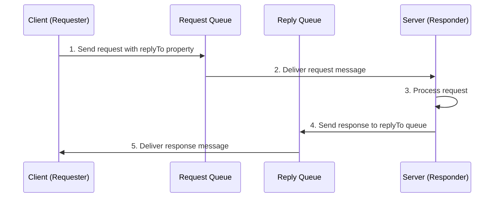

# RabbitMQ Request Reply Pattern

## Introduction

The Request-Reply pattern (sometimes called Request-Response) is a fundamental messaging pattern that enables synchronous communication between distributed services. While RabbitMQ excels at asynchronous messaging, there are many situations where you need a response to your message - like making an API call or requesting data from another service.

In this tutorial, we'll explore how to implement the Request-Reply pattern using RabbitMQ, allowing your distributed applications to communicate in a request-response fashion while still leveraging the reliability and scalability of a message broker.

## Understanding the Request-Reply Pattern

At its core, the Request-Reply pattern involves two main components:

1. **Requester (Client)**: Sends a request and waits for a response
2. **Responder (Server)**: Receives requests, processes them, and sends back responses



While this seems straightforward, implementing it in RabbitMQ requires a few specific techniques:

1. **Correlation IDs**: To match responses with their original requests
2. **Reply queues**: A way for the responder to know where to send the reply
3. **Temporary queues**: Often used for replies to avoid creating permanent infrastructure

Let's dive into implementing this pattern step by step.

## Basic Implementation

### Step 1: Setting Up the Project

For this tutorial, we'll use Node.js with the `amqplib` library. First, set up your project:

```bash
mkdir rabbitmq-request-reply
cd rabbitmq-request-reply
npm init -y
npm install amqplib
```

### Step 2: Creating the Server (Responder)

Let's create a server that will respond to requests. Save this as `server.js`:

```javascript
const amqp = require('amqplib');

async function startServer() {
  // Connect to RabbitMQ
  const connection = await amqp.connect('amqp://localhost');
  const channel = await connection.createChannel();
  
  // Create the request queue
  const requestQueue = 'rpc_queue';
  await channel.assertQueue(requestQueue, { durable: false });
  
  console.log(' [x] Server waiting for RPC requests');
  
  // Consume messages from the request queue
  channel.consume(requestQueue, async (msg) => {
    const number = parseInt(msg.content.toString());
    console.log(` [.] Received request: ${number}`);
    
    // Process the request
    const result = fibonacci(number);
    
    // Send the response back to the client
    channel.sendToQueue(
      msg.properties.replyTo,
      Buffer.from(result.toString()), 
      {
        correlationId: msg.properties.correlationId
      }
    );
    
    // Acknowledge the message
    channel.ack(msg);
  });
}

// Example function that calculates Fibonacci numbers
function fibonacci(n) {
  if (n === 0 || n === 1) {
    return n;
  }
  
  return fibonacci(n - 1) + fibonacci(n - 2);
}

startServer().catch(console.error);
```

### Step 3: Creating the Client (Requester)

Now, let's create a client that sends requests and waits for responses. Save this as `client.js`:

```javascript
const amqp = require('amqplib');
const { v4: uuidv4 } = require('uuid');

async function sendRequest(n) {
  // Connect to RabbitMQ
  const connection = await amqp.connect('amqp://localhost');
  const channel = await connection.createChannel();
  
  // Create a reply queue with a random name
  const { queue: replyQueue } = await channel.assertQueue('', { 
    exclusive: true 
  });
  
  // Generate a unique correlation ID for this request
  const correlationId = uuidv4();
  
  // Set up a promise to resolve when we get a response
  return new Promise((resolve, reject) => {
    // Set a timeout for the request
    const timeout = setTimeout(() => {
      channel.close();
      connection.close();
      reject(new Error('Request timed out'));
    }, 10000);
    
    // Listen for responses on our reply queue
    channel.consume(replyQueue, (msg) => {
      // Check if this response matches our request
      if (msg.properties.correlationId === correlationId) {
        // Clear the timeout and resolve the promise with the result
        clearTimeout(timeout);
        const result = parseInt(msg.content.toString());
        
        // Close the channel and connection
        setTimeout(() => {
          channel.close();
          connection.close();
        }, 500);
        
        // Resolve the promise with the result
        resolve(result);
      }
    }, { noAck: true });
    
    // Send the request
    console.log(` [x] Requesting fibonacci(${n})`);
    channel.sendToQueue('rpc_queue', 
      Buffer.from(n.toString()),
      { 
        correlationId,
        replyTo: replyQueue 
      }
    );
  });
}

// Usage
async function run() {
  const num = process.argv[2] ? parseInt(process.argv[2]) : 30;
  
  try {
    const result = await sendRequest(num);
    console.log(` [.] Got ${result}`);
  } catch (error) {
    console.error(error);
  }
}

run();
```

### Step 4: Running the Example

First, make sure RabbitMQ is running. Then start the server in one terminal:

```bash
node server.js
```

And in another terminal, run the client:

```bash
node client.js 10
```

You should see output like:

```
# Server terminal
[x] Server waiting for RPC requests
[.] Received request: 10

# Client terminal
[x] Requesting fibonacci(10)
[.] Got 55
```

## Key Components Explained

### Correlation ID

The correlation ID is a unique identifier sent with each request that helps match responses to their corresponding requests. This is crucial when:

- Multiple clients share a reply queue
- A client sends multiple requests concurrently

When a server processes a request, it includes the same correlation ID in the response, allowing the client to identify which response belongs to which request.

### Reply-To Queue

The reply-to property tells the server where to send its response. This can be:

1. **Temporary Queue**: Each client creates its own temporary queue for replies (as shown in our example)
2. **Shared Queue**: Multiple clients use the same queue, relying on correlation IDs to distinguish messages

Temporary queues are created with:
- `exclusive: true`: Only accessible by the creating connection
- Empty name (`''`): RabbitMQ generates a random name like `amq.gen-AbC123XyZ`

### Waiting for the Response

In our client, we use a Promise to wait for the response:

1. Create a Promise that will resolve when we get a matching response
2. Set up a consumer on the reply queue that checks correlation IDs
3. When a matching response arrives, resolve the Promise
4. Add a timeout to handle cases where no response arrives

## Practical Example: Microservice Communication

Let's look at a more practical example where a user service needs to validate permissions with an auth service:

### Auth Service (server.js)

```javascript
const amqp = require('amqplib');

async function startAuthService() {
  const connection = await amqp.connect('amqp://localhost');
  const channel = await connection.createChannel();
  
  const requestQueue = 'auth_requests';
  await channel.assertQueue(requestQueue, { durable: true });
  
  console.log(' [x] Auth Service ready to validate permissions');
  
  channel.consume(requestQueue, async (msg) => {
    const request = JSON.parse(msg.content.toString());
    console.log(` [.] Validating: ${request.userId} for action ${request.action}`);
    
    // Simulate permission check
    const hasPermission = checkPermission(request.userId, request.action);
    
    // Prepare response
    const response = {
      userId: request.userId,
      action: request.action,
      permitted: hasPermission,
      timestamp: new Date().toISOString()
    };
    
    // Send response back
    channel.sendToQueue(
      msg.properties.replyTo,
      Buffer.from(JSON.stringify(response)), 
      {
        correlationId: msg.properties.correlationId
      }
    );
    
    channel.ack(msg);
  });
}

function checkPermission(userId, action) {
  // In a real app, this would check a database
  const permissions = {
    'user123': ['read', 'write'],
    'user456': ['read']
  };
  
  return permissions[userId] && permissions[userId].includes(action);
}

startAuthService().catch(console.error);
```

### User Service (client.js)

```javascript
const amqp = require('amqplib');
const { v4: uuidv4 } = require('uuid');

class AuthClient {
  constructor() {
    this.connection = null;
    this.channel = null;
    this.replyQueue = '';
    this.pendingRequests = new Map();
  }
  
  async connect() {
    this.connection = await amqp.connect('amqp://localhost');
    this.channel = await connection.createChannel();
    
    // Set up reply queue
    const { queue } = await this.channel.assertQueue('', { exclusive: true });
    this.replyQueue = queue;
    
    // Start consuming responses
    this.channel.consume(this.replyQueue, (msg) => {
      const correlationId = msg.properties.correlationId;
      const resolver = this.pendingRequests.get(correlationId);
      
      if (resolver) {
        const response = JSON.parse(msg.content.toString());
        resolver.resolve(response);
        this.pendingRequests.delete(correlationId);
      }
    }, { noAck: true });
  }
  
  async checkPermission(userId, action) {
    const correlationId = uuidv4();
    
    // Create pending request entry
    const requestPromise = new Promise((resolve, reject) => {
      const timeout = setTimeout(() => {
        this.pendingRequests.delete(correlationId);
        reject(new Error('Request timed out'));
      }, 5000);
      
      this.pendingRequests.set(correlationId, {
        resolve: (value) => {
          clearTimeout(timeout);
          resolve(value);
        }
      });
    });
    
    // Send the request
    const request = { userId, action };
    this.channel.sendToQueue(
      'auth_requests',
      Buffer.from(JSON.stringify(request)),
      {
        correlationId,
        replyTo: this.replyQueue
      }
    );
    
    return requestPromise;
  }
  
  async close() {
    await this.channel.close();
    await this.connection.close();
  }
}

// Usage Example
async function runExample() {
  const authClient = new AuthClient();
  await authClient.connect();
  
  try {
    // Try different permissions
    const result1 = await authClient.checkPermission('user123', 'write');
    console.log('Permission check result:', result1);
    
    const result2 = await authClient.checkPermission('user456', 'write');
    console.log('Permission check result:', result2);
  } finally {
    await authClient.close();
  }
}

runExample().catch(console.error);
```

## Best Practices for Request-Reply Pattern

### 1. Set Appropriate Timeouts

Always include a timeout for waiting on responses. Network issues or server failures could cause a request to never receive a response.

```javascript
// Example timeout implementation
const timeout = setTimeout(() => {
  reject(new Error('Request timed out after 5 seconds'));
}, 5000);
```

### 2. Handle Connection Failures

Both the client and server should gracefully handle connection issues:

```javascript
// Connection error handling
connection.on('error', (err) => {
  console.error('Connection error', err);
  // Implement reconnection logic
});
```

### 3. Use Durable Queues for Critical Requests

For important requests that shouldn't be lost if a server restarts, use durable queues:

```javascript
await channel.assertQueue('critical_requests', { durable: true });
```

### 4. Implement Circuit Breakers

For production systems, implement a circuit breaker pattern to avoid overwhelming failing services:

```javascript
// Simplified circuit breaker example
class CircuitBreaker {
  constructor(requestFn, options = {}) {
    this.requestFn = requestFn;
    this.failureThreshold = options.failureThreshold || 3;
    this.resetTimeout = options.resetTimeout || 30000;
    this.failures = 0;
    this.state = 'CLOSED'; // CLOSED, OPEN, HALF-OPEN
  }
  
  async execute(...args) {
    if (this.state === 'OPEN') {
      throw new Error('Circuit is OPEN');
    }
    
    try {
      const result = await this.requestFn(...args);
      this.success();
      return result;
    } catch (error) {
      this.failure();
      throw error;
    }
  }
  
  success() {
    this.failures = 0;
    this.state = 'CLOSED';
  }
  
  failure() {
    this.failures++;
    if (this.failures >= this.failureThreshold) {
      this.state = 'OPEN';
      setTimeout(() => {
        this.state = 'HALF-OPEN';
        this.failures = 0;
      }, this.resetTimeout);
    }
  }
}
```

### 5. Consider Using Direct Reply-To for Efficiency

RabbitMQ has a special feature called Direct Reply-To (`amq.rabbitmq.reply-to`) that provides a more efficient way to implement request-reply without creating temporary queues:

```javascript
// Using Direct Reply-To
channel.sendToQueue(
  'rpc_queue',
  Buffer.from(request),
  { 
    correlationId,
    replyTo: 'amq.rabbitmq.reply-to' 
  }
);
```

## Common Pitfalls and Solutions

### 1. Resource Leaks

**Problem**: Not properly closing channels and connections.

**Solution**: Always use proper cleanup:

```javascript
// Proper resource cleanup
function cleanup() {
  try {
    if (channel) await channel.close();
    if (connection) await connection.close();
  } catch (err) {
    console.error('Error during cleanup', err);
  }
}
```

### 2. Message Routing Issues

**Problem**: Messages aren't being routed to the right queue.

**Solution**: Double-check queue names and bindings. Use the RabbitMQ Management UI to inspect queues.

### 3. Memory Leaks with Pending Requests

**Problem**: If responses never arrive, your pending requests map keeps growing.

**Solution**: Always use timeouts to clean up pending requests:

```javascript
setTimeout(() => {
  pendingRequests.delete(correlationId);
}, 10000);
```

## Real-World Applications

Request-Reply with RabbitMQ is commonly used in:

1. **Microservice Architectures**: For synchronous operations between services
2. **Distributed Computing**: Distributing work to worker nodes and collecting results
3. **API Gateways**: Routing client requests to backend services
4. **Authentication & Authorization**: Validating user permissions across services
5. **Data Enrichment**: Fetching additional data to enhance a message

## Alternative Approaches

### 1. REST APIs

If you need truly synchronous communication, consider using REST:

**Pros**:
- Simpler to implement
- Better for synchronous operations

**Cons**:
- Less reliable (no built-in retries)
- Tight coupling between services

### 2. Callbacks (Fire and Forget)

Instead of waiting for responses, send a callback destination:

```javascript
// In the request:
{
  "data": "...",
  "callbackQueue": "service.callbacks"
}
```

**Pros**:
- Better decoupling
- Client doesn't block waiting

**Cons**:
- More complex to track request state
- Requires state management

## Summary

The Request-Reply pattern in RabbitMQ provides a powerful way to implement synchronous-like communication in asynchronous messaging systems. It combines the reliability of message queues with the convenience of request-response interactions.

Key concepts to remember:
- Use correlation IDs to match responses with requests
- Create temporary reply queues for client-specific responses
- Set timeouts to handle missing responses
- Consider using Direct Reply-To for efficiency
- Properly manage resources and clean up connections

By following these principles, you can build robust distributed systems that communicate effectively, even when synchronous interactions are required.

## Exercises

1. Modify the Fibonacci example to handle errors (e.g., if a negative number is provided)
2. Implement the Request-Reply pattern using the Direct Reply-To feature
3. Create a load-balanced responder system with multiple servers consuming from the same request queue
4. Implement retries in the client for failed requests
5. Build a simple distributed calculator with different operations (add, subtract, multiply, divide)

## Additional Resources

- [RabbitMQ Tutorials: RPC](https://www.rabbitmq.com/tutorials/tutorial-six-javascript.html)
- [Direct Reply-To Documentation](https://www.rabbitmq.com/direct-reply-to.html)
- [Patterns for Distributed Systems](https://www.enterpriseintegrationpatterns.com/)
- [Understanding AMQP Protocol](https://www.rabbitmq.com/amqp-0-9-1-reference.html)