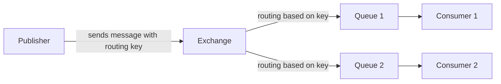
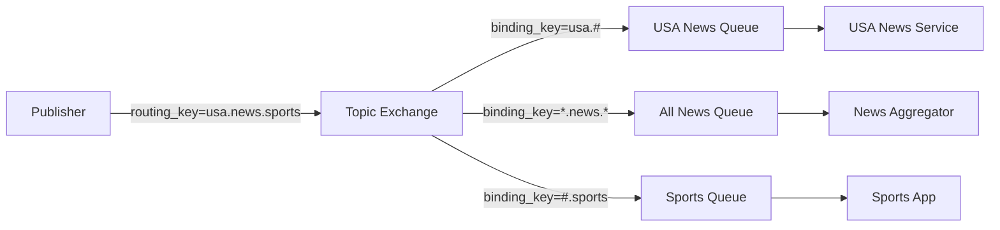
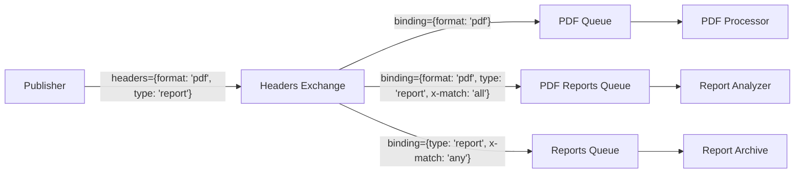

# RabbitMQ Routing

## Introduction

Message routing is a fundamental concept in RabbitMQ that allows publishers to send messages selectively to different consumers. Instead of broadcasting every message to all consumers or manually managing message distribution, routing gives you fine-grained control over message flow.

In this guide, we'll explore how RabbitMQ implements routing through exchanges and binding keys, allowing you to build flexible messaging architectures that deliver the right messages to the right services.

## Understanding the Routing Concept

At its core, routing in RabbitMQ is about directing messages to their intended destinations based on specific criteria. This is handled through a combination of:

1. **Exchanges** - The "post offices" that receive messages from publishers
2. **Queues** - The "mailboxes" where messages wait to be consumed
3. **Bindings** - The "rules" that connect exchanges to queues
4. **Routing Keys** - The "addresses" on messages that exchanges use to decide where to send them

Let's visualize this relationship:



## Types of Exchanges for Routing

RabbitMQ provides several exchange types, each with different routing behaviors:

1. **Direct Exchange** - Routes messages to queues whose binding key exactly matches the routing key
2. **Topic Exchange** - Routes messages based on wildcard pattern matching between routing key and binding key
3. **Headers Exchange** - Routes based on message header attributes instead of routing keys
4. **Fanout Exchange** - Broadcasts all messages to all bound queues (no routing keys used)

Let's explore each of these in detail with examples.

## Direct Exchange Routing

The direct exchange delivers messages to queues based on an exact match between the routing key and binding key.

### How Direct Exchange Works

```mermaid
graph LR
    P[Publisher] -->|routing_key="payment"| E[Direct Exchange]
    E -->|binding_key="payment"| Q1[Payment Queue]
    E -->|binding_key="order"| Q2[Order Queue]
    E -->|binding_key="shipping"| Q3[Shipping Queue]
    Q1 --> C1[Payment Service]
    Q2 --> C2[Order Service]
    Q3 --> C3[Shipping Service]
```

### Direct Exchange Example

Let's implement a simple logging system where logs are routed based on severity level:

```javascript
// Connection setup code omitted for brevity
const amqp = require('amqplib');

async function setupDirectExchange() {
  try {
    // Create connection
    const connection = await amqp.connect('amqp://localhost');
    const channel = await connection.createChannel();
    
    // Declare exchange
    const exchange = 'logs_direct';
    await channel.assertExchange(exchange, 'direct', { durable: false });
    
    // Declare queues
    const errorQueue = await channel.assertQueue('error_logs', { durable: true });
    const infoQueue = await channel.assertQueue('info_logs', { durable: true });
    const warningQueue = await channel.assertQueue('warning_logs', { durable: true });
    
    // Bind queues to exchange with specific binding keys
    await channel.bindQueue(errorQueue.queue, exchange, 'error');
    await channel.bindQueue(infoQueue.queue, exchange, 'info');
    await channel.bindQueue(warningQueue.queue, exchange, 'warning');
    
    console.log('Logging system setup complete');
    
    // Publishing example
    channel.publish(exchange, 'error', Buffer.from('This is an error message'));
    channel.publish(exchange, 'info', Buffer.from('This is an info message'));
    channel.publish(exchange, 'warning', Buffer.from('This is a warning message'));
    
    // Consumer code would be in a separate file
  } catch (error) {
    console.error('Error:', error);
  }
}

setupDirectExchange();
```

In this example:
1. We create a direct exchange called 'logs_direct'
2. We create three queues for different log levels
3. We bind each queue to the exchange with a binding key matching the log level
4. When publishing, we specify the routing key that matches the intended binding key

## Topic Exchange Routing

Topic exchanges allow for more flexible routing using patterns with wildcards:

- `*` (star) substitutes exactly one word
- `#` (hash) substitutes zero or more words

### How Topic Exchange Works



### Topic Exchange Example

Let's implement a news distribution system using topic exchanges:

```javascript
// Connection setup code omitted for brevity
const amqp = require('amqplib');

async function setupTopicExchange() {
  try {
    // Create connection
    const connection = await amqp.connect('amqp://localhost');
    const channel = await connection.createChannel();
    
    // Declare exchange
    const exchange = 'news_topics';
    await channel.assertExchange(exchange, 'topic', { durable: true });
    
    // Declare queues
    const usaQueue = await channel.assertQueue('usa_news', { durable: true });
    const allNewsQueue = await channel.assertQueue('all_news', { durable: true });
    const sportsQueue = await channel.assertQueue('sports_news', { durable: true });
    
    // Bind queues with pattern matching
    await channel.bindQueue(usaQueue.queue, exchange, 'usa.#');
    await channel.bindQueue(allNewsQueue.queue, exchange, '*.news.*');
    await channel.bindQueue(sportsQueue.queue, exchange, '#.sports');
    
    console.log('News distribution system setup complete');
    
    // Publishing examples
    channel.publish(exchange, 'usa.news.politics', 
      Buffer.from('US election update'));
    
    channel.publish(exchange, 'europe.news.sports', 
      Buffer.from('Champions League results'));
    
    // This message will go to both USA news and sports queues
    channel.publish(exchange, 'usa.news.sports', 
      Buffer.from('US Open tennis results'));
    
  } catch (error) {
    console.error('Error:', error);
  }
}

setupTopicExchange();
```

In this example:
1. Messages with 'usa.news.politics' routing key go to the USA queue
2. Messages with 'europe.news.sports' go to both the all news and sports queues
3. Messages with 'usa.news.sports' go to all three queues

## Headers Exchange Routing

Headers exchanges route messages based on header attributes rather than routing keys. This is useful when you need to route based on multiple criteria.

### How Headers Exchange Works



### Headers Exchange Example

Let's implement a document processing system using headers exchanges:

```javascript
// Connection setup code omitted for brevity
const amqp = require('amqplib');

async function setupHeadersExchange() {
  try {
    // Create connection
    const connection = await amqp.connect('amqp://localhost');
    const channel = await connection.createChannel();
    
    // Declare exchange
    const exchange = 'document_processing';
    await channel.assertExchange(exchange, 'headers', { durable: true });
    
    // Declare queues
    const pdfQueue = await channel.assertQueue('pdf_processing', { durable: true });
    const reportQueue = await channel.assertQueue('report_processing', { durable: true });
    const archiveQueue = await channel.assertQueue('document_archive', { durable: true });
    
    // Bind queues with header matching
    await channel.bindQueue(pdfQueue.queue, exchange, '', {
      'format': 'pdf',
      'x-match': 'all'  // must match all headers
    });
    
    await channel.bindQueue(reportQueue.queue, exchange, '', {
      'type': 'report',
      'x-match': 'all'
    });
    
    await channel.bindQueue(archiveQueue.queue, exchange, '', {
      'format': 'pdf',
      'type': 'report',
      'x-match': 'any'  // match any of these headers
    });
    
    console.log('Document processing system setup complete');
    
    // Publishing examples
    channel.publish(exchange, '', 
      Buffer.from('PDF Report Content'), {
        headers: {
          format: 'pdf',
          type: 'report',
          department: 'finance'
        }
      });
    
    channel.publish(exchange, '', 
      Buffer.from('Excel Data Content'), {
        headers: {
          format: 'xlsx',
          type: 'report',
          department: 'sales'
        }
      });
    
  } catch (error) {
    console.error('Error:', error);
  }
}

setupHeadersExchange();
```

In this example:
1. The PDF report message matches all three queues
2. The Excel report message only matches the report queue

## Practical Applications of Routing

Now that we understand the different routing mechanisms, let's look at some practical real-world applications:

### Microservices Communication

Routing is essential in microservice architectures where different services need to selectively receive relevant messages:

```javascript
// Order processing system with multiple services

// Order Service publishes events with different routing keys
channel.publish('order_events', 'order.created', 
  Buffer.from(JSON.stringify(orderData)));

channel.publish('order_events', 'order.payment.completed', 
  Buffer.from(JSON.stringify(paymentData)));

channel.publish('order_events', 'order.shipped', 
  Buffer.from(JSON.stringify(shippingData)));

// Different services bind to relevant events
// Payment service binds to: "order.created", "order.payment.*"
// Shipping service binds to: "order.payment.completed", "order.shipped"
// Notification service binds to: "order.#" (all order events)
```

### Error Handling and Dead Letter Exchanges

Routing can be used for sophisticated error handling:

```javascript
// Setup dead letter exchange for failed messages
await channel.assertExchange('dead_letter_exchange', 'direct');
const deadLetterQueue = await channel.assertQueue('failed_messages');
await channel.bindQueue(deadLetterQueue.queue, 'dead_letter_exchange', 'failed');

// Configure main queue with dead letter routing
const mainQueue = await channel.assertQueue('main_processing_queue', {
  deadLetterExchange: 'dead_letter_exchange',
  deadLetterRoutingKey: 'failed'
});

// Now any rejected/expired messages from mainQueue will be routed to deadLetterQueue
```

### Priority Routing

You can implement priority-based message processing:

```javascript
// Setup priority queues
const highPriorityQueue = await channel.assertQueue('high_priority');
const normalPriorityQueue = await channel.assertQueue('normal_priority');
const lowPriorityQueue = await channel.assertQueue('low_priority');

// Bind to a direct exchange with priority levels as routing keys
await channel.bindQueue(highPriorityQueue.queue, 'task_exchange', 'high');
await channel.bindQueue(normalPriorityQueue.queue, 'task_exchange', 'normal');
await channel.bindQueue(lowPriorityQueue.queue, 'task_exchange', 'low');

// Consumer services can then connect to different priority queues
// based on their capacity and importance
```

## Best Practices for RabbitMQ Routing

1. **Choose the right exchange type** for your routing needs:
   - Direct exchange for simple routing
   - Topic exchange for pattern-based routing
   - Headers exchange for complex attribute-based routing
   - Fanout exchange when you need to broadcast to all queues

2. **Design routing keys carefully**:
   - Use dot-separated hierarchical structures for topic exchanges (e.g., `region.service.event`)
   - Keep a consistent naming convention
   - Document your routing key structure

3. **Consider message persistence**:
   - Use durable exchanges and queues for important messages
   - Set `persistent: true` for messages that shouldn't be lost

4. **Implement error handling**:
   - Use dead letter exchanges for failed message processing
   - Add retry mechanisms with incrementing routing keys

5. **Monitor your routing topology**:
   - Keep track of bindings and message flow
   - Use RabbitMQ Management UI to visualize routing

## Summary

RabbitMQ routing provides powerful mechanisms to direct messages from publishers to consumers based on various criteria:

- **Direct exchanges** match exact routing keys
- **Topic exchanges** use pattern matching with wildcards
- **Headers exchanges** route based on message attributes
- Each type has specific use cases and advantages

By understanding and properly implementing routing in RabbitMQ, you can build flexible, scalable messaging architectures that efficiently deliver the right messages to the right services at the right time.

## Exercises

1. Set up a direct exchange with three different routing keys and observe how messages flow to different queues.

2. Implement a topic exchange for a weather notification system where consumers can subscribe to updates for specific cities, regions, or event types.

3. Create a headers exchange that routes customer support tickets based on priority, department, and issue type.

4. Design a dead letter exchange system that captures failed messages and routes them to appropriate handling services.

## Additional Resources

- [RabbitMQ Tutorials](https://www.rabbitmq.com/getstarted.html)
- [RabbitMQ Exchange Types](https://www.rabbitmq.com/tutorials/amqp-concepts.html#exchanges)
- [RabbitMQ Dead Letter Exchanges](https://www.rabbitmq.com/dlx.html)
- [Designing Messaging Patterns](https://www.enterpriseintegrationpatterns.com/)