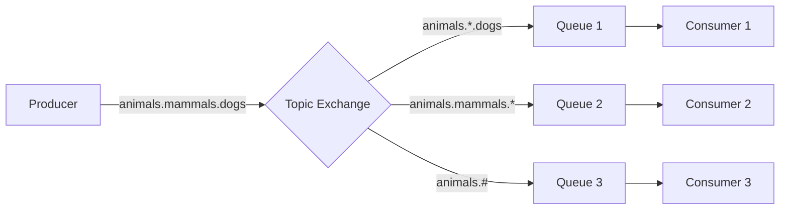

# RabbitMQ Topics

## Introduction

Topic exchanges in RabbitMQ provide one of the most flexible ways to route messages between producers and consumers. Unlike direct exchanges that route based on exact routing key matches, topic exchanges allow for pattern-based routing. This enables powerful pub/sub scenarios where consumers can subscribe to specific categories or patterns of messages.

In this guide, we'll explore how topic exchanges work, when to use them, and how to implement them in your applications.

## What are Topic Exchanges?

A topic exchange routes messages to queues based on wildcard matches between the routing key and the queue binding pattern. The routing key must be a list of words delimited by dots (e.g., `stock.usd.nyse`, `weather.europe.germany.berlin`).

The binding key must also be in the same format, but with two important special characters for pattern matching:
- `*` (asterisk) can substitute for exactly one word
- `#` (hash) can substitute for zero or more words

## Topic Exchange Behavior

Here's how topic exchanges work:

1. A producer publishes a message to the exchange with a specific routing key, like `animals.mammals.dogs`
2. The exchange examines all bindings and routes the message to queues with matching binding patterns
3. Consumers receive messages from their subscribed queues



## Setting Up a Topic Exchange in RabbitMQ

Let's create a practical example using a weather information system.

### Step 1: Creating a Topic Exchange

First, we need to declare a topic exchange:

```javascript
// JavaScript (Node.js with amqplib)
const amqp = require('amqplib');

async function setup() {
  const connection = await amqp.connect('amqp://localhost');
  const channel = await connection.createChannel();
  
  // Declare a topic exchange
  await channel.assertExchange('weather_updates', 'topic', {
    durable: true
  });
  
  // Rest of the code will follow
}

setup();
```

### Step 2: Publishing Messages

Now, let's create a publisher that sends weather updates with routing keys:

```javascript
// Weather update publisher
async function publishWeatherUpdate(channel, area, severity, temperature) {
  const routingKey = `weather.${area}.${severity}`;
  const message = {
    temperature,
    timestamp: new Date().toISOString(),
    area,
    severity
  };
  
  channel.publish(
    'weather_updates', 
    routingKey, 
    Buffer.from(JSON.stringify(message))
  );
  
  console.log(`Published: ${routingKey} - ${temperature}°C`);
}

// Usage examples
publishWeatherUpdate(channel, 'europe.london', 'normal', 18);
publishWeatherUpdate(channel, 'europe.paris', 'warning', 36);
publishWeatherUpdate(channel, 'america.newyork', 'critical', 40);
```

### Step 3: Consuming Messages

Now let's create consumers with different binding patterns:

```javascript
// Consumer for all European weather updates
async function setupEuropeConsumer() {
  const connection = await amqp.connect('amqp://localhost');
  const channel = await connection.createChannel();
  
  await channel.assertExchange('weather_updates', 'topic', { durable: true });
  
  // Create a queue with a generated name
  const { queue } = await channel.assertQueue('', { exclusive: true });
  
  // Bind to all European weather updates
  await channel.bindQueue(queue, 'weather_updates', 'weather.europe.#');
  
  console.log(`Listening for European weather updates...`);
  
  channel.consume(queue, (message) => {
    if (message) {
      const content = JSON.parse(message.content.toString());
      console.log(`[EUROPE] ${message.fields.routingKey}: ${content.temperature}°C in ${content.area}`);
      channel.ack(message);
    }
  });
}

// Consumer for all critical alerts regardless of location
async function setupCriticalConsumer() {
  const connection = await amqp.connect('amqp://localhost');
  const channel = await connection.createChannel();
  
  await channel.assertExchange('weather_updates', 'topic', { durable: true });
  
  const { queue } = await channel.assertQueue('', { exclusive: true });
  
  // Bind to all critical alerts
  await channel.bindQueue(queue, 'weather_updates', 'weather.*.critical');
  
  console.log(`Listening for critical weather alerts...`);
  
  channel.consume(queue, (message) => {
    if (message) {
      const content = JSON.parse(message.content.toString());
      console.log(`[CRITICAL] Alert: ${content.temperature}°C in ${content.area}!`);
      channel.ack(message);
    }
  });
}

// Start both consumers
setupEuropeConsumer();
setupCriticalConsumer();
```

### Output Example

When running the above code, you might see output like this:

```
Publisher:
Published: weather.europe.london.normal - 18°C
Published: weather.europe.paris.warning - 36°C
Published: weather.america.newyork.critical - 40°C

Europe Consumer:
Listening for European weather updates...
[EUROPE] weather.europe.london.normal: 18°C in europe.london
[EUROPE] weather.europe.paris.warning: 36°C in europe.paris

Critical Consumer:
Listening for critical weather alerts...
[CRITICAL] Alert: 40°C in america.newyork!
```

## Common Binding Patterns and Their Meanings

Here are some example binding patterns and what they mean:

| Binding Pattern | What It Matches |
|-----------------|-----------------|
| `weather.#` | All weather messages regardless of location or severity |
| `weather.*.critical` | Critical weather alerts for any single-word location |
| `weather.america.*` | All weather updates for America with any single-word severity |
| `weather.europe.#` | All weather updates for Europe, regardless of specific location or severity |
| `#` | All messages (use with caution!) |
| `weather.*.normal` | Normal weather updates for any single-word location |

## When to Use Topic Exchanges

Topic exchanges are ideal for:

1. **Category-based messaging**: When your messages naturally fall into hierarchical categories
2. **Multi-dimensional filtering**: When consumers need to filter on multiple criteria
3. **Flexible subscription models**: When different consumers need different subsets of messages
4. **Geographic or organizational data**: Information naturally organized in hierarchies

## Real-World Applications

### Application 1: Log Processing System

A log processing system might use topic exchanges to route logs based on source, severity, and component:

```
logs.production.auth.error
logs.staging.api.warning
logs.production.database.critical
```

Different teams could subscribe to relevant patterns:

- Security team: `logs.*.auth.#`
- Database administrators: `logs.*.database.#`
- DevOps on-call: `logs.production.*.critical`

### Application 2: Stock Trading Platform

A stock trading platform might use topics to distribute market data:

```
market.stock.AAPL.price
market.stock.GOOGL.dividend
market.forex.EUR-USD.price
```

Clients could subscribe based on their interests:

- Apple stock watchers: `market.stock.AAPL.#`
- Dividend hunters: `market.stock.*.dividend`
- Forex traders: `market.forex.#`

## Implementation Tips

1. **Design your routing keys carefully**: Create a consistent scheme that makes sense for your domain
2. **Document your routing key format**: Make sure all developers understand the format
3. **Consider performance**: Very complex routing topologies might impact performance
4. **Handle edge cases**: Plan what happens when no queues match a message
5. **Use meaningful names**: Make your routing keys self-descriptive

## Topic vs. Other Exchange Types

| Exchange Type | Best For |
|---------------|----------|
| **Topic** | Category-based routing with wildcard support |
| **Direct** | Simple routing based on exact key matching |
| **Fanout** | Broadcasting to all bound queues |
| **Headers** | Routing based on message header attributes |

## Common Pitfalls and How to Avoid Them

1. **Too generic binding patterns**: Using `#` alone matches everything, which might overwhelm consumers
2. **Overlapping bindings**: Be aware that a message can be delivered to multiple queues
3. **Routing key length**: Very long routing keys can be cumbersome to manage
4. **Inconsistent naming**: Stick to a consistent naming convention

## Summary

Topic exchanges in RabbitMQ provide a powerful, flexible way to route messages based on patterns. By using dot-delimited routing keys and special wildcards (`*` and `#`), you can create sophisticated message routing topologies that adapt to your specific business needs.

Remember these key points:
- Use `.` (dots) to separate words in routing keys
- `*` matches exactly one word
- `#` matches zero or more words
- Design your routing key hierarchy thoughtfully
- Topic exchanges are ideal for category-based routing

## Exercises

1. Create a topic exchange for a news distribution system with categories, regions, and urgency levels
2. Set up consumers that subscribe to:
   - All sports news regardless of region
   - All urgent news from a specific region
   - All political news from multiple regions
3. Implement a message replay feature that republishes messages with the same routing keys

## Additional Resources

- [RabbitMQ Topic Exchange Documentation](https://www.rabbitmq.com/tutorials/tutorial-five-python.html)
- [Advanced Routing Patterns](https://www.rabbitmq.com/tutorials/amqp-concepts.html)
- [Designing Event-Driven Systems](https://www.confluent.io/designing-event-driven-systems/)

---

With topic exchanges, you have a powerful tool to implement flexible, category-based message routing in your distributed systems. The combination of structured routing keys and wildcard-based pattern matching makes this one of the most versatile features in RabbitMQ.