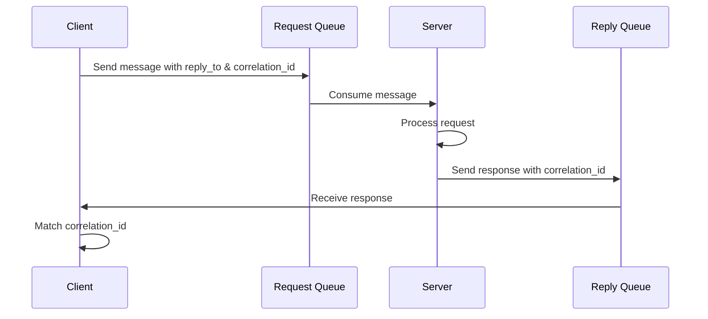

# RabbitMQ RPC

## Introduction

Remote Procedure Call (RPC) is a powerful messaging pattern that allows a client application to request a service from a server application running on a different system, without needing to understand the network details. RabbitMQ, as a message broker, provides an excellent foundation for implementing RPC patterns in distributed systems.

In this tutorial, we'll explore how to build a simple RPC system using RabbitMQ, where a client sends a request and waits for a response from a server that processes the request.

## Understanding RPC in Messaging Systems

In traditional RPC models, a client directly calls a procedure on a remote server and waits for the result. With message-based RPC using RabbitMQ, this interaction is broken down into:

1. The client sends a message to a request queue
2. The server (consumer) processes the request
3. The server sends back a response to a queue where the client is listening
4. The client receives and processes the response

This approach provides several advantages:
- **Decoupling**: The client doesn't need to know where the server is located
- **Load balancing**: Multiple servers can process requests from the same queue
- **Fault tolerance**: If a server fails, another can take over
- **Asynchronous processing**: Clients can make requests without blocking

## Basic RPC Pattern with RabbitMQ

Let's implement a simple RPC system where a client sends a number, and the server calculates its Fibonacci value.

### RPC Pattern Diagram



### Implementation Details

For our implementation, we'll need:

1. A client that:
   - Creates a unique callback queue for replies
   - Sends messages with two properties:
     - `reply_to`: Specifies the callback queue
     - `correlation_id`: A unique value for each request

2. A server that:
   - Listens to the request queue
   - Processes requests
   - Sends responses to the queue specified in `reply_to`
   - Includes the same `correlation_id` in the response

### Server Implementation

First, let's implement the server that processes Fibonacci calculations:

```javascript
// rpc_server.js
const amqp = require('amqplib');

// Fibonacci function - calculates nth Fibonacci number
function fibonacci(n) {
  if (n == 0 || n == 1)
    return n;
  else
    return fibonacci(n - 1) + fibonacci(n - 2);
}

async function startServer() {
  try {
    // Connect to RabbitMQ server
    const connection = await amqp.connect('amqp://localhost');
    const channel = await connection.createChannel();
    
    const queue = 'rpc_queue';
    
    // Make sure the queue exists
    await channel.assertQueue(queue, {
      durable: false
    });
    
    // Only process one message at a time
    channel.prefetch(1);
    
    console.log(' [x] Awaiting RPC requests');
    
    // Consume messages from the queue
    channel.consume(queue, async (msg) => {
      const n = parseInt(msg.content.toString());
      
      console.log(` [.] Calculating fibonacci(${n})`);
      
      // Calculate the result
      const result = fibonacci(n);
      
      // Send response back using the provided reply_to queue and correlation_id
      channel.sendToQueue(
        msg.properties.replyTo,
        Buffer.from(result.toString()),
        {
          correlationId: msg.properties.correlationId
        }
      );
      
      // Acknowledge the message
      channel.ack(msg);
    });
  } catch (error) {
    console.error(error);
  }
}

startServer();
```

### Client Implementation

Now, let's implement the client that sends requests and waits for responses:

```javascript
// rpc_client.js
const amqp = require('amqplib');
const { v4: uuidv4 } = require('uuid');

class FibonacciRpcClient {
  constructor() {
    this.connection = null;
    this.channel = null;
    this.callbackQueue = null;
    this.responses = {};
    this.consumers = {};
  }
  
  async connect() {
    this.connection = await amqp.connect('amqp://localhost');
    this.channel = await connection.createChannel();
    
    // Create an exclusive callback queue
    const queueResult = await this.channel.assertQueue('', {
      exclusive: true
    });
    this.callbackQueue = queueResult.queue;
    
    // Consume responses
    this.channel.consume(
      this.callbackQueue,
      (msg) => {
        // Get the correlation ID
        const correlationId = msg.properties.correlationId;
        
        // If we have a pending request with this ID
        if (correlationId in this.responses) {
          // Get the response
          const content = msg.content.toString();
          
          // Resolve the promise with the response
          this.responses[correlationId].resolve(content);
          
          // Clean up
          delete this.responses[correlationId];
        }
      },
      {
        noAck: true
      }
    );
  }
  
  async call(n) {
    // Generate a unique correlation ID
    const correlationId = uuidv4();
    
    // Create a promise that will be resolved when we get a response
    const promise = new Promise((resolve, reject) => {
      this.responses[correlationId] = { resolve, reject };
    });
    
    // Send the request
    this.channel.sendToQueue(
      'rpc_queue',
      Buffer.from(n.toString()),
      {
        correlationId: correlationId,
        replyTo: this.callbackQueue
      }
    );
    
    // Return the promise
    return promise;
  }
  
  async close() {
    await this.channel.close();
    await this.connection.close();
  }
}

// Example usage
async function main() {
  const fibonacciRpc = new FibonacciRpcClient();
  await fibonacciRpc.connect();
  
  console.log(' [x] Requesting fibonacci(30)');
  
  // Call the RPC and wait for the response
  const result = await fibonacciRpc.call(30);
  console.log(' [.] Got', result);
  
  // Close the connection
  await fibonacciRpc.close();
}

main().catch(console.error);
```

## Example Output

When you run the server and then the client, you should see:

**Server output:**
```
[x] Awaiting RPC requests
[.] Calculating fibonacci(30)
```

**Client output:**
```
[x] Requesting fibonacci(30)
[.] Got 832040
```

## Important Considerations

When implementing RPC with RabbitMQ, keep these best practices in mind:

### 1. Error Handling

The server should always respond, even in error cases. Otherwise, clients might hang indefinitely.

```javascript
try {
  // Process request and send response
} catch (error) {
  // Send error response
  channel.sendToQueue(
    msg.properties.replyTo,
    Buffer.from(JSON.stringify({ error: error.message })),
    {
      correlationId: msg.properties.correlationId
    }
  );
}
```

### 2. Timeouts

Clients should implement timeouts to prevent waiting forever:

```javascript
async call(n, timeout = 5000) {
  const correlationId = uuidv4();
  
  const promise = new Promise((resolve, reject) => {
    this.responses[correlationId] = { resolve, reject };
    
    // Set timeout
    setTimeout(() => {
      if (correlationId in this.responses) {
        delete this.responses[correlationId];
        reject(new Error('Request timed out'));
      }
    }, timeout);
  });
  
  // ... rest of the method
}
```

### 3. Response Correlation

Always ensure your correlation IDs are unique and properly tracked:

```javascript
// Generate a truly unique ID
const correlationId = `${process.pid}-${Date.now()}-${Math.random().toString(36).substring(2, 15)}`;
```

## Real-World Applications

RPC patterns with RabbitMQ are widely used in microservices architectures. Here are some practical applications:

### 1. Distributed Computation

When you need to distribute computational tasks:

```javascript
// client.js
const result = await rpcClient.call({
  operation: 'image-processing',
  data: imageBuffer.toString('base64')
});
```

### 2. Authentication Services

Centralizing authentication across services:

```javascript
// client.js
const authResult = await rpcClient.call({
  operation: 'verify-token',
  token: userToken
});

if (authResult.valid) {
  // Proceed with authenticated operation
}
```

### 3. Data Aggregation

Collecting data from multiple services:

```javascript
// client.js
const userData = await rpcClient.call({
  operation: 'get-user-profile',
  userId: '12345',
  includeOrders: true,
  includePayments: true
});
```

## Performance Considerations

### Connection and Channel Reuse

For production applications, you should reuse connections and channels:

```javascript
// Create a singleton RPC client
let rpcClient = null;

async function getRpcClient() {
  if (!rpcClient) {
    rpcClient = new FibonacciRpcClient();
    await rpcClient.connect();
  }
  return rpcClient;
}
```

### Batch Processing

For better throughput, consider batching multiple requests:

```javascript
async function batchCall(numbers) {
  const batchId = uuidv4();
  const promises = numbers.map((n, index) => {
    return this.call({
      batchId,
      index,
      value: n
    });
  });
  
  return Promise.all(promises);
}
```

## Summary

RabbitMQ RPC provides a powerful pattern for building distributed systems with request-response interactions. By following the principles outlined in this tutorial, you can create robust, scalable RPC implementations that:

- Properly track requests and responses
- Handle errors gracefully
- Set appropriate timeouts
- Scale to handle increased load

The key components of a RabbitMQ RPC system are:
1. A client that sends requests with a correlation ID and reply-to queue
2. A server that processes requests and sends responses to the specified queue
3. A mechanism for correlating responses with requests

## Exercises

1. Modify the Fibonacci example to handle errors (e.g., negative numbers)
2. Implement a timeout mechanism in the client
3. Extend the server to handle multiple types of operations
4. Create a load-balanced RPC system with multiple servers
5. Implement a priority system where some requests are processed before others

## Additional Resources

- [RabbitMQ Tutorial - RPC](https://www.rabbitmq.com/tutorials/tutorial-six-javascript.html)
- [Advanced Message Queuing Protocol (AMQP) Specification](https://www.amqp.org/specification/0-9-1/amqp-org-download)
- [Designing Distributed Systems: Patterns and Paradigms for Scalable, Reliable Services](https://www.oreilly.com/library/view/designing-distributed-systems/9781491983638/)