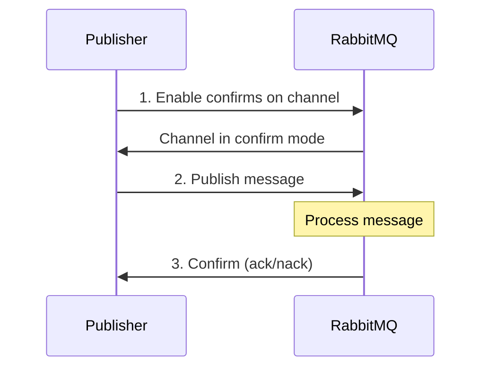

# RabbitMQ Publisher Confirms

## Introduction

When sending messages to RabbitMQ, how do you know if your message was actually received by the broker? What if your application sends a critical message but the broker crashes before processing it? This is where **Publisher Confirms** come into play.

Publisher Confirms are a RabbitMQ extension to the AMQP protocol that provide a way for publishers to receive acknowledgments from the broker when messages have been successfully processed. Think of it as a receipt that guarantees your message was safely delivered.

In this tutorial, we'll learn:
- Why Publisher Confirms are important
- How to enable and use Publisher Confirms
- Different implementation strategies
- Best practices for reliable messaging

## Why Use Publisher Confirms?

Without Publisher Confirms, publishing messages to RabbitMQ is essentially a "fire and forget" operation. Your application sends a message and assumes it was processed successfully. But in distributed systems, many things can go wrong:

- Network issues between your publisher and the broker
- The broker might be overloaded or crash
- Memory pressure could cause message drops

By enabling Publisher Confirms, your application can know with certainty that messages were safely received and processed by the broker.

## How Publisher Confirms Work

<div className="mermaid-container">

</div>

The process follows these steps:

1. The publisher enables confirms on a channel
2. The publisher sends messages through this channel
3. The broker asynchronously sends back confirms (acknowledgments) for each message
4. These confirms indicate whether the message was successfully processed or not

## Enabling Publisher Confirms

Publisher Confirms must be enabled on a per-channel basis. Here's how to do it in various languages:

### Java

```java
// Create a channel
Channel channel = connection.createChannel();

// Enable publisher confirms
channel.confirmSelect();
```

### Python (Pika)

```python
# Create a channel
channel = connection.channel()

# Enable publisher confirms
channel.confirm_delivery()
```

### Node.js (amqplib)

```javascript
// Create a channel
const channel = await connection.createChannel();

// Enable publisher confirms
await channel.confirmSelect();
```

### C# (.NET)

```csharp
// Create a channel
IModel channel = connection.CreateModel();

// Enable publisher confirms
channel.ConfirmSelect();
```

## Implementation Strategies

There are three main strategies for using Publisher Confirms:

1. **Publish messages individually and wait for confirms synchronously**
2. **Publish messages in batches and wait for confirms**
3. **Publish messages asynchronously and handle confirms with callbacks**

Let's explore each approach in detail.

### Strategy 1: Individual Confirms (Synchronous)

This is the simplest approach but also the slowest:

```javascript
// Enable confirms
channel.confirmSelect();

// Publish a message and wait for confirmation
channel.basicPublish("exchange", "routing-key", null, message.getBytes());
if (channel.waitForConfirms()) {
    System.out.println("Message confirmed!");
} else {
    System.out.println("Message was not confirmed :(");
}
```

**Advantages:**
- Simple to implement
- Easy to understand

**Disadvantages:**
- Very slow (waits for each confirmation before sending the next message)
- Not suitable for high-throughput applications

### Strategy 2: Batch Confirms

This approach publishes a batch of messages and then waits for all confirms:

```java
// Enable confirms
channel.confirmSelect();

// Publish batch of messages
int batchSize = 100;
int outstandingMessageCount = 0;

for (int i = 0; i < MESSAGE_COUNT; i++) {
    channel.basicPublish("exchange", "routing-key", null, message.getBytes());
    outstandingMessageCount++;

    if (outstandingMessageCount == batchSize) {
        channel.waitForConfirms();
        outstandingMessageCount = 0;
    }
}

// Wait for outstanding confirms
if (outstandingMessageCount > 0) {
    channel.waitForConfirms();
}
```

**Advantages:**
- Better throughput than individual confirms
- Still relatively simple to implement

**Disadvantages:**
- If a confirm fails, you don't know which specific message failed
- Need to keep track of all messages in the batch for retry
- Still blocks the publishing process while waiting for confirms

### Strategy 3: Asynchronous Confirms

This is the most efficient approach, using callbacks to handle confirms:

```java
// Enable confirms
channel.confirmSelect();

// Set up confirm listeners
ConcurrentNavigableMap<Long, String> outstandingConfirms = new ConcurrentSkipListMap<>();

channel.addConfirmListener(
    // Ack handler
    (sequenceNumber, multiple) -> {
        if (multiple) {
            // Confirm all messages up to this sequence number
            ConcurrentNavigableMap<Long, String> confirmed = outstandingConfirms.headMap(
                    sequenceNumber, true
            );
            confirmed.clear();
        } else {
            // Confirm just this message
            outstandingConfirms.remove(sequenceNumber);
        }
    },
    // Nack handler
    (sequenceNumber, multiple) -> {
        String body = outstandingConfirms.get(sequenceNumber);
        System.err.format(
            "Message with body %s has been nacked. Sequence number: %d, multiple: %b%n",
            body, sequenceNumber, multiple
        );
        
        // Handle the nack perhaps by republishing
        if (multiple) {
            ConcurrentNavigableMap<Long, String> nacked = outstandingConfirms.headMap(
                    sequenceNumber, true
            );
            nacked.clear();
        } else {
            outstandingConfirms.remove(sequenceNumber);
        }
    }
);

// Publish messages and track with sequence numbers
for (String body : messages) {
    outstandingConfirms.put(channel.getNextPublishSeqNo(), body);
    channel.basicPublish("exchange", "routing-key", null, body.getBytes());
}
```

**Advantages:**
- Highest possible throughput
- Non-blocking - publishing continues while confirms are processed
- Can track exactly which messages succeeded or failed

**Disadvantages:**
- More complex to implement
- Requires careful sequence number tracking
- Need to manage concurrent access to shared data structures

## Handling Negative Acknowledgments (Nacks)

Sometimes RabbitMQ cannot process a message and will send a negative acknowledgment (nack). This can happen if:

- The message cannot be routed to any queue
- Internal broker errors occur

When receiving a nack, your application should implement an appropriate strategy:

1. **Log the failure** for later investigation
2. **Republish the message** (potentially with a retry limit)
3. **Store the message** in a "dead letter" storage for manual handling

## Practical Example: Reliable Order Processing System

Let's build a more complete example of a system that processes orders reliably using Publisher Confirms:

```java
import com.rabbitmq.client.*;

import java.io.IOException;
import java.nio.charset.StandardCharsets;
import java.util.concurrent.*;

public class ReliableOrderProcessor {

    private static final String EXCHANGE_NAME = "orders";
    private static final String ROUTING_KEY = "new.order";
    
    public static void main(String[] argv) throws Exception {
        ConnectionFactory factory = new ConnectionFactory();
        factory.setHost("localhost");
        
        try (Connection connection = factory.newConnection();
             Channel channel = connection.createChannel()) {
             
            // Declare exchange
            channel.exchangeDeclare(EXCHANGE_NAME, "direct", true);
            
            // Enable publisher confirms
            channel.confirmSelect();
            
            // Keep track of published messages
            ConcurrentNavigableMap<Long, Order> outstandingConfirms = new ConcurrentSkipListMap<>();
            
            // Set up confirm listeners
            channel.addConfirmListener(
                // Ack handler
                (sequenceNumber, multiple) -> {
                    if (multiple) {
                        ConcurrentNavigableMap<Long, Order> confirmed = outstandingConfirms.headMap(
                                sequenceNumber, true
                        );
                        confirmed.forEach((seq, order) -> 
                            System.out.printf("Order %s confirmed!%n", order.getId()));
                        confirmed.clear();
                    } else {
                        Order order = outstandingConfirms.remove(sequenceNumber);
                        System.out.printf("Order %s confirmed!%n", order.getId());
                    }
                },
                // Nack handler
                (sequenceNumber, multiple) -> {
                    if (multiple) {
                        ConcurrentNavigableMap<Long, Order> nacked = outstandingConfirms.headMap(
                                sequenceNumber, true
                        );
                        nacked.forEach((seq, order) -> {
                            System.err.printf("Order %s nacked! Will retry.%n", order.getId());
                            // Republish failed orders
                            republishOrder(channel, order, outstandingConfirms);
                        });
                        nacked.clear();
                    } else {
                        Order order = outstandingConfirms.remove(sequenceNumber);
                        System.err.printf("Order %s nacked! Will retry.%n", order.getId());
                        // Republish failed order
                        republishOrder(channel, order, outstandingConfirms);
                    }
                }
            );
            
            // Process sample orders
            for (int i = 1; i <= 10; i++) {
                Order order = new Order("ORD-" + i, "Product-" + i, i);
                publishOrder(channel, order, outstandingConfirms);
                
                // Wait a bit between order submissions
                Thread.sleep(500);
            }
            
            // Wait for all confirms
            if (!outstandingConfirms.isEmpty()) {
                System.out.println("Waiting for outstanding confirms...");
                Thread.sleep(5000);
            }
        }
    }
    
    private static void publishOrder(
            Channel channel, 
            Order order, 
            ConcurrentNavigableMap<Long, Order> outstandingConfirms) throws IOException {
            
        // Get next sequence number
        long sequenceNumber = channel.getNextPublishSeqNo();
        
        // Track this order with its sequence number
        outstandingConfirms.put(sequenceNumber, order);
        
        // Publish the order
        String orderJson = order.toJson();
        channel.basicPublish(
            EXCHANGE_NAME, 
            ROUTING_KEY,
            MessageProperties.PERSISTENT_TEXT_PLAIN,
            orderJson.getBytes(StandardCharsets.UTF_8)
        );
        
        System.out.printf("Published order %s with sequence number %d%n", 
            order.getId(), sequenceNumber);
    }
    
    private static void republishOrder(
            Channel channel, 
            Order order, 
            ConcurrentNavigableMap<Long, Order> outstandingConfirms) {
        try {
            // Simple retry logic - in production, you might want more sophisticated retry handling
            publishOrder(channel, order, outstandingConfirms);
        } catch (IOException e) {
            System.err.printf("Failed to republish order %s: %s%n", 
                order.getId(), e.getMessage());
        }
    }
    
    // Simple Order class
    static class Order {
        private final String id;
        private final String product;
        private final int quantity;
        
        Order(String id, String product, int quantity) {
            this.id = id;
            this.product = product;
            this.quantity = quantity;
        }
        
        String getId() {
            return id;
        }
        
        String toJson() {
            return String.format(
                "{\"id\":\"%s\",\"product\":\"%s\",\"quantity\":%d}",
                id, product, quantity);
        }
    }
}
```

**Output example:**

```
Published order ORD-1 with sequence number 1
Order ORD-1 confirmed!
Published order ORD-2 with sequence number 2
Order ORD-2 confirmed!
Published order ORD-3 with sequence number 3
Order ORD-3 confirmed!
Published order ORD-4 with sequence number 4
Order ORD-4 nacked! Will retry.
Published order ORD-4 with sequence number 5
Order ORD-4 confirmed!
...
```

## Best Practices

To get the most out of Publisher Confirms, follow these best practices:

1. **Use asynchronous confirms** for high-throughput applications
2. **Combine with persistent messages** (delivery mode 2) for maximum reliability
3. **Implement proper error handling** for nacks
4. **Add adequate logging** to track message flow
5. **Consider using transactions** for critical messages (though they are slower)
6. **Implement retry logic** with exponential backoff
7. **Set up dead letter exchanges** for repeatedly failed messages
8. **Monitor confirm latency** as part of your application metrics

## Performance Considerations

Publisher Confirms do introduce some overhead. Here are some performance considerations:

- **Individual synchronous confirms** can reduce throughput to a few hundred messages per second
- **Batch confirms** can achieve a few thousand messages per second
- **Asynchronous confirms** can achieve tens of thousands of messages per second
- The more nodes in your RabbitMQ cluster, the longer confirms may take (as the message needs to be replicated)

## Summary

Publisher Confirms provide a reliable way to ensure your messages have been safely received by the RabbitMQ broker. By implementing the asynchronous confirmation pattern, you can achieve both high throughput and strong reliability guarantees.

This becomes especially important in distributed systems where message delivery guarantees are crucial for system integrity and data consistency.

## Exercises

1. Implement a simple producer using the synchronous individual confirm strategy
2. Modify your implementation to use batch confirms and compare the performance
3. Implement the asynchronous confirm strategy and add proper error handling
4. Create a system that republishes failed messages with an exponential backoff strategy
5. Extend the example to persist unconfirmed messages to disk for recovery after application restart

## Additional Resources

- [RabbitMQ Publisher Confirms Documentation](https://www.rabbitmq.com/confirms.html)
- [RabbitMQ Reliability Guide](https://www.rabbitmq.com/reliability.html)
- [RabbitMQ Management UI](https://www.rabbitmq.com/management.html) - For monitoring message confirmations and server health