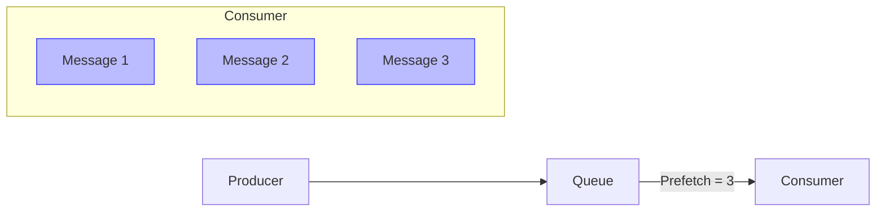

# RabbitMQ Consumer Prefetch

## Introduction

When working with message queues in RabbitMQ, one of the most important configuration settings that can significantly impact your application's performance is the **consumer prefetch** setting. This setting controls how many messages RabbitMQ will deliver to a consumer at once before requiring acknowledgments.

Understanding and properly configuring prefetch values is crucial for building efficient and responsive message-processing systems. In this guide, we'll explore what prefetch is, why it matters, and how to implement it effectively in your applications.

## What is Consumer Prefetch?

Consumer prefetch (also known as QoS or Quality of Service) limits the number of unacknowledged messages that can be delivered to a consumer at once. By default, RabbitMQ will send as many messages as it can to consumers that have subscribed to a queue, which can potentially overwhelm them.

The prefetch value acts as a flow control mechanism, ensuring that consumers only receive a manageable number of messages at a time.



## Why Prefetch Matters

Without a prefetch limit, RabbitMQ will push all messages in a queue to the first available consumer. This can lead to several problems:

1. **Memory pressure**: Consumers may get overwhelmed with too many messages in memory
2. **Worker imbalance**: Some workers might be overloaded while others remain idle
3. **Message loss risk**: If a consumer with many unacknowledged messages crashes, all those messages need to be requeued and reprocessed

By setting an appropriate prefetch value, you can:

- Distribute work more evenly across multiple consumers
- Control memory usage on consumer applications
- Improve overall system resilience and reliability
- Optimize throughput based on your specific workload characteristics

## Setting the Prefetch Value

In most RabbitMQ client libraries, you set the prefetch value using a channel-level method. Here's how to do it in a few popular languages:

### Node.js (amqplib)

```javascript
// Connect and create a channel
const connection = await amqp.connect('amqp://localhost');
const channel = await connection.createChannel();

// Set the prefetch count to 10
await channel.prefetch(10);

// Now consume messages
channel.consume('my_queue', async (msg) => {
  // Process message
  console.log(`Received: ${msg.content.toString()}`);
  
  // Acknowledge the message when done
  channel.ack(msg);
}, { noAck: false });
```

### Python (Pika)

```python
import pika

# Connect and create a channel
connection = pika.BlockingConnection(pika.ConnectionParameters('localhost'))
channel = connection.channel()

# Set the prefetch count to 10
channel.basic_qos(prefetch_count=10)

# Define a callback function for message processing
def callback(ch, method, properties, body):
    print(f"Received: {body.decode()}")
    # Process message
    ch.basic_ack(delivery_tag=method.delivery_tag)

# Start consuming with acknowledgments
channel.basic_consume(queue='my_queue', on_message_callback=callback, auto_ack=False)
print("Waiting for messages. To exit press CTRL+C")
channel.start_consuming()
```

### Java (Spring AMQP)

```java
@Configuration
public class RabbitConfig {
    @Bean
    public SimpleRabbitListenerContainerFactory rabbitListenerContainerFactory(
            ConnectionFactory connectionFactory) {
        SimpleRabbitListenerContainerFactory factory = new SimpleRabbitListenerContainerFactory();
        factory.setConnectionFactory(connectionFactory);
        factory.setPrefetchCount(10);
        factory.setAcknowledgeMode(AcknowledgeMode.MANUAL);
        return factory;
    }
}

@Component
public class MessageConsumer {
    @RabbitListener(queues = "my_queue", containerFactory = "rabbitListenerContainerFactory")
    public void receiveMessage(Message message, Channel channel) throws IOException {
        try {
            String content = new String(message.getBody());
            System.out.println("Received: " + content);
            // Process message
            
            // Acknowledge message
            channel.basicAck(message.getMessageProperties().getDeliveryTag(), false);
        } catch (Exception e) {
            // Reject and requeue on error
            channel.basicNack(message.getMessageProperties().getDeliveryTag(), false, true);
        }
    }
}
```

## Choosing the Right Prefetch Value

Finding the optimal prefetch value depends on several factors:

1. **Message processing time**: For fast-processing messages, higher values work well. For slow-processing messages, lower values are better.
2. **System resources**: Consider your consumer's memory and CPU constraints.
3. **Concurrency model**: Thread-based vs. event-loop processing will impact optimal values.
4. **Reliability requirements**: Lower values provide better work distribution but may reduce throughput.

### General Guidelines:

- **Start low and increase gradually**: Begin with a prefetch of 1-10 and test performance.
- **For slow processing tasks** (`>100ms` per message): Use smaller values (1-5).
- **For fast processing tasks** (`<10ms` per message): Use larger values (100-300).
- **Monitor and adjust**: There's no one-size-fits-all setting.

## Global vs. Per-Consumer Prefetch

RabbitMQ offers two types of prefetch settings:

1. **Per-consumer prefetch** (default): Limits unacknowledged messages for each individual consumer.
2. **Global prefetch**: Limits the total number of unacknowledged messages for all consumers on a channel.

Most of the time, per-consumer prefetch is what you want. Here's how to set global prefetch in different languages:

### Node.js (amqplib)

```javascript
// Set global prefetch (second parameter as true)
await channel.prefetch(30, true);
```

### Python (Pika)

```python
# Set global prefetch
channel.basic_qos(prefetch_count=30, global_=True)
```

### Java (Spring AMQP)

```java
factory.setGlobalQos(true);
factory.setPrefetchCount(30);
```

## Real-World Example: Worker Queue with Fair Dispatch

Let's build a task processing system that distributes work fairly among multiple workers:

### Producer (Node.js)

```javascript
const amqp = require('amqplib');

async function sendTasks() {
  const connection = await amqp.connect('amqp://localhost');
  const channel = await connection.createChannel();
  const queue = 'task_queue';
  
  // Make sure the queue exists
  await channel.assertQueue(queue, { durable: true });
  
  // Send 20 tasks with varying complexity
  for (let i = 1; i <= 20; i++) {
    const dots = '.'.repeat(i % 5 + 1);  // Varying task complexity
    const message = `Processing task ${i} ${dots}`;
    
    channel.sendToQueue(queue, Buffer.from(message), {
      persistent: true  // Message will survive broker restarts
    });
    console.log(`Sent: ${message}`);
  }
  
  setTimeout(() => {
    connection.close();
    process.exit(0);
  }, 500);
}

sendTasks().catch(console.error);
```

### Consumer Worker (Node.js)

```javascript
const amqp = require('amqplib');

async function startWorker() {
  const connection = await amqp.connect('amqp://localhost');
  const channel = await connection.createChannel();
  const queue = 'task_queue';
  
  // Make sure the queue exists
  await channel.assertQueue(queue, { durable: true });
  
  // Set prefetch to 1 for fair dispatch
  await channel.prefetch(1);
  
  console.log(`Worker waiting for messages. To exit press CTRL+C`);
  
  channel.consume(queue, async (msg) => {
    const content = msg.content.toString();
    console.log(`Received: ${content}`);
    
    // Simulate processing time (longer for messages with more dots)
    const dots = content.split('.').length - 1;
    await new Promise(resolve => setTimeout(resolve, dots * 1000));
    
    console.log(`Done processing: ${content}`);
    channel.ack(msg);
  }, { noAck: false });
}

startWorker().catch(console.error);
```

### What This Example Demonstrates

When you run multiple instances of this worker, each with a prefetch of 1, you'll see:

1. Tasks are distributed evenly across workers
2. Faster workers automatically get more messages
3. No worker gets overwhelmed with too many messages at once

### Without Prefetch

Without setting prefetch (or with a high value), the first worker would receive most or all of the messages, regardless of how busy it is. This would lead to poor resource utilization and longer processing times.

## Common Pitfalls and Best Practices

### Pitfalls to Avoid

1. **Setting prefetch too high**: Can overwhelm consumers and lead to poor distribution
2. **Setting prefetch too low**: Can limit throughput unnecessarily
3. **Forgetting to acknowledge messages**: Will eventually block new message delivery once prefetch limit is reached
4. **Using auto-ack with high prefetch**: Can lead to message loss if consumer crashes

### Best Practices

1. **Match prefetch to processing capacity**: Consider how many messages your consumer can process in parallel
2. **Use prefetch=1 for fair work distribution**: Especially when processing time varies
3. **Increase prefetch for high-throughput scenarios**: When messages are processed very quickly
4. **Consider your acknowledgment strategy**: Batch acknowledgments may require higher prefetch values
5. **Monitor queue metrics**: RabbitMQ Management UI can show message rates and consumer utilization

## Performance Testing

Before deploying to production, it's valuable to test different prefetch settings:

1. Start with a low prefetch (1-10)
2. Measure throughput (messages/second)
3. Gradually increase prefetch and re-measure
4. Plot a graph of throughput vs. prefetch setting
5. Identify the "sweet spot" where throughput levels off

## Summary

RabbitMQ's consumer prefetch setting is a powerful tool for controlling message delivery and optimizing system performance. By limiting how many unacknowledged messages a consumer can have at once, you can ensure fair work distribution, prevent memory issues, and build more resilient systems.

Key takeaways:

- Prefetch limits unacknowledged messages delivered to consumers
- Lower values (1-5) provide better work distribution
- Higher values can improve throughput for fast-processing messages
- Always test different values to find what works best for your workload
- Consider message processing time when choosing values

## Additional Resources

- [RabbitMQ Consumer Prefetch Documentation](https://www.rabbitmq.com/consumer-prefetch.html)
- [RabbitMQ Work Queues Tutorial](https://www.rabbitmq.com/tutorials/tutorial-two-python.html)
- [RabbitMQ Performance Best Practices](https://www.rabbitmq.com/production-checklist.html)

## Exercises

1. Set up a RabbitMQ instance and create a worker queue with multiple consumers.
2. Experiment with different prefetch values (1, 10, 100) and measure how they affect message distribution.
3. Implement a system where some messages take longer to process than others, and observe how prefetch impacts fairness.
4. Write a script that discovers the optimal prefetch value for your specific workload by testing multiple values.
5. Modify the consumer code to use batch acknowledgment and determine how this affects the optimal prefetch value.