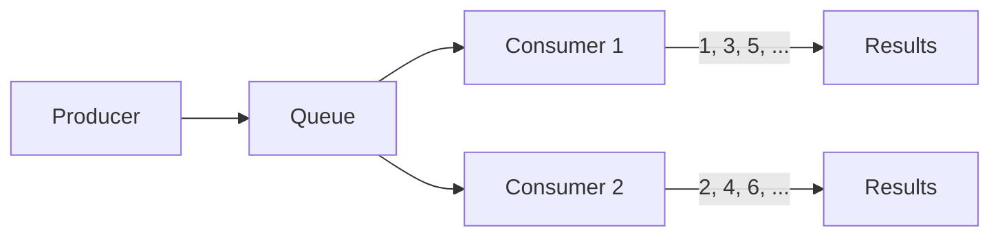
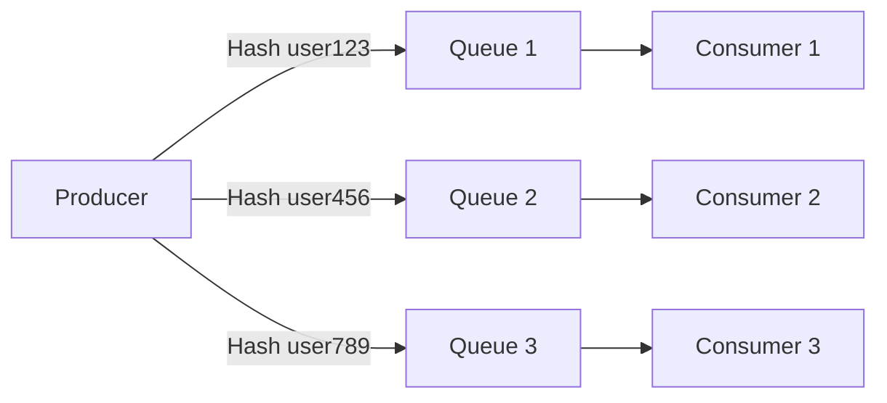

# RabbitMQ Message Ordering

## Introduction

When building distributed systems with RabbitMQ, one common challenge developers face is ensuring messages are processed in a specific order. While RabbitMQ makes message delivery reliable, its default behavior doesn't automatically guarantee that messages will be consumed in the exact order they were published.

In this guide, we'll explore:
- How RabbitMQ handles message ordering by default
- When message order matters (and when it doesn't)
- Practical patterns to implement reliable ordering
- Real-world examples showing these patterns in action

## Understanding Default Ordering Behavior

RabbitMQ provides the following guarantees regarding message ordering:

1. **Within a single queue**: Messages published to a queue from a single producer will be delivered to consumers in the same order they were published.

2. **Multiple consumers**: When multiple consumers read from the same queue, each consumer receives a subset of messages, but overall ordering across consumers is not guaranteed.

3. **Multiple queues**: There are no ordering guarantees across different queues, even when published by the same producer.

Let's visualize how this works:



In this scenario, messages arrive in order (1, 2, 3, 4, 5, 6...), but with multiple consumers, the processing order becomes non-deterministic.

## When Does Message Order Matter?

Not all messaging scenarios require strict ordering. Understanding your requirements is crucial:

### Order Matters When:
- Processing financial transactions for an account
- Tracking state changes for an entity (e.g., order status updates)
- Implementing event sourcing patterns
- Handling incremental updates to a dataset

### Order May Not Matter When:
- Processing independent tasks (e.g., image resizing)
- Handling analytics events
- Managing notifications
- Processing batch operations

## Basic Ordering Guarantees Example

Let's look at a basic example of publishing and consuming messages with RabbitMQ:

```javascript
// Producer code
const amqp = require('amqplib');

async function publishMessages() {
  const connection = await amqp.connect('amqp://localhost');
  const channel = await connection.createChannel();
  const queue = 'ordered_queue';
  
  await channel.assertQueue(queue, {durable: true});
  
  // Publish 5 ordered messages
  for (let i = 1; i <= 5; i++) {
    const message = `Message ${i}`;
    channel.sendToQueue(queue, Buffer.from(message), {
      persistent: true
    });
    console.log(`Published: ${message}`);
    // Small delay to make the sequence clear in logs
    await new Promise(resolve => setTimeout(resolve, 100));
  }
  
  await channel.close();
  await connection.close();
}

publishMessages();
```

```javascript
// Consumer code
const amqp = require('amqplib');

async function consumeMessages() {
  const connection = await amqp.connect('amqp://localhost');
  const channel = await connection.createChannel();
  const queue = 'ordered_queue';
  
  await channel.assertQueue(queue, {durable: true});
  
  // Process only one message at a time
  await channel.prefetch(1);
  
  console.log('Waiting for messages...');
  
  channel.consume(queue, (msg) => {
    if (msg !== null) {
      const content = msg.content.toString();
      console.log(`Received: ${content}`);
      
      // Simulate processing time
      setTimeout(() => {
        channel.ack(msg);
        console.log(`Processed: ${content}`);
      }, 500);
    }
  });
}

consumeMessages();
```

**Sample Output (Single Consumer):**
```
Published: Message 1
Published: Message 2
Published: Message 3
Published: Message 4
Published: Message 5

Waiting for messages...
Received: Message 1
Processed: Message 1
Received: Message 2
Processed: Message 2
Received: Message 3
Processed: Message 3
Received: Message 4
Processed: Message 4
Received: Message 5
Processed: Message 5
```

When we have a single consumer, the order is preserved. However, if we run multiple consumers on the same queue, the processing order won't be guaranteed.

## Implementing Strict Message Ordering

Let's explore several patterns to guarantee message ordering in different scenarios:

### Pattern 1: Single Consumer

The simplest approach is to use just one consumer for a queue:

```javascript
// Create a single consumer with prefetch set to 1
await channel.prefetch(1);
```

**Pros:**
- Preserves order naturally
- Simple to implement

**Cons:**
- Limited throughput
- Single point of failure
- No parallelism

### Pattern 2: Partitioned Queues

A more scalable approach is to partition messages into multiple queues based on a key:

```javascript
// Producer using consistent routing based on entity ID
async function publishOrderedMessage(entityId, message) {
  // Determine queue based on entityId
  const queueNumber = Math.abs(hashFunction(entityId) % NUM_QUEUES);
  const queueName = `ordered_queue_${queueNumber}`;
  
  await channel.assertQueue(queueName, {durable: true});
  channel.sendToQueue(queueName, Buffer.from(message), {
    persistent: true,
    headers: {
      entityId: entityId
    }
  });
}

// Simple hash function (you can use a better one in production)
function hashFunction(str) {
  let hash = 0;
  for (let i = 0; i < str.length; i++) {
    hash = ((hash << 5) - hash) + str.charCodeAt(i);
    hash |= 0; // Convert to 32bit integer
  }
  return hash;
}
```

In this pattern, messages for the same entity always go to the same queue, preserving their order:



### Pattern 3: Sequence Numbers

Another approach is to include sequence numbers in your messages:

```javascript
// Producer assigns sequence numbers per entity
const sequences = new Map();

async function publishSequencedMessage(entityId, message) {
  // Get or initialize sequence number
  let sequence = sequences.get(entityId) || 0;
  sequence++;
  sequences.set(entityId, sequence);
  
  await channel.assertQueue('sequenced_queue', {durable: true});
  channel.sendToQueue('sequenced_queue', Buffer.from(message), {
    persistent: true,
    headers: {
      entityId: entityId,
      sequenceNumber: sequence
    }
  });
}
```

The consumer must then handle and reorder messages:

```javascript
// Consumer tracking sequences and handling out-of-order messages
const processedSequences = new Map();
const pendingMessages = new Map();

channel.consume('sequenced_queue', (msg) => {
  if (msg !== null) {
    const entityId = msg.properties.headers.entityId;
    const sequenceNumber = msg.properties.headers.sequenceNumber;
    
    // Get the last processed sequence for this entity
    const lastProcessed = processedSequences.get(entityId) || 0;
    
    if (sequenceNumber === lastProcessed + 1) {
      // Process in-order message
      processMessage(msg);
      processedSequences.set(entityId, sequenceNumber);
      
      // Process any pending messages that are now in order
      processPendingMessages(entityId);
    } else {
      // Store out-of-order message for later processing
      if (!pendingMessages.has(entityId)) {
        pendingMessages.set(entityId, new Map());
      }
      pendingMessages.get(entityId).set(sequenceNumber, msg);
      // Acknowledge receipt but defer processing
      channel.ack(msg);
    }
  }
});

function processPendingMessages(entityId) {
  const entityPending = pendingMessages.get(entityId);
  if (!entityPending) return;
  
  let lastProcessed = processedSequences.get(entityId);
  let nextSequence = lastProcessed + 1;
  
  while (entityPending.has(nextSequence)) {
    const msg = entityPending.get(nextSequence);
    processMessage(msg);
    entityPending.delete(nextSequence);
    processedSequences.set(entityId, nextSequence);
    nextSequence++;
  }
}

function processMessage(msg) {
  // Process message content
  console.log(`Processing: ${msg.content.toString()}`);
  // Acknowledge
  channel.ack(msg);
}
```

## Real-World Example: Order Processing System

Let's implement a practical example of an e-commerce order processing system:

```javascript
// order-service.js
const amqp = require('amqplib');

async function setupOrderProcessing() {
  const connection = await amqp.connect('amqp://localhost');
  const channel = await connection.createChannel();
  
  // Create queues for different order processing stages
  const orderQueues = [
    'orders.received',
    'orders.validated',
    'orders.payment-processed',
    'orders.fulfilled'
  ];
  
  for (const queue of orderQueues) {
    await channel.assertQueue(queue, {durable: true});
  }
  
  // Process received orders
  channel.consume('orders.received', async (msg) => {
    if (msg !== null) {
      const order = JSON.parse(msg.content.toString());
      console.log(`Validating order ${order.id}`);
      
      // Simulate validation
      await new Promise(resolve => setTimeout(resolve, 300));
      
      // Pass to next stage
      channel.sendToQueue('orders.validated', 
        Buffer.from(JSON.stringify({
          ...order,
          validatedAt: new Date().toISOString()
        })),
        { persistent: true }
      );
      
      channel.ack(msg);
    }
  }, { prefetch: 1 });
  
  // Process validated orders
  channel.consume('orders.validated', async (msg) => {
    if (msg !== null) {
      const order = JSON.parse(msg.content.toString());
      console.log(`Processing payment for order ${order.id}`);
      
      // Simulate payment processing
      await new Promise(resolve => setTimeout(resolve, 500));
      
      // Pass to next stage
      channel.sendToQueue('orders.payment-processed', 
        Buffer.from(JSON.stringify({
          ...order,
          paymentProcessedAt: new Date().toISOString()
        })),
        { persistent: true }
      );
      
      channel.ack(msg);
    }
  }, { prefetch: 1 });
  
  // Continue with further stages...
}

// Create a sample order
async function createOrder(channel, orderId) {
  const order = {
    id: orderId,
    customer: `customer-${orderId}`,
    items: [
      { product: 'widget', quantity: 2, price: 19.99 },
      { product: 'gadget', quantity: 1, price: 24.99 }
    ],
    createdAt: new Date().toISOString()
  };
  
  await channel.assertQueue('orders.received', {durable: true});
  channel.sendToQueue('orders.received', 
    Buffer.from(JSON.stringify(order)),
    { persistent: true }
  );
  
  console.log(`Created order ${orderId}`);
}

// Run everything
async function runDemo() {
  const connection = await amqp.connect('amqp://localhost');
  const channel = await connection.createChannel();
  
  await setupOrderProcessing();
  
  // Create a few orders
  for (let i = 1; i <= 3; i++) {
    await createOrder(channel, `ORD-${i}`);
    await new Promise(resolve => setTimeout(resolve, 100));
  }
}

runDemo().catch(console.error);
```

In this example, each order flows through a sequence of queues that represent the stages of order processing. For any individual order, the processing happens in the correct sequence.

## Best Practices for Message Ordering

1. **Understand your ordering requirements**: Not all systems need strict ordering. Determine exactly which events must be ordered.

2. **Use single queues for naturally ordered processes**: For step-by-step workflows, use separate queues for each stage.

3. **Partition by entity ID**: When possible, route related messages to the same queue based on the entity they affect.

4. **Include metadata in messages**: Add sequence numbers, timestamps, or version numbers to enable reordering if needed.

5. **Consider message priority**: RabbitMQ supports message priorities, which can be useful in some ordering scenarios.

6. **Design for idempotence and resilience**: Make your consumers handle duplicate or out-of-order messages gracefully.

## Limitations and Trade-offs

When implementing message ordering patterns, be aware of these trade-offs:

| Approach | Pros | Cons |
|----------|------|------|
| Single consumer | Simple, natural ordering | Limited throughput, single point of failure |
| Partitioning | Good scalability, preserves order within entities | Requires consistent routing, potential for uneven queue distribution |
| Sequence numbers | Highly resilient, can recover from network issues | More complex to implement, higher processing overhead |

## Summary

RabbitMQ doesn't guarantee message ordering by default when using multiple consumers or queues, but with the right patterns, you can achieve reliable sequencing for your message processing needs:

1. For simple cases, use a single consumer with a prefetch limit of 1.
2. For better scalability, partition messages by entity ID.
3. For complex scenarios, implement sequence numbering and message reordering logic.

Remember that trying to maintain strict global ordering across a distributed system often introduces bottlenecks. Instead, identify the specific entities or processes that require ordering, and apply these patterns selectively.

## Exercises

1. Implement a message producer that sends numbered messages (1-100) to a RabbitMQ queue, and multiple consumers that process them. Observe the processing order.

2. Modify the producer-consumer example to implement the partitioning pattern based on a message attribute.

3. Implement a solution that handles out-of-order message delivery using sequence numbers, with ability to resequence messages that arrive out of order.

4. Design a system that processes customer orders with multiple processing stages, ensuring that each individual order's operations happen in the correct sequence.

## Additional Resources

- [RabbitMQ Documentation on Queues](https://www.rabbitmq.com/queues.html)
- [RabbitMQ Reliability Guide](https://www.rabbitmq.com/reliability.html)
- [Understanding Message Ordering in Distributed Systems](https://www.cloudamqp.com/blog/2017-12-29-part1-rabbitmq-best-practice.html)