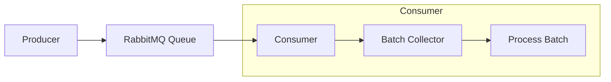
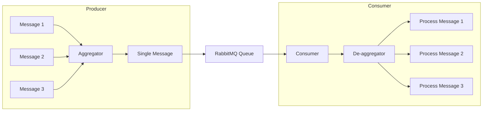
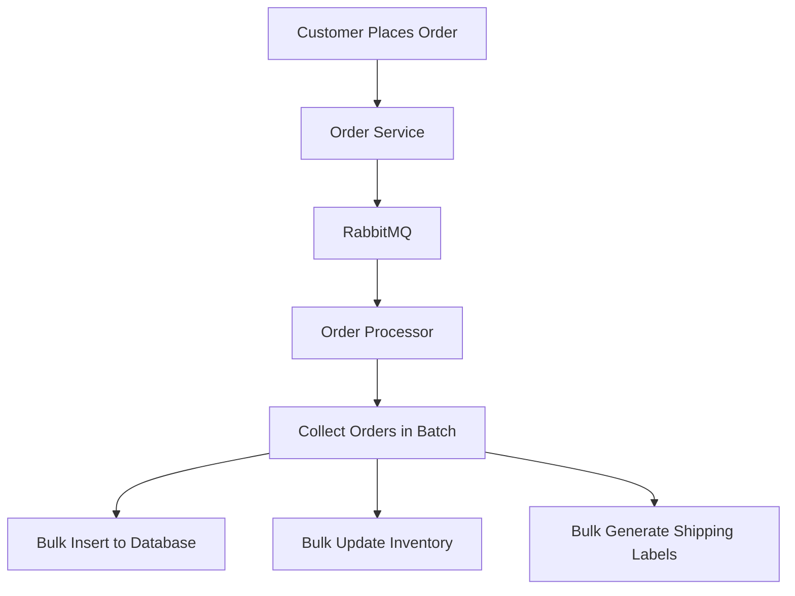

# RabbitMQ Batch Processing

## Introduction

When working with message queues, processing messages one at a time can sometimes be inefficient, especially when dealing with high-volume scenarios or operations that benefit from bulk processing. RabbitMQ batch processing is a pattern that allows consumers to process multiple messages at once, improving throughput and resource utilization.

In this guide, we'll explore different approaches to batch processing with RabbitMQ, their benefits, implementation strategies, and real-world applications.

## What is Batch Processing?

Batch processing refers to the technique of handling multiple messages together as a single unit or "batch" rather than processing them individually. This pattern is particularly useful when:

- The overhead of processing each message individually is high
- Database or API operations can be optimized through bulk operations
- You need to reduce the number of network roundtrips
- You want to optimize resource utilization

## Batch Processing Patterns in RabbitMQ

### Pattern 1: Client-Side Batching

In this approach, the consumer application collects messages from RabbitMQ individually but processes them in batches.



#### Implementation Example

Here's a simple Python implementation using the `pika` library:

```python
import pika
import time

# Constants
BATCH_SIZE = 100
BATCH_TIMEOUT = 5  # seconds

connection = pika.BlockingConnection(pika.ConnectionParameters('localhost'))
channel = connection.channel()
channel.queue_declare(queue='task_queue', durable=True)

# Acknowledge delivery
channel.basic_qos(prefetch_count=BATCH_SIZE)

batch = []
last_batch_time = time.time()

def process_batch(messages):
    # Process all messages in the batch
    print(f"Processing batch of {len(messages)} messages")
    # Simulate batch processing
    time.sleep(1)
    
    # Acknowledge all messages in the batch
    for method, properties, body in messages:
        channel.basic_ack(delivery_tag=method.delivery_tag)
    
    print("Batch processed successfully")

def callback(ch, method, properties, body):
    global batch, last_batch_time
    
    # Add the message to the current batch
    batch.append((method, properties, body))
    
    # Process the batch if it's full or timeout has occurred
    current_time = time.time()
    if len(batch) >= BATCH_SIZE or (current_time - last_batch_time >= BATCH_TIMEOUT and batch):
        messages_to_process = batch
        batch = []
        last_batch_time = current_time
        process_batch(messages_to_process)

channel.basic_consume(queue='task_queue', on_message_callback=callback, auto_ack=False)

print('Waiting for messages. To exit press CTRL+C')
channel.start_consuming()
```

In this example:
1. We set a batch size and timeout
2. We collect messages until we reach the batch size or timeout
3. We process the entire batch at once
4. We acknowledge all messages after batch processing is complete

### Pattern 2: Server-Side Batching with Prefetch Count

RabbitMQ's `basic.qos` method allows you to control how many unacknowledged messages a consumer can have. By setting an appropriate prefetch count, you can effectively batch messages at the server level.


#### Implementation Example

```python
import pika
import time

connection = pika.BlockingConnection(pika.ConnectionParameters('localhost'))
channel = connection.channel()
channel.queue_declare(queue='task_queue', durable=True)

# Set prefetch count to 100
channel.basic_qos(prefetch_count=100)

def callback(ch, method, properties, body):
    print(f" [x] Received {body.decode()}")
    # Process the message
    time.sleep(0.1)
    print(f" [x] Done")
    ch.basic_ack(delivery_tag=method.delivery_tag)

channel.basic_consume(queue='task_queue', on_message_callback=callback)

print(' [*] Waiting for messages. To exit press CTRL+C')
channel.start_consuming()
```

This approach doesn't process messages in batches at the application level, but it optimizes network usage by fetching multiple messages at once.

### Pattern 3: Batch Publisher Confirms

When publishing messages, you can use batch confirms to improve producer throughput:

```python
import pika

connection = pika.BlockingConnection(pika.ConnectionParameters('localhost'))
channel = connection.channel()
channel.queue_declare(queue='task_queue', durable=True)

# Enable publisher confirms
channel.confirm_delivery()

# Publish 1000 messages without waiting for confirms between each
for i in range(1000):
    channel.basic_publish(
        exchange='',
        routing_key='task_queue',
        body=f'Message {i}',
        properties=pika.BasicProperties(
            delivery_mode=2,  # make message persistent
        )
    )

# Wait for confirms on all messages
if channel.wait_for_confirms():
    print("All messages confirmed!")
else:
    print("Some messages failed to confirm")
```

### Pattern 4: Batching with Message Aggregation

In this pattern, the producer collects multiple logical messages and sends them as a single RabbitMQ message.



#### Implementation Example

Producer:

```python
import pika
import json

connection = pika.BlockingConnection(pika.ConnectionParameters('localhost'))
channel = connection.channel()
channel.queue_declare(queue='batch_queue', durable=True)

batch = []
BATCH_SIZE = 100

# Collect messages
for i in range(1000):
    message = {"id": i, "data": f"Some data for message {i}"}
    batch.append(message)
    
    # Send when batch is full
    if len(batch) >= BATCH_SIZE:
        channel.basic_publish(
            exchange='',
            routing_key='batch_queue',
            body=json.dumps(batch),
            properties=pika.BasicProperties(
                delivery_mode=2,  # make message persistent
                content_type='application/json'
            )
        )
        print(f"Sent batch of {len(batch)} messages")
        batch = []

# Send any remaining messages
if batch:
    channel.basic_publish(
        exchange='',
        routing_key='batch_queue',
        body=json.dumps(batch),
        properties=pika.BasicProperties(
            delivery_mode=2,
            content_type='application/json'
        )
    )
    print(f"Sent final batch of {len(batch)} messages")

connection.close()
```

Consumer:

```python
import pika
import json

connection = pika.BlockingConnection(pika.ConnectionParameters('localhost'))
channel = connection.channel()
channel.queue_declare(queue='batch_queue', durable=True)

def callback(ch, method, properties, body):
    # Parse the batch of messages
    messages = json.loads(body)
    print(f"Received batch of {len(messages)} messages")
    
    # Process each message in the batch
    for message in messages:
        print(f"Processing message {message['id']}")
        # Your processing logic here
    
    # Acknowledge the batch
    ch.basic_ack(delivery_tag=method.delivery_tag)
    print("Batch processing complete")

channel.basic_consume(queue='batch_queue', on_message_callback=callback)

print('Waiting for batches. To exit press CTRL+C')
channel.start_consuming()
```

## Benefits of Batch Processing

1. **Improved Throughput**: Processing messages in batches reduces the overhead of individual message handling.

2. **Reduced Database Load**: When messages require database operations, batching can significantly reduce the number of database transactions.

3. **Better Resource Utilization**: Processing in batches can make better use of CPU, memory, and I/O resources.

4. **Reduced Network Traffic**: Fewer round trips between the consumer and RabbitMQ server.

5. **Lower Latency for High Volumes**: Although individual message latency might increase, the overall system throughput and latency improve for high-volume scenarios.

## Challenges and Considerations

### 1. Message Ordering

When processing messages in batches, you need to consider whether message order is important for your application. If strict ordering is required, you'll need additional logic to handle it.

### 2. Error Handling

If one message in a batch fails, you need to decide how to handle the entire batch:

- Reject the entire batch (simplest but not always ideal)
- Split the batch and retry the failed portion
- Process successful messages and only retry failed ones

### 3. Batch Size Tuning

Finding the optimal batch size requires experimentation:
- Too small: Limited throughput improvement
- Too large: Increased memory usage and potential issues with message expiry

### 4. Latency vs. Throughput

Batch processing introduces a trade-off between throughput and latency:
- Larger batches generally improve throughput
- But they also increase the wait time for the first message in a batch

## Real-World Application: E-Commerce Order Processing

Consider an e-commerce system that needs to process incoming orders:



Without batching, each order would require:
- 1 database insert
- 1 inventory update
- 1 shipping label generation

With batching (100 orders):
- 1 bulk database insert (instead of 100)
- 1 bulk inventory update (instead of 100)
- 1 bulk shipping label generation (instead of 100)

This can dramatically improve throughput during high-volume periods, such as flash sales or holiday shopping seasons.

## Implementation Example: Log Aggregation System

Let's implement a more complete example of a log aggregation system that collects logs from various services and processes them in batches:

Producer (log sender):

```python
import pika
import json
import time
import random

# Connect to RabbitMQ
connection = pika.BlockingConnection(pika.ConnectionParameters('localhost'))
channel = connection.channel()

# Declare a durable queue
channel.queue_declare(queue='logs_queue', durable=True)

# Log levels
log_levels = ['INFO', 'WARNING', 'ERROR', 'DEBUG']

# Service names
services = ['user-service', 'payment-service', 'inventory-service', 'notification-service']

# Generate and send logs
for i in range(1000):
    log = {
        'timestamp': time.time(),
        'service': random.choice(services),
        'level': random.choice(log_levels),
        'message': f'Log message {i}',
        'details': {
            'request_id': f'req-{random.randint(1000, 9999)}',
            'user_id': random.randint(1, 1000) if random.random() > 0.3 else None
        }
    }
    
    channel.basic_publish(
        exchange='',
        routing_key='logs_queue',
        body=json.dumps(log),
        properties=pika.BasicProperties(
            delivery_mode=2,  # make message persistent
        )
    )
    
    if i % 100 == 0:
        print(f"Sent {i} logs")
    
    # Simulate variable log production rate
    time.sleep(random.uniform(0.01, 0.1))

print("Finished sending logs")
connection.close()
```

Consumer (log processor with batching):

```python
import pika
import json
import time
from datetime import datetime

# Batch settings
BATCH_SIZE = 100
BATCH_TIMEOUT = 5  # seconds

# Connect to RabbitMQ
connection = pika.BlockingConnection(pika.ConnectionParameters('localhost'))
channel = connection.channel()
channel.queue_declare(queue='logs_queue', durable=True)

# Set prefetch count
channel.basic_qos(prefetch_count=BATCH_SIZE)

# Prepare for batching
batch = []
last_batch_time = time.time()

def save_logs_to_database(logs):
    """Simulate saving logs to a database in bulk"""
    print(f"Saving batch of {len(logs)} logs to database...")
    # In a real system, this would be a bulk insert/update
    time.sleep(0.5)  # Simulate database operation
    print("Logs saved successfully")
    
    # Print some statistics
    levels = {}
    services = {}
    for log in logs:
        log_data = json.loads(log)
        levels[log_data['level']] = levels.get(log_data['level'], 0) + 1
        services[log_data['service']] = services.get(log_data['service'], 0) + 1
    
    print("Batch statistics:")
    print(f"  Log levels: {levels}")
    print(f"  Services: {services}")

def process_batch():
    global batch, last_batch_time
    
    if not batch:
        return
        
    # Process the current batch
    logs_to_process = batch
    batch = []
    last_batch_time = time.time()
    
    # Process the batch
    save_logs_to_database(logs_to_process)

def callback(ch, method, properties, body):
    global batch, last_batch_time
    
    # Add the message to the batch
    batch.append(body)
    
    # Check if we should process the batch
    current_time = time.time()
    if len(batch) >= BATCH_SIZE or (current_time - last_batch_time >= BATCH_TIMEOUT and batch):
        process_batch()
        
        # Acknowledge all messages up to this point
        ch.basic_ack(delivery_tag=method.delivery_tag, multiple=True)
    else:
        # Don't acknowledge yet, wait for batch to complete
        pass

# Start consuming
channel.basic_consume(queue='logs_queue', on_message_callback=callback, auto_ack=False)

print('Log processor started. Waiting for messages...')

try:
    # Process batches on timeout even if no new messages arrive
    while True:
        # Check if we need to process the current batch due to timeout
        current_time = time.time()
        if batch and current_time - last_batch_time >= BATCH_TIMEOUT:
            process_batch()
            # Need to acknowledge manually in this case
            if batch:
                channel.basic_ack(delivery_tag=0, multiple=True)
        
        # Process messages for a short time
        connection.process_data_events(time_limit=1)
except KeyboardInterrupt:
    # Process any remaining messages
    if batch:
        process_batch()
    print('Shutting down...')

connection.close()
```

## Best Practices for RabbitMQ Batch Processing

1. **Find the Right Batch Size**: Start with a small batch size and gradually increase it while monitoring performance metrics.

2. **Implement Timeout Logic**: Always have a timeout mechanism to process partial batches if the batch size isn't reached within a reasonable time.

3. **Use Prefetch Count Wisely**: Set the prefetch count slightly higher than your batch size to ensure a continuous flow of messages.

4. **Handle Partial Batch Failures**: Implement retry mechanisms for failed messages rather than rejecting entire batches.

5. **Monitor and Adjust**: Continuously monitor your system's performance and adjust batch sizes based on:
   - Queue length
   - System load
   - Processing time
   - Memory usage

6. **Consider Message TTL**: If using client-side batching, be mindful of message TTL (Time-To-Live) settings to avoid processing expired messages.

7. **Implement Proper Error Handling**: Always have robust error handling to deal with issues in batch processing.

## Summary

Batch processing in RabbitMQ is a powerful pattern for improving throughput and efficiency in message-based systems. We've explored various approaches to batch processing, including client-side batching, server-side prefetch optimization, batch publisher confirms, and message aggregation.

Each approach has its trade-offs in terms of complexity, performance, and reliability. The right choice depends on your specific requirements, message volumes, and system architecture.

By implementing batch processing effectively, you can significantly improve your system's throughput, reduce resource usage, and handle high-volume scenarios more efficiently.

## Further Learning

To deepen your understanding of RabbitMQ batch processing, consider:

1. **Experimenting with Different Batch Sizes**: Try different batch sizes and measure the impact on your system's performance.

2. **Implementing Different Batching Strategies**: Compare client-side batching vs. message aggregation for your specific use case.

3. **Advanced RabbitMQ Features**: Explore how features like message TTL, dead-letter exchanges, and priority queues can be combined with batch processing.

## Exercises

1. Modify the log aggregation example to handle errors within a batch and implement a retry mechanism for failed messages.

2. Implement a batch processing system that maintains message order within batches.

3. Create a dynamic batch sizing system that adjusts batch size based on current system load and queue length.

4. Implement a batch processing pattern with a dead-letter queue for messages that fail processing multiple times.

5. Build a monitoring dashboard that tracks the performance metrics of your batch processing system, including throughput, latency, and resource usage.