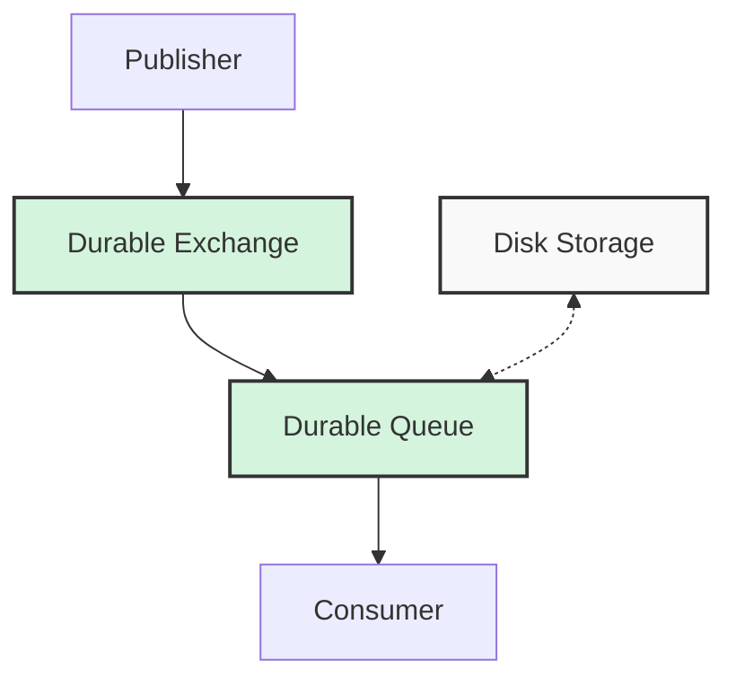

# RabbitMQ Message Persistence

When working with message brokers like RabbitMQ, one critical concern is ensuring that your messages aren't lost in case of system failures. That's where **message persistence** comes in - a key reliability feature that helps you recover from unexpected crashes and outages.

## What is Message Persistence?

Message persistence refers to the ability of RabbitMQ to save messages to disk, allowing them to survive broker restarts or crashes. By default, when RabbitMQ stops or crashes, all queued messages are lost unless persistence is explicitly enabled.

Think of persistence like saving a document you're working on. If you don't save it and your computer crashes, you lose your work. Similarly, persisting messages is like saving them to disk so they remain available even after unexpected events.

## Why Message Persistence Matters

Consider these scenarios where persistence is crucial:

- Processing financial transactions
- Handling critical user data
- Managing order systems
- Recording important events
- Implementing reliable microservice communication

Without persistence, a broker failure could mean permanent data loss and inconsistent system states.

## How Message Persistence Works in RabbitMQ

Message persistence in RabbitMQ has three key components:

1. **Durable exchanges**
2. **Durable queues**
3. **Persistent messages**

All three components must be properly configured to ensure message persistence.



Let's explore each component in detail.

## 1. Creating Durable Exchanges

Exchanges need to be marked as durable to survive broker restarts:

```javascript
// Creating a durable exchange
channel.assertExchange('logs_exchange', 'direct', {
  durable: true
});
```

When you set `durable: true`, RabbitMQ saves the exchange definition to disk. If the broker restarts, the exchange will be recreated automatically.

## 2. Setting Up Durable Queues

Similarly, queues must be declared as durable:

```javascript
// Creating a durable queue
channel.assertQueue('important_logs', {
  durable: true
});
```

A durable queue is recreated when RabbitMQ restarts. However, remember that making a queue durable doesn't automatically persist the messages within it.

## 3. Publishing Persistent Messages

Even with durable exchanges and queues, you need to explicitly mark messages as persistent:

```javascript
// Publishing a persistent message
channel.publish('logs_exchange', 'error', Buffer.from('System error occurred'), {
  persistent: true
});

// Or using sendToQueue
channel.sendToQueue('important_logs', Buffer.from('Critical message'), {
  persistent: true
});
```

The `persistent: true` option tells RabbitMQ to save the message to disk. It sets the message's delivery mode property to 2, indicating persistence.

## Complete Example: Implementing Message Persistence

Let's see a complete Node.js example that demonstrates all three components of message persistence:

### Producer Code (publisher.js)

```javascript
const amqp = require('amqplib');

async function sendPersistentMessage() {
  try {
    // Connect to RabbitMQ
    const connection = await amqp.connect('amqp://localhost');
    const channel = await connection.createChannel();
    
    // Declare a durable exchange
    const exchange = 'persistent_exchange';
    await channel.assertExchange(exchange, 'direct', {
      durable: true
    });
    
    // Declare a durable queue
    const queue = 'persistent_queue';
    await channel.assertQueue(queue, {
      durable: true
    });
    
    // Bind the queue to the exchange
    const routingKey = 'important';
    await channel.bindQueue(queue, exchange, routingKey);
    
    // Send a persistent message
    const message = 'This is an important message that should not be lost';
    channel.publish(exchange, routingKey, Buffer.from(message), {
      persistent: true
    });
    
    console.log(`Sent persistent message: ${message}`);
    
    // Close the connection after 1 second
    setTimeout(() => {
      connection.close();
      process.exit(0);
    }, 1000);
  } catch (error) {
    console.error('Error:', error);
  }
}

sendPersistentMessage();
```

### Consumer Code (consumer.js)

```javascript
const amqp = require('amqplib');

async function receivePersistentMessages() {
  try {
    // Connect to RabbitMQ
    const connection = await amqp.connect('amqp://localhost');
    const channel = await connection.createChannel();
    
    // Declare the same durable queue
    const queue = 'persistent_queue';
    await channel.assertQueue(queue, {
      durable: true
    });
    
    // Set prefetch to process one message at a time
    channel.prefetch(1);
    
    console.log('Waiting for messages...');
    
    // Process incoming messages
    channel.consume(queue, (message) => {
      if (message) {
        const content = message.content.toString();
        console.log(`Received: ${content}`);
        
        // Simulate processing time
        setTimeout(() => {
          // Acknowledge the message
          channel.ack(message);
          console.log('Message processed successfully');
        }, 2000);
      }
    });
  } catch (error) {
    console.error('Error:', error);
  }
}

receivePersistentMessages();
```

**Output (Publisher):**
```
Sent persistent message: This is an important message that should not be lost
```

**Output (Consumer):**
```
Waiting for messages...
Received: This is an important message that should not be lost
Message processed successfully
```

## Performance Considerations

While message persistence is crucial for reliability, it comes with some performance trade-offs:

1. **Disk I/O Overhead**: Writing to disk is slower than keeping messages in memory
2. **Throughput Reduction**: Persistence can reduce the message throughput rate
3. **Increased Latency**: Message delivery may take longer due to disk operations

For high-throughput systems, consider:
- Using SSD storage for RabbitMQ data
- Implementing appropriate acknowledgment patterns
- Finding the right balance between reliability and performance

## Publisher Confirms: Ensuring Persistence

Persistence alone doesn't guarantee that messages are successfully stored. To be certain, use **publisher confirms**:

```javascript
// Enable publisher confirms
await channel.confirmChannel();

// Publish with confirmation
channel.publish('logs_exchange', 'error', Buffer.from('Critical message'), {
  persistent: true
});

// Wait for confirmation
await channel.waitForConfirms();
console.log('Message persistence confirmed');
```

Publisher confirms act as acknowledgments from RabbitMQ that messages have been safely persisted.

## Real-World Application: Order Processing System

Consider an e-commerce platform that processes customer orders. A system outage during order processing could lead to lost orders or duplicate charges if message persistence isn't properly implemented.

Here's how you might implement a reliable order processing system:

```javascript
// Order service
async function processOrder(userId, orderId, items) {
  const connection = await amqp.connect('amqp://localhost');
  const channel = await connection.createConfirmChannel();
  
  // Ensure exchange and queue are durable
  await channel.assertExchange('order_exchange', 'direct', { durable: true });
  await channel.assertQueue('order_processing', { durable: true });
  await channel.bindQueue('order_processing', 'order_exchange', 'new_order');
  
  // Create order message
  const orderMessage = {
    orderId,
    userId,
    items,
    timestamp: new Date().toISOString()
  };
  
  // Publish with persistence
  channel.publish(
    'order_exchange',
    'new_order',
    Buffer.from(JSON.stringify(orderMessage)),
    { persistent: true }
  );
  
  // Wait for confirmation
  await channel.waitForConfirms();
  console.log(`Order ${orderId} successfully queued for processing`);
  
  await channel.close();
  await connection.close();
}
```

**Order processor consumer:**

```javascript
async function startOrderProcessor() {
  const connection = await amqp.connect('amqp://localhost');
  const channel = await connection.createChannel();
  
  await channel.assertQueue('order_processing', { durable: true });
  channel.prefetch(1);
  
  console.log('Order processor started, waiting for orders...');
  
  channel.consume('order_processing', async (message) => {
    if (!message) return;
    
    const order = JSON.parse(message.content.toString());
    console.log(`Processing order ${order.orderId}`);
    
    try {
      // Process the order (database operations, payment processing, etc.)
      await processOrderInDatabase(order);
      
      // Acknowledge successful processing
      channel.ack(message);
      console.log(`Order ${order.orderId} processed successfully`);
    } catch (error) {
      console.error(`Error processing order ${order.orderId}:`, error);
      
      // Reject and requeue if it's a temporary failure
      channel.nack(message, false, true);
    }
  });
}
```

This implementation ensures that orders aren't lost even if RabbitMQ or the order processor crashes.

## Best Practices for Message Persistence

To make the most of RabbitMQ's persistence capabilities:

1. **Use Durable Everything**: Make exchanges, queues, and messages persistent when reliability matters
2. **Implement Publisher Confirms**: Don't consider a message sent until confirmed
3. **Use Proper Acknowledgments**: Acknowledge messages only after successful processing
4. **Handle Redeliveries**: Design your consumers to handle message redeliveries
5. **Consider Clustering**: For critical systems, use RabbitMQ clusters with mirrored queues
6. **Monitor Disk Space**: Persistent messages consume disk space
7. **Test Failure Scenarios**: Regularly test your system's behavior during RabbitMQ restarts

## Common Pitfalls to Avoid

Some common mistakes when implementing message persistence include:

- **Forgetting a Component**: Using durable queues but not marking messages as persistent
- **Assuming Default Durability**: All components are non-durable by default
- **Ignoring Publisher Confirms**: Not waiting for confirmation that messages were persisted
- **Premature Acknowledgment**: Acknowledging messages before processing completes
- **Overlooking Disk Space**: Not monitoring disk space usage for persistent messages

## Summary

Message persistence is a fundamental aspect of building reliable systems with RabbitMQ. By ensuring that exchanges, queues, and messages are all properly configured for durability, you can create robust applications that can recover gracefully from failures.

Remember these key points:
- All three components (exchanges, queues, and messages) must be marked as durable/persistent
- Persistence trades some performance for reliability
- Publisher confirms provide additional assurance that messages are safely stored
- Proper acknowledgment strategies complete the reliability picture

By implementing message persistence correctly, you can build applications that maintain data integrity even in the face of unexpected crashes or restarts.

## Additional Resources

To deepen your understanding of RabbitMQ message persistence, consider exploring:

- RabbitMQ official documentation on reliability
- Message acknowledgment patterns
- Clustering and high availability in RabbitMQ
- Monitoring tools for RabbitMQ

## Practice Exercises

1. Create a simple application that demonstrates the difference between persistent and non-persistent messages during a RabbitMQ restart
2. Implement a system that uses publisher confirms and proper acknowledgments
3. Build a microservice that uses persistent messaging for critical communications
4. Measure and compare the performance differences between persistent and non-persistent messaging