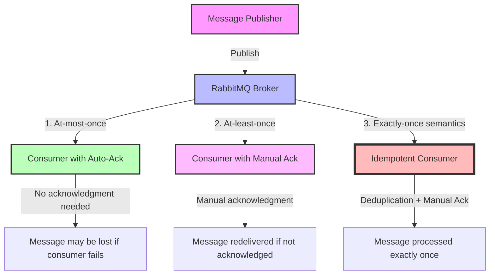

# RabbitMQ Delivery Guarantees

When working with distributed systems, one of the most critical aspects is ensuring that messages are delivered reliably between components. RabbitMQ offers several delivery guarantees that help you build robust and reliable applications. This guide will walk you through these guarantees and how to implement them.

## Introduction to Delivery Guarantees

In messaging systems, there are typically three levels of delivery guarantees:

1. **At-most-once delivery**: Messages may be lost but will never be delivered more than once.
2. **At-least-once delivery**: Messages will be delivered, but might be delivered multiple times.
3. **Exactly-once delivery**: Messages will be delivered exactly once without loss or duplication.

RabbitMQ primarily provides mechanisms for the first two types, while exactly-once delivery requires additional application-level handling.

## Understanding Message Acknowledgments

The foundation of RabbitMQ's delivery guarantees is the acknowledgment (ack) mechanism. When a consumer receives a message, it can either acknowledge it or not.

### Basic Acknowledgment Modes

RabbitMQ supports three acknowledgment modes:

1. **Auto acknowledgment (auto_ack=true)**: Messages are considered delivered as soon as they are sent to the consumer.
2. **Manual acknowledgment (auto_ack=false)**: The consumer must explicitly acknowledge messages.
3. **Negative acknowledgment (nack)**: The consumer can reject messages and decide whether they should be requeued.

Let's look at these modes with code examples:

```javascript
// Auto acknowledgment (at-most-once delivery)
channel.consume(queueName, (msg) => {
  console.log(`Received message: ${msg.content.toString()}`);
  // No acknowledgment needed, message is considered delivered immediately
}, { noAck: true });

// Manual acknowledgment (at-least-once delivery)
channel.consume(queueName, (msg) => {
  console.log(`Received message: ${msg.content.toString()}`);
  try {
    // Process the message
    processMessage(msg);
    // Acknowledge success
    channel.ack(msg);
  } catch (error) {
    // Negative acknowledgment with requeue
    channel.nack(msg, false, true);
  }
}, { noAck: false });
```

## Implementing At-Most-Once Delivery

At-most-once delivery is the simplest but least reliable option. Messages are considered delivered as soon as they are sent to the consumer. If the consumer crashes before processing the message, it will be lost.

### When to Use At-Most-Once Delivery

- When occasional message loss is acceptable
- For high-throughput systems where performance is more important than reliability
- For non-critical data like metrics or logs

### Implementation Example

```javascript
// Publisher
const amqp = require('amqplib');

async function publishMessage() {
  const connection = await amqp.connect('amqp://localhost');
  const channel = await connection.createChannel();
  const queueName = 'at_most_once_queue';
  
  await channel.assertQueue(queueName, { durable: false });
  
  const message = 'Hello World!';
  channel.sendToQueue(queueName, Buffer.from(message));
  console.log(`Sent: ${message}`);
  
  setTimeout(() => {
    connection.close();
  }, 500);
}

publishMessage();

// Consumer
const amqp = require('amqplib');

async function consumeMessages() {
  const connection = await amqp.connect('amqp://localhost');
  const channel = await connection.createChannel();
  const queueName = 'at_most_once_queue';
  
  await channel.assertQueue(queueName, { durable: false });
  
  console.log('Waiting for messages...');
  
  channel.consume(queueName, (msg) => {
    console.log(`Received: ${msg.content.toString()}`);
    // Message automatically acknowledged
  }, { noAck: true });
}

consumeMessages();
```

## Implementing At-Least-Once Delivery

At-least-once delivery ensures that messages are not lost, but they might be delivered more than once if a consumer fails after processing but before acknowledging.

### When to Use At-Least-Once Delivery

- When message loss is unacceptable
- For systems where duplicate processing is tolerable or can be handled
- For critical business operations where data integrity is important

### Implementation Example

```javascript
// Publisher
const amqp = require('amqplib');

async function publishMessage() {
  const connection = await amqp.connect('amqp://localhost');
  const channel = await connection.createChannel();
  const queueName = 'at_least_once_queue';
  
  // Make the queue durable
  await channel.assertQueue(queueName, { durable: true });
  
  const message = 'Critical message';
  // Mark message as persistent
  channel.sendToQueue(queueName, Buffer.from(message), { persistent: true });
  console.log(`Sent: ${message}`);
  
  setTimeout(() => {
    connection.close();
  }, 500);
}

publishMessage();

// Consumer
const amqp = require('amqplib');

async function consumeMessages() {
  const connection = await amqp.connect('amqp://localhost');
  const channel = await connection.createChannel();
  const queueName = 'at_least_once_queue';
  
  // Make the queue durable
  await channel.assertQueue(queueName, { durable: true });
  
  // Set prefetch to limit the number of unacknowledged messages
  channel.prefetch(1);
  
  console.log('Waiting for messages...');
  
  channel.consume(queueName, (msg) => {
    console.log(`Received: ${msg.content.toString()}`);
    
    // Simulate processing
    setTimeout(() => {
      try {
        // Process message
        console.log('Processing complete');
        
        // Acknowledge the message
        channel.ack(msg);
      } catch (error) {
        // Negative acknowledgment with requeue
        channel.nack(msg, false, true);
      }
    }, 1000);
  }, { noAck: false });
}

consumeMessages();
```

## Advanced: Implementing Exactly-Once Delivery Semantics

True exactly-once delivery is not directly supported by RabbitMQ, but you can achieve exactly-once semantics by implementing idempotent consumers or using message deduplication techniques.

### Idempotent Consumers

An idempotent consumer can safely process the same message multiple times without unwanted side effects:

```javascript
const amqp = require('amqplib');
const redis = require('redis');
const { promisify } = require('util');

async function consumeMessagesIdempotently() {
  // Setup Redis client for tracking processed messages
  const redisClient = redis.createClient();
  const setExAsync = promisify(redisClient.setex).bind(redisClient);
  const getAsync = promisify(redisClient.get).bind(redisClient);
  
  const connection = await amqp.connect('amqp://localhost');
  const channel = await connection.createChannel();
  const queueName = 'exactly_once_queue';
  
  await channel.assertQueue(queueName, { durable: true });
  channel.prefetch(1);
  
  console.log('Waiting for messages...');
  
  channel.consume(queueName, async (msg) => {
    const messageId = msg.properties.messageId;
    
    // Check if message was already processed
    const processed = await getAsync(`processed_message:${messageId}`);
    
    if (!processed) {
      console.log(`Processing message: ${msg.content.toString()}`);
      
      try {
        // Process the message
        processMessage(msg);
        
        // Mark as processed in Redis with a TTL
        await setExAsync(`processed_message:${messageId}`, 3600, 'true');
        
        console.log('Message processed successfully');
      } catch (error) {
        console.error('Error processing message:', error);
      }
    } else {
      console.log(`Message ${messageId} already processed, skipping`);
    }
    
    // Acknowledge the message even if already processed
    channel.ack(msg);
  }, { noAck: false });
}

function processMessage(msg) {
  // Actual business logic
  console.log(`Executing business logic for message: ${msg.content.toString()}`);
}

consumeMessagesIdempotently();
```

### Publisher Confirms

To ensure that messages are properly published, you can use publisher confirms:

```javascript
const amqp = require('amqplib');

async function publishWithConfirms() {
  const connection = await amqp.connect('amqp://localhost');
  const channel = await connection.createChannel();
  
  // Enable publisher confirms
  await channel.confirm();
  
  const queueName = 'confirmed_queue';
  await channel.assertQueue(queueName, { durable: true });
  
  try {
    const message = 'Message with publisher confirm';
    const messageId = Date.now().toString();
    
    channel.sendToQueue(
      queueName,
      Buffer.from(message),
      {
        persistent: true,
        messageId: messageId
      }
    );
    
    // Wait for confirmation
    await channel.waitForConfirms();
    console.log('Message was confirmed!');
  } catch (error) {
    console.error('Message was not confirmed:', error);
  }
  
  await connection.close();
}

publishWithConfirms();
```

## Visualizing Message Delivery Guarantees

Below is a diagram showing the different delivery guarantees and how they relate to acknowledgment patterns:



## Real-World Application: Order Processing System

Let's consider a practical example of an e-commerce order processing system:

```javascript
// Order Service (Publisher)
const amqp = require('amqplib');

async function placeOrder(orderId, items, totalAmount) {
  const connection = await amqp.connect('amqp://localhost');
  const channel = await connection.createChannel();
  
  // Enable publisher confirms
  await channel.confirm();
  
  const exchangeName = 'order_exchange';
  await channel.assertExchange(exchangeName, 'direct', { durable: true });
  
  const orderMessage = {
    orderId,
    items,
    totalAmount,
    timestamp: new Date().toISOString()
  };
  
  try {
    // Publish with persistent delivery mode and message ID
    channel.publish(
      exchangeName,
      'new_order',
      Buffer.from(JSON.stringify(orderMessage)),
      {
        persistent: true,
        messageId: orderId,
        contentType: 'application/json'
      }
    );
    
    // Wait for confirmation
    await channel.waitForConfirms();
    console.log(`Order ${orderId} published successfully`);
  } catch (error) {
    console.error(`Failed to publish order ${orderId}:`, error);
    throw new Error('Order publication failed');
  } finally {
    await connection.close();
  }
}

// Inventory Service (Consumer)
const amqp = require('amqplib');
const db = require('./database'); // Your database connection

async function startInventoryService() {
  const connection = await amqp.connect('amqp://localhost');
  const channel = await connection.createChannel();
  
  const exchangeName = 'order_exchange';
  const queueName = 'inventory_queue';
  
  await channel.assertExchange(exchangeName, 'direct', { durable: true });
  await channel.assertQueue(queueName, { durable: true });
  await channel.bindQueue(queueName, exchangeName, 'new_order');
  
  channel.prefetch(1);
  
  console.log('Inventory service waiting for orders...');
  
  channel.consume(queueName, async (msg) => {
    const order = JSON.parse(msg.content.toString());
    console.log(`Processing inventory for order: ${order.orderId}`);
    
    try {
      // Check if we've already processed this order
      const alreadyProcessed = await db.hasProcessedOrder(order.orderId);
      
      if (!alreadyProcessed) {
        // Update inventory
        await updateInventory(order.items);
        
        // Mark as processed
        await db.markOrderAsProcessed(order.orderId);
        
        console.log(`Inventory updated for order ${order.orderId}`);
      } else {
        console.log(`Order ${order.orderId} already processed, skipping`);
      }
      
      // Acknowledge the message
      channel.ack(msg);
    } catch (error) {
      console.error(`Error processing order ${order.orderId}:`, error);
      
      // If it's a temporary failure, requeue
      if (isTemporaryFailure(error)) {
        channel.nack(msg, false, true);
      } else {
        // For permanent failures, don't requeue but send to dead letter queue
        channel.nack(msg, false, false);
      }
    }
  }, { noAck: false });
}

async function updateInventory(items) {
  // Actual inventory update logic
  for (const item of items) {
    await db.decrementStock(item.productId, item.quantity);
  }
}

function isTemporaryFailure(error) {
  // Determine if the error is temporary (like a DB connection issue)
  return error.code === 'ECONNREFUSED' || error.name === 'SequelizeConnectionError';
}

startInventoryService();
```

## Best Practices for Reliable Delivery

1. **Use durable queues and persistent messages** for critical data
   ```javascript
   channel.assertQueue('critical_queue', { durable: true });
   channel.sendToQueue(queueName, Buffer.from(message), { persistent: true });
   ```

2. **Implement proper error handling** and decide when to requeue
   ```javascript
   try {
     // Process message
     processMessage(msg);
     channel.ack(msg);
   } catch (error) {
     if (isRecoverable(error)) {
       // Requeue for temporary failures
       channel.nack(msg, false, true);
     } else {
       // Send to Dead Letter Exchange for permanent failures
       channel.nack(msg, false, false);
     }
   }
   ```

3. **Use publisher confirms** to ensure messages are stored by the broker
   ```javascript
   await channel.confirm();
   channel.sendToQueue(queueName, Buffer.from(message), { persistent: true });
   await channel.waitForConfirms();
   ```

4. **Set up Dead Letter Exchanges** for handling failed messages
   ```javascript
   await channel.assertExchange('my_dlx', 'direct', { durable: true });
   await channel.assertQueue('main_queue', {
     durable: true,
     deadLetterExchange: 'my_dlx',
     deadLetterRoutingKey: 'dead_messages'
   });
   ```

5. **Implement idempotent consumers** for exactly-once processing semantics

6. **Use connection and channel recovery** to handle network issues
   ```javascript
   const connection = await amqp.connect('amqp://localhost', {
     heartbeat: 30,
     reconnect: true,
     reconnectTimeInSeconds: 5
   });
   ```

7. **Set appropriate prefetch values** to control consumer load
   ```javascript
   // Only fetch one message at a time until acknowledged
   channel.prefetch(1);
   ```

## Summary

RabbitMQ provides flexible delivery guarantees that can be tailored to your application's needs:

- **At-most-once delivery**: Simple but may lose messages (auto acknowledgment)
- **At-least-once delivery**: Ensures messages are processed but may cause duplicates (manual acknowledgment)
- **Exactly-once semantics**: Requires additional application-level handling (manual acknowledgment + deduplication)

By understanding and correctly implementing these delivery guarantees, you can build robust messaging systems that handle failures gracefully.

## Additional Resources

- [RabbitMQ Reliability Guide](https://www.rabbitmq.com/reliability.html)
- [RabbitMQ Publisher Confirms](https://www.rabbitmq.com/confirms.html)
- [RabbitMQ Consumer Acknowledgments](https://www.rabbitmq.com/confirms.html#acknowledgements)

## Exercises

1. Implement a message processor that handles duplicate messages using a Redis-based deduplication strategy.
2. Create a publisher that retries failed message publications with exponential backoff.
3. Build a system that uses Dead Letter Exchanges to handle messages that couldn't be processed after multiple attempts.
4. Implement a transaction processing system that ensures exactly-once semantics for financial operations.