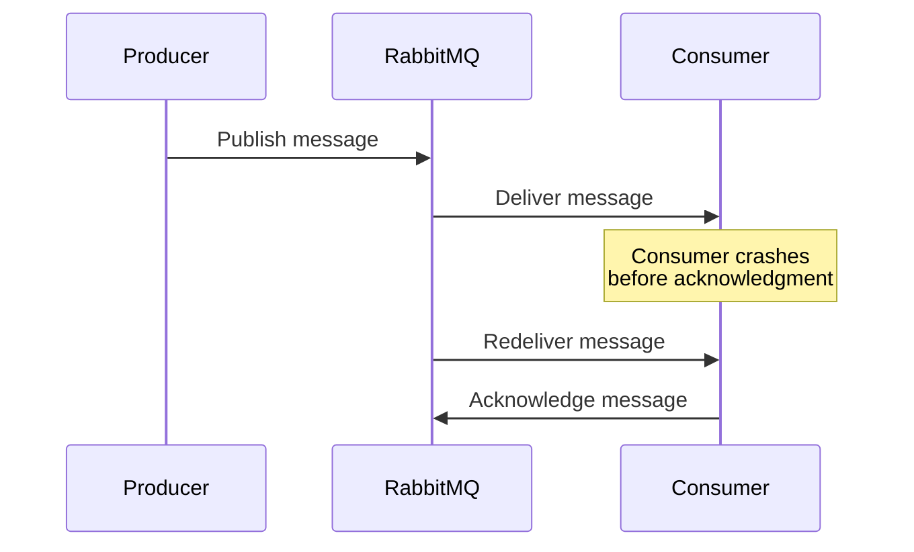

# RabbitMQ Redelivery

## Introduction

When working with message queues, ensuring that messages are processed reliably is critical. One key aspect of RabbitMQ's reliability features is message redelivery - the mechanism that allows messages to be sent to consumers again when they weren't successfully processed the first time.

In this guide, we'll explore how RabbitMQ handles message redelivery, why messages get redelivered, and how to implement proper handling strategies to build robust applications.

## What Is Message Redelivery?

Message redelivery in RabbitMQ occurs when a message that was previously delivered to a consumer is sent to a consumer again (either the same consumer or a different one). This usually happens in one of these scenarios:

1. A consumer received the message but didn't acknowledge it before disconnecting
2. A consumer explicitly rejected the message (with `basic.reject` or `basic.nack`) without the `dead-letter` option
3. The consumer channel was closed before acknowledgment
4. A message was returned from the broker as undeliverable

Let's visualize how redelivery works in a typical scenario:



## How to Identify Redelivered Messages

RabbitMQ marks messages that are being redelivered with a `redelivered` flag in the message properties. This flag helps consumers identify messages that have been delivered at least once before.

Here's how to check the redelivered flag in different programming languages:

### JavaScript (with amqplib)

```javascript
channel.consume(queue, (msg) => {
  if (msg !== null) {
    // Check if the message has been redelivered
    const isRedelivered = msg.fields.redelivered;
    
    if (isRedelivered) {
      console.log('This message has been redelivered');
    } else {
      console.log('This is the first delivery attempt');
    }
    
    // Process the message...
    
    channel.ack(msg);
  }
});
```

### Python (with pika)

```python
def callback(ch, method, properties, body):
    # Check if the message has been redelivered
    if method.redelivered:
        print("This message has been redelivered")
    else:
        print("This is the first delivery attempt")
    
    # Process the message...
    
    ch.basic_ack(delivery_tag=method.delivery_tag)

channel.basic_consume(queue='my_queue', on_message_callback=callback)
```

### Java (with Spring AMQP)

```java
@RabbitListener(queues = "my-queue")
public void processMessage(Message message, Channel channel) throws IOException {
    // Check if message has been redelivered
    boolean isRedelivered = message.getMessageProperties().isRedelivered();
    
    if (isRedelivered) {
        System.out.println("This message has been redelivered");
    } else {
        System.out.println("This is the first delivery attempt");
    }
    
    // Process the message...
    
    channel.basicAck(message.getMessageProperties().getDeliveryTag(), false);
}
```

## Common Causes of Redelivery

Understanding why messages get redelivered will help you build more robust applications:

### 1. Consumer Failure

When a consumer fails (crashes, loses connection, etc.) before acknowledging a message, RabbitMQ will redeliver the message to another consumer.

### 2. Manual Rejection

When a consumer explicitly rejects a message without the `dead-letter` option using `basic.reject` or `basic.nack`:

```javascript
// JavaScript example of rejecting a message with requeue=true
channel.reject(msg, true); // This will cause redelivery
```

### 3. Channel Closure

If the channel or connection is closed before acknowledgment, any unacknowledged messages will be requeued.

### 4. Prefetch Count and Acknowledgment

If you set a high prefetch count but don't acknowledge messages promptly, they may be redelivered when the consumer disconnects with unacked messages.

## Handling Redelivered Messages

Here are strategies for handling redelivered messages effectively:

### Idempotent Consumers

Design your message handlers to be idempotent - processing the same message multiple times should produce the same result. This is the most important pattern when working with message queues.

```javascript
// Example of an idempotent operation
async function processPayment(paymentId, amount) {
  // Check if payment was already processed
  const existingPayment = await db.payments.findOne({ paymentId });
  
  if (existingPayment) {
    console.log(`Payment ${paymentId} already processed, skipping`);
    return;
  }
  
  // Process the payment
  await db.payments.insert({ paymentId, amount, status: 'completed' });
}
```

### Retry Counting

Keep track of how many times a message has been retried by using message headers:

```python
def callback(ch, method, properties, body):
    # Get retry count from headers or default to 0
    headers = properties.headers or {}
    retry_count = headers.get('x-retry-count', 0)
    
    try:
        # Process message
        process_message(body)
        # Acknowledge on success
        ch.basic_ack(delivery_tag=method.delivery_tag)
    except Exception as e:
        # Check if max retries exceeded
        if retry_count >= 3:
            # Move to dead letter queue
            ch.basic_reject(delivery_tag=method.delivery_tag, requeue=False)
        else:
            # Update retry count and republish
            headers['x-retry-count'] = retry_count + 1
            ch.basic_publish(
                exchange='',
                routing_key='my_queue',
                body=body,
                properties=pika.BasicProperties(headers=headers)
            )
            # Ack the original message
            ch.basic_ack(delivery_tag=method.delivery_tag)
```

### Dead Letter Exchanges

Configure a Dead Letter Exchange (DLX) to handle messages that cannot be processed after multiple attempts:

```javascript
// Setting up a queue with a dead letter exchange
channel.assertExchange('my-dlx', 'direct');
channel.assertQueue('dead-letter-queue', { durable: true });
channel.bindQueue('dead-letter-queue', 'my-dlx', 'my-routing-key');

channel.assertQueue('my-queue', {
  durable: true,
  arguments: {
    'x-dead-letter-exchange': 'my-dlx',
    'x-dead-letter-routing-key': 'my-routing-key'
  }
});
```

## Configuring Redelivery Behavior

You can influence when and how messages are redelivered by setting these parameters:

### 1. Acknowledgment Mode

Use the appropriate acknowledgment mode based on your reliability needs:

```javascript
// Auto-ack (less reliable, no redelivery)
channel.consume(queue, processMsg, { noAck: true });

// Manual ack (more reliable, enables redelivery)
channel.consume(queue, (msg) => {
  // Process message
  processMsg(msg);
  // Acknowledge when done
  channel.ack(msg);
});
```

### 2. Prefetch Count

Control how many messages a consumer receives at once:

```javascript
// Only send one message at a time until acknowledged
channel.prefetch(1);

// Allow consumer to receive up to 10 messages before acknowledging
channel.prefetch(10);
```

### 3. Consumer Timeouts

Some client libraries allow you to set timeouts for message handling:

```java
// Spring AMQP example
@RabbitListener(queues = "my-queue", 
                concurrency = "3-5",
                ackMode = "MANUAL",
                autoStartup = "true")
public void processMessage(@Payload String message,
                          @Header(AmqpHeaders.DELIVERY_TAG) long deliveryTag,
                          Channel channel) throws Exception {
    try {
        // Process message with a timeout
        CompletableFuture<Void> future = CompletableFuture.runAsync(() -> {
            // Message processing logic
        });
        
        future.get(30, TimeUnit.SECONDS); // Time out after 30 seconds
        
        // Acknowledge success
        channel.basicAck(deliveryTag, false);
    } catch (TimeoutException e) {
        // Reject after timeout
        channel.basicNack(deliveryTag, false, true); // Requeue
    }
}
```

## Practical Example: Order Processing System

Let's look at a complete example of handling redelivered messages in an order processing system:

```javascript
// Order processing with redelivery handling
const amqp = require('amqplib');

async function startConsumer() {
  const connection = await amqp.connect('amqp://localhost');
  const channel = await connection.createChannel();
  
  // Setup DLX and queues
  await channel.assertExchange('orders-dlx', 'direct');
  await channel.assertQueue('failed-orders', { durable: true });
  await channel.bindQueue('failed-orders', 'orders-dlx', 'orders');
  
  // Setup main queue with DLX config
  await channel.assertQueue('orders', {
    durable: true,
    arguments: {
      'x-dead-letter-exchange': 'orders-dlx',
      'x-dead-letter-routing-key': 'orders'
    }
  });
  
  // Prefetch only one message at a time
  channel.prefetch(1);
  
  channel.consume('orders', async (msg) => {
    if (!msg) return;
    
    const order = JSON.parse(msg.content.toString());
    const headers = msg.properties.headers || {};
    const retryCount = headers['x-retry-count'] || 0;
    const isRedelivered = msg.fields.redelivered;
    
    console.log(`Processing order ${order.id}, retry: ${retryCount}, redelivered: ${isRedelivered}`);
    
    try {
      // Check if order already processed (idempotency)
      const orderExists = await checkOrderExists(order.id);
      
      if (orderExists) {
        console.log(`Order ${order.id} already processed, acknowledging`);
        channel.ack(msg);
        return;
      }
      
      // Process the order
      await processOrder(order);
      
      // Acknowledge success
      channel.ack(msg);
      console.log(`Order ${order.id} processed successfully`);
    } catch (error) {
      console.error(`Error processing order ${order.id}:`, error.message);
      
      // Check retry count - max 3 retries
      if (retryCount >= 3) {
        console.log(`Max retries reached for order ${order.id}, sending to DLQ`);
        channel.reject(msg, false); // Don't requeue, will go to DLQ
      } else {
        // Republish with incremented retry count
        const newHeaders = { ...headers, 'x-retry-count': retryCount + 1 };
        console.log(`Retrying order ${order.id}, attempt: ${retryCount + 1}`);
        
        // Ack the original message
        channel.ack(msg);
        
        // Republish with retry count
        channel.publish('', 'orders', Buffer.from(JSON.stringify(order)), {
          persistent: true,
          headers: newHeaders
        });
      }
    }
  });
  
  console.log('Order consumer started');
  
  // Handle application shutdown
  process.on('SIGINT', async () => {
    await channel.close();
    await connection.close();
    process.exit(0);
  });
}

async function checkOrderExists(orderId) {
  // Simulate database check
  return false; // For demonstration
}

async function processOrder(order) {
  // Simulate processing (including potential failures)
  if (Math.random() < 0.3) {
    throw new Error('Simulated processing failure');
  }
  
  // Simulate processing time
  await new Promise(resolve => setTimeout(resolve, 500));
  console.log(`Order ${order.id} processing completed`);
}

startConsumer().catch(console.error);
```

## Monitoring Redeliveries

High redelivery rates can indicate problems in your application. Monitor these metrics:

- Number of redelivered messages
- Redelivery rate
- Messages in dead-letter queues
- Consumer failure rate

Most RabbitMQ management tools and monitoring solutions provide these metrics out of the box.

## Best Practices

1. **Always use manual acknowledgment** for important messages
2. **Make consumers idempotent** to handle redeliveries safely
3. **Implement retry limits** to prevent infinite redelivery loops
4. **Use dead-letter exchanges** for messages that can't be processed
5. **Add retry counting** in message headers
6. **Log and monitor** redelivery rates
7. **Use appropriate prefetch values** based on your processing speed
8. **Implement circuit breakers** for downstream services
9. **Consider message TTL** for time-sensitive operations

## Summary

RabbitMQ's redelivery mechanism is a key component of its reliability features, ensuring that messages don't get lost when consumers fail. By understanding how redelivery works and implementing proper handling strategies like idempotent consumers, retry counting, and dead-letter exchanges, you can build robust messaging systems that gracefully handle failures.

Remember that message redelivery introduces complexity into your system, particularly the possibility of processing the same message multiple times. Design your consumers with this in mind, and always strive for idempotent operations when working with message queues.

## Additional Resources

- [RabbitMQ Consumer Acknowledgements Documentation](https://www.rabbitmq.com/confirms.html)
- [Dead Letter Exchanges](https://www.rabbitmq.com/dlx.html)
- [Consumer Prefetch](https://www.rabbitmq.com/consumer-prefetch.html)

## Exercises

1. Set up a RabbitMQ instance and create a queue with a dead-letter exchange
2. Implement a producer and consumer that handles redelivered messages
3. Experiment with different acknowledgment modes and observe their effects
4. Create a system that logs message retry counts and handles retries with exponential backoff
5. Build a monitoring dashboard that tracks message redelivery rates