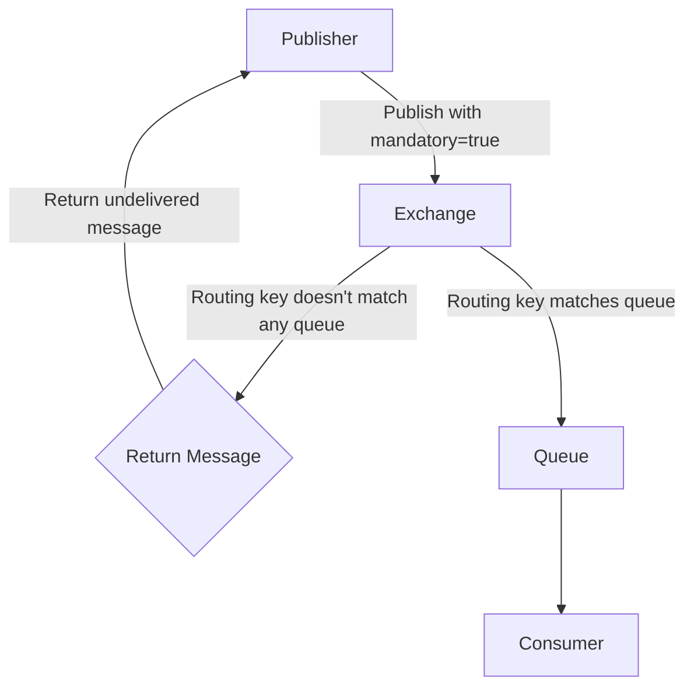

# RabbitMQ Return Messages

## Introduction

When working with distributed systems, ensuring message delivery is critical. But what happens when a message cannot be delivered to its intended destination? This is where RabbitMQ's **Return Messages** feature comes into play.

Return messages are a reliability mechanism in RabbitMQ that allows publishers to be notified when a message cannot be delivered to any queue. This typically happens when a message is published with the "mandatory" flag set, but no queue is bound to the exchange with a matching routing key.

In this tutorial, we'll explore how return messages work, when to use them, and how to implement handlers for undeliverable messages in your applications.

## Understanding Return Messages

### When Are Messages Returned?

Messages are returned to the publisher in two specific scenarios:

1. When a message is published with the **mandatory** flag set, but no queue matches the routing key
2. When a message is published with the **immediate** flag set, but no consumer is ready to accept the message immediately (Note: the immediate flag was deprecated in RabbitMQ 3.0)

Let's visualize this process:



### Why Use Return Messages?

Return messages provide publishers with feedback about message delivery failures, allowing them to:

- Log delivery failures
- Implement retry mechanisms
- Store undeliverable messages for later processing
- Alert administrators about potential configuration issues

## Implementing Return Message Handling

Let's look at how to implement return message handling in different programming languages.

### Java Example with Spring AMQP

First, let's set up a RabbitTemplate with a ReturnCallback:

```java
@Bean
public RabbitTemplate rabbitTemplate(ConnectionFactory connectionFactory) {
    RabbitTemplate template = new RabbitTemplate(connectionFactory);
    
    // Enable mandatory flag by default
    template.setMandatory(true);
    
    // Set up the return callback
    template.setReturnsCallback(returned -> {
        String message = new String(returned.getMessage().getBody());
        String routingKey = returned.getRoutingKey();
        String exchange = returned.getExchange();
        int replyCode = returned.getReplyCode();
        String replyText = returned.getReplyText();
        
        System.out.println("Message returned: " + message);
        System.out.println("Routing key: " + routingKey);
        System.out.println("Exchange: " + exchange);
        System.out.println("Reply code: " + replyCode);
        System.out.println("Reply text: " + replyText);
        
        // Implement your error handling logic here
        // For example, store in a "dead letter" database or retry later
    });
    
    return template;
}
```

Now, let's use this template to publish a message:

```java
@Service
public class MessagePublisher {
    private final RabbitTemplate rabbitTemplate;
    
    public MessagePublisher(RabbitTemplate rabbitTemplate) {
        this.rabbitTemplate = rabbitTemplate;
    }
    
    public void publishMessage(String exchange, String routingKey, String message) {
        // The mandatory flag is already set to true in our template
        rabbitTemplate.convertAndSend(exchange, routingKey, message);
        System.out.println("Message sent: " + message);
    }
}
```

### Output Example

When a message can't be delivered, your return callback would receive information and output something like:

```
Message sent: Hello, RabbitMQ!
Message returned: Hello, RabbitMQ!
Routing key: non.existent.key
Exchange: my.exchange
Reply code: 312
Reply text: NO_ROUTE
```

### Node.js Example with amqplib

Here's how to implement return message handling in Node.js:

```javascript
const amqp = require('amqplib');

async function publishWithReturnHandler() {
    try {
        // Connect to RabbitMQ
        const connection = await amqp.connect('amqp://localhost');
        const channel = await connection.createChannel();
        
        // Set up return handler
        channel.on('return', (msg) => {
            console.log('Message returned:');
            console.log(`Content: ${msg.content.toString()}`);
            console.log(`Routing key: ${msg.fields.routingKey}`);
            console.log(`Exchange: ${msg.fields.exchange}`);
            console.log(`Reply code: ${msg.fields.replyCode}`);
            console.log(`Reply text: ${msg.fields.replyText}`);
            
            // Implement your error handling logic here
        });
        
        // Declare exchange
        await channel.assertExchange('my.exchange', 'topic', { durable: true });
        
        // Publish message with mandatory flag
        const message = 'Hello, RabbitMQ!';
        channel.publish(
            'my.exchange',
            'non.existent.key',
            Buffer.from(message),
            { mandatory: true }
        );
        
        console.log('Message sent:', message);
        
        // Keep the program running to receive returns
        setTimeout(() => {
            connection.close();
            process.exit(0);
        }, 5000);
    } catch (error) {
        console.error('Error:', error);
    }
}

publishWithReturnHandler();
```

## Real-World Applications

### E-commerce Order Processing

In an e-commerce system, return messages can be used to handle scenarios where orders can't be routed to the appropriate fulfillment service.

```javascript
// Publishing an order message
function publishOrder(order) {
    // Determine routing key based on product category
    const routingKey = `order.${order.category}`;
    
    // Publish with mandatory flag to ensure delivery
    channel.publish(
        'order.exchange',
        routingKey,
        Buffer.from(JSON.stringify(order)),
        { mandatory: true }
    );
}

// Handle returned messages
channel.on('return', (msg) => {
    const order = JSON.parse(msg.content.toString());
    console.log(`Order ${order.id} could not be routed to fulfillment`);
    
    // Store in a retry queue
    channel.sendToQueue('orders.retry', Buffer.from(msg.content));
    
    // Alert customer service
    notifyCustomerService(order, 'Order processing delayed');
});
```

### Notification System

In a notification system, return messages can help track when notifications can't be delivered to specific services:

```java
@Service
public class NotificationService {
    private final RabbitTemplate rabbitTemplate;
    private final NotificationRepository notificationRepository;
    
    // Constructor injection...
    
    public void sendNotification(Notification notification) {
        // Set routing key based on notification type and user preferences
        String routingKey = "notification." + notification.getType() + 
                            "." + notification.getUserChannel();
        
        rabbitTemplate.convertAndSend("notification.exchange", routingKey, notification);
    }
    
    // Configure return callback
    @PostConstruct
    public void setupReturnCallback() {
        rabbitTemplate.setReturnsCallback(returned -> {
            Notification notification = (Notification) 
                rabbitTemplate.getMessageConverter().fromMessage(returned.getMessage());
            
            // Mark as failed in database
            notification.setStatus("DELIVERY_FAILED");
            notification.setFailureReason(returned.getReplyText());
            notificationRepository.save(notification);
            
            // Try alternative notification channel
            if (notification.getUserChannel().equals("push")) {
                notification.setUserChannel("email");
                // Retry with new channel
                sendNotification(notification);
            }
        });
    }
}
```

## Best Practices for Using Return Messages

1. **Always Handle Returns**: If you set the mandatory flag, always implement a return handler to avoid silent failures.

2. **Consider Performance**: Return handlers add overhead. Use them where reliability is more important than raw performance.

3. **Implement Retry Logic**: Create a strategy for handling returned messages, such as:
   - Immediate retry with different routing key
   - Delayed retry with exponential backoff
   - Moving to a dead-letter queue after maximum attempts

4. **Combine with Publisher Confirms**: For comprehensive reliability, use return messages alongside publisher confirms:
   - Returns tell you when a message couldn't be routed
   - Confirms tell you when a message was successfully processed

5. **Monitor Return Metrics**: Track the volume and patterns of returned messages to identify configuration issues.

## Implementation Patterns

### Dead Letter Strategy

```java
public void handleReturnedMessage(ReturnedMessage returned) {
    // Extract original message and metadata
    Message original = returned.getMessage();
    String routingKey = returned.getRoutingKey();
    
    // Add headers with return information
    Map<String, Object> headers = new HashMap<>(original.getMessageProperties().getHeaders());
    headers.put("x-original-exchange", returned.getExchange());
    headers.put("x-original-routing-key", routingKey);
    headers.put("x-return-reason", returned.getReplyText());
    headers.put("x-return-time", System.currentTimeMillis());
    
    // Publish to dead letter exchange
    rabbitTemplate.convertAndSend(
        "dead.letter.exchange",
        "unroutable",
        original.getBody(),
        message -> {
            message.getMessageProperties().setHeaders(headers);
            return message;
        }
    );
}
```

### Retry Pattern with Exponential Backoff

```javascript
channel.on('return', (msg) => {
    const content = JSON.parse(msg.content.toString());
    const headers = msg.properties.headers || {};
    
    // Get retry count or initialize to 0
    const retryCount = (headers['x-retry-count'] || 0) + 1;
    
    if (retryCount <= 3) {
        // Calculate delay with exponential backoff
        const delay = Math.pow(2, retryCount - 1) * 1000; // 1s, 2s, 4s
        
        setTimeout(() => {
            // Update headers
            const updatedHeaders = {
                ...headers,
                'x-retry-count': retryCount,
                'x-original-routing-key': msg.fields.routingKey
            };
            
            // Retry publishing
            channel.publish(
                msg.fields.exchange,
                msg.fields.routingKey,
                msg.content,
                {
                    mandatory: true,
                    headers: updatedHeaders
                }
            );
            
            console.log(`Retry ${retryCount} for message after ${delay}ms`);
        }, delay);
    } else {
        // Move to dead letter queue after max retries
        channel.sendToQueue('dead.letter.queue', msg.content, {
            headers: {
                ...headers,
                'x-max-retries-exceeded': true,
                'x-original-exchange': msg.fields.exchange,
                'x-original-routing-key': msg.fields.routingKey
            }
        });
        
        console.log('Max retries exceeded, moved to dead letter queue');
    }
});
```

## Summary

RabbitMQ Return Messages provide a crucial mechanism for handling message delivery failures at the publisher level. By setting the mandatory flag and implementing return handlers, you can build more reliable messaging systems that gracefully handle scenarios where messages cannot be routed to any queue.

Key takeaways:

- Return messages notify publishers when messages can't be delivered
- They work with the mandatory flag set on published messages
- They enable publishers to implement retry strategies, logging, or alerting for undeliverable messages
- When combined with other reliability features like publisher confirms, they provide comprehensive delivery guarantees

## Additional Resources

- [RabbitMQ Documentation on Publisher Returns](https://www.rabbitmq.com/publishers.html#returns)
- [Spring AMQP Documentation on Returns](https://docs.spring.io/spring-amqp/docs/current/reference/html/#template-confirms)
- [amqplib Documentation for Node.js](https://www.squaremobius.net/amqp.node/channel_api.html#channel_events)

## Exercises

1. Implement a return handler that logs returned messages to a file with timestamps and reason codes.
2. Create a system that moves returned messages to different queues based on their original routing keys.
3. Build a web dashboard that displays statistics about returned messages in your system.
4. Implement a circuit breaker pattern that stops publishing to specific routing keys if they consistently return messages.
5. Extend the retry pattern example to use a dedicated retry exchange and queue instead of setTimeout.