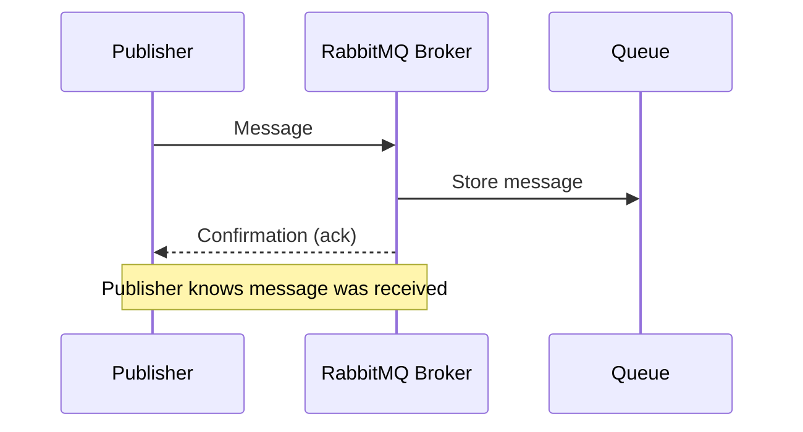

# RabbitMQ Publisher Confirms

## Introduction

When building reliable messaging systems, one critical question is: "How do I know if my message was actually received by the broker?" This is where RabbitMQ's Publisher Confirms feature comes in - a mechanism that gives publishers confirmation that their messages have been safely received and processed by the RabbitMQ broker.

In this tutorial, we'll explore how Publisher Confirms work, why they're essential for building reliable systems, and how to implement them in your applications using different programming languages.

## What are Publisher Confirms?

Publisher Confirms are a RabbitMQ extension to the AMQP protocol that provide acknowledgments from the broker back to the publisher. When a publisher sends a message to RabbitMQ:

1. The broker receives the message
2. The broker processes the message (stores it in queues)
3. The broker sends back a confirmation to the publisher

This confirmation tells the publisher that the message was safely received and processed by the broker.



## Why Use Publisher Confirms?

Without Publisher Confirms, a publisher has no way of knowing if a message was successfully received by the broker. This can lead to message loss in scenarios like:

- Network issues between publisher and broker
- Broker crashes before processing the message
- Message rejected due to broker resource constraints

By enabling confirms, applications can implement reliable publishing patterns that handle failure scenarios appropriately.

## Enabling Publisher Confirms

Before sending messages, you need to put the channel into confirm mode. Let's see how this works in different languages:

### Java

```java
// Create a channel
Channel channel = connection.createChannel();

// Enable publisher confirms
channel.confirmSelect();

// Now you can publish messages and get confirmations
```

### Node.js

```javascript
// Create a channel
const channel = await connection.createChannel();

// Enable publisher confirms
await channel.confirmSelect();

// Now you can publish messages and get confirmations
```

### Python

```python
# Create a channel
channel = connection.channel()

# Enable publisher confirms
channel.confirm_delivery()

# Now you can publish messages and get confirmations
```

## Publisher Confirm Strategies

There are three main strategies for handling publisher confirms:

1. **Individual confirms (synchronous)** - Wait for confirmation after each published message
2. **Batching confirms (synchronous)** - Publish a batch of messages and wait for all confirmations
3. **Asynchronous confirms** - Set up callback handlers for confirmations and continue publishing

Let's explore each approach with examples.

## Strategy 1: Individual Confirms

This is the simplest approach but offers the lowest throughput:

### Java Example

```java
// Enable confirms
channel.confirmSelect();

// Publish message and wait for confirmation
channel.basicPublish("exchange", "routingKey", null, "message".getBytes());
if (channel.waitForConfirms()) {
    System.out.println("Message was confirmed");
} else {
    System.out.println("Message was not confirmed");
}
```

### Node.js Example

```javascript
// Enable confirms
await channel.confirmSelect();

// Publish message and wait for confirmation
channel.publish("exchange", "routingKey", Buffer.from("message"));
await channel.waitForConfirms();
console.log("Message was confirmed");
```

### Python Example

```python
# Enable confirms
channel.confirm_delivery()

# Publish message
channel.basic_publish(
    exchange="exchange",
    routing_key="routingKey",
    body="message"
)

# If no exception is raised, the message was confirmed
print("Message was confirmed")
```

**Pros:**
- Simple to implement
- Straightforward error handling

**Cons:**
- Low throughput - waiting for each confirmation blocks the publishing pipeline

## Strategy 2: Batching Confirms

This approach improves throughput by publishing multiple messages before waiting for confirms:

### Java Example

```java
// Enable confirms
channel.confirmSelect();

// Publish batch of messages
int batchSize = 100;
int outstandingMessageCount = 0;

for (int i = 0; i < MESSAGE_COUNT; i++) {
    channel.basicPublish("exchange", "routingKey", null, 
                         ("message " + i).getBytes());
    outstandingMessageCount++;

    if (outstandingMessageCount == batchSize) {
        channel.waitForConfirms();
        outstandingMessageCount = 0;
    }
}

// Wait for any remaining confirms
if (outstandingMessageCount > 0) {
    channel.waitForConfirms();
}
```

### Node.js Example

```javascript
// Enable confirms
await channel.confirmSelect();

// Publish batch of messages
const batchSize = 100;
let outstandingMessageCount = 0;

for (let i = 0; i < MESSAGE_COUNT; i++) {
    channel.publish("exchange", "routingKey", 
                   Buffer.from(`message ${i}`));
    outstandingMessageCount++;

    if (outstandingMessageCount === batchSize) {
        await channel.waitForConfirms();
        outstandingMessageCount = 0;
    }
}

// Wait for any remaining confirms
if (outstandingMessageCount > 0) {
    await channel.waitForConfirms();
}
```

### Python Example

```python
# Enable confirms
channel.confirm_delivery()

# Publish batch of messages
batch_size = 100
outstanding_message_count = 0

for i in range(MESSAGE_COUNT):
    channel.basic_publish(
        exchange="exchange",
        routing_key="routingKey",
        body=f"message {i}"
    )
    outstanding_message_count += 1

    if outstanding_message_count == batch_size:
        # In Python, confirmation is automatic after each publish
        # unless an exception is raised
        outstanding_message_count = 0

# No need to wait for remaining confirms in Python
```

**Pros:**
- Better throughput than individual confirms
- Still relatively simple to implement

**Cons:**
- If a failure occurs, you don't know which specific messages in the batch failed
- Need to republish the entire batch on failure

## Strategy 3: Asynchronous Confirms

This is the most powerful and efficient approach, using callbacks to handle confirmations without blocking:

### Java Example

```java
// Enable confirms
channel.confirmSelect();

// Set up confirm listeners
ConcurrentNavigableMap<Long, String> outstandingConfirms = new ConcurrentSkipListMap<>();

channel.addConfirmListener((sequenceNumber, multiple) -> {
    // Handle confirms (acks)
    if (multiple) {
        ConcurrentNavigableMap<Long, String> confirmed = outstandingConfirms.headMap(
                sequenceNumber, true
        );
        confirmed.clear();
    } else {
        outstandingConfirms.remove(sequenceNumber);
    }
    return false;
}, (sequenceNumber, multiple) -> {
    // Handle nacks (rejections)
    String message = outstandingConfirms.get(sequenceNumber);
    System.err.format("Message %s was nacked and needs to be republished%n", message);
    
    if (multiple) {
        ConcurrentNavigableMap<Long, String> nacked = outstandingConfirms.headMap(
                sequenceNumber, true
        );
        nacked.clear();
    } else {
        outstandingConfirms.remove(sequenceNumber);
    }
    return false;
});

// Publish messages and track them
for (int i = 0; i < MESSAGE_COUNT; i++) {
    String message = "message " + i;
    outstandingConfirms.put(channel.getNextPublishSeqNo(), message);
    channel.basicPublish("exchange", "routingKey", null, message.getBytes());
}
```

### Node.js Example

```javascript
// Enable confirms
await channel.confirmSelect();

// Set up a map to track outstanding messages
const outstandingConfirms = new Map();

// Set up confirm listeners
channel.on('ack', (seqNo, multiple) => {
    // Handle confirms
    if (multiple) {
        // Clear all messages up to and including seqNo
        for (const key of outstandingConfirms.keys()) {
            if (key <= seqNo) {
                outstandingConfirms.delete(key);
            }
        }
    } else {
        outstandingConfirms.delete(seqNo);
    }
});

channel.on('nack', (seqNo, multiple) => {
    // Handle rejections
    if (multiple) {
        // Handle all messages up to and including seqNo
        for (const key of outstandingConfirms.keys()) {
            if (key <= seqNo) {
                const message = outstandingConfirms.get(key);
                console.error(`Message ${message} was nacked and needs to be republished`);
                outstandingConfirms.delete(key);
            }
        }
    } else {
        const message = outstandingConfirms.get(seqNo);
        console.error(`Message ${message} was nacked and needs to be republished`);
        outstandingConfirms.delete(seqNo);
    }
});

// Publish messages and track them
for (let i = 0; i < MESSAGE_COUNT; i++) {
    const message = `message ${i}`;
    const seqNo = channel.publish("exchange", "routingKey", Buffer.from(message));
    outstandingConfirms.set(seqNo, message);
}
```

### Python Example

```python
# Define callback for confirms
def confirm_callback(frame):
    if isinstance(frame.method, pika.spec.Basic.Ack):
        # Handle confirms
        if frame.method.multiple:
            # Clear all messages up to and including delivery_tag
            keys_to_remove = [k for k in outstandingConfirms.keys() if k <= frame.method.delivery_tag]
            for key in keys_to_remove:
                outstandingConfirms.pop(key, None)
        else:
            outstandingConfirms.pop(frame.method.delivery_tag, None)
    elif isinstance(frame.method, pika.spec.Basic.Nack):
        # Handle rejections
        if frame.method.multiple:
            # Handle all messages up to and including delivery_tag
            keys_to_remove = [k for k in outstandingConfirms.keys() if k <= frame.method.delivery_tag]
            for key in keys_to_remove:
                message = outstandingConfirms.pop(key, None)
                print(f"Message {message} was nacked and needs to be republished")
        else:
            message = outstandingConfirms.pop(frame.method.delivery_tag, None)
            print(f"Message {message} was nacked and needs to be republished")

# Enable confirms
channel.confirm_delivery(callback=confirm_callback)

# Set up a dictionary to track outstanding messages
outstandingConfirms = {}

# Publish messages and track them
for i in range(MESSAGE_COUNT):
    message = f"message {i}"
    # In Pika, you can get the delivery tag from the channel's next_publish_seq_no
    delivery_tag = channel.next_publish_seq_no
    outstandingConfirms[delivery_tag] = message
    channel.basic_publish(
        exchange="exchange",
        routing_key="routingKey",
        body=message
    )
```

**Pros:**
- Highest throughput
- Fine-grained error handling (know exactly which messages failed)
- Non-blocking publishing pipeline

**Cons:**
- More complex to implement
- Requires careful tracking of message sequence numbers

## Handling Failed Messages

When a message is not confirmed (nacked), you have several options:

1. **Republish the message** - Attempt to send it again
2. **Store the message locally** - Keep it in a persistent store for later retry
3. **Alert an operator** - For critical messages that must be handled

Remember that a nack doesn't always mean the message is lost - it could still be delivered. Handling this correctly depends on your application's requirements.

## Real-World Example: Order Processing System

Let's look at a practical example of using publisher confirms in an order processing system:

```java
// Enable confirms and set up listeners
channel.confirmSelect();

Map<Long, Order> pendingOrders = new ConcurrentHashMap<>();

channel.addConfirmListener((sequenceNumber, multiple) -> {
    // Handle confirms (orders successfully sent to broker)
    if (multiple) {
        pendingOrders.entrySet().removeIf(entry -> entry.getKey() <= sequenceNumber);
    } else {
        pendingOrders.remove(sequenceNumber);
    }
    return false;
}, (sequenceNumber, multiple) -> {
    // Handle nacks (orders rejected by broker)
    if (multiple) {
        pendingOrders.entrySet().stream()
                .filter(entry -> entry.getKey() <= sequenceNumber)
                .forEach(entry -> {
                    Order failedOrder = entry.getValue();
                    
                    // Log the failure
                    logger.error("Failed to publish order: {}", failedOrder.getId());
                    
                    // Store in database for retry
                    orderRepository.markForRetry(failedOrder);
                    
                    // Remove from pending map
                    pendingOrders.remove(entry.getKey());
                });
    } else {
        Order failedOrder = pendingOrders.remove(sequenceNumber);
        logger.error("Failed to publish order: {}", failedOrder.getId());
        orderRepository.markForRetry(failedOrder);
    }
    return false;
});

// Process and publish orders
for (Order order : orders) {
    try {
        // Convert order to message
        byte[] orderMessage = objectMapper.writeValueAsBytes(order);
        
        // Get sequence number and track the order
        long seqNo = channel.getNextPublishSeqNo();
        pendingOrders.put(seqNo, order);
        
        // Publish to RabbitMQ
        channel.basicPublish("orders", order.getType(), 
                            MessageProperties.PERSISTENT_BASIC, 
                            orderMessage);
        
        // Update status in database (pending confirmation)
        orderRepository.updateStatus(order.getId(), "PROCESSING");
    } catch (Exception e) {
        logger.error("Error publishing order: {}", order.getId(), e);
        orderRepository.markForRetry(order);
    }
}
```

In this example:
1. We track each order using its sequence number
2. We handle both confirmations and rejections
3. Failed orders are stored in a database for later retry
4. The system maintains durability by ensuring orders aren't lost

## Best Practices

When working with Publisher Confirms, keep these best practices in mind:

1. **Use asynchronous confirms for high-throughput systems** - They offer the best performance while maintaining reliability
2. **Track messages by sequence number** - This allows you to know exactly which messages failed
3. **Implement proper error handling** - Have a strategy for handling nacked messages
4. **Consider using transactions for critical messages** - For messages that absolutely cannot be lost
5. **Combine with durable exchanges and queues** - For complete end-to-end reliability
6. **Handle connection failures** - Maintain a list of unsent messages that can survive application restarts
7. **Set reasonable timeouts** - Don't wait indefinitely for confirmations

## Limitations and Alternatives

Publisher Confirms have some limitations:

1. **They only confirm receipt by the broker** - Not delivery to consumers
2. **They add some overhead** - Especially in synchronous mode
3. **They don't guarantee idempotence** - Messages might be published twice in failure scenarios

Alternatives to consider:

1. **RabbitMQ Transactions** - More heavyweight but ACID-compliant
2. **Client-side retry mechanisms** - Implementing your own tracking and retry logic
3. **External message tracking systems** - Using databases to track message state

## Summary

RabbitMQ Publisher Confirms provide an essential mechanism for ensuring that messages are reliably delivered to the broker. In this tutorial, we've explored:

- What Publisher Confirms are and why they're important
- Three strategies for implementing confirms (individual, batching, and asynchronous)
- Code examples in Java, Node.js, and Python
- Real-world application in an order processing system
- Best practices and limitations

By implementing Publisher Confirms in your applications, you can build more reliable messaging systems that can handle failures gracefully and prevent message loss.

## Exercises

1. Implement an asynchronous confirm listener that logs the confirmation rate (confirms per second)
2. Create a simple application that publishes messages with confirms and handles broker restarts
3. Benchmark the three different confirm strategies to compare their throughput
4. Implement a reliable publisher that stores unconfirmed messages in a local database
5. Extend the order processing example to include retry logic with exponential backoff

## Additional Resources

- [RabbitMQ Publisher Confirms Documentation](https://www.rabbitmq.com/confirms.html)
- [Understanding When RabbitMQ Messages Are Lost](https://www.rabbitmq.com/reliability.html)
- [Implementing Reliable Publishing with Spring AMQP](https://docs.spring.io/spring-amqp/docs/current/reference/html/#template-confirms)