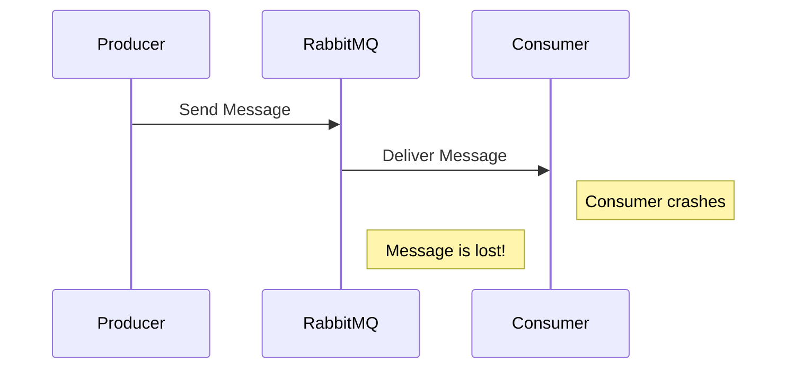
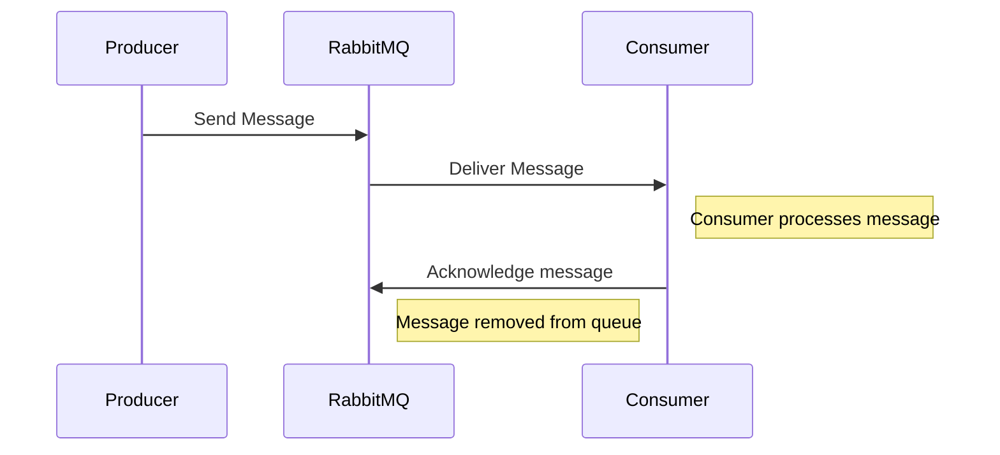
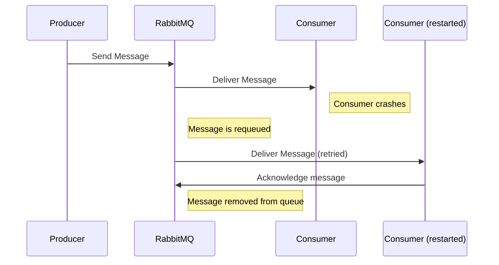
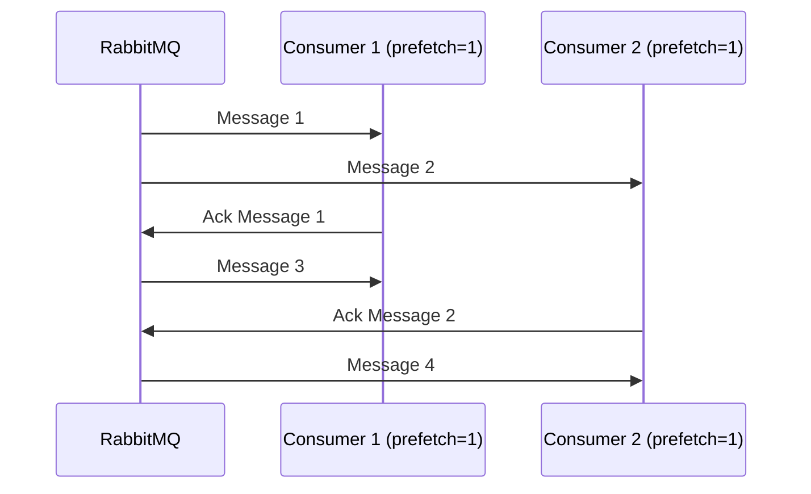
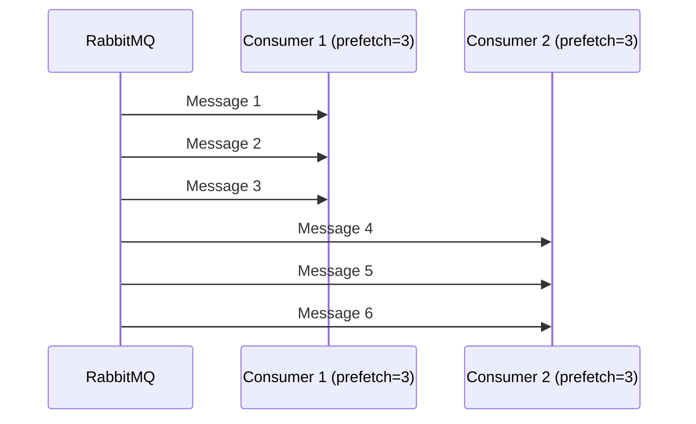

# RabbitMQ Consumer Acknowledgments

## Introduction

When working with message brokers like RabbitMQ, ensuring that messages are properly processed is critical to building reliable applications. One of the most important reliability mechanisms in RabbitMQ is the **acknowledgment system**, which allows consumers to confirm when they have successfully processed a message.

In this guide, we'll explore how consumer acknowledgments work in RabbitMQ, why they're essential for building reliable systems, and how to implement different acknowledgment patterns in your applications.

## Understanding Message Acknowledgments

### What are Acknowledgments?

Acknowledgments (or "acks" for short) are signals that a consumer sends back to RabbitMQ to indicate that it has successfully processed a message. When RabbitMQ receives an acknowledgment, it knows it can safely remove the message from the queue.

### Why Message Acknowledgments Matter

Without acknowledgments, RabbitMQ would remove messages from queues as soon as they are delivered to a consumer. This approach has a critical flaw: if a consumer crashes or encounters an error while processing a message, that message would be lost forever.

Let's visualize the problem:



With acknowledgments, RabbitMQ doesn't remove a message until it receives confirmation that the message was processed successfully:



If the consumer crashes before acknowledging:



## Acknowledgment Modes in RabbitMQ

RabbitMQ supports several acknowledgment modes that determine how and when messages are acknowledged:

### 1. Auto Acknowledgment Mode (No Acks)

In this mode, RabbitMQ considers messages to be acknowledged as soon as they are delivered.

**Pros:**
- Simplest approach
- Highest throughput

**Cons:**
- No reliability guarantees
- Messages can be lost if consumers crash

### 2. Manual Acknowledgment Mode

In this mode, consumers must explicitly send acknowledgments back to RabbitMQ.

**Types of manual acknowledgments:**

- **Basic Ack**: Acknowledges a single message
- **Basic Nack**: Negatively acknowledges a message (indicates failure)
- **Basic Reject**: Similar to nack but with fewer options
- **Multiple Acknowledgment**: Acknowledges multiple messages at once

Let's implement each of these acknowledgment modes with code examples.

## Implementing Acknowledgment Patterns

### Setting Up Your RabbitMQ Connection

First, let's set up a basic connection to RabbitMQ using a popular client library called `amqp-client` for Java:

```java
import com.rabbitmq.client.*;

public class RabbitMQConsumer {

    private final static String QUEUE_NAME = "task_queue";

    public static void main(String[] argv) throws Exception {
        // Create a connection factory
        ConnectionFactory factory = new ConnectionFactory();
        factory.setHost("localhost");
        
        // Create connection and channel
        Connection connection = factory.newConnection();
        Channel channel = connection.createChannel();
        
        // Declare a queue
        channel.queueDeclare(QUEUE_NAME, true, false, false, null);
        System.out.println("Waiting for messages...");
        
        // Consumer code will go here
        
        // Closing happens in shutdown hooks or after processing
    }
}
```

### Auto Acknowledgment Mode (No Acks)

Here's how to create a consumer with auto acknowledgment mode:

```java
// Auto-ack is enabled by setting the second parameter to true
channel.basicConsume(QUEUE_NAME, true, (consumerTag, delivery) -> {
    String message = new String(delivery.getBody(), "UTF-8");
    System.out.println("Received message: " + message);
    // Process the message here
    // No need to acknowledge - it's automatic
}, consumerTag -> { });
```

**Output:**
```
Waiting for messages...
Received message: Hello World!
Received message: Task message 1
```

### Manual Acknowledgment Mode with Basic Ack

To use manual acknowledgment, set `autoAck` to `false` and explicitly acknowledge messages:

```java
// Auto-ack is disabled by setting the second parameter to false
channel.basicConsume(QUEUE_NAME, false, (consumerTag, delivery) -> {
    String message = new String(delivery.getBody(), "UTF-8");
    try {
        System.out.println("Received message: " + message);
        // Process the message here
        doWork(message);
        
        // Acknowledge the message after successful processing
        channel.basicAck(delivery.getEnvelope().getDeliveryTag(), false);
        System.out.println("Message processed successfully and acknowledged");
    } catch (Exception e) {
        System.out.println("Error processing message: " + e.getMessage());
        // Handling failures will be covered in the next sections
    }
}, consumerTag -> { });

// Simulate message processing
private static void doWork(String message) throws InterruptedException {
    // Simulate processing time (longer for messages with more dots)
    for (char ch : message.toCharArray()) {
        if (ch == '.') {
            Thread.sleep(1000);
        }
    }
}
```

**Output:**
```
Waiting for messages...
Received message: Hello World!
Message processed successfully and acknowledged
Received message: Task message...
Processing...
Processing...
Processing...
Message processed successfully and acknowledged
```

### Using Basic Nack for Message Rejection

When your consumer encounters an error it can't handle, you might want to either:
1. Reject and discard the message
2. Reject and requeue the message for later processing

Here's how to handle these cases:

```java
channel.basicConsume(QUEUE_NAME, false, (consumerTag, delivery) -> {
    String message = new String(delivery.getBody(), "UTF-8");
    try {
        System.out.println("Received message: " + message);
        
        // Simulate a processing error for certain messages
        if (message.contains("error")) {
            throw new RuntimeException("Failed to process message");
        }
        
        // Normal processing
        doWork(message);
        
        // Acknowledge successful processing
        channel.basicAck(delivery.getEnvelope().getDeliveryTag(), false);
        System.out.println("Message processed successfully");
    } catch (Exception e) {
        System.out.println("Error processing message: " + e.getMessage());
        
        // Reject the message and requeue it (second parameter)
        try {
            // Negative acknowledgment - requeue the message (true)
            channel.basicNack(delivery.getEnvelope().getDeliveryTag(), false, true);
            System.out.println("Message requeued for later processing");
        } catch (IOException ioException) {
            System.err.println("Failed to nack message: " + ioException.getMessage());
        }
    }
}, consumerTag -> { });
```

**Output when processing normal message:**
```
Waiting for messages...
Received message: Hello World!
Message processed successfully
```

**Output when processing error message:**
```
Waiting for messages...
Received message: This will cause an error
Error processing message: Failed to process message
Message requeued for later processing
```

### Using Basic Reject

For simpler cases, you can use `basicReject` instead of `basicNack`:

```java
// Instead of basicNack, you can use basicReject when you don't need 
// the "multiple" flag capability
channel.basicReject(delivery.getEnvelope().getDeliveryTag(), true); // true to requeue
```

The main difference is that `basicNack` can reject multiple messages at once and provides more flexibility.

### Multiple Acknowledgment

You can acknowledge multiple messages at once by setting the second parameter of `basicAck` to `true`:

```java
// Consumer with batch processing
final int batchSize = 10;
final AtomicInteger messageCount = new AtomicInteger(0);

channel.basicQos(batchSize * 2); // Prefetch count
channel.basicConsume(QUEUE_NAME, false, (consumerTag, delivery) -> {
    String message = new String(delivery.getBody(), "UTF-8");
    long deliveryTag = delivery.getEnvelope().getDeliveryTag();
    
    try {
        System.out.println("Received message #" + deliveryTag + ": " + message);
        doWork(message);
        
        // If this is a multiple of our batch size or the last delivery tag, 
        // acknowledge all messages up to this point
        if (deliveryTag % batchSize == 0) {
            channel.basicAck(deliveryTag, true); // Acknowledge this and all previous messages
            System.out.println("Batch acknowledged up to message #" + deliveryTag);
        }
    } catch (Exception e) {
        System.out.println("Error processing message: " + e.getMessage());
        // In case of error, you might want to nack the entire batch
        try {
            channel.basicNack(deliveryTag, true, true);
            System.out.println("Batch negatively acknowledged up to message #" + deliveryTag);
        } catch (IOException ioException) {
            System.err.println("Failed to nack messages: " + ioException.getMessage());
        }
    }
}, consumerTag -> { });
```

**Output:**
```
Waiting for messages...
Received message #1: Hello World!
Received message #2: Task message 1
...
Received message #10: Task message 9
Batch acknowledged up to message #10
```

## Prefetch Settings and Their Impact on Acknowledgments

The `basicQos` method sets the prefetch count, which determines how many unacknowledged messages a consumer can have at one time:

```java
// Set prefetch count to 1
channel.basicQos(1);
```

This setting has a significant impact on how your acknowledgments work:

- **Low prefetch count (e.g., 1)**: RabbitMQ will only send one message at a time and wait for acknowledgment before sending the next. This achieves fair dispatch between multiple consumers but can limit throughput.

- **High prefetch count**: RabbitMQ will send many messages at once, which can improve throughput but might overwhelm consumers or lead to unfair work distribution.

Here's a diagram showing how prefetch count affects message delivery:



With a higher prefetch count:



## Real-World Acknowledgment Patterns

Now let's look at some practical patterns for implementing acknowledgments in real-world scenarios.

### 1. Single Message Processing with Retry Logic

This pattern is useful for processing messages that might temporarily fail but could succeed after retrying:

```java
channel.basicConsume(QUEUE_NAME, false, (consumerTag, delivery) -> {
    String message = new String(delivery.getBody(), "UTF-8");
    int retryCount = 0;
    int maxRetries = 3;
    boolean success = false;
    
    while (!success && retryCount < maxRetries) {
        try {
            System.out.println("Processing message, attempt " + (retryCount + 1));
            // Try to process the message
            processMessage(message);
            success = true;
        } catch (Exception e) {
            retryCount++;
            System.out.println("Failed to process message: " + e.getMessage());
            
            if (retryCount < maxRetries) {
                System.out.println("Retrying in 2 seconds...");
                Thread.sleep(2000); // Wait before retrying
            }
        }
    }
    
    if (success) {
        // Acknowledge the message if processing was successful
        channel.basicAck(delivery.getEnvelope().getDeliveryTag(), false);
        System.out.println("Message processed and acknowledged after " + retryCount + " retries");
    } else {
        // Failed after all retries - reject and maybe send to a dead letter queue
        channel.basicNack(delivery.getEnvelope().getDeliveryTag(), false, false);
        System.out.println("Message processing failed after " + maxRetries + " attempts - rejected");
    }
}, consumerTag -> { });
```

### 2. Dead Letter Exchange Pattern

For messages that can't be processed after multiple attempts, you can send them to a dead letter exchange:

```java
// First, declare a queue with a dead letter exchange
Map<String, Object> arguments = new HashMap<>();
arguments.put("x-dead-letter-exchange", "dlx.exchange");
arguments.put("x-dead-letter-routing-key", "dlx.routing.key");
channel.queueDeclare(QUEUE_NAME, true, false, false, arguments);

// Declare the dead letter exchange and queue
channel.exchangeDeclare("dlx.exchange", "direct");
channel.queueDeclare("dlx.queue", true, false, false, null);
channel.queueBind("dlx.queue", "dlx.exchange", "dlx.routing.key");

// Consumer code that rejects failed messages
channel.basicConsume(QUEUE_NAME, false, (consumerTag, delivery) -> {
    String message = new String(delivery.getBody(), "UTF-8");
    try {
        System.out.println("Processing message: " + message);
        
        if (message.contains("fail")) {
            throw new RuntimeException("Simulated failure");
        }
        
        // Process the message
        doWork(message);
        
        // Acknowledge success
        channel.basicAck(delivery.getEnvelope().getDeliveryTag(), false);
        System.out.println("Successfully processed message");
    } catch (Exception e) {
        System.out.println("Failed to process message: " + e.getMessage());
        
        // Reject the message without requeuing - it will go to the DLX
        channel.basicNack(delivery.getEnvelope().getDeliveryTag(), false, false);
        System.out.println("Message sent to dead letter queue");
    }
}, consumerTag -> { });
```

### 3. Batch Processing with Transactions

For scenarios where you need to process messages in batches and need all-or-nothing semantics:

```java
// Enable transactions on the channel
channel.txSelect();

final int batchSize = 5;
final List<Long> deliveryTags = new ArrayList<>();

channel.basicConsume(QUEUE_NAME, false, (consumerTag, delivery) -> {
    String message = new String(delivery.getBody(), "UTF-8");
    long deliveryTag = delivery.getEnvelope().getDeliveryTag();
    
    try {
        System.out.println("Processing message #" + deliveryTag + ": " + message);
        processMessage(message);
        
        // Keep track of this message's delivery tag
        deliveryTags.add(deliveryTag);
        
        // If we've processed a full batch, commit the transaction
        if (deliveryTags.size() >= batchSize) {
            try {
                // Acknowledge all messages in the batch
                for (Long tag : deliveryTags) {
                    channel.basicAck(tag, false);
                }
                
                // Commit the transaction
                channel.txCommit();
                System.out.println("Transaction committed for batch of " + deliveryTags.size() + " messages");
                deliveryTags.clear();
            } catch (Exception e) {
                // If anything goes wrong, roll back
                channel.txRollback();
                System.out.println("Transaction rolled back due to error: " + e.getMessage());
            }
        }
    } catch (Exception e) {
        System.out.println("Error processing message: " + e.getMessage());
        
        // Roll back any pending operations
        try {
            channel.txRollback();
            System.out.println("Transaction rolled back");
            
            // Requeue the message for later processing
            channel.basicNack(deliveryTag, false, true);
        } catch (IOException ioException) {
            System.err.println("Failed to rollback: " + ioException.getMessage());
        }
    }
}, consumerTag -> { });
```

## Best Practices for Consumer Acknowledgments

To ensure reliable message processing, follow these best practices:

### 1. Acknowledge After Processing, Not Before

Always send acknowledgments after you've successfully processed a message, not before:

```java
// GOOD: Acknowledge after processing
try {
    // Process the message
    processMessage(message);
    
    // Then acknowledge
    channel.basicAck(delivery.getEnvelope().getDeliveryTag(), false);
} catch (Exception e) {
    // Handle failure
}

// BAD: Don't do this!
channel.basicAck(delivery.getEnvelope().getDeliveryTag(), false);
processMessage(message); // If this fails, the message is already acknowledged!
```

### 2. Set Appropriate Prefetch Values

Choose prefetch values based on your consumer's processing capacity:

```java
// For CPU-bound tasks, set prefetch close to the number of processor cores
channel.basicQos(Runtime.getRuntime().availableProcessors());

// For I/O-bound tasks, you might set higher prefetch
channel.basicQos(25);

// For very expensive operations, limit to 1 at a time
channel.basicQos(1);
```

### 3. Implement Idempotent Consumers

Design your message handlers to be idempotent (able to process the same message multiple times without negative effects):

```java
public void processPayment(String paymentId) {
    // Check if payment was already processed
    if (paymentRepository.isAlreadyProcessed(paymentId)) {
        log.info("Payment {} was already processed - skipping", paymentId);
        return;
    }
    
    // Process the payment
    Payment payment = paymentService.process(paymentId);
    
    // Mark as processed to ensure idempotence
    paymentRepository.markAsProcessed(paymentId);
}
```

### 4. Handle Different Types of Failures Appropriately

Different errors require different handling strategies:

```java
try {
    processMessage(message);
    channel.basicAck(deliveryTag, false);
} catch (TemporaryFailureException e) {
    // Temporary issue - requeue for retry
    channel.basicNack(deliveryTag, false, true);
    log.warn("Temporary failure, message requeued: {}", e.getMessage());
} catch (PermanentFailureException e) {
    // Permanent issue - send to dead letter queue
    channel.basicNack(deliveryTag, false, false);
    log.error("Permanent failure, message rejected: {}", e.getMessage());
} catch (Exception e) {
    // Unexpected error - log and requeue
    channel.basicNack(deliveryTag, false, true);
    log.error("Unexpected error: {}", e.getMessage(), e);
}
```

## Summary

In this guide, we've covered:

1. **The importance of acknowledgments** for ensuring messages are reliably processed
2. **Different acknowledgment modes** in RabbitMQ:
   - Auto acknowledgment (no acks)
   - Manual acknowledgment with `basicAck`
   - Negative acknowledgment with `basicNack`
   - Rejection with `basicReject`
   - Multiple acknowledgment for batch processing
3. **Real-world acknowledgment patterns**:
   - Single message processing with retry logic
   - Dead letter exchange pattern for unprocessable messages
   - Batch processing with transactions
4. **Best practices** for implementing consumer acknowledgments

By implementing proper acknowledgment patterns, you can build robust and reliable messaging systems that can handle failures gracefully and ensure that no message is ever lost.

## Additional Resources

- [RabbitMQ Documentation on Consumer Acknowledgments](https://www.rabbitmq.com/confirms.html)
- [RabbitMQ Java Client API Guide](https://www.rabbitmq.com/api-guide.html)
- [Dead Letter Exchanges](https://www.rabbitmq.com/dlx.html)

## Exercises

1. **Basic Acknowledgment Exercise**: Modify the basic acknowledgment example to include a simulated network failure that occasionally prevents acknowledgments. Implement a solution that ensures messages are still processed exactly once.

2. **Retry Pattern Exercise**: Implement a consumer that retries failed messages a configurable number of times before sending them to a dead letter queue.

3. **Batch Processing Exercise**: Create a consumer that processes messages in batches of 10, with all-or-nothing semantics using transactions.

4. **Performance Comparison Exercise**: Compare the throughput of auto-ack mode versus manual ack with different prefetch values. Document your findings.