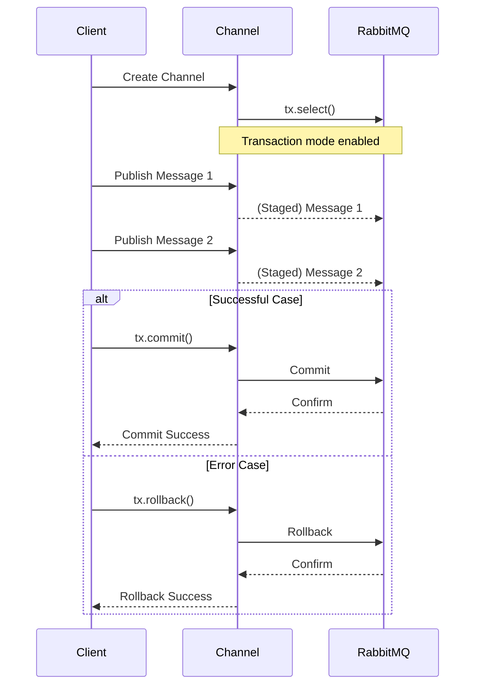

# RabbitMQ Transactions

## Introduction

When working with message queues, ensuring that messages are reliably published and consumed is crucial. RabbitMQ, as an implementation of the Advanced Message Queuing Protocol (AMQP), provides several mechanisms to guarantee message delivery. One such mechanism is **transactions**.

Transactions in RabbitMQ allow you to group multiple operations (like publishing messages or acknowledging deliveries) and execute them as a single atomic unit. This means that either all operations within the transaction succeed, or none do. If any operation fails, all changes are rolled back, ensuring the consistency of your messaging system.

## Understanding RabbitMQ Transactions

Transactions in RabbitMQ work at the channel level. A channel is a virtual connection inside a RabbitMQ connection that lets you interact with the broker. When you enable transactions on a channel, all operations on that channel become part of the transaction until you either commit or roll back.

### Key Transaction Operations

- **tx.select**: Enables transaction mode on a channel
- **tx.commit**: Commits all operations performed since the last commit
- **tx.rollback**: Rolls back all operations performed since the last commit

## When to Use Transactions

Transactions are particularly useful when:

1. You need to ensure that multiple messages are published together
2. You want to make sure that message acknowledgments are processed atomically
3. You need a guarantee that either all operations succeed or none do

However, it's important to note that transactions come with a performance overhead, as they require synchronous communication with the broker for each commit or rollback.

## Code Examples: Working with Transactions in RabbitMQ

Let's explore how to use transactions in RabbitMQ with examples in different programming languages.

### Example 1: Publishing Messages with Transactions in Node.js

```javascript
const amqp = require('amqplib');

async function publishWithTransaction() {
  try {
    // Connect to RabbitMQ server
    const connection = await amqp.connect('amqp://localhost');
    const channel = await connection.createChannel();
    
    // Declare a queue
    const queueName = 'transaction_example';
    await channel.assertQueue(queueName, { durable: true });
    
    // Enable transactions on the channel
    await channel.assertQueue(queueName, { durable: true });
    
    // Enable transactions on the channel
    await channel.txSelect();
    
    try {
      // Publish multiple messages within the transaction
      channel.sendToQueue(queueName, Buffer.from('Message 1'), { persistent: true });
      channel.sendToQueue(queueName, Buffer.from('Message 2'), { persistent: true });
      channel.sendToQueue(queueName, Buffer.from('Message 3'), { persistent: true });
      
      // If everything goes well, commit the transaction
      await channel.txCommit();
      console.log('Transaction committed successfully');
    } catch (error) {
      // If there's an error, roll back the transaction
      await channel.txRollback();
      console.error('Transaction rolled back due to error:', error);
    }
    
    // Close connection
    await channel.close();
    await connection.close();
  } catch (error) {
    console.error('Error:', error);
  }
}

publishWithTransaction();
```

**Output:**
```
Transaction committed successfully
```

### Example 2: Consuming Messages with Transactions in Python

```python
import pika

def consume_with_transaction():
    # Connect to RabbitMQ server
    connection = pika.BlockingConnection(pika.ConnectionParameters('localhost'))
    channel = connection.channel()
    
    # Declare a queue
    queue_name = 'transaction_example'
    channel.queue_declare(queue=queue_name, durable=True)
    
    # Enable transactions on the channel
    channel.tx_select()
    
    def callback(ch, method, properties, body):
        try:
            # Process the message
            print(f" [x] Received {body.decode()}")
            
            # Simulate processing
            # If processing is successful, acknowledge the message within the transaction
            ch.basic_ack(delivery_tag=method.delivery_tag)
            
            # Commit the transaction
            ch.tx_commit()
            print(" [x] Transaction committed")
        except Exception as e:
            # If there's an error during processing, roll back the transaction
            ch.tx_rollback()
            print(f" [!] Transaction rolled back: {e}")
    
    # Set up consumer
    channel.basic_consume(queue=queue_name, on_message_callback=callback)
    
    print(' [*] Waiting for messages. To exit press CTRL+C')
    channel.start_consuming()

# Run the consumer
consume_with_transaction()
```

**Output:**
```
 [*] Waiting for messages. To exit press CTRL+C
 [x] Received Message 1
 [x] Transaction committed
 [x] Received Message 2
 [x] Transaction committed
 [x] Received Message 3
 [x] Transaction committed
```

### Example 3: Using Transactions in Java

```java
import com.rabbitmq.client.Channel;
import com.rabbitmq.client.Connection;
import com.rabbitmq.client.ConnectionFactory;

public class RabbitMQTransactionExample {

    private final static String QUEUE_NAME = "transaction_example";

    public static void main(String[] argv) throws Exception {
        ConnectionFactory factory = new ConnectionFactory();
        factory.setHost("localhost");
        
        try (Connection connection = factory.newConnection();
             Channel channel = connection.createChannel()) {
            
            // Declare the queue
            channel.queueDeclare(QUEUE_NAME, true, false, false, null);
            
            // Enable transactions
            channel.txSelect();
            
            try {
                // Publish multiple messages
                String message1 = "Transaction message 1";
                String message2 = "Transaction message 2";
                String message3 = "Transaction message 3";
                
                channel.basicPublish("", QUEUE_NAME, null, message1.getBytes());
                channel.basicPublish("", QUEUE_NAME, null, message2.getBytes());
                channel.basicPublish("", QUEUE_NAME, null, message3.getBytes());
                
                // Commit the transaction
                channel.txCommit();
                System.out.println(" [x] Sent messages and committed transaction");
            } catch (Exception e) {
                // Roll back on error
                channel.txRollback();
                System.out.println(" [!] Transaction rolled back: " + e.getMessage());
            }
        }
    }
}
```

**Output:**
```
 [x] Sent messages and committed transaction
```

## Transaction Workflow Visualization

Transactions follow a specific workflow in RabbitMQ:



## Performance Considerations

While transactions provide strong reliability guarantees, they come with some performance trade-offs:

1. **Synchronous Operation**: Each commit or rollback requires a network round-trip to the RabbitMQ server.
2. **Throughput Impact**: Transaction overhead can significantly reduce your message throughput.
3. **Latency**: Transactions increase the latency of your messaging operations.

For high-throughput scenarios, consider alternatives like **publisher confirms** which provide similar reliability guarantees with better performance characteristics.

## Comparing Transactions with Other Reliability Mechanisms

| Feature | Transactions | Publisher Confirms | Consumer Acknowledgments |
|---------|-------------|-------------------|-------------------------|
| Atomicity | ✅ Yes | ❌ No | ❌ No |
| Performance | ⚠️ Lower | ✅ Higher | ✅ Higher |
| Complexity | ✅ Simple | ⚠️ Moderate | ✅ Simple |
| Multiple Operations | ✅ Yes | ❌ No | ❌ No |
| Asynchronous | ❌ No | ✅ Yes | ✅ Yes |

## Real-World Application: Order Processing System

Let's consider a real-world example where transactions are useful: an e-commerce order processing system.

When a customer places an order, several things need to happen:

1. Inventory must be updated
2. Order details must be saved
3. Payment confirmation must be sent
4. Shipping notification must be triggered

Using RabbitMQ transactions, we can ensure that either all of these messages are published or none are:

```javascript
// Pseudo-code for order processing system
async function processOrder(order) {
  const connection = await amqp.connect('amqp://localhost');
  const channel = await connection.createChannel();
  
  // Enable transactions
  await channel.txSelect();
  
  try {
    // Publish multiple related messages as part of the order process
    channel.sendToQueue('inventory-service', 
      Buffer.from(JSON.stringify({ action: 'update', orderId: order.id, items: order.items })));
    
    channel.sendToQueue('order-service', 
      Buffer.from(JSON.stringify({ action: 'create', order })));
    
    channel.sendToQueue('payment-service', 
      Buffer.from(JSON.stringify({ action: 'confirm', orderId: order.id, amount: order.total })));
    
    channel.sendToQueue('shipping-service', 
      Buffer.from(JSON.stringify({ action: 'notify', orderId: order.id, address: order.shippingAddress })));
    
    // Commit the transaction - all messages will be delivered
    await channel.txCommit();
    console.log(`Order ${order.id} processed successfully`);
  } catch (error) {
    // If anything goes wrong, roll back the transaction - no messages will be delivered
    await channel.txRollback();
    console.error(`Failed to process order ${order.id}:`, error);
  } finally {
    await channel.close();
    await connection.close();
  }
}
```

This ensures that the order processing system maintains consistency. Either all services receive their respective messages, or none do.

## Best Practices for Using RabbitMQ Transactions

1. **Use Sparingly**: Only use transactions when you truly need atomicity across multiple operations.
2. **Keep Transactions Short**: The longer a transaction is open, the more resources it consumes.
3. **Handle Errors Properly**: Always include proper error handling to ensure transactions are rolled back when needed.
4. **Consider Alternatives**: For many use cases, publisher confirms or consumer acknowledgments might be more appropriate.
5. **Test Performance Impact**: Benchmark your application with and without transactions to understand the performance implications.

## Summary

RabbitMQ transactions provide a powerful mechanism for ensuring message reliability by allowing multiple operations to be executed atomically. While they come with some performance overhead, they are invaluable in situations where consistency is critical.

Key takeaways:

- Transactions ensure that either all operations succeed or none do
- They work at the channel level in RabbitMQ
- They're particularly useful for grouping multiple related message publishing or consuming operations
- Transactions have performance implications and should be used judiciously
- For high-throughput scenarios, consider alternatives like publisher confirms

## Exercises

1. Implement a simple producer and consumer that use transactions to send and process a batch of messages.
2. Compare the performance of publishing 100 messages with and without transactions.
3. Build a small application that simulates the order processing example, with services that consume messages from different queues.
4. Modify the examples to intentionally trigger errors and observe how transaction rollbacks behave.
5. Implement the same functionality using publisher confirms instead of transactions and compare the approaches.

## Additional Resources

- [RabbitMQ Documentation on Transactions](https://www.rabbitmq.com/confirms.html#transactions)
- [AMQP 0-9-1 Protocol Specification](https://www.rabbitmq.com/resources/specs/amqp0-9-1.pdf)
- [RabbitMQ Client Libraries](https://www.rabbitmq.com/devtools.html)
- [Patterns for Reliable Message Processing](https://www.rabbitmq.com/reliability.html)